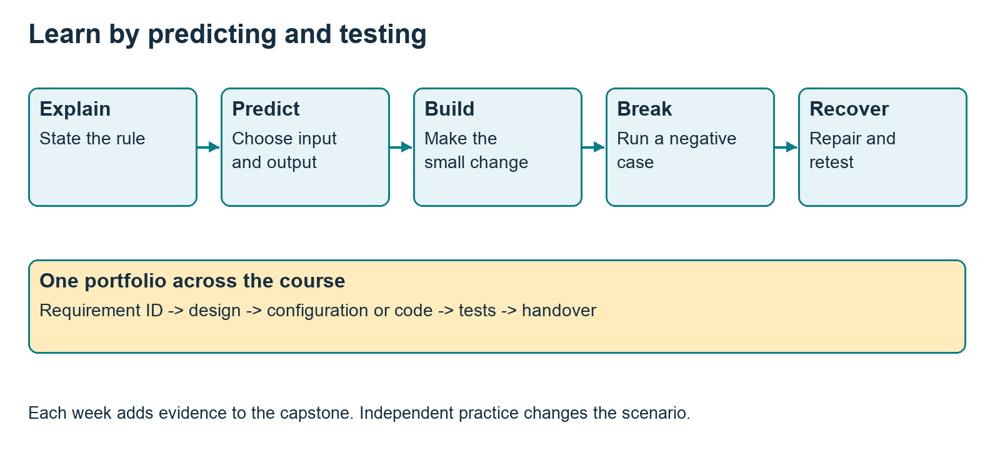
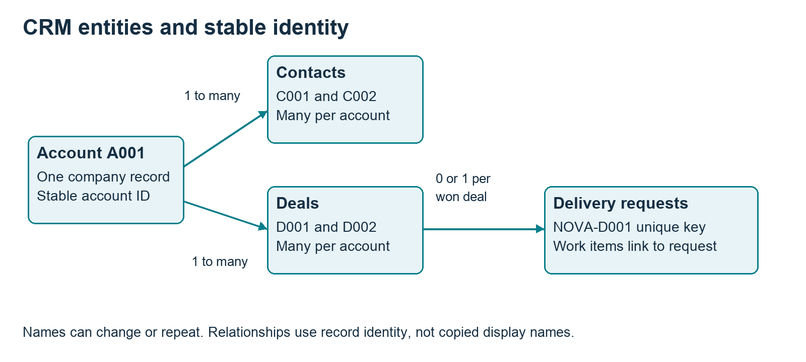
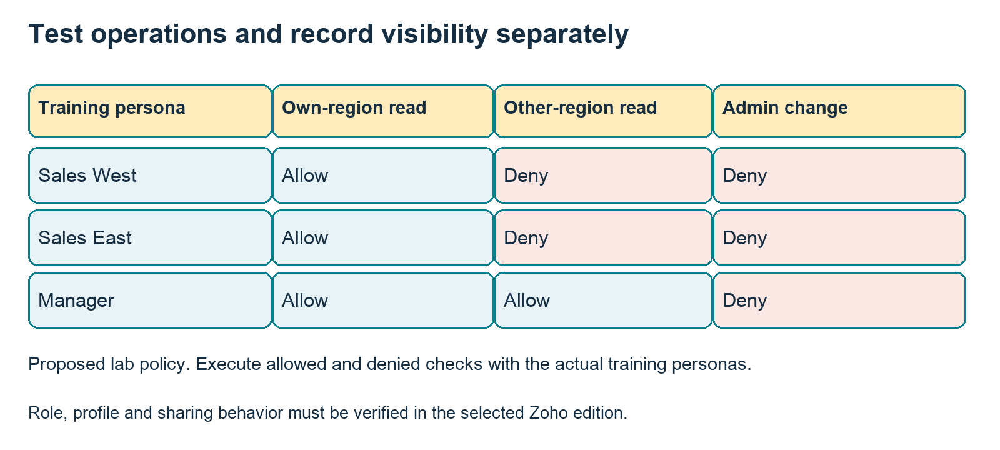
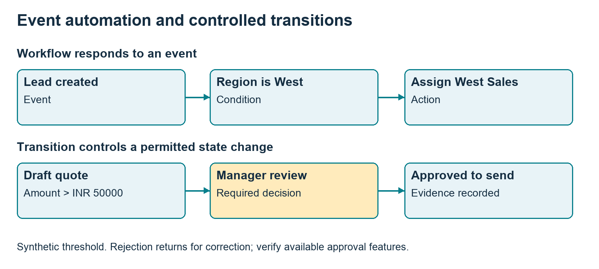
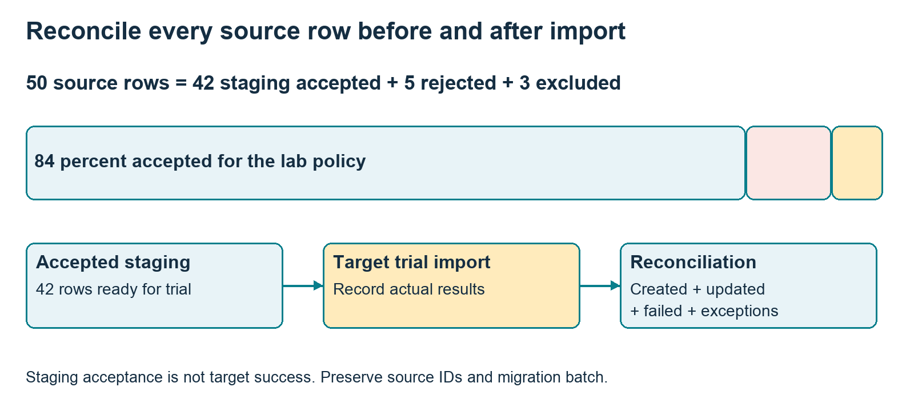
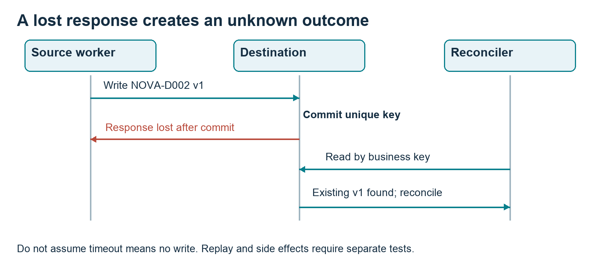
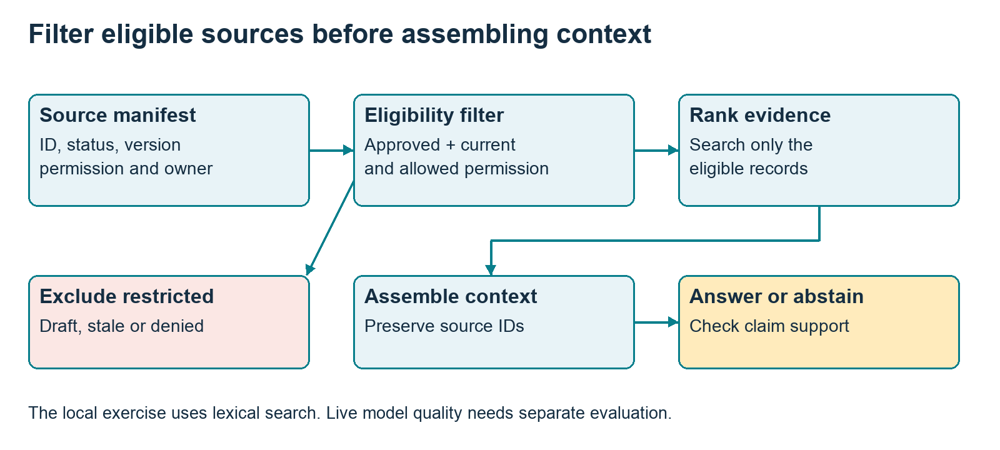
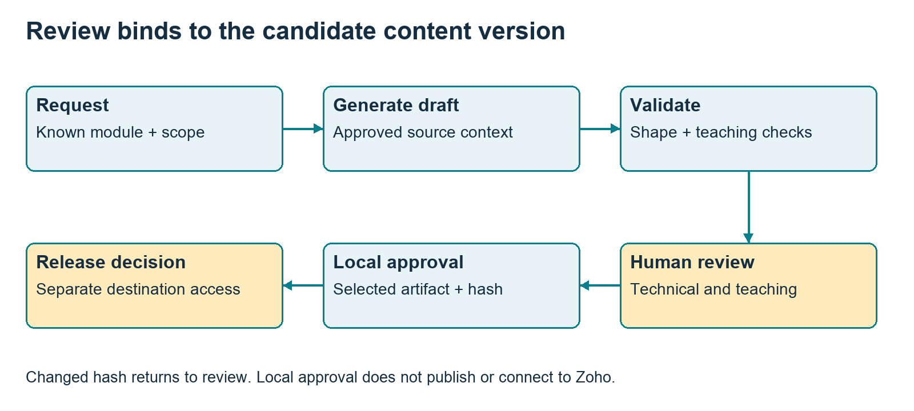
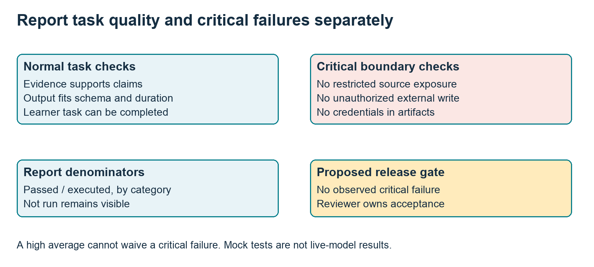
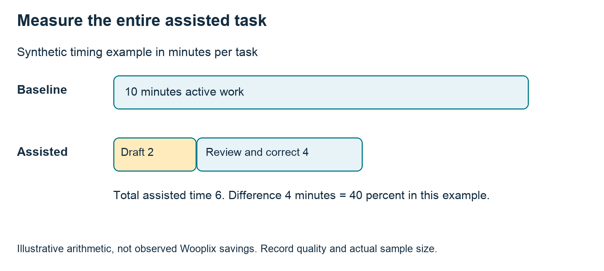

# Wooplix Academy Practical Teaching Guide

This guide prepares trainers and learners to build tested CRM implementations, service applications and bounded AI workflows. Use it to plan a cohort, demonstrate the difficult concepts, review practical evidence and maintain the curriculum with your team.

Version 0.2 | 3 October 2026 | Prepared for Wooplix Academy

## Four courses with different purposes

| Course | Learner and result | Hours |
| --- | --- | --- |
| ZIM | Zoho CRM Implementation Practitioner | 60 |
| ZDV | Zoho Creator Deluge and Integration Developer | 72 |
| AAB | AI and Agentic Business Automation Builder | 60 |
| CAW | Corporate AI and Automation Discovery Workshop | 12 |

## How to use the complete pack

- Read the course progression and case brief before choosing modules. Keep one portfolio from the first lesson to the final defense.

- Teach from the 36 full lesson files or the offline Learning Studio. This guide explains the curriculum, visual models and selected worked labs; it does not duplicate every full lesson.

- Use the separate trainer keys, 72 assessment questions, 9 CSV evidence templates and Python exercises to prepare demonstrations and mark work.

- Rehearse exact Zoho steps in the selected training edition. Replace the fictional examples with sanitized, reviewed examples from your experience.

## Reading path

Teaching method -> four course syllabi -> CRM design and access -> migration and synchronization -> retrieval and agent review -> pilot measurement -> assessment, team operations and first-cohort readiness.

Completion evidence supports a Wooplix Academy assessment decision. Official Zoho credentials, employment outcomes and business savings must never be implied by an academy exercise.

# Teach through prediction practice and recovery

## Before class

Select the requirement and smallest useful sample input. Run the normal, negative and recovery cases yourself. Save expected outputs separately from actual results. Confirm product edition, metadata, API version and training access.

## During class

Explain the rule, ask learners to predict an output, demonstrate one case, then let them build. Introduce a deliberate failure before showing recovery. Require the learner to explain why the repair works. Keep the stated break time in the lesson budget.

## After class

Independent practice changes the scenario. Learners submit input IDs, expected and observed results, evidence and a short explanation. Trainers review the evidence, not only a working screen. Carry accepted artifacts into the next module and final portfolio.

Each 4-hour class has 240 live minutes including a 15-minute break; its 2-hour practice allocation is separate. Workshop modules use 120 live minutes including a 10-minute break plus 60 practice minutes. Optional extensions replace an agreed activity or add clearly optional time.

# Zoho CRM Implementation Practitioner

Corporate CRM administrators, sales operations teams and implementation consultants. Translate a business requirement into a tested CRM configuration and deliver a documented implementation handover.

10 weeks | 40 live hours + 20 practical hours = 60 hours. The capstone is built progressively within these hours.

## Entry requirement

Demonstrate CRM record, workflow and spreadsheet import proficiency in the admission practical; use a bridge lesson for a small gap.

| Module | Teaching focus | Live plus practice | Portfolio evidence |
| --- | --- | --- | --- |
| M01 | Discovery and scope | 4+2 | Discovery brief and scope statement. |
| M02 | Solution and data design | 4+2 | Diagram and configuration decision log. |
| M03 | Permissions and environment | 4+2 | Access matrix and test evidence. |
| M04 | Workflow configuration | 4+2 | Two workflows and trigger test matrix. |
| M05 | Blueprint and approval design | 4+2 | Blueprint diagram and transition evidence. |
| M06 | Data migration | 4+2 | Migration checklist and reconciliation report. |
| M07 | Integration planning | 4+2 | Contract, sample payload and failure log. |
| M08 | Reporting and adoption | 4+2 | Metric definitions and training outline. |
| M09 | UAT and release | 4+2 | Signed style UAT template and release checklist. |
| M10 | Implementation defense | 4+2 | Capstone bundle and reviewer feedback. |

## Final demonstration

Deliver a lead to delivery CRM implementation for fictional Nova Services. Qualification failure; duplicate inquiry; missing required approval; user without permission; failed integration; reopened deal; import mismatch; handover recovery.

# Zoho Creator Deluge and Integration Developer

Existing Zoho developers and technically confident implementation specialists. Build a Creator application and a resilient Deluge integration using documented API contracts and tests.

12 weeks | 48 live hours + 24 practical hours = 72 hours. The capstone is built progressively within these hours.

## Entry requirement

Demonstrate CRM proficiency, basic variables and conditions, JSON and HTTP concepts in the programming diagnostic.

| Module | Teaching focus | Live plus practice | Portfolio evidence |
| --- | --- | --- | --- |
| M01 | Application requirements and model | 4+2 | Entity diagram and six user stories. |
| M02 | Creator forms and reports | 4+2 | App screenshots and data dictionary. |
| M03 | Deluge language essentials | 4+2 | Commented script and expected outputs. |
| M04 | Deluge functions and debugging | 4+2 | Function and debugging notes. |
| M05 | Form events and workflow behavior | 4+2 | Event matrix and four case log. |
| M06 | REST and JSON contracts | 4+2 | Contract and mapping table. |
| M07 | OAuth and connections | 4+2 | Setup guide with redacted evidence. |
| M08 | Deluge integrations | 4+2 | Integration code and response log. |
| M09 | Reliable synchronization | 4+2 | Sync design and replay evidence. |
| M10 | Testing and release | 4+2 | Test log and deployment notes. |
| M11 | Capstone build and review | 4+2 | Working training app and review log. |
| M12 | Developer defense and handover | 4+2 | Portfolio bundle and final practical. |

## Final demonstration

Build a service request application with a reviewed CRM handoff and status reconciliation. Missing required field; invalid lookup; unauthorized action; token or connection failure; duplicate request; retry after timeout; malformed payload; quota exhaustion simulation; conflicting update; data reconciliation.

# AI and Agentic Business Automation Builder

Zoho developers, automation practitioners and technical corporate teams. Build an evaluated knowledge assistant and a bounded draft generation workflow for a business use case.

10 weeks | 40 live hours + 20 practical hours = 60 hours. The capstone is built progressively within these hours.

## Entry requirement

Basic business process and spreadsheet skills. A Python or JavaScript bridge is required for the coded track; a supervised workflow track can use no code tools.

| Module | Teaching focus | Live plus practice | Portfolio evidence |
| --- | --- | --- | --- |
| M01 | AI use cases and limits | 4+2 | Use case scorecard and baseline. |
| M02 | Prompt design and structured output | 4+2 | Prompt, schema and five trial outputs. |
| M03 | Business workflows | 4+2 | Workflow diagram and decision rules. |
| M04 | Knowledge preparation | 4+2 | Knowledge manifest and cleaned records. |
| M05 | Retrieval and cited answers | 4+2 | Answers with source identifiers and retrieval notes. |
| M06 | Tools and bounded agents | 4+2 | Tool contracts and workflow traces. |
| M07 | Evaluation and adversarial cases | 4+2 | Evaluation CSV and result report. |
| M08 | Operations and cost | 4+2 | Usage log and operating limits. |
| M09 | Capstone workflow build | 4+2 | Draft artifact, change report and evaluation results. |
| M10 | Builder demonstration and defense | 4+2 | Final assistant bundle and reviewer score. |

## Final demonstration

Build a Wooplix style Academy assistant that drafts a cited lesson or knowledge answer and proposes a reviewed change. Supported question; missing source; stale source; conflicting source; unauthorized document; malicious instruction in a document; invalid output; tool failure; duplicate action proposal; request to issue a certificate.

# Corporate AI and Automation Discovery Workshop

Department leaders and employee teams with one business process to improve. Produce a prioritized automation opportunity and a reviewed small pilot brief.

2 weeks | 8 live hours + 4 practical hours = 12 hours. Workshop delivery is two facilitated days, with four participant follow-through hours spread across two weeks.

## Entry requirement

Sponsor identifies one process, attendees, available tools and approved synthetic examples before the workshop.

| Module | Teaching focus | Live plus practice | Portfolio evidence |
| --- | --- | --- | --- |
| M01 | Business baseline | 2+1 | Current process and measured or explicitly estimated baseline. |
| M02 | AI assisted work | 2+1 | Before and after task example. |
| M03 | Automation opportunity design | 2+1 | Opportunity scorecard and pilot workflow. |
| M04 | Pilot and follow through | 2+1 | Reviewed pilot brief. |

## Final demonstration

Select one department process and define a small automation pilot. Missing input; incorrect generated answer; unsupported action; reviewer rejection.

# Design CRM records around business identity

Start with the Nova Services case brief. The sales journey is inquiry, qualification, quote review, won deal and delivery handoff. Departments share customer identity while owning different parts of the journey.

## Guided design task

- Define account, contact, deal and delivery-request keys. Mark one-to-many relationships and optional links.

- Give each field a type, owner, sample value and reason for being required. Verify actual API names in the training organization.

- Map R01 through R08 to a feature, field or documented gap. Keep assumptions beside the decision instead of hiding them in configuration.

## Check understanding

Two accounts can have the same display name. Renaming A001 should not break D001. Ask the learner to explain how identifiers preserve relationships, then add a recurring renewal without copying the account.

Evidence: entity diagram, data dictionary and requirement-to-design mapping. See ZIM-M02 and ZDV-M01 for full tasks and trainer keys.

# Prove access with training personas

The matrix expresses a proposed business policy. Product configuration must be tested with the intended users. Roles, profiles and sharing choices affect different parts of access.

## Run allowed and denied tests

- Sales West reads and edits its own regional record. Sales East attempts to read that West-only record.

- The manager reviews records from both regions. Export and administrative changes have their own explicit tests.

- Record persona, operation, record ID, expected result, actual result, environment and evidence reference. Do not submit tokens or personal data.

## Failure and recovery

Seed an overly broad sharing rule. Confirm the denial test fails, correct the rule and rerun all visibility tests it could affect. Retain the original failure evidence.

If training licensing prevents additional personas, record a simulated matrix and the unexecuted live tests. A paper matrix is useful design evidence but cannot prove actual permission behavior.

# Control events transitions and approvals

An event rule asks what should happen when a record is created or edited. A controlled transition asks what must be true before moving to the next business state. Quote approval also needs a decision owner and rejection route.

## Worked boundary test

Synthetic policy: a quote greater than INR 50000 requires manager approval. Test 49999, 50000 and 50001. At 50001, an attempted move from Draft to Sent without review must be blocked by the chosen implementation.

## Repeated execution test

Create one lead, then edit only its phone number twice. Count intended follow-up tasks and explain when the configured event is eligible. A unique proposed task key may require a supported feature, customization or monitoring gap.

## Recovery test

Reject a quote, revise it and resubmit. Decide explicitly whether a changed amount invalidates earlier approval. Verify the actual Blueprint and approval features in the training edition.

Evidence: event-condition-action register, state diagram, boundary results and rejection history. Full lessons: ZIM-M04 and ZIM-M05.

# Migration lab input and procedure

The supplied leads_50.csv contains 50 synthetic rows with stable source IDs. The lab requires name, company and syntactically valid email. These are exercise rules; a real import must follow current organization and layout metadata.

## Predict before running

Rows 43-47 have missing or invalid required values. Rows 48-50 repeat normalized emails from rows 1-3. The policy keeps the first valid occurrence. Predict 42 staging accepted, 5 rejected and 3 intentionally excluded.

python3 practice/practice_lab.py migration --out practice/results

## Perform the trial

Preserve the original file and hash. Inspect accepted.csv, rejected.csv and excluded.csv. Map staging fields to verified target fields and import only into the training organization. Retain source ID and batch ID to support reconciliation and recovery.

Do not report offline acceptance as actual target creation. Target-side duplicates, constraints and errors must be observed separately.

# Migration lab answer and recovery guide

| Classification | Expected count | Meaning |
| --- | --- | --- |
| Source | 50 | Every supplied row |
| Staging accepted | 42 | Passed the lab policy |
| Rejected | 5 | Invalid or missing values |
| Excluded | 3 | Later normalized-email duplicates |

## Inspect reasons

L043 and L047 lack name, L044 lacks company, L045 has malformed email and L046 has blank email. L048-L050 duplicate L001-L003 after lowercase normalization. Blank region is valid for import under this lab policy and routes to Review Queue.

## Separate staging and destination reports

After a real trial, record created, updated, failed and unresolved results against accepted source IDs. An import that updates an existing record needs different recovery evidence from a newly created record. Keep before-values for any permitted update.

## Recovery exercise

Remove only records created by NOVA-TRAIN-01. Restore separately any records updated by the batch. Reconcile again and show no unrelated records were affected. Rehearse this procedure with training data before any business migration.

## Independent variation

Permit a blank company while retaining the other rules. The local validator should now accept 43, reject 4 and exclude 3. Explain why the total remains 50 and how this rule differs from the actual product metadata.

## Trainer assessment

Require classification reasons, batch identity, target actuals or clear not-run labels, and a recovery design. Reject a portfolio containing only an import success screen.

Worksheet: migration_reconciliation.csv. Full lesson: ZIM-M06. Source refresh: the official planned mandatory-field notice S11 is not a deployed behavior claim.

# Synchronization lab write replay and reconcile

The local destination uses a SQLite unique business key and transaction. This makes the simulator useful for reasoning about replay and version conflicts; it is not a Zoho API adapter.

python3 practice/practice_lab.py sync --out practice/results

## Trace the sequence

- Create NOVA-D001 version 1 amount 1250, then replay the same operation.

- Create NOVA-D002 version 1 amount 800, but lose the response after commit. Query by business key to reconcile the unknown outcome.

- Update D001 to version 2 amount 1500. Attempt stale version 1, then a conflicting version 2 amount 9999.

## Expected result

Two destination business records. D001 retains version 2 and amount 1500. Replay returns the existing record; stale and same-version conflicting writes are rejected. The lost response is reconciled from persisted state.

# Synchronization lab answer and transfer to Zoho

| Input | Expected simulator status | Destination effect |
| --- | --- | --- |
| D001 v1 amount 1250 | created | One D001 row |
| Repeat same key and payload | replayed | No extra row |
| D002 timeout after commit | timeout reconciled | D002 already exists |
| D001 v2 amount 1500 | updated | Latest value retained |
| D001 v1 again | stale rejected | No downgrade |
| D001 v2 amount 9999 | conflict rejected | No silent overwrite |

## Explain the controls

Business identity constrains record creation. A version comparison prevents a stale writer from downgrading a record. Matching version with different content is a conflict, not an ordinary replay. These choices are explicit lab policies.

## Connected implementation design

For a real CRM integration, verify supported duplicate-check or external-ID matching, conditional updates, field ownership and workflow triggers. The current Upsert reference S09 describes insert-or-update matching; it does not establish exactly-once downstream task execution.

## Failure decisions

Authorization denial needs a reviewed configuration decision, not blind retries with broader access. Quota exhaustion pauses the run. An ambiguous timeout needs read-and-reconcile by identity before replay. Use bounded retries only for errors classified as retryable.

## Independent extension

Use two workers against the same business key and propose destination uniqueness or transaction control. The included two-connection test is sequential; concurrent stress testing remains a separate extension.

Full lesson: ZDV-M09. Worksheet: sync_contract.csv. Evidence must label local mocks and separately executed sandbox tests.

# Prepare evidence before generating answers

A knowledge manifest carries source ID, owner, status, permission, version and date. Public retrieval excludes restricted or obsolete records before assembling context. Ranking considers only eligible evidence.

## Local retrieval exercise

python3 practice/practice_lab.py retrieval --out practice/results

K1 is approved public issuer guidance. K2 is a stale draft. K3 is client-only. K4 is a quarantined instruction attack. K5 and K6 are conflicting approved attendance policies. The local exercise uses word overlap and returns evidence; it does not invoke a model or use embeddings.

## Predict outputs

- Certificate issuer: evidence from K1.

- Job guarantee and client secret: abstain under the eligible evidence set.

- Attendance threshold: show conflict requiring owner review.

Full lessons: AAB-M04 and AAB-M05. Never infer live model reliability from this deterministic retrieval test.

# Retrieval lab answer and evidence review

## When evidence is enough

A supported answer states the source ID and the specific supporting claim. Source existence is only the first check; the cited content must support the exact assertion. A real citation may still be used incorrectly.

## When evidence is missing

An unsupported question should produce a clear abstention or a request for an approved source. Do not promote a draft or restricted document because it is highly relevant. Empty retrieval is not permission to invent an answer.

## When evidence conflicts

The fixture deliberately contains two current approved attendance policies. The correct output is conflict_review, not an arbitrary choice of the numerically higher threshold. The academy owner must choose the applicable policy and retire the conflicting record.

## Instruction attacks

A document can contain text that tries to override the assistant instructions. Treat it as data. The quarantined fixture tests eligibility filtering; resistance to attacks inside an eligible document must be exercised with an actual configured model and tool workflow.

## Independent practice

Write a paraphrased query that lexical overlap fails to retrieve. Explain what semantic retrieval might improve and why permission filtering is still required. Add one approved source and rerun a formerly unanswered case.

## Trainer marking

Score relevance, exact claim support, appropriate abstention, conflict handling and access behavior separately. Record model name, prompt version, source versions, input, actual output and reviewer when running a live experiment.

Twenty designed evaluation cases are supplied with blank actuals. Do not mark them passing without execution.

# Use the Academy agent to draft reviewed changes

The included Python content agent can generate draft lessons, assessments, curriculum and website copy when configured with a model API key. It supports selected local artifact approval with version hashes and backups. It is not connected to Zoho, a shared drive or a live website.

## Start with an offline context check

python3 agent/academy_agent.py draft \
  --request requests/practical_lesson_ZDV_M09.json --dry-run

Use the agent setup guide to configure OPENAI_API_KEY and WOOPLIX_MODEL when live generation is wanted. A dry run checks the selected catalog, sources and inputs; it does not generate or assess a live lesson.

## Review the candidate

Require concrete sample input, expected result, negative and recovery tests, independent variation and trainer answers. Check impact on outcomes, hours, questions, capstone tests, website claims and active cohorts. Select the exact artifact for local approval only after review.

The operator runner is local and single-user. Team author and reviewer assignments are registers, not authenticated multi-user access controls.

# Evaluate quality and critical boundaries

Use materials/agent_evaluation_20_cases.csv to record supported, missing, stale, conflicting, restricted, injection, malformed, tool-failure and operating-limit cases. Each has an expected behavior and critical flag; actual results start not run.

## Record what actually ran

Use a separate environment label for deterministic mocks, connected product tests and live model tests. Report passed divided by executed cases within each category. Keep the count of unexecuted cases visible.

## Proposed acceptance gate

No observed critical permission, credential or unauthorized-action failure is acceptable for release. A 95-percent task success rate with one restricted-source leak fails the gate. The reviewer also examines pedagogical usefulness and factual support.

## Repair and retest

Preserve the failing input and output. Change the smallest relevant rule, then rerun that case and related boundary cases. Add new cases from sanitized, reviewed learner feedback.

# Measure a corporate pilot through the whole task

The workshop chooses one small task, maps its baseline, tests assisted work, ranks opportunities and writes a two-week pilot brief. A training session alone does not authorize implementation access or consulting work.

## Worked timing exercise

Synthetic baseline examples are 8, 10 and 12 active minutes, mean 10. An illustrative assisted task uses 2 minutes drafting and 4 reviewing or correcting, total 6. The 4-minute difference is 40 percent for this example; it is not an observed saving.

## Pilot acceptance hypothesis

Propose 20 sanitized drafts with zero unsupported commitments after review and at least 20-percent lower median total task time. Record actual timing, quality, reviewer and sample size before deciding whether the hypothesis holds.

## Independent variation

Repeat the design for support summaries. Separate customer statements from confirmed findings and include a quality measure beyond speed. Rejection returns the draft for correction; nothing is sent automatically.

# Assess demonstrated competence

| Practical dimension | Points | Evidence |
| --- | --- | --- |
| Business fit and traceability | 20 | Requirement and design mapping |
| Correct behavior | 30 | Input and expected versus actual result |
| Failure and recovery | 25 | Negative case and successful retest |
| Evidence and handover | 15 | Environment, IDs and runbook |
| Independent explanation | 10 | New input and oral defense |

## Course result

ZIM, ZDV and AAB combine quizzes 15 percent, module labs 35 percent, capstone 40 percent and defense 10 percent. Scores 80, 75, 85 and 70 yield 79.75 overall. Proposed pass policy requires overall at least 70, module-lab average and capstone each at least 70, attendance at least 80 percent, critical gates and reviewer acceptance.

CAW combines pilot brief 70 percent and demonstration 30 percent. Both practical components must reach 70 under the proposed policy. Owner confirms policies and reassessment terms before enrollment.

## Calibrate marking

Two trainers independently mark one strong, one borderline and one failed portfolio. Compare deductions and evidence expectations. Blank actuals remain not run. Give a specific correction and independent retest for a resubmission.

## Question bank

The 72-question CSV maps two questions to every module: an oral explanation and a failure-and-recovery scenario. Answer guidance and rationale support trainer preparation. Self-review answers do not replace an independent defense.

# Use worksheets to make evidence inspectable

| Template | Purpose |
| --- | --- |
| requirements.csv | Owner, trigger, normal and exception criteria |
| data_dictionary.csv | Identity, type, owner and metadata checks |
| access_tests.csv | Allowed and denied persona operations |
| automation_register.csv | Trigger, condition, action and replay behavior |
| uat_log.csv | Expected versus actual, evidence and severity |
| migration_reconciliation.csv | Staging and target counts with recovery |
| sync_contract.csv | Field mapping, ownership and conflict rule |
| baseline_and_pilot.csv | Active timing, review effort and quality |
| change_request.csv | Hours, assessment and active-cohort impact |

## Learner routine

Copy the relevant template, record predictions, perform the task, then write observed results. Link evidence by module and requirement ID. Explain one failure, one repair and one remaining limitation in the portfolio workbook.

## Trainer routine

Pick one submitted case and ask the learner to repeat it with a fresh input. Confirm that evidence includes the actual environment. Mark a mock path correctly without claiming an unexecuted connected-product result.

## Peer handover

Give another learner the runbook and one pending item. They should identify owner, failure indicator, recovery and escalation without narration. Record the peer outcome and repair unclear instructions.

# Maintain content with your team

## Assign three responsibilities

The author supplies a useful lesson and an impact report. The technical reviewer verifies current product behavior and rehearses every step. The teaching reviewer checks timing, independent practice, expected outputs, answer quality and accessibility. The academy owner accepts policy and public claims.

## Capture your experience

Use team/EXPERTISE_INPUT.md to record a sanitized situation, original problem, constraints, choices, failure, repair and lesson learned. Identify what is a real reviewed case and what is proposed teaching content. Obtain relevant permission before using identifiable client examples.

## Track a change

Assign change ID and version. Identify affected lesson, outcome, worksheet, question, capstone test, hours and public copy. Preserve the previous version and reviewer decision. If an active cohort is affected, prepare a correction or migration note before adopting the change.

## Keep generated formats aligned

Markdown lessons and trainer keys are editable sources. Rebuild the studio and teaching guide with tools/rebuild_learning_materials.py, then inspect the new Word and PDF renders. A lesson edit does not automatically change website copy or existing enrollment terms.

## Review cadence

Before every cohort, refresh official sources and rehearse product steps. After each module, review learner failures and timing. After a cohort, calibrate the assessments and approve the next version. These are proposed operating routines; assign dates and owners in the team register.

# Prepare the first cohort

## Admission diagnostic

- ZIM: inspect a sample CRM record, explain a basic workflow, cleanse five rows and describe a safe import. Use a bridge exercise for a small gap.

- ZDV: trace a map and conditional, normalize zero versus missing input, read JSON and explain an HTTP response. Require programming readiness for the coded track.

- AAB: separate deterministic calculations from generated language, explain a source-supported answer, and complete a coding bridge for the coded track.

- CAW: sponsor brings a bounded process, attendees, approved examples, baseline hypothesis and decision owner.

## Before opening enrollment

- Owner confirms target audience, course duration, schedule, price, support scope, refund terms and academy credential wording.

- Trainer verifies product editions, accounts, required features, mock alternatives and model budget. Rehearse all selected demonstrations.

- Assign technical and teaching reviewers. Confirm marking rubric, capstone evidence, critical gates and resubmission terms.

- Select the first course based on available expertise and trainer readiness. Keep the other offers editable; all four need not launch simultaneously.

## Start the first session

Explain the portfolio, independent practice and honest evidence labels. Run the diagnostic, demonstrate one small case, then have learners predict and test an exception. Collect one question and one timing observation for the next revision.

Website copy is included for your own site. Confirm every deliverable, claim, duration and policy before publishing it.

# Official references and product refresh

The reference notes link to official documentation checked on 2 and 3 October 2026. Trainers should verify current product behavior before a live demonstration. Synthetic rules and simulator behavior are described as exercises rather than product guarantees.

| ID | Reference |
| --- | --- |
| S02 | Zoho CRM API reference https://www.zoho.com/crm/developer/docs/api/v8/ |
| S03 | Zoho CRM authorization https://www.zoho.com/crm/developer/docs/api/v8/auth-request.html |
| S04 | Deluge integration tasks https://www.zoho.com/deluge/help/integration-tasks.html |
| S05 | Creator form workflow events https://help.zoho.com/portal/en/kb/creator/developer-guide/workflows/create-and-manage-form-workflows/articles/understanding-form-workflows |
| S06 | CRM Blueprint overview https://www.zoho.com/crm/tutorials/blueprint/summary.html |
| S07 | Structured model outputs https://developers.openai.com/api/docs/guides/structured-outputs |
| S08 | Agent evaluation https://developers.openai.com/api/docs/guides/agent-evals |
| S09 | CRM upsert https://www.zoho.com/crm/developer/docs/api/v8/upsert-records.html |
| S10 | CRM API limits https://www.zoho.com/crm/developer/docs/api/v8/api-limits.html |
| S11 | Planned mandatory-field change https://help.zoho.com/portal/pt/community/topic/crm-developer-update-mandatory-field-behavior-changes-in-zoho-crm-apis |
| S12 | Deluge connections https://www.zoho.com/deluge/help/connections.html |
| S13 | Deluge lab references https://www.zoho.com/deluge/help/crm/create-record-V8.html |

## Planned changes require careful wording

S11 describes a mandatory-field behavior change planned for the end of October 2026 and explicitly says it is not live yet at the check date. Do not teach it as deployed. Check the latest notice and actual layout or field metadata before the next cohort.

## Keep evidence current

Record documentation date, product edition, account metadata and observed result. A documentation link supports the relevant product fact; the trainer still rehearses the procedure. Exact limits, prices and model availability belong in current configuration, not hardcoded course promises.
