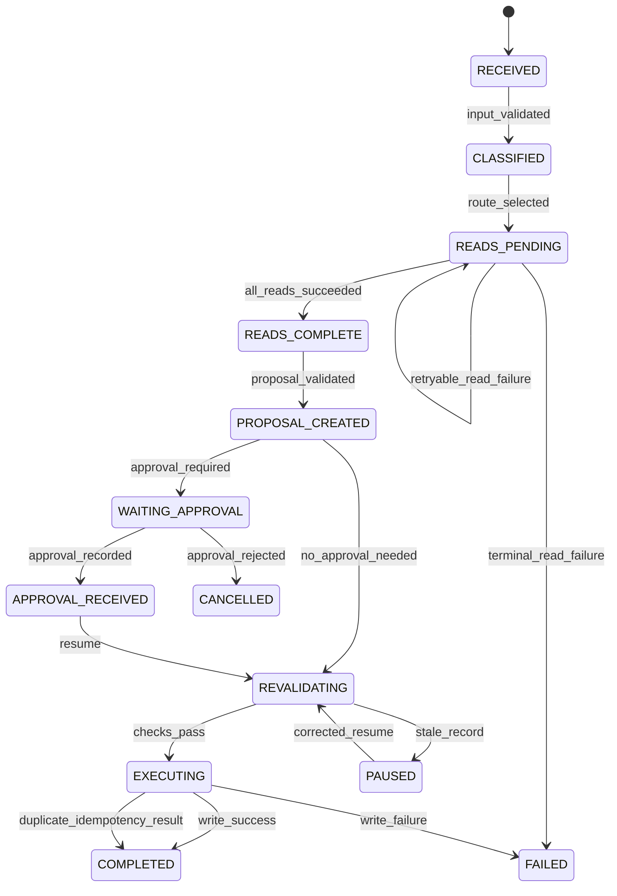

# Workflow Orchestration and State

## 1. What you will learn
A single model request is not a complete business process. A useful assistant may need to classify a request, perform several reads, prepare a proposal, pause for approval, revalidate current records and then execute one controlled action.

Workflow orchestration defines how those steps happen and what the application remembers between them.

In this chapter, you will learn how to:
- chain steps into a workflow;
- route requests to different paths;
- run independent read operations in parallel;
- control model and tool loops;
- represent the process as a state machine;
- retry safe failures without duplicating writes;
- save checkpoints;
- pause and resume after approval or user clarification;
- distinguish working state, conversation memory, business records and audit evidence;
- define retention and deletion behavior;
- create explicit stopping rules.

The Northstar workflow continues to use the tools designed in Chapter 9:
- `crm_get_permitted_customer_context`;
- `crm_draft_follow_up_task`;
- `crm_create_approved_follow_up_task`.

The following boundaries remain in force:
- tenant, user and customer permissions come from trusted application context;
- read tools return only permitted fields;
- proposals are not writes;
- approvals are bound to a proposal and record version;
- writes require record revalidation;
- idempotency prevents duplicate actions;
- generated text does not prove that an action occurred.

The OpenAI function-calling documentation describes a loop in which the model requests a tool, the application executes it, the application returns the result and the model may continue or produce a final answer. It also documents the possibility of multiple calls and configuration for parallel calls. The workflow controls in this chapter are application design decisions built around that provider interaction pattern.

---

## 2. Lessons

### Lesson 1: Chaining, routing and parallel work

#### Chaining
A chain is a sequence in which one step's result becomes the next step's input.

Northstar example:
```
receive enquiry
  -> classify intent
  -> retrieve approved product and policy evidence
  -> retrieve permitted customer context
  -> draft task proposal
  -> request approval
  -> revalidate
  -> execute
```
Chaining is appropriate when later steps depend on earlier results. For example, the application should not draft a customer-specific task until it knows:
- which customer was requested;
- whether the user may access that customer;
- which source evidence applies.

#### Routing
Routing chooses a path based on a result:
```
classify request
  |
  +-- product question -> product retrieval
  |
  +-- policy question -> policy retrieval
  |
  +-- customer-context request -> permitted CRM read
  |
  +-- action request -> proposal and approval path
  |
  +-- ambiguous -> clarification state
```
A route should be explicit enough to test. A model may help classify a natural-language request, but the application should validate the selected route and prevent an action path from being chosen for an unauthorized request.

#### Parallel work
Independent reads can be performed in parallel.
For a Northstar request asking:
> Can I offer 8% on the NS-4000, and draft a follow-up task for Acme?

These reads may be independent:
1. retrieve current product source;
2. retrieve current policy source;
3. retrieve permitted Acme context.

```
                 +--> product read ---+
request -> route +--> policy read ----+--> assemble evidence -> draft
                 +--> CRM read -------+
```

Parallelism can reduce waiting time, but it introduces coordination questions:
- What happens if one read fails?
- Are partial results safe to store?
- Can any read return unauthorized data?
- Should the workflow continue with partial evidence?
- How many calls count against the workflow budget?

Do not run side-effecting operations in parallel unless the application has a specific transactional design. Two parallel task-creation calls can create duplicates.

#### Tool loops
A tool loop occurs when the model requests a tool, receives a result and requests another tool.
A loop needs:
- a maximum number of calls;
- a maximum retry count;
- duplicate-call detection;
- a progress condition;
- a terminal failure state.

> **Check for understanding:** Why can the three initial reads in the Northstar example run in parallel while task execution should remain sequential?  
> *Answer:* The reads do not change records and do not depend on one another. Task execution has approval, record-version and duplicate-prevention dependencies.

---

### Lesson 2: State machines

#### A state machine makes process status explicit
A state machine represents:
- possible states;
- allowed transitions;
- events that cause transitions;
- data required in each state;
- terminal states.

Northstar states:
`RECEIVED`, `CLASSIFIED`, `READS_PENDING`, `READS_COMPLETE`, `PROPOSAL_CREATED`, `WAITING_APPROVAL`, `APPROVAL_RECEIVED`, `REVALIDATING`, `EXECUTING`, `COMPLETED`, `PAUSED`, `FAILED`, `CANCELLED`.

A state is not the same as a message. "The model said it created a task" is not a state transition to `COMPLETED`.

#### State transition table
| Current state | Event | Next state | Required condition |
|---|---|---|---|
| `RECEIVED` | `input_validated` | `CLASSIFIED` | Required request fields present |
| `CLASSIFIED` | `route_selected` | `READS_PENDING` | Route is permitted |
| `READS_PENDING` | `all_reads_succeed` | `READS_COMPLETE` | Results pass permission checks |
| `READS_PENDING` | `retryable_read_failure` | `READS_PENDING` | Retry budget remains |
| `READS_PENDING` | `terminal_read_failure` | `FAILED` | No safe recovery |
| `READS_COMPLETE` | `proposal_created` | `PROPOSAL_CREATED` | Proposal validates |
| `PROPOSAL_CREATED` | `approval_needed` | `WAITING_APPROVAL` | Proposal stored |
| `PROPOSAL_CREATED` | `no_approval_needed` | `REVALIDATING` | Policy permits direct action |
| `WAITING_APPROVAL` | `approved` | `APPROVAL_RECEIVED` | Approval binds to proposal |
| `WAITING_APPROVAL` | `rejected` | `CANCELLED` | Rejection recorded |
| `APPROVAL_RECEIVED` | `resume_event` | `REVALIDATING` | Current permissions checked |
| `REVALIDATING` | `checks_pass` | `EXECUTING` | Record version and idempotency valid |
| `REVALIDATING` | `stale_record` | `PAUSED` | New review required |
| `EXECUTING` | `write_succeeds` | `COMPLETED` | Execution ID recorded |
| `EXECUTING` | `duplicate_key` | `COMPLETED` | Existing execution ID returned |

Invalid transitions such as `WAITING_APPROVAL -> EXECUTING` without approval and revalidation are strictly rejected.

#### State data
```json
{
  "workflow_id": "NST-WF-001",
  "state": "WAITING_APPROVAL",
  "requester_id": "sam.rep@example.com",
  "tenant_id": "northstar-demo",
  "customer_id": "NST-CUST-001",
  "record_version": 7,
  "proposal_id": "NST-PROP-001",
  "required_approval": true,
  "tool_attempts": {
    "crm_get_permitted_customer_context": 1,
    "retrieve_policy": 1,
    "retrieve_product": 1,
    "crm_draft_follow_up_task": 1
  },
  "last_checkpoint": "cp-004",
  "resume_token": "resume-NST-WF-001-004",
  "action_status": "proposal_only"
}
```

> **Check for understanding:** Why is `WAITING_APPROVAL` a state rather than a temporary message?  
> *Answer:* Because the workflow may stop for an unknown amount of time and must later resume with enough information to validate the approval and current record.

---

### Lesson 3: Retries, errors and bounded loops

#### Retry only when recovery is safe
| Error type | Example | Retry guidance |
|---|---|---|
| Transient read failure | CRM timeout | Retry within limit |
| Rate pressure | 429 status | Honor delay and retry |
| Dependency unavailable | CRM service down | Defer or fail safely |
| Invalid arguments | Unknown field | Do not retry unchanged input |
| Permission denied | Customer outside scope | Do not retry |
| Approval required | No approval record | Pause |
| Stale record | Version changed | Review; do not retry unchanged write |
| Duplicate request | Idempotency key exists | Return existing result |
| Internal error | Unexpected exception | Stop, log safely |

#### Exponential backoff
$$\text{delay}_n = \min(\text{max\_delay}, \text{initial\_delay} \times 2^n) + \text{jitter}$$

#### Bounded tool-loop policy
```yaml
workflow_limits:
  max_total_tool_calls: 8
  max_retries_per_read: 1
  max_identical_failed_calls: 1
  max_state_transitions: 20
  max_wall_clock_minutes: 10
  parallel_writes: false
  write_without_revalidation: false
```

> **Check for understanding:** Why should a permission-denied CRM read not be retried with the same arguments?  
> *Answer:* Retrying does not change the user's authorization and may create unnecessary calls or expose an attempt to bypass access control.

---

### Lesson 4: Checkpoints, pause and resume

#### What a checkpoint is
A checkpoint is a durable record of safe workflow progress. It should be written after meaningful steps:
- after validated input;
- after successful reads;
- after a proposal is created;
- before waiting for approval;
- after approval is received;
- after revalidation;
- after execution.

#### Pause and resume conditions
Pause when human approval is required, user clarification is needed, or the record is stale.

A resume event requires:
```json
{
  "workflow_id": "NST-WF-001",
  "resume_token": "resume-NST-WF-001-004",
  "event": "approval_received",
  "approval_id": "NST-APR-001",
  "actor_id": "manager@example.com"
}
```
The application must not trust only the resume event; it must revalidate permissions, proposal status, approval binding, and customer record version.

> **Check for understanding:** Why should a workflow store a checkpoint before waiting for approval?  
> *Answer:* Without a checkpoint, the application may lose the exact proposal, source versions, expected record version and tool history needed to validate the approval later.

---

### Lesson 5: Memory and retention

#### Memory types
| Memory type | Example | Purpose |
|---|---|---|
| Working state | Current workflow state and checkpoint | Resume a process |
| Conversation history | Previous user/assistant messages | Maintain interaction context |
| Business record | CRM customer or task | Authoritative business data |
| Knowledge source | Approved product or policy document | Ground answers |
| Long-term preference | Preferred language | Personalization |
| Audit evidence | Tool calls, approvals, execution IDs | Accountability |

#### Retention assumptions
```yaml
retention_assumptions:
  working_state:
    expires_after_terminal: "7 synthetic days"
  resume_tokens:
    contain_customer_content: false
    expire_after: "7 synthetic days"
  audit_events:
    retention: "controlled by application audit policy"
  business_records:
    retention: "controlled by CRM governance"
```

> **Check for understanding:** Why should a resume token not contain the full customer record?  
> *Answer:* A resume token may be exposed in logs, URLs or client storage. A small opaque token reduces data duplication and references server-side state securely.

---

### Lesson 6: Stopping rules
Stopping rules for Northstar:
1. Stop immediately on `permission_denied`.
2. Stop before any write without matching approval.
3. Stop before any write if record version changed.
4. Stop after one retry for the same failed read.
5. Stop after eight total tool calls.
6. Stop after one identical failed call.
7. Pause when approval is required.
8. Return `insufficient_evidence` when approved sources are silent.
9. Return duplicate success when idempotency identifies an existing action.

---

## 3. Visual explanation

### Northstar state machine


---

## 4. Worked case: a pause-and-resume Northstar workflow

### Scenario
Sam asks:
> Can I offer Acme an 8% discount on the NS-4000, and can you prepare the follow-up task?

Trusted session:
- Requester: `sam.rep@example.com`
- Permitted customer: `NST-CUST-001` (Acme)
- Current record version: `7`

### Execution steps
1. **Receive & classify:** Route to product retrieval, policy retrieval, CRM read, task draft.
2. **Parallel reads:** Retrieve `NST-PROD-001:v1.2`, `NST-POLICY-001:v3.0`, and Acme record version 7.
3. **Draft proposal:** Store `NST-PROP-001` (`status: "pending_approval"`, `version: 7`). Transition to `WAITING_APPROVAL`.
4. **Checkpoint saved:** `cp-004` stored.
5. **Approval received:** Manager approves with `NST-APR-001` for version 7. Transition to `APPROVAL_RECEIVED -> REVALIDATING`.
6. **Revalidate:** Checks pass. Transition to `EXECUTING`.
7. **Execute:** Action tool creates `task_generated_001`. Transition to `COMPLETED`.

If the record version had changed to 8 while waiting for approval, revalidation would pause with `stale_record` and block execution.

---

## 5. Try it yourself — guided practice

### Learning goal
Build an offline workflow that pauses for approval and resumes safely within explicit limits.

### Workflow limits
```yaml
limits:
  max_total_tool_calls: 8
  max_retries_per_read: 1
  max_identical_failed_calls: 1
  max_state_transitions: 20
  max_wall_clock_minutes: 10
  parallel_writes: false
```

### Guided practice worksheet
| Step | Current state | Event | Next state | Tool calls used | Checkpoint saved | Action status |
|---|---|---|---|---|---|---|
| 1 | RECEIVED | input_validated | CLASSIFIED | 0 | No | no_action |
| 2 | CLASSIFIED | route_selected | READS_PENDING | 0 | Yes | no_action |
| 3 | READS_PENDING | all_reads_succeeded | READS_COMPLETE | 3 | Yes | no_action |
| 4 | READS_COMPLETE | proposal_created | PROPOSAL_CREATED | 1 | Yes | proposal_only |
| 5 | PROPOSAL_CREATED | approval_required | WAITING_APPROVAL | 0 | Yes | proposal_only |
| 6 | WAITING_APPROVAL | approval_received | APPROVAL_RECEIVED | 0 | Yes | proposal_only |
| 7 | APPROVAL_RECEIVED | resume | REVALIDATING | 0 | Yes | proposal_only |
| 8 | REVALIDATING | revalidation_passed | EXECUTING | 1 | Yes | pending_execution |
| 9 | EXECUTING | execution_succeeded | COMPLETED | 1 | Yes | executed |

---

## 6. Independent challenge

### Changed scenario
Lee asks:
> Check whether the NS-5000 is compatible with WarehousePro, retrieve Beacon's permitted context and draft a customer reply. Wait for manager approval before any send.

- Requester: `lee.rep@example.com`
- Permitted customer: `NST-CUST-002` (Beacon, record version 3)
- Eligible source: `NST-PROD-002:v1.0` (compatibility not specified)
- Held source: `NST-PROD-002:West:v1.1` (West-only, held, cannot be used)

Tool events:
- E-01: `product_retrieval` -> success
- E-02: `crm_get_permitted_customer_context` -> timeout (retryable)
- E-03: `crm_get_permitted_customer_context` -> success (record version 3)
- E-04: `crm_draft_customer_reply` -> success (`NST-PROP-003`)
- E-05: `approval_received` -> `NST-APR-003` (approved version 3)
- E-06: `resume` -> current record version is 4!

### Deliverables
1. Draw the state path, including retry.
2. Identify parallel reads.
3. Count tool calls against limit (4 calls before approval).
4. Define checkpoint saved before approval.
5. State expected result after E-06 (pause with `stale_record` because version changed to 4).
6. Explain why held West source is excluded.
7. Define memory and retention fields.
8. Define stopping rules for timeout and stale record.
9. Produce trace artifact.
10. State whether any message was sent (no message sent).

---

## 7. Common problems and recovery

| Symptom | Diagnosis | Correction | Verification |
|---|---|---|---|
| Workflow jumps from approval to write | Revalidation state missing | Require `APPROVAL_RECEIVED -> REVALIDATING -> EXECUTING` | Stale-record test stops execution |
| Timeout causes write to run twice | Retry policy covers side effects | Retry reads only; use idempotency for writes | Repeated action returns existing result |
| Parallel reads lose one result | Results not associated with call IDs | Store result by operation and call ID | Partial failure preserves successful reads |
| Resume token contains customer email | Full context serialized into token | Use opaque token and server-side state reference | Token contains no customer content |
| Paused workflow counted as complete | State labels too broad | Use explicit paused states | Reports separate paused and completed |

---

## 8. Check your understanding
1. What is the difference between chaining and routing?
2. When is parallel work appropriate?
3. Why should side-effecting tools usually run sequentially?
4. What is a state machine?
5. What is a terminal state?
6. Which errors are usually safe to retry?
7. Why is a retry count alone insufficient?
8. What should a checkpoint contain?
9. What must be revalidated on resume?
10. Why should a resume token be opaque?
11. Name four different kinds of memory in a business assistant.
12. Why should workflow state be scoped by tenant and customer?
13. What is a no-progress condition?
14. Why is `paused_for_approval` different from `completed`?
15. What should happen when a tool call times out and the operation may have succeeded?
16. In the independent challenge, why does event E-06 stop execution?

---

## 9. Solutions and explanations

### Guided-practice solution
- Total tool calls used: 3 reads + 1 proposal + 1 execution = 5 (within budget of 8).
- Repeated execution with same idempotency key returns existing `task_generated_001` (`action_status: "already_executed"`).
- Changing CRM version to 8 before resume stops at `REVALIDATING` and transitions to `PAUSED` (`pause_reason: "stale_record"`).

### Independent-challenge solution
1. **State path:** `RECEIVED -> CLASSIFIED -> READS_PENDING -> product success -> CRM timeout -> CRM retry success -> READS_COMPLETE -> PROPOSAL_CREATED -> WAITING_APPROVAL -> APPROVAL_RECEIVED -> REVALIDATING -> PAUSED`.
2. **Parallel reads:** Product retrieval and first CRM read can run concurrently.
3. **Tool-call count:** 1 product read + 2 CRM reads + 1 proposal draft = 4 calls. No write executed.
4. **Checkpoint:** Contains `NST-PROP-003`, version 3, and proposal status.
5. **Result after E-06:** Revalidation fails due to version mismatch (expected 3, current 4); workflow transitions to `PAUSED` with `pause_reason: "stale_record"`.
6. **Held source:** Excluded because status is `held`, owner is unverified, and scope is `West` while requester is `East`.
7. **Message status:** No message was sent; operation remained strictly `proposal_only`.

### Check-your-understanding answers
1. Chaining is a known sequence. Routing selects among paths based on classification or state.
2. Parallel work is appropriate for independent, read-only operations.
3. Writes have ordering, approval and duplicate-prevention dependencies.
4. A state machine defines allowed states and transitions caused by events.
5. A terminal state is a state from which the workflow does not continue, such as completed, cancelled or failed.
6. Transient read or dependency failures may be retried within a bounded budget.
7. A single attempt may exceed the total time budget, and retries may multiply hidden SDK or application retries.
8. It should contain state, workflow identity, trusted scope, references to proposals and sources, attempts, checkpoint ID and resume information.
9. Permissions, proposal status, approval binding, source versions, current record version and idempotency state.
10. It avoids putting customer content into a token that may appear in logs or client storage.
11. Working state, conversation history, business records, knowledge sources and audit evidence.
12. Without scope, one customer or tenant's state may be reused for another.
13. Repeated identical calls, unchanged errors or transitions that do not add information.
14. Approval has paused the process; no business action has necessarily occurred.
15. Use idempotency and an execution-status check before retrying. Do not blindly repeat a possibly successful write.
16. Approval covers version 3 but current record is version 4, so execution would use stale context.

---

## 10. Chapter recap and next step
Orchestration turns individual model and tool calls into a controlled business process.

You can now:
- chain dependent steps;
- route requests;
- run independent reads in parallel;
- bound tool loops;
- represent progress with explicit states;
- retry safe failures;
- pause for approval or clarification;
- resume from checkpoints;
- revalidate changed records;
- separate working state from business records and audit evidence;
- define memory scope and retention;
- stop when the workflow cannot safely progress.

### I can checklist
- [x] I can design a sequence of dependent workflow steps.
- [x] I can identify which reads can run in parallel.
- [x] I can define explicit state names and transitions.
- [x] I can distinguish retryable from terminal errors.
- [x] I can define a bounded tool-call budget.
- [x] I can save a checkpoint before approval.
- [x] I can resume only after revalidation.
- [x] I can stop on a stale record.
- [x] I can prevent duplicate writes.
- [x] I can separate working memory from audit evidence.
- [x] I can define retention and deletion behavior.
- [x] I can explain why paused is not completed.

Chapter 11 will implement the Northstar agent using Zia Agent Studio. It will keep the platform-specific configuration separate from the custom Python tools and orchestration defined here.

---

## 11. Glossary and further reading

### Glossary
- **Checkpoint:** A durable record of workflow state from which the process can resume.
- **Chaining:** Running steps in sequence where later steps depend on earlier results.
- **Idempotent operation:** An operation that does not create additional effects when repeated with the same identity.
- **Memory:** Stored information used to maintain workflow, conversation, personalization or audit context.
- **Orchestration:** The coordination of model calls, tools, states, retries, approvals and outputs.
- **Pause state:** A nonterminal state in which the workflow waits for an event or correction.
- **Resume token:** An opaque reference used to continue a paused workflow.
- **Routing:** Selecting a workflow path based on intent, state or validation results.
- **State machine:** A defined set of states and valid event-driven transitions.
- **Stopping rule:** A condition that ends or pauses processing to prevent unsafe or unbounded behavior.
- **Tool loop:** Repeated model-tool-application interactions used to complete a task.

### Further reading
1. OpenAI function calling — tool-call loops, multiple calls, tool outputs, parallel calls and strict schemas. `<https://developers.openai.com/api/docs/guides/function-calling>`
2. OpenAI tools overview — function tools, hosted tools, tool choice and Agents API integration. `<https://developers.openai.com/api/docs/guides/tools>`
3. OpenAI Responses API reference — response state and input/output item structures. `<https://developers.openai.com/api/reference/resources/responses>`
4. OpenAI Python SDK — error handling, retries, timeouts and request lifecycle. `<https://github.com/openai/openai-python>`
5. OpenAI data controls — application state and retention considerations. `<https://developers.openai.com/api/docs/guides/your-data>`
