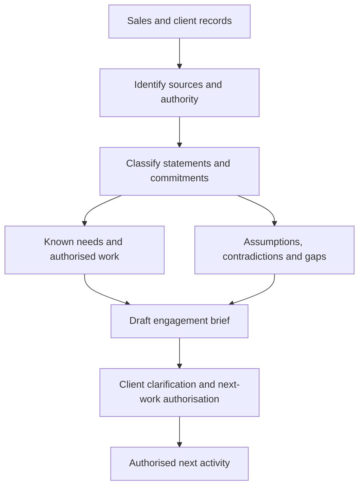

# Consulting Role and Sales-to-Delivery Handoff


## 1. What you will learn

A client buys an improvement to its business, but a delivery team often receives a proposal, sales messages and an incomplete description of the problem. Your first consulting task is to turn that material into a reliable starting point.

A sales-to-delivery handoff transfers the business context, proposed work, commitments and unresolved matters from the people who developed the opportunity to the people who will deliver the engagement. A useful handoff explains what the client needs and what you are authorised to do. It also makes uncertainty visible.

By the end of this chapter, you should be able to:

- Explain the client’s operating context and desired outcomes.
- Distinguish a proposal, an authorised commitment and an informal expectation.
- Separate client statements, verified business requirements, assumptions, exclusions and unanswered questions.
- Identify discovery gaps that prevent a responsible delivery promise.
- Describe commercial boundaries without treating them as product limitations.
- Review a handoff and produce a usable engagement brief.

You need practical experience administering, developing or delivering Zoho applications equivalent to Course 1 or Course 2. You should already understand records, fields, users, permissions and basic automation. Here, you will use that experience to ask better questions rather than immediately configure a solution.

Your contribution to the course project

You will work with Evergreen Field Services, a fictional business needing service intake, customer visibility, dispatch coordination, financial handoffs and management reporting.

Your chapter artifact is an engagement brief: a short, evidence-based account of the client situation, intended outcomes, current authorisation, known requirements and unresolved matters. Later chapters will build discovery notes, a charter, requirements, scope, architecture and delivery evidence from this starting point.

All Evergreen people, documents, dates, business rules, records and numbers in this chapter are synthetic. They are exercise inputs, not observations from a real client or a Zoho execution. Completed artifacts are student model drafts, not client-reviewed documents. Educational scope wording is not approved legal language or Wooplix policy.


## 2. Lessons


### 2.1 Understand the client before proposing the solution

Skill: explain the business situation without reducing it to a list of applications.

As an experienced administrator or developer, you may recognise configuration patterns quickly. An intake form suggests record creation; a dispatch board suggests assignment and status; a finance handoff suggests an integration.

Those associations are useful hypotheses. They are not yet a solution.

A consultant must understand the work behind the requested feature. Who receives a service request? Who decides whether it is ready for dispatch? What information must reach Finance? Who owns a decision when Operations and Finance disagree?

Evergreen performs scheduled maintenance and repairs. Its synthetic context includes two service teams, twelve technicians and two dispatchers working through one dispatch desk. Requests arrive by phone and email. Staff use spreadsheets to coordinate jobs and look up customer information.

These facts describe operations, not a licence count. They do not establish how many people need which applications or permissions.


| Stakeholder | Synthetic contact | Main concern |
| --- | --- | --- |
| Client Sponsor — Morgan Shaw | sponsor@evergreen.example.com | Business outcomes and spending boundaries |
| Operations Manager — Priya Rao | operations@evergreen.example.com | Reliable intake and fewer incomplete handoffs |
| Finance Lead — Luis Chen | finance@evergreen.example.com | Invoice control and financial information |
| Dispatcher — Tessa Reed | dispatch@evergreen.example.com | Current job status and technician assignment |
| Technician Lead — Daniel Okafor | technicians@evergreen.example.com | Usable completion reporting |
| Implementation Lead — Jordan Ellis | implementation@partner.example.com | Evidence, feasibility and delivery boundaries |
| Supplier Sales Lead — Casey Vale | sales@partner.example.com | Expectations established during sales |

The Implementation Lead does not inherit the Sponsor’s commercial authority. The Dispatcher can explain dispatch work but cannot approve additional supplier work under the supplied authority model.

Consider this exchange:

Dispatcher: “We need one place to see what is happening.”  

Implementation Lead: “Who needs to see it, and what decision should they be able to make?”  

Dispatcher: “Internal staff need to find the customer’s open jobs, see their status and identify the assigned technician.”  

Implementation Lead: “I will record that internal visibility need. I still need to establish whether other references to ‘customer visibility’ mean a customer-facing service.”

The consultant converts vague language into a business question without prematurely selecting an application.

A common mistake is to write “Deploy Zoho CRM” as the client outcome. An application is a possible means. The outcome might be that a dispatcher can identify the owner and status of an open job without contacting several colleagues.

Lesson check LC1: A dispatcher asks for “one dashboard for everything.” What two questions would help you understand the need before proposing a dashboard?


### 2.2 Separate outcomes, deliverables and acceptance

Skill: explain what should improve and what evidence could demonstrate that improvement.

An outcome is a change in business performance or capability. A deliverable is something you produce. Acceptance evidence shows whether an agreed deliverable or behaviour meets its agreed conditions.

For example:

- Outcome: fewer completed jobs return to Operations because Finance lacks information.
- Deliverable: a defined completion-to-Finance handoff.
- Possible acceptance evidence: representative cases demonstrate that required information reaches Finance and that invoice release remains under Finance control.

These are connected, but they are not interchangeable. A functioning form does not prove that the business outcome improved. Equally, a proposed improvement target is not automatically a contractual acceptance condition.

Evergreen’s Sponsor suggests an 80% first-pass finance handoff rate as a discussion target. That number is not yet an approved acceptance threshold. You must first agree what “first pass” means, which cases count and how the measurement period will work.

In this chapter, the supplied sample rule is:

A reviewed handoff passes first time when Finance did not return it for missing information. A handoff awaiting review is excluded from this completed-review measure.

The exclusion matters. An unfinished record is neither a demonstrated pass nor a demonstrated failure. Excluding it makes the calculation reproducible, but you must still disclose that unfinished work exists.

Your experience can also help distinguish two superficially similar requests:

Operations: “Finance should not have to re-enter job information.”  

Finance: “I still need to review the completed job before releasing an invoice.”

Reducing re-entry may involve transferring agreed information. It does not imply automatic invoice release. The correct consulting response preserves both needs and investigates how they can coexist.

Avoid promising a quantified improvement merely because the client wants it. A target needs a baseline, a definition and later evidence. Chapter 16 will revisit outcomes against actual project evidence; this chapter establishes a defensible starting description.

Lesson check LC2: Why does “build a completion form” fail to describe the whole business outcome? Why must an unreviewed handoff be disclosed even when it is excluded from the first-pass calculation?


### 2.3 Read proposals as evidence, not as automatic authority

Skill: classify statements and establish which commitments apply.

A proposal describes offered work and its proposed terms. A commitment is a responsibility or promise established through the applicable authorisation process. A sales email may reveal an important expectation without creating the same authority as an accepted scope document.

For this exercise, the supplied engagement note is the authority for current work. In a real engagement, establish the applicable agreement and approval process with the people responsible for commercial decisions.

Use these distinctions consistently:


| Category | Meaning | Evergreen example |
| --- | --- | --- |
| Client statement | Something a stakeholder said; its meaning or authority may need checking | “We need customer visibility.” |
| Verified business requirement | A sufficiently specific business need confirmed by the relevant stakeholder in the supplied case | Finance reviews a completed job before invoice release |
| Assumption | A condition used for planning that has not been confirmed | Process owners will be available at the dates requested for later discovery |
| Exclusion | Work outside a particular stated boundary | Customer self-service is excluded from the current discussion proposal |
| Unresolved question | Information or a decision still needed | Does “customer visibility” include external customer access? |
| Authorised commitment | Work permitted by the supplied authorisation | Review the sales handoff and produce an engagement brief |

“Verified business requirement” does not mean “implemented and tested.” You can confirm a business need before confirming whether a particular product and edition can meet it.

Similarly, an exclusion is attached to a scope boundary. It does not mean that Zoho universally cannot perform the work. Customer self-service could be investigated later through an authorised scope change.

A useful response to an optimistic promise is specific:

Sales Lead: “I said all historical jobs could come over.”  

Implementation Lead: “I will preserve that expectation in the handoff. We do not yet have a source inventory, record counts or quality evidence, so I cannot present complete historical migration as an agreed delivery commitment.”

You are correcting the interpretation of the promise, not deleting evidence that the client may have relied on.

Product names also need qualification. Zoho’s official CRM comparison presents capabilities and limits by edition; it does not establish Evergreen’s entitlement.1 The CRM API v8 documentation describes organisation metadata that includes environment type and licence details, subject to scope and permission requirements.2 An appropriately authorised client administrator could supply relevant inventory evidence. You do not need unrestricted credentials to ask for it.

Evergreen’s edition, subscribed applications, hosting region and administrator authority are not supplied. Product fit and tenant-specific steps remain unverified.

Lesson check LC3: A proposal excludes customer self-service, but a sales email says “customers will have visibility.” How should you record this disagreement?


### 2.4 Transfer uncertainty and commercial boundaries clearly

Skill: produce a brief that supports the next decision without concealing gaps.

A discovery gap is missing information that could change the understanding of the problem, scope, solution, effort or delivery risk.

Not every gap blocks the current activity. Unknown migration volumes do not prevent you from reviewing documents. They do prevent a responsible promise to migrate all historical records.

For each gap, record:

1. What is unknown.
2. Why it matters.
3. Who can supply or decide it.
4. What evidence would close it.
5. Which decision remains blocked.

This is more useful than writing “awaiting clarification.” It gives the next person an actionable question.

Commercial boundaries also describe responsibilities. In the current Evergreen stage:

- The Implementation Lead owns the brief and clarification tracking.
- Client process owners confirm business needs.
- Finance controls the disclosure of finance information.
- The Sponsor authorises additional engagement work.
- No implementation, release or operational support service is authorised.

If a production incident is mentioned during handoff, record it and route it to the client’s existing support owner. Producing an engagement brief does not establish an incident-response service or a restoration capability.

A bounded effort example

The following estimate covers only the handoff review and brief. It is a synthetic planning estimate, not a quotation.


| Work item | Supplier role | Staff effort | Dependency |
| --- | --- | --- | --- |
| Read and index supplied records | Implementation Lead | 2 person-hours | Source packet available on working day 1 |
| Classify claims and check contradictions | Implementation Lead | 2 person-hours | Sales clarification available on working day 2 |
| Draft and check the engagement brief | Implementation Lead | 2 person-hours | Classification complete |
| Correction reserve | Implementation Lead | 0–2 person-hours | Used only if a correction requires rework |

Base supplier effort:


> 2 + 2 + 2 = 6 person-hours

Planning range:


> 6 + (0 to 2) = 6–8 person-hours

For this example, the Implementation Lead has two hours of capacity per working day. The dependencies permit the base work on days 1, 2 and 3. If the full correction reserve is needed after drafting, it uses day 4.

Thus, 6–8 person-hours of staff effort corresponds to 3–4 elapsed working days under these stated conditions. It is not a six-to-eight-hour implementation schedule. Changed availability or additional work requires a revised estimate.

Detailed estimating comes in Chapter 9. Here, your responsibility is to identify the work being estimated, its units and the conditions behind the schedule.

Lesson check LC4: Why can a task requiring six person-hours still take three working days? Which parts of this estimate would change if the sales clarification arrived late?


## 3. Visual explanation: from sales evidence to delivery readiness




The diagram shows an evidence flow, not an automatic approval sequence.

You first identify where a claim came from and who had authority to make it. You then classify it. Known needs and unresolved matters both belong in the engagement brief.

The brief supports clarification and the authorisation of the next activity. Its existence does not authorise discovery, configuration or release by itself. A cleanly formatted document cannot repair missing authority.


## 4. Worked case: review Evergreen’s handoff


### 4.1 Supplied source packet

The following synthetic documents contain all facts needed for the worked review.


| Source ID | Artifact and supplied status | Relevant content |
| --- | --- | --- |
| EVG-SRC-001 | Operations questionnaire, 8 January 2027; business statements confirmed in the scenario | Two teams, twelve technicians, two dispatchers and one dispatch desk. Phone/email intake and spreadsheet coordination. New requests need a unique business job reference, customer reference and received timestamp. Internal staff need the customer’s open-job status and assigned technician. |
| EVG-SRC-002 | Proposal P-03, 9 January; discussion draft, not accepted | Proposes evaluating intake, customer visibility, dispatch, completion information for Finance and weekly reporting. Customer self-service and automated route optimisation are excluded from this proposal. |
| EVG-SRC-003 | Engagement note EL-01, 11 January; current authorisation supplied as a scenario fact | “Authorised work is review of the sales handoff and preparation of an engagement brief. Discovery, configuration, migration, launch and support require separate authorisation.” |
| EVG-SRC-004 | Sales email, 10 January; expectation evidence | “We should be live by 15 February; all old jobs can come over and Finance will not re-key anything.” No supporting implementation scope or estimate is supplied. |
| EVG-SRC-005 | Finance clarification, 11 January; business rule confirmed in the scenario | Job completion does not authorise invoice release. Finance reviews and releases invoices. Finance data access has not been granted. Required handoff fields still need detailed discovery. |
| EVG-SRC-006 | Synthetic six-case handoff sample and Sponsor’s outcome note | Sample shown below. Sponsor suggests 80% first-pass handoffs for discussion and wants weekly open/completed reporting. Reporting definitions and the target’s acceptance status are unresolved. |
| EVG-SRC-007 | Environment and access note | Zoho is in use. Applications, edition, hosting region, environments and client administrator are unconfirmed. The Implementation Lead may use the briefing documents and synthetic sample only; no tenant access, data export or credentials are authorised. |

The six-case sample is not a migration inventory. It establishes no historical record count.


### 4.2 Sample inputs and measurement rule

A completed finance review is marked review_complete. A first-pass success has returned_for_missing_info=no. An awaiting_review row has no return result and is excluded from the completed-review rate.


```csv
job_ref,customer_ref,finance_review_state,returned_for_missing_info,return_reason
EVG-JOB-1001,EVG-CUST-0101,review_complete,no,none
EVG-JOB-1002,EVG-CUST-0102,review_complete,yes,missing_completion_summary
EVG-JOB-1003,EVG-CUST-0101,review_complete,no,none
EVG-JOB-1004,EVG-CUST-0103,review_complete,no,none
EVG-JOB-1005,EVG-CUST-0104,review_complete,yes,missing_completion_date
EVG-JOB-1006,EVG-CUST-0105,awaiting_review,,
EVG-JOB-* and EVG-CUST-* are synthetic business identifiers. They are distinct from Zoho-generated record IDs. Requirement and test IDs identify project evidence, not customer or job records.
```


### 4.3 Step-by-step review

Step 1: establish the mandate

EL-01 authorises the handoff review and engagement brief.

Expected intermediate result: one current authorised activity boundary. The proposal and sales email do not expand it.

Record EVG-DEC-001: use EL-01 as the authority for current work. This is the Implementation Lead’s treatment of supplied evidence, not a new client approval.

Step 2: separate confirmed needs from candidates

The supplied Operations and Finance statements support three verified business requirements. Weekly reporting remains a candidate because its counting rules are unresolved.


| Requirement ID | Business need and status | Evidence and business owner |
| --- | --- | --- |
| EVG-REQ-001 | Verified: each new service request has a unique business job reference, customer reference and received timestamp | EVG-SRC-001; Operations Manager |
| EVG-REQ-002 | Verified: internal staff can find a customer’s open jobs, current status and assigned technician | EVG-SRC-001; Operations Manager and Dispatcher |
| EVG-REQ-003 | Verified: completing a job does not release an invoice; Finance reviews before release | EVG-SRC-005; Finance Lead |
| EVG-REQ-004 | Candidate: weekly open/completed management reporting | EVG-SRC-006; Sponsor |

Expected intermediate result: three verified business needs and one candidate, with product feasibility still unverified.

These early test links preserve the intended business checks:


| Test ID | Draft inputs and expected business result | Evidence status |
| --- | --- | --- |
| EVG-TEST-001 | Two new requests for EVG-CUST-0101, received on 12 January 2027 at 09:00 and 09:05 UTC. Expect different business job references and preservation of the customer and received time. | Proposed; not executed |
| EVG-TEST-002 | A synthetic open job, EVG-JOB-2001, for EVG-CUST-0101, assigned to Technician A. Expect an authorised internal user to find its customer, status and assignment. | Proposed; role and product setup unresolved; not executed |
| EVG-TEST-003 | A synthetic completed job awaiting Finance review. Expect completion alone not to release an invoice; release follows the authorised Finance review. | Proposed; implementation and permissions unresolved; not executed |

These are draft business checks, not complete UAT scripts. Chapters 4 and 13 will develop the traceability and acceptance evidence.

Step 3: calculate the descriptive baseline

Five rows have completed reviews. Three of those were not returned.


> First-pass rate = (completed reviews not returned) ÷ (all completed reviews) × 100


> (3) ÷ (5)×100=60%

The sample return rate is:


> (2) ÷ (5)×100=40%

One of six supplied handoffs remains unreviewed. Its result is unknown.

The difference between the sample first-pass rate and the discussion target is:


> 80%-60%=20 percentage points

Expected intermediate result: a 60% descriptive sample baseline, a provisional 80% target and explicit disclosure of one unfinished case.

Six synthetic cases are not enough to establish normal business performance or prove the cause of returns.

Step 4: assign the discovery gaps


| Question ID | Unresolved matter | Owner or requested source |
| --- | --- | --- |
| EVG-Q-001 | Does customer visibility include external access? | Sponsor and Operations Manager |
| EVG-Q-002 | Which applications, edition, region and environments are available, and who administers them? | Sponsor to nominate client administrator |
| EVG-Q-003 | What information must pass to Finance, and what may each role see? | Finance Lead |
| EVG-Q-004 | What makes a launch ready, and what supports 15 February? | Sponsor and Implementation Lead |
| EVG-Q-005 | How are weekly counts and the 80% target defined and approved? | Sponsor and Operations Manager |
| EVG-Q-006 | Which historical records exist and might be migrated? | Operations Manager and Finance Lead |

Record EVG-DEC-002: retain the sales date, complete-history claim and zero-re-entry claim as expectations requiring clarification; do not baseline them as delivery commitments.


### 4.4 Completed engagement brief

Artifact: Evergreen Engagement Brief v0.1 — draft student model


| Brief field | Completed content |
| --- | --- |
| Owner and purpose | Jordan Ellis, Implementation Lead. Establish a reliable starting point from EVG-SRC-001 through EVG-SRC-007. Not client-reviewed. |
| Client context | Two service teams use phone/email intake and spreadsheets through one dispatch desk. Coordination and incomplete finance handoffs are the immediate concerns. |
| Intended outcomes | Reliable intake identifiers; internal visibility of open jobs and assignments; controlled transfer to Finance; useful management reporting. |
| Baseline and target | Synthetic sample: 3 first-pass successes from 5 completed reviews = 60%; one unreviewed handoff excluded and disclosed. Sponsor’s 80% target is for discussion, not approved acceptance. |
| Current authorised work | Review sales handoff and produce this brief under EL-01. |
| Proposal boundary | P-03 proposes evaluation of five business areas. Customer self-service and automated route optimisation are excluded from that discussion proposal. |
| Current exclusions | No discovery, configuration, migration, launch or support is authorised. No tenant access, export or credentials are permitted. |
| Verified requirements | EVG-REQ-001–003, linked to proposed EVG-TEST-001–003. Business confirmation only; no execution evidence. |
| Candidate requirement | EVG-REQ-004: weekly reporting, pending definitions. |
| Sales expectations | 15 February launch, all historical jobs and no finance re-entry remain unvalidated expectations from EVG-SRC-004. |
| Assumptions | EVG-ASM-001: process owners will be available when later discovery is requested; unconfirmed. EVG-ASM-002: the sample is useful for illustrating handoff measurement, but its representativeness is unconfirmed. |
| Open questions | EVG-Q-001–006, with owners and closure evidence in the gap table. |
| Effort and elapsed schedule | Handoff-only estimate: 6–8 supplier person-hours; 3–4 working days under the stated capacity and dependency assumptions. No implementation estimate. |
| Responsibilities and support | Implementation Lead maintains the brief; client owners confirm their needs; Sponsor authorises further work. Existing client support retains operational incidents. No new support commitment is established. |
| Readiness and next action | Ready to share as a draft handoff summary. Request client clarification and authorisation for the next activity. Implementation readiness cannot yet be assessed. |


### 4.5 A mistake and its correction

Mistake: “Scope: launch on 15 February, migrate all historical jobs and automate invoicing.”

This converts a sales expectation into an authorised scope, invents migration completeness and contradicts Finance’s rule.

Correction: “The sales email establishes expectations about date, history and re-entry. Current authority covers only the handoff review and brief. Finance review remains required. Implementation scope, migration coverage and release planning require further evidence and authorisation.”

The correction preserves the original expectation while making its status clear.


## 5. Try it yourself — guided practice

Learning goal and access

Produce Evergreen Engagement Brief v0.2 after receiving clarification. Use the worked packet, a text editor and a calculator. This is a document-based activity; no Zoho account or tenant access is needed.

Additional inputs

These synthetic clarifications continue the case.


| Source ID | Supplied clarification |
| --- | --- |
| EVG-SRC-008 | Sales Lead, 12 January: “The launch date was indicative. Historical migration and zero re-entry were not agreed deliverables; my email overstated their status.” |
| EVG-SRC-009 | Sponsor, 12 January: “Customer visibility in the current proposal means internal staff finding customers and their open jobs. We are not asking for a customer portal in that proposal. 15 February remains a planning preference. No additional work is authorised.” |
| EVG-SRC-010 | Finance Lead, 12 January: “No invoice export or shared administrator credentials are approved for this handoff. I can provide a redacted field-name list during discovery once that work is authorised.” |

No redacted field list has yet been supplied.

Steps and expected intermediate results

1. Reconcile the sales email with the correction.  

Preserve EVG-SRC-004 and link EVG-SRC-008 to it.  

Expected result: the expectation history remains visible, with corrected commitment status.

2. Update the question register.  

Decide which question is closed and what remains unresolved.  

Expected result: one audience question is resolved; product inventory, finance detail, release readiness, measures and migration questions remain open.

3. Check the outcome statement.  

Recalculate the first-pass rate from the CSV.  

Expected result: a denominator of five, exclusion of the unfinished row and an explicit distinction between baseline and target.

4. Update authorisation, access and readiness.  

Do not treat the offered future field list as a delivered artifact.  

Expected result: a brief that can be circulated for clarification while accurately describing the current limited mandate.

5. Produce the final artifact.  

Complete the worksheets below and label the brief v0.2, draft, not client-reviewed.

Blank engagement brief worksheet


| Field | Your entry | Column guidance |
| --- | --- | --- |
| Artifact identity and owner |  | Name, version, status and accountable author |
| Client context |  | Operational facts, with source IDs |
| Outcomes |  | Business improvements, not application names |
| Baseline and target |  | Formula, counts, exclusions and target status |
| Authorised work |  | Current mandate and its source |
| Proposal and exclusions |  | Distinguish proposed evaluation from current authority |
| Verified requirements and test links |  | Preserve existing IDs and evidence status |
| Candidate requirements |  | Needs not yet sufficiently defined or confirmed |
| Corrected expectations |  | Original source, correction and remaining expectation |
| Assumptions |  | Condition, impact and confirmation owner |
| Questions and dependencies |  | Status, owner and closure evidence |
| Effort and schedule |  | Work boundary, person-hours, capacity and dependencies |
| Responsibilities and support |  | Who clarifies, approves and owns operational support |
| Readiness and next action |  | What may proceed and what decision is requested |

Blank evidence classification worksheet

Use one row per material statement. Add rows as needed.


| Source ID and statement | Category | Linked requirement, decision or question | Current status |
| --- | --- | --- | --- |
|  |  |  |  |
|  |  |  |  |
|  |  |  |  |
|  |  |  |  |

Final artifact: a completed v0.2 brief and evidence worksheet.

Cleanup: retain the original source packet and your versioned brief. Remove duplicate scratch copies you created if they are no longer useful. This exercise requires no application-state cleanup.


## 6. Independent challenge

Continue from the guided clarification state.

Changed inputs


| Source ID | New synthetic input |
| --- | --- |
| EVG-SRC-011 | Sponsor: “I authorise one additional discovery session about customer visibility and the necessary preparation, finance field-list review and brief update. No build, migration or release is authorised. Tessa is available on working day 4; Finance will provide the redacted field list at the start of working day 7.” |
| EVG-SRC-012 | Finance Lead: “Some invoice descriptions contain sensitive notes. Only a redacted field-name list is approved initially. Finance still controls invoice release.” |
| EVG-SRC-013 | Dispatcher: “Please add a customer-facing portal and automated route optimisation for the first launch. We have not identified which customers may log in. Portal users must not see financial information.” |

Record the Dispatcher’s request as EVG-CHANGE-001. The request has not been commercially approved. Detailed routing discovery is not included in the Sponsor’s additional authorisation.

The supplied estimate inputs for the authorised addition are:


| Added work | Role | Effort | Dependency |
| --- | --- | --- | --- |
| Prepare visibility interview | Implementation Lead | 1–2 person-hours | May start on working day 1 |
| Conduct visibility session | Implementation Lead | 1 person-hour | Preparation complete; meeting on day 4 |
| Attend visibility session | Dispatcher | 1 person-hour | Meeting on day 4 |
| Prepare redacted field list | Finance Lead | 0.5 person-hours | Supplied at start of day 7 |
| Review redacted field list | Implementation Lead | 1–2 person-hours | Session complete and list received |
| Update brief | Implementation Lead | 1 person-hour | Field-list review complete |

For this exercise:

- Day 1 starts the authorised addition after the original handoff brief is complete.
- The Implementation Lead has two hours of capacity each working day.
- Work may finish and its dependent task may start on the same day if capacity remains.
- There are no other dependencies.
- No actual calendar dates, holidays or portal/routing delivery estimates are supplied.

Deliverables

Produce:

1. A revised draft engagement brief, v0.3.
2. A change entry for EVG-CHANGE-001 distinguishing the request from authorised work.
3. Candidate requirement entries for the portal and routing request.
4. An added-work estimate separating supplier and client effort.
5. An elapsed working-day range for completing the added brief update.
6. A short client response explaining the next decision required.

Observable success criteria

Your work must:

- Preserve existing requirement IDs and Finance’s release rule.
- Describe the Sponsor’s narrow additional authorisation accurately.
- Keep the new portal and routing requests separate from an approved delivery scope.
- Respect the finance disclosure restriction.
- Show effort units, substitutions, dependencies and capacity.
- Avoid presenting a preferred launch date as a supported commitment.
- Record unresolved customer identity and routing questions.
- Describe artifacts as drafts and tests as unexecuted.

## 7. Common problems and recovery

Recovery in this chapter means repairing evidence and communication. It does not mean restoring a database or undoing a release.


| Symptom | Diagnosis | Correction |
| --- | --- | --- |
| “Everything in the proposal is in scope.” | Offered work has been treated as authorised work | Identify the applicable authority and separate proposed, authorised and excluded work |
| “All six handoffs passed or failed.” | The unfinished case has been forced into a completed-case measure | Exclude its unknown result and disclose it separately |
| A missing target definition is filled with an invented SLA | A discovery gap has been hidden | Record the missing definition and its decision owner |
| Finance refuses an export | Access was requested beyond the current permission boundary | Continue with authorised documents; record the gap and request permitted evidence |
| A correction overwrites the original sales message | Expectation history is lost | Retain both sources and explain the correction in the latest brief |
| A portal request is called a product impossibility | A scope exclusion has been mistaken for a technical prohibition | Explain its scope status and defer product-fit assessment |
| A client asks the implementation team to fix an operational incident | Support ownership is unclear | Route the incident to the existing support owner and record any separate support request |

If you have already circulated an inaccurate brief, issue a clearly versioned correction to its recipients. Identify the changed statement, supporting source and affected decision. You cannot assume that editing your local copy corrects everyone’s understanding.


## 8. Check your understanding

1. An administrator can create fields in Evergreen’s tenant. Does that permission establish authority to build the proposed solution? Explain.
2. Using the CSV, calculate the first-pass rate and state the treatment of EVG-JOB-1006.
3. Why is “customer visibility” insufficient to promise a customer-facing portal? Identify the relevant clarification owner.
4. Write a two-sentence response to the original 15 February sales expectation.
5. Trace the Finance release rule from source to requirement to planned test. What can that chain demonstrate now, and what can it not demonstrate?

Attempt these questions and the exercises before reading the solutions.


## 9. Solutions and explanations


### 9.1 Lesson checks

LC1: Ask who will use the dashboard and what decision or action it must support. Questions about the information, timing and exceptions are also valid. “Which chart type do you want?” is premature because it does not establish the business need.

LC2: A form is a deliverable. The broader outcome concerns complete information reaching Finance with less avoidable return and re-entry. The unfinished record must be disclosed because the completed-review rate does not describe all supplied work or its eventual result.

LC3: Preserve both sources. Record customer self-service as excluded from P-03 and external visibility as unresolved. Ask the Sponsor and Operations Manager to confirm the intended audience. Do not silently broaden the proposal or describe the feature as technically impossible.

LC4: Effort counts working time; elapsed schedule also reflects capacity and waiting. Late sales clarification delays classification and dependent drafting. It may leave staff effort unchanged if no rework occurs, but the elapsed range must be revised.


### 9.2 Guided practice solution

The first-pass calculation remains:


> (3) ÷ (5)×100=60%

EVG-JOB-1006 remains unfinished and excluded. The target remains provisional.

Completed artifact: Evergreen Engagement Brief v0.2 — draft student model


| Field | Completed content |
| --- | --- |
| Owner and sources | Jordan Ellis. EVG-SRC-001–010. Draft; not client-reviewed. |
| Context and outcomes | Phone/email intake and spreadsheet coordination through one dispatch desk. Improve intake reliability, internal open-job visibility and controlled finance handoffs; clarify weekly reporting. |
| Baseline and target | 60% first-pass in five completed synthetic reviews; one unfinished record disclosed. Proposed 80% target is not approved acceptance. |
| Authorised work | Handoff review and engagement brief only, under EL-01. EVG-SRC-009 grants no additional work. |
| Proposal boundary | Internal customer visibility is confirmed for P-03. Customer portal and automated routing remain excluded from that proposal. |
| Verified requirements | EVG-REQ-001–003 remain unchanged, linked to EVG-TEST-001–003; tests proposed and not executed. |
| Candidate requirement | EVG-REQ-004 remains pending reporting definitions. |
| Corrected expectations | EVG-SRC-008 corrects EVG-SRC-004: historical migration and zero re-entry were not agreed deliverables. The date remains a preference, not a supported launch commitment. |
| Assumptions | EVG-ASM-001 and EVG-ASM-002 remain unconfirmed. |
| Question status | EVG-Q-001 closed by EVG-SRC-009 for the current proposal’s audience. EVG-Q-002–006 remain open. |
| Access and dependency | No invoice export or shared credentials. A future redacted field list is offered, not supplied, and depends on discovery authorisation. |
| Estimate | Handoff-only estimate remains 6–8 supplier person-hours and 3–4 working days under the original stated conditions. |
| Ownership and support | Implementation Lead owns brief corrections; Finance controls finance disclosure; Sponsor authorises additional work; existing client support owns operational incidents. |
| Readiness and next action | Share the draft and request the next-work decision. No implementation readiness claim and no discovery start. |

A completed evidence worksheet could include:


| Source and statement | Category | Linked record | Current status |
| --- | --- | --- | --- |
| EVG-SRC-008 corrects historical migration and re-entry wording | Expectation correction | EVG-DEC-002; EVG-Q-006 | Original email retained; no migration commitment |
| EVG-SRC-009 confirms internal visibility | Business clarification | EVG-REQ-002; EVG-Q-001 | Audience question closed for current proposal |
| EVG-SRC-009 says no additional work is authorised | Authorisation boundary | EVG-DEC-001 | Current mandate unchanged |
| EVG-SRC-010 refuses export and offers a future redacted list | Permission boundary and dependency | EVG-Q-003 | Fields still unknown; no access granted |

An acceptable alternative is to attach the classifications as an appendix rather than a separate worksheet. The source, authority and status distinctions must remain visible.


### 9.3 Independent challenge solution

Added-work estimate

Supplier effort is Implementation Lead effort:


> (1–2)+1+(1–2)+1=4–6 person-hours

Client effort is separate:


> 1+0.5=1.5 person-hours

The combined supplier planning range for the original handoff and authorised addition is:


> (6–8)+(4–6)=10–14 person-hours

This is still not an implementation estimate.

For the addition’s elapsed schedule:

- Preparation can finish before day 4.
- The session occurs on day 4.
- Field-list review cannot begin before day 7.
- At the low effort value, one hour of review plus one hour of updating fits within day 7’s two-hour capacity.
- At the high effort value, two hours of review use day 7’s capacity; the one-hour update finishes on day 8.

The added brief update therefore finishes on working day 7–8, conditional on the supplied availability and capacity. Do not add this range mechanically to the original handoff schedule: the challenge explicitly starts after that brief is complete.

New candidate requirements


| Requirement ID | Candidate need | Source | Unresolved matter and test status |
| --- | --- | --- | --- |
| EVG-REQ-005 | Customer-facing portal with no financial information exposed | EVG-SRC-013 | Customer eligibility, identity and access rules unresolved; no test assigned |
| EVG-REQ-006 | Automated route optimisation for first launch | EVG-SRC-013 | Routing objectives, inputs and constraints unresolved; no test assigned |

Candidate status is appropriate because the requests lack sufficient definition and delivery approval. Product feasibility is also unverified.

Completed change entry


| Field | EVG-CHANGE-001 entry |
| --- | --- |
| Requester and source | Dispatcher; EVG-SRC-013 |
| Requested change | Add customer-facing portal and automated route optimisation to the first launch |
| Current boundary affected | Both are excluded from P-03; no implementation is authorised |
| Business implications | External access creates identity and visibility questions; routing requires new operational definitions |
| Authorisation status | Customer-visibility discovery addition authorised by EVG-SRC-011. Portal/routing delivery not approved. Detailed routing discovery not authorised. |
| Estimate status | Authorised addition: 4–6 supplier person-hours plus 1.5 client person-hours. No portal/routing delivery estimate available. |
| Recommendation | Complete authorised visibility discovery; seek definitions and a separate decision on any wider assessment or delivery |
| Decision owner | Sponsor, using input from Operations, Finance and the Implementation Lead |

Completed revised brief

Artifact: Evergreen Engagement Brief v0.3 — draft student model


| Field | Completed content |
| --- | --- |
| Owner and evidence | Jordan Ellis; EVG-SRC-001–013. Student model draft, not client-reviewed. |
| Context and outcomes | Original operational context unchanged. Internal visibility remains the current proposal need; external portal and routing are new requests, not established delivery outcomes. |
| Baseline and target | 60% first-pass in five completed synthetic reviews; one unfinished case. The 80% target remains provisional. |
| Current authority | EL-01 handoff work plus the narrow visibility discovery addition in EVG-SRC-011. No build, migration, release or support authorisation. |
| Requirements and traceability | EVG-REQ-001–003 remain verified business needs linked to proposed, unexecuted EVG-TEST-001–003. EVG-REQ-004–006 are candidates. |
| Proposal and change | P-03 exclusions remain recorded. EVG-CHANGE-001 requests portal and routing; delivery approval is pending. |
| Finance boundary | Finance retains invoice release. Only a redacted field-name list is permitted initially; sensitive invoice descriptions must not be assumed available. |
| Assumptions and questions | EVG-ASM-001–002 remain open for later work. EVG-Q-001 remains closed for P-03’s original audience. EVG-Q-002–006 remain open. Add EVG-Q-007 for external customer identity/access and EVG-Q-008 for routing objectives and constraints. |
| Effort | Authorised addition: 4–6 supplier person-hours; 1.5 client person-hours. Original plus added supplier effort: 10–14 person-hours. |
| Elapsed schedule | Added brief update finishes on working day 7–8 under supplied availability and two-hour daily supplier capacity. No supported implementation date. |
| Responsibility and support | Implementation Lead owns the draft and authorised investigation; Sponsor owns further approval; Finance owns disclosure and invoice rules; existing support ownership remains unchanged. |
| Recommendation | Proceed with the authorised visibility session and field-list review. Request a separate scope decision before wider assessment or delivery. |

Record EVG-DEC-003: plan only the additional work authorised by EVG-SRC-011; keep portal/routing delivery outside the approved work. This is the Implementation Lead’s planning decision, not a fabricated client delivery approval.

A suitable client response is:

We can proceed with the authorised customer-visibility session and brief update, using the permitted redacted finance field list. The portal and routing request remains open: customer identity rules, routing needs, product fit and delivery impact must be established before you can decide on a revised scope or supported launch date.


### 9.4 Understanding check answers

1. No. Product permission allows an action within a system; commercial authority establishes whether it is part of the engagement. Both must be appropriate.
2. 60%: three non-returned handoffs divided by five completed reviews. EVG-JOB-1006 has an unknown result, so it is excluded and disclosed.
3. Audience and use case are missing. Internal staff visibility differs from external customer access. The Sponsor and Operations Manager provide the relevant clarification.
4. Example: “We have recorded 15 February as the sales planning expectation, but current authority covers only the handoff brief. We need agreed scope, dependencies and readiness conditions before presenting a supported release commitment.”
5. EVG-SRC-005 → EVG-REQ-003 → EVG-TEST-003. The chain demonstrates where the business rule came from and how it is intended to be checked. It does not demonstrate configured permissions, a passing test, UAT acceptance or an observed release result.

## 10. Chapter recap and next step

A strong handoff is reliable because it preserves evidence and explains uncertainty.

Your engagement brief should tell a reader what the client does, what should improve, what is currently authorised and what prevents the next promise. It should preserve disagreements rather than hide them, and distinguish business confirmation from product verification.

Completion checklist

- I can explain Evergreen’s context without treating an application name as an outcome.
- I can distinguish a proposal, an expectation and an authorised commitment.
- I can classify assumptions, exclusions and discovery gaps.
- I can calculate the sample rate and explain its unfinished-case exclusion.
- I can maintain requirement-to-test links without inventing test results.
- I can separate staff effort from elapsed schedule.
- I can produce a draft brief with clear ownership and next decisions.

Your project artifact is the engagement brief with its source classifications, questions and early traceability.

Chapter 2, Stakeholder Discovery and Kickoff, builds on it through interviews, conflicting needs, decision rights, discovery notes, a charter and initial estimate assumptions. Obtain authority for any discovery beyond the narrow work already supplied in this case.


## 11. Glossary and further reading

Glossary


| Term | Meaning |
| --- | --- |
| Acceptance evidence | Recorded information showing whether agreed conditions were met |
| Assumption | An unconfirmed condition used for planning |
| Baseline | A stated starting point used for comparison or control |
| Commercial boundary | The authorised limit of work, responsibility or commitment |
| Discovery gap | Missing information that could affect an engagement decision |
| Elapsed schedule | Time from start to finish, including capacity limits and waiting |
| Engagement brief | Evidence-based summary of context, outcomes, authority and uncertainty |
| Exclusion | Work outside a particular stated scope |
| Outcome | Desired improvement in business performance or capability |
| Person-hour | One person working for one hour |
| Proposal | Offered work and terms that require the applicable acceptance process |
| Traceability | An explicit link between a need and related evidence, decisions or tests |
| Verified business requirement | A specific need confirmed by the relevant business stakeholder; not necessarily implemented or tested |

Further reading

1. Zoho CRM — Feature-wise comparison of editions  
[Open official reference](https://www.zoho.com/crm/complete-feature-list.html)

Supports the need to check edition-specific capability and limit dependencies. It does not establish Evergreen’s purchased entitlement.

2. Zoho CRM Developer Documentation — API v8: Get Organization Details  
[Open official reference](https://www.zoho.com/crm/developer/docs/api/v8/get-org-data.html)

Describes organisation metadata, including environment type and licence details, and the applicable scope and permission conditions. Use it when planning an authorised inventory request; this chapter does not require an API call.

These official references were accessed on 5 October 2026. Research is partially verified: the cited product statements are documentation-based, while Evergreen’s actual applications, edition, region, permissions and product fit remain unknown. No UI procedure, API execution or product test result is claimed.
