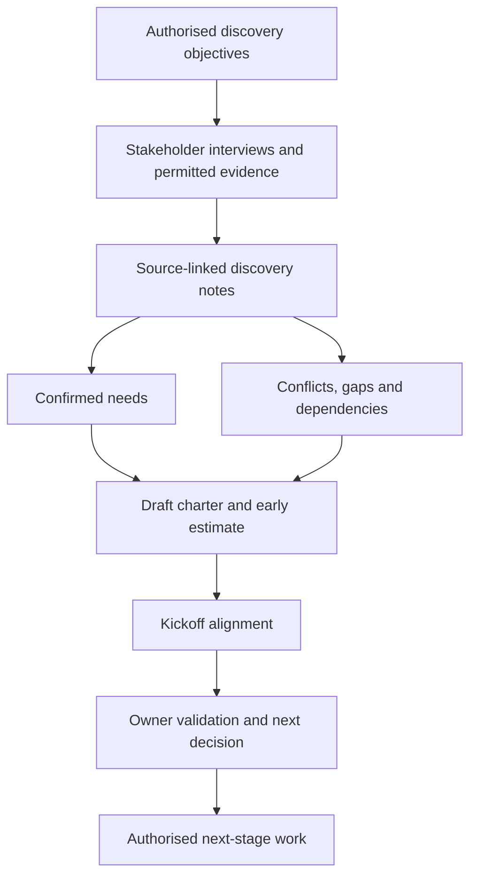

# Stakeholder Discovery and Kickoff

## 1. What you will learn

A sales handoff gives you a starting account of the client’s situation. Discovery helps you establish whether that account is complete enough to support delivery decisions.

Stakeholder discovery is structured investigation of the people, work, rules and dependencies that shape an implementation. Kickoff aligns participants on the engagement’s purpose, boundaries, responsibilities and next actions. A kickoff meeting does not replace discovery, approve every requirement or demonstrate implementation readiness.

By the end of this chapter, you should be able to:

- Plan and conduct interviews that reveal business needs and exceptions.
- Facilitate discussion without allowing the loudest participant to define the solution.
- Separate conflicting requests from the underlying needs.
- Identify who supplies facts, recommends options and approves decisions.
- Record dependencies and distinguish missing information from confirmed conditions.
- Write useful discovery objectives.
- Produce discovery notes, a draft charter and initial estimate assumptions.
- Explain early effort and schedule estimates without presenting them as implementation commitments.

Prerequisites and previous continuity

You need practical Zoho experience and the Chapter 1 distinction between a client statement, verified business requirement, assumption, exclusion and unresolved question.

Chapter 1 established the following synthetic Evergreen facts:

| Record or fact | State carried into this chapter |
| --- | --- |
| Operating context | Two service teams, twelve technicians and two dispatchers through one dispatch desk; phone/email intake and spreadsheet coordination |
| EVG-REQ-001 | Verified business need: unique job reference, customer reference and received timestamp for each new request |
| EVG-REQ-002 | Verified business need: internal visibility of a customer’s open jobs, status and assigned technician |
| EVG-REQ-003 | Verified business rule: completion alone does not release an invoice; Finance reviews before release |
| EVG-REQ-004 | Candidate: weekly management reporting, with definitions unresolved |
| EVG-REQ-005 and EVG-REQ-006 | Candidates: customer portal and automated routing |
| EVG-CHANGE-001 | Portal/routing request recorded; delivery not approved |
| EVG-TEST-001–003 | Proposed business checks; not executed |
| Measurement | Three first-pass handoffs from five completed synthetic reviews: 60%; one unfinished case excluded and disclosed |
| Discussion target | 80% first-pass handoffs; not approved acceptance |
| Authorisation | Handoff brief plus a narrow customer-visibility discovery addition; no build, migration, release or new support service |
| Artifact status | Student model drafts, not client-reviewed documents |

The portal and routing requests did not change the meaning of the original proposal’s internal visibility need. They were additional requests.

This chapter supplies an explicit new authorisation for a broader discovery package. It does not infer permission from the earlier draft.

Your project contribution

Your project pack gains:

1. A stakeholder map and interview plan.
2. Discovery notes with sources, decisions and unanswered questions.
3. A draft project charter.
4. A bounded discovery-phase estimate and assumption record.

All Evergreen documents, dialogue, dates, numbers and business rules remain synthetic. Supplied dialogue is simulation evidence, not proof that a real meeting occurred. Estimates are planned effort, not timesheet observations. Scope wording is educational, not approved legal language or Wooplix policy.

## 2. Lessons

### 2.1 Interview people about work, decisions and exceptions

Skill: obtain usable evidence rather than a feature wish list.

An interview should help you understand how work happens and why people make particular decisions. Asking only “What features do you want?” encourages stakeholders to prescribe screens before explaining their needs.

Start with a concrete event:

“Take me through the last ordinary service request, from arrival to Finance review.”

Then investigate the important transitions:

- What information was available?
- Who decided the request was ready?
- What happened next?
- How did the receiving person know work was waiting?
- What happened when something was missing?

Use open questions to invite explanation: “How do you decide which technician to assign?” Use focused questions to establish a specific fact: “Who can authorise invoice release?”

Neither question type is sufficient alone. Open questions reveal context; focused questions make a record precise.

An interview should also examine an exception. A normal job can hide the controls that matter most:

Implementation Lead: “What happens when the customer reschedules after assignment?”  

Dispatcher: “We change the spreadsheet.”  

Implementation Lead: “What happens to the original appointment, and who tells the technician?”  

Dispatcher: “That depends on who answers the phone. We do not have one agreed rule.”

The useful result is not a guessed rescheduling workflow. It is a documented discovery gap.

Avoid leading questions such as “Would automatic invoicing solve this?” They introduce a solution and may encourage agreement. A better question is “Which information must Finance receive, and which decision must remain with Finance?”

Also distinguish:

- Reported fact: a stakeholder describes what normally happens.
- Document evidence: a permitted artifact supports the description.
- Unconfirmed claim: the statement still needs another owner or source.
- Proposed future behaviour: the stakeholder wants a change.

A walkthrough is stronger when you can follow an authorised sample record. It is not permission to inspect unrelated customer or financial information.

Lesson check LC1: Rewrite “Would a mobile app fix your completion problems?” as two neutral questions that reveal the work and its difficulties.

### 2.2 Facilitate conflicting needs without forcing premature agreement

Skill: help stakeholders reach a decision that respects their different responsibilities.

Facilitation means guiding a discussion so that participants can understand the problem, contribute evidence and reach appropriate decisions.

You do not need to make every person agree with every request. You need to make the disagreement understandable and route the decision correctly.

A practical sequence is:

1. Restate each person’s need neutrally.
2. Separate the need from the requested solution.
3. Identify constraints that must be preserved.
4. Compare options against the needs.
5. Record the decision or unresolved trade-off.

For example:

Dispatcher: “Show us the whole invoice so we stop chasing Finance.”  

Finance Lead: “Dispatch does not need cost and margin fields.”  

Implementation Lead: “Dispatch needs to know whether the handoff reached Finance and who owns it. Finance needs to restrict financial details. Could a nonfinancial handoff status and responsible contact meet the coordination need?”

The proposed option is narrower than “show the whole invoice.” It should still be confirmed by the relevant owners.

A common mistake is to settle a conflict by majority vote. A vote cannot override a supplied Finance control or authorise new commercial work. Another mistake is to record “agreed” when participants merely stopped objecting.

Use precise outcomes:

- “Finance confirmed that a nonfinancial handoff status may be shared.”
- “Dispatcher confirmed that status and a contact address meet the coordination need.”
- “Portal identity rules remain unresolved.”
- “Sponsor deferred the portal/routing request from the current package.”

For quieter participants, ask a direct but neutral question: “Technician Lead, what would make this completion record difficult to enter in the field?” Summarise the answer before returning to the wider group.

Record dissent when it affects delivery. A documented unresolved issue is more useful than false consensus.

Lesson check LC2: What is the underlying need behind the request to show the whole invoice? Which Finance boundary must the proposed alternative preserve?

### 2.3 Establish decision rights and dependencies

Skill: know who can close a question and what must happen before dependent work proceeds.

A decision right identifies who has authority to make a particular decision. Expertise, participation and approval authority are different.

Evergreen uses the following synthetic decision model:

| Decision type | Decision owner | Contributors |
| --- | --- | --- |
| Engagement scope and additional supplier work | Client Sponsor | Implementation Lead and affected process owners |
| Operational process facts and operational priorities | Operations Manager | Dispatcher and Technician Lead |
| Invoice release and finance-data disclosure | Finance Lead | Operations and Implementation Lead |
| Product feasibility and supplier effort recommendation | Implementation Lead | Client Administrator and business owners |
| Cross-functional priority trade-off | Client Sponsor | Operations and Finance; their supplied control boundaries remain explicit |
| Product access grant | Authorised client administrator, within client authority | Sponsor and relevant data owner |
| Draft charter acceptance | Client Sponsor after review | Process owners and Implementation Lead |

A stakeholder can confirm a process fact without accepting a contract. An administrator can provide authorised environment evidence without approving the business scope.

A dependency is a condition that must be satisfied before another activity can proceed. It should name the receiving activity and the consequence of delay.

Weak entry:

“Waiting for Finance.”

Useful entry:

“The field-list review cannot start until Finance supplies the approved redacted list. A delay affects requirement consolidation and the charter update.”

Dependencies can concern people, evidence or decisions. “Portal customer eligibility is undefined” is a dependency for a responsible external-access design, even if nobody is waiting for a software installation.

Product inventory is another example. Zoho’s CRM comparison distinguishes edition-dependent capabilities and limits.1 The CRM API v8 documentation describes organisation information including environment type and licence details, with scope and permission conditions.2 These sources help you specify the evidence needed. They do not establish Evergreen’s actual entitlement or permit an API call.

Do not turn the organisation’s business address into proof of hosting region. Ask the authorised administrator for the relevant tenant information.

Lesson check LC3: The Dispatcher confirms an assignment rule and asks the team to add automated routing. Which part can the Dispatcher confirm, and which decision requires the Sponsor?

### 2.4 Define objectives and use kickoff to align the work

Skill: write objectives that can guide discovery without inventing business guarantees.

An objective describes the result an activity should achieve. A discovery objective should be observable and achievable within the authorised investigation.

Weak objective:

“Understand Evergreen.”

Useful objective:

“By the end of the discovery pack, identify the owner and required information at each major intake-to-Finance handoff, and mark any disputed or missing rule.”

The second objective gives you something to inspect. It does not claim the business process has already improved.

Distinguish three levels:

| Level | Evergreen example |
| --- | --- |
| Business outcome | Reduce avoidable returns from Finance |
| Discovery objective | Establish required handoff fields, owners and current exceptions |
| Discovery deliverable | Notes, open-question register and draft charter |

A project charter is a concise record of purpose, boundaries, stakeholders, decision rights, major dependencies and intended measures. It is not a detailed statement of work, architecture or release plan.

A useful kickoff conversation confirms:

- Why the engagement exists.
- What work is authorised now.
- Who supplies information and makes decisions.
- What outputs will be produced.
- What remains unknown.
- How changes and unresolved matters will be handled.

You should state the maturity of the information. “Draft charter for review” means something different from “accepted scope baseline.”

If a key stakeholder is absent, the kickoff may still align known facts. It cannot manufacture that person’s confirmation. Record the missing contribution and the decision it blocks.

Lesson check LC4: Why is “hold a kickoff meeting” a deliverable rather than a sufficient discovery objective?

### 2.5 Size the investigation before sizing the implementation

Skill: estimate bounded work using effort, dependencies and uncertainty.

Early sizing is a first structured estimate made before all delivery details are known. Its usefulness comes from making the reasoning visible, not from appearing precise.

For this chapter, estimate the discovery package. You do not yet have enough evidence to estimate the complete implementation.

Break the package into activities. Assign staff effort in person-hours. Identify client participation separately. Then use availability and capacity to derive an elapsed schedule.

For a Sponsor interview:

| Component | Implementation Lead effort |
| --- | --- |
| Preparation | 0.25 person-hours |
| Interview | 0.50 person-hours |
| Notes and question updates | 0.25 person-hours |
| Total | 1.00 person-hours |

If the Sponsor is only available on working day 2, the activity cannot finish on day 1 simply because it requires one supplier hour.

A reserve is explicitly allocated effort for identified uncertainty. It should not conceal undefined additional scope. Four hours for corrections within the agreed packet is different from an unbounded promise to conduct as many interviews as necessary.

Record estimate assumptions such as:

- One interview per listed stakeholder group.
- Permitted evidence arrives at the supplied dates.
- No solution design, migration execution or configuration is included.
- Desk activities may be split across working days.
- New interviews or new discovery domains require a revised plan.

Chapter 9 develops implementation estimation in depth. Here, your task is to avoid confusing a bounded discovery estimate with a project delivery commitment.

Lesson check LC5: Why should client interview time be recorded separately from supplier effort? What makes a reserve different from an undefined allowance for extra scope?

## 3. Visual explanation: discovery and decision flow

The diagram separates investigation, documentation and approval.

Interviews produce evidence and questions, not automatic agreement. Both confirmed needs and unresolved matters feed the charter and estimate. Kickoff aligns the participants, after which the appropriate owners validate facts and decide the next activity.

The final arrow depends on authorisation. It does not mean that finishing the discovery documents automatically permits configuration.

## 4. Worked case: begin structured discovery

### 4.1 New authorisation and interview inputs

These are explicit new synthetic inputs.

| Source ID | Supplied content |
| --- | --- |
| EVG-SRC-014 | Sponsor authorisation, 14 January 2027: structured stakeholder interviews, permitted document inventory, one kickoff alignment meeting, discovery notes, draft charter and a discovery-phase effort plan are authorised. The package includes the previously authorised but unperformed visibility session and field-list review. Supplier effort ceiling: 22 person-hours. No configuration, migration, release or new support service. |
| EVG-SRC-015 | Sponsor interview simulation: “Prioritise internal job visibility and a reliable Finance handoff. Keep the portal and routing requests separate for now. I want weekly open and completed counts, but we have not agreed the reporting cutoff or business timezone. The 80% target and 15 February date remain discussion preferences.” |
| EVG-SRC-016 | Operations/Dispatcher walkthrough simulation: requests arrive by phone/email; Operations records customer and job references; Dispatcher assigns a technician; completed jobs are sent to Finance. Returned handoffs are corrected by Operations. Dispatcher asks for invoice visibility to stop chasing Finance. Cancellation and rescheduling treatment varies; no agreed rule is supplied. |

The broader authorisation replaces the unused narrow-session plan with one integrated discovery package. Do not add the previous 4–6 supplier hours to the integrated package estimate.

Record EVG-DEC-004: plan one integrated discovery package under EVG-SRC-014, without double-counting the unperformed narrow activities.

### 4.2 Step 1: turn statements into interview findings

Do not record every sentence as a requirement. First identify its meaning and status.

Completed discovery note: EVG-NOTE-001

| Field | Completed content |
| --- | --- |
| Sources | EVG-SRC-015 and EVG-SRC-016 |
| Participants represented | Sponsor, Operations Manager and Dispatcher |
| Purpose | Clarify current flow, priorities and coordination problems |
| Confirmed business facts | Phone/email intake; Operations records references; Dispatcher assigns; Finance receives completion handoff; Operations corrects returns |
| Confirmed priority | Internal visibility and reliable Finance handoff are the current discovery focus |
| Requested behaviour | Dispatcher wants invoice visibility to reduce chasing |
| Interpretation requiring confirmation | The underlying dispatch need may be handoff status and ownership rather than full invoice access |
| Unresolved matters | Reporting cutoff/timezone; cancellation and rescheduling rules; permissible finance visibility |
| Existing record links | EVG-REQ-001–004; EVG-Q-003 and EVG-Q-005 |
| New question | EVG-Q-009: who owns cancellation/rescheduling decisions and notifications? Operations Manager to confirm |
| Decision status | No new implementation approval or accepted reporting definition |
| Next evidence | Finance interview; Technician Lead interview; process exception examples |

Expected intermediate result: a note that separates facts, requests and interpretation.

### 4.3 Step 2: build the stakeholder map

| Stakeholder | Discovery contribution | Decision role |
| --- | --- | --- |
| Sponsor | Priorities, outcomes and engagement boundaries | Scope and cross-functional priority approval |
| Operations Manager | Intake, corrections and process ownership | Operational facts and priorities |
| Finance Lead | Handoff fields, disclosure and invoice release | Finance controls and disclosures |
| Dispatcher | Assignment, status and coordination needs | Process contributor, not scope approver |
| Technician Lead | Completion entry and field practicality | Technician workflow contributor |
| Implementation Lead | Evidence structure, dependencies and sizing | Supplier recommendations |
| Client Administrator | Tenant inventory and authorised access evidence | Product-access owner within client authority |

The Client Administrator is a new supporting role in this chapter. The later supplied contact is admin@evergreen.example.com.

### 4.4 Step 3: write the initial charter

Artifact: Evergreen Discovery Charter v0.1 — draft student model

| Charter field | Completed content |
| --- | --- |
| Purpose | Establish the business facts, boundaries and unresolved matters needed for responsible implementation planning |
| Business outcomes | Reliable intake, internal job visibility and controlled Finance handoff; management reporting remains to be defined |
| Authorised phase | Integrated discovery and kickoff package under EVG-SRC-014, within 22 supplier person-hours |
| EVG-OBJ-001 | Identify owners, information and unresolved rules at each major intake-to-Finance handoff |
| EVG-OBJ-002 | Confirm current visibility audience and distinguish portal/routing requests from current authorised work |
| EVG-OBJ-003 | Propose reproducible reporting and first-pass definitions, with any missing cutoff or approval marked |
| EVG-OBJ-004 | Obtain permitted environment/source evidence or identify the gaps preventing later sizing |
| Deliverables | Stakeholder map, source-linked notes, question updates, draft charter and discovery estimate |
| Exclusions | Solution configuration, detailed routing design, data migration, product test execution, release and new support service |
| Authority | Sponsor approves scope; process owners confirm facts; Finance controls invoice release and disclosure; Implementation Lead recommends feasibility and effort |
| Measurement status | 60% synthetic sample baseline; 80% discussion target; no approved performance guarantee |
| Dependencies | Stakeholder availability, Finance field list, administrator inventory and owner validation |
| Acceptance status | Draft for client review; no charter acceptance supplied |

### 4.5 Step 4: size one activity transparently

The Sponsor interview uses 0.25 hours preparation, 0.50 hours discussion and 0.25 hours notes.

> 0.25+0.50+0.25=1.00 supplier person-hour

Sponsor participation is 0.50 person-hours.

Expected intermediate result: a bounded activity estimate with separate roles and a stated meeting dependency. It is not an implementation estimate.

A mistake and its correction

Mistake: “All stakeholders agreed to the reporting dashboard and portal.”

The supplied dialogue contains neither agreement on reporting definitions nor approval of a portal.

Correction: “The Sponsor prioritised internal visibility and Finance handoff. Weekly reporting remains a candidate pending definitions. Portal and routing requests remain separate from approved delivery scope.”

The corrected note gives the next reader a usable account of what actually exists in the simulation.

## 5. Try it yourself — guided practice

Learning goal and access

Complete the discovery notes, charter and initial estimate assumptions for the integrated package.

Use the Chapter 1 continuity and EVG-SRC-014–016 above, plus the inputs below. You need a document editor and calculator. No tenant access is required.

Additional interview and inventory inputs

| Source ID | Supplied simulation input |
| --- | --- |
| EVG-SRC-017 | Finance: “The completion handoff needs job reference, customer reference, completion date and completion summary. Completion must not release an invoice. Dispatch may see a nonfinancial handoff status and responsible Finance contact, but not cost or margin. Technician users must not see cost or margin. A redacted field-name list will be available on day 5.” |
| EVG-SRC-018 | Technician Lead: “Operations should supply job and customer references before assignment. We can supply completion date and summary. A required summary is reasonable, but cancellation and rescheduling rules still need agreement. We are not requesting automatic invoice release.” |
| EVG-SRC-019 | Client Administrator: “Zoho CRM is in use. I can provide a permitted inventory on day 5. Edition, hosting region and environment details are not yet evidenced in this packet. No credentials or record exports are approved.” Contact: admin@evergreen.example.com |
| EVG-SRC-020 | Availability and capacity: packet on day 1; Sponsor interview day 2; Operations/Dispatcher day 3; Finance and Technician Lead interviews day 4; administrator inventory and Finance field list day 5; kickoff day 7; owner validation day 8. Implementation Lead capacity is four hours per working day. |
| EVG-SRC-021 | Supplier sizing assumptions and work breakdown shown below. All hours are planned effort. |

Business field descriptions such as “completion date” are not Zoho API field names.

Supplied work breakdown

| Work ID | Activity | Supplier effort: Implementation Lead | Client effort |
| --- | --- | --- | --- |
| D01 | Review and index packet | 2 hours | 0 |
| D02 | Sponsor interview, preparation and notes | 1 hour | Sponsor: 0.5 hours |
| D03 | Operations/Dispatcher walkthrough and notes | 2 hours | Operations: 1 hour; Dispatcher: 1 hour |
| D04 | Finance interview and notes | 1.5 hours | Finance: 0.75 hours |
| D05 | Technician Lead interview and notes | 1.5 hours | Technician Lead: 0.75 hours |
| D06 | Inventory and redacted field-list review | 2 hours | Administrator: 0.5 hours; Finance: 0.25 hours |
| D07 | Consolidate findings, questions and requirement links | 3 hours | 0 |
| D08 | Kickoff preparation, meeting and notes | 1.5 hours | Six client participants: 0.75 hours each |
| D09 | Draft charter and initial estimate | 2 hours | 0 |
| D10 | Targeted owner validation and corrections | 1.5 hours | Sponsor, Operations and Finance: 0.25 hours each |

The six client kickoff participants are Sponsor, Operations Manager, Finance Lead, Dispatcher, Technician Lead and Client Administrator.

Additional estimate rules:

- A supplier reserve of 0–4 hours covers desk corrections within the existing packet.
- The reserve does not include new interviews or detailed solution design.
- Reserve work occurs after D10.
- Desk activities may be divided across working days.
- Meetings occur at their supplied slots.
- Dependent work may start on the same day if capacity remains.
- Discovery working day 1 is a new planning origin. It is not mapped to a promised release date.

Guided steps and expected results

1. Prepare an interview plan.  

Give each interview a purpose, two neutral questions and a permitted evidence request.  

Expected result: questions address normal work, exceptions and decisions, without requesting unrestricted data.

2. Write notes for Finance, Technician Lead and Administrator.  

Separate confirmed business statements from unavailable documents.  

Expected result: a field-list promise is not labelled a received list, and a statement that CRM is in use is not labelled verified licence evidence.

3. Record the visibility resolution.  

Explain how the nonfinancial status option meets dispatch coordination while preserving Finance controls.  

Expected result: the underlying need and the permitted information are explicit.

4. Update early requirement links.  

Use EVG-REQ-007 for the completion handoff fields and EVG-REQ-008 for nonfinancial dispatch handoff visibility. Link them to EVG-TEST-004 and EVG-TEST-005 respectively.  

Expected result: business confirmation with proposed tests, not executed results.

5. Calculate supplier and client effort.  

Sum the work table and apply the reserve separately.  

Expected result: reproducible totals that remain within the supplied supplier ceiling.

6. Derive the elapsed schedule and finish the charter.  

Account for meetings, document availability and daily capacity.  

Expected result: a schedule range supported by dependencies, not by dividing total hours alone.

Blank discovery note worksheet

| Field | Your entry | Guidance |
| --- | --- | --- |
| Note ID and sources |  | Give the note a stable identifier and cite supplied sources |
| Participants and purpose |  | State whose account is represented and why |
| Confirmed business facts |  | Separate current behaviour from requested changes |
| Needs and requested behaviour |  | Record the need and the proposed solution distinctly |
| Constraints and permissions |  | Identify data, control and authority boundaries |
| Conflicts and interpretation |  | State what differs; label your interpretation |
| Requirement and test links |  | Preserve existing IDs; state evidence maturity |
| Open questions |  | Give an owner and closure evidence |
| Decision status |  | Confirmed, proposed, deferred or unresolved |
| Next action |  | Name the responsible role and required output |

Blank charter worksheet

| Charter field | Your entry | Guidance |
| --- | --- | --- |
| Purpose and outcomes |  | Explain the business reason |
| Authorised phase and ceiling |  | Cite scope authority and effort boundary |
| Discovery objectives |  | Use observable results |
| Deliverables and exclusions |  | Distinguish investigation from implementation |
| Stakeholders and decision rights |  | Name contributors and approvers |
| Measures |  | State baseline, definitions and target status |
| Dependencies and gaps |  | Explain consequences and owners |
| Effort and schedule |  | Separate roles, units, reserve and elapsed time |
| Review and next decision |  | State draft status and requested decision |

Blank estimate assumption worksheet

| Assumption ID | Planning condition | Evidence/status | Impact if false |
| --- | --- | --- | --- |
|  |  |  |  |
|  |  |  |  |
|  |  |  |  |

Final artifacts: discovery notes, updated stakeholder map, Discovery Charter v0.2 and an estimate/assumption sheet.

Cleanup: keep sources and versioned outputs. Remove temporary duplicate notes you created. No product-state cleanup is needed.

## 6. Independent challenge

Continue from the guided package, but replace the affected availability and decision inputs with these new synthetic facts.

| Source ID | Changed input |
| --- | --- |
| EVG-SRC-022 | Sponsor: “Keep the day 7 kickoff for alignment only. The Technician Lead is now available on day 8, with no deputy. Do not present technician-dependent findings as validated before that interview. Defer portal and routing to a separate later assessment. The supplier ceiling remains 22 hours. One additional 30-minute Sponsor review is authorised after the revised pack is ready.” |
| EVG-SRC-023 | Finance: “The interview remains on day 4, but the redacted field list will arrive at the start of day 9 rather than day 5.” |
| EVG-SRC-024 | Supplier Sales Lead: “Please describe the day 7 kickoff as final discovery approval and implementation readiness.” No authority or evidence supports that request. |

For this challenge:

- D05 moves to day 8.
- D06 remains a single two-hour activity and cannot start until both required documents are available.
- D08 remains 1.5 supplier hours and the same client effort. A gap summary replaces the unfinished charter as its input; this substitution is explicitly permitted by the Sponsor.
- D07 and D09 retain their original dependencies.
- D10 may occur on days 10 and 11 after its dependencies are met. Its desk work and validation contacts may be split.
- The additional Sponsor review requires 0.5 supplier hours and 0.5 Sponsor hours. It follows D10 and is available on day 11.
- Capacity remains four supplier hours per working day.
- Any remaining reserve is used after the additional Sponsor review and must fit within the 22-hour ceiling.
- No final review result or client acceptance is supplied.

Deliverables

Produce:

1. Revised discovery notes and question status.
2. Discovery Charter v0.3, with accurate kickoff and acceptance status.
3. A revised supplier/client effort calculation.
4. An elapsed completion range supported by a feasible schedule.
5. A short response to the Sales Lead.
6. A revised status for EVG-CHANGE-001.

Success criteria

Your work must preserve Finance controls, distinguish alignment from validation, account for both delayed inputs and avoid calling an unreviewed pack accepted. It must keep the estimate within the ceiling or explicitly request a different decision.

## 7. Common problems and recovery

| Symptom | Diagnosis | Correction |
| --- | --- | --- |
| Notes contain only requested screens | Interview focused on solutions | Ask for a concrete case, decisions, required information and exceptions |
| One stakeholder dominates the discussion | Facilitation did not separate contributions | Invite relevant owners, summarise differing needs and route decisions |
| “Agreed” appears without an approver | Silence or attendance was treated as approval | Replace it with accurate status and identify the decision owner |
| Financial records are unavailable | Permission boundary or missing evidence | Use permitted field descriptions and record the limitation |
| An absent Technician Lead is treated as represented | Missing expertise was hidden | Mark technician-dependent findings unvalidated and arrange follow-up |
| The estimate is total hours divided by capacity | Meeting and evidence dependencies were omitted | Build a feasible sequence using availability |
| Kickoff is labelled implementation-ready | Meeting completion was confused with readiness | Describe its actual alignment purpose and open decisions |
| The field list is promised but not received | Future evidence was treated as present | Record owner, expected arrival and dependent work |

If you circulate incorrect notes, issue a versioned correction explaining the changed finding and affected decision. Preserve the original source and correction.

Recovery limits are important: correcting notes does not restore data, validate a product or establish support coverage. Operational incidents remain with the client’s existing support owner unless a separate service is authorised.

## 8. Check your understanding

1. What should a discovery note contain when two stakeholders describe different cancellation rules?
2. Why is a customer portal request not sufficiently defined when the client cannot identify who may log in?
3. How can the day 7 kickoff remain useful when technician validation and the field list are incomplete?
4. Which evidence is needed before EVG-Q-002 can be closed?
5. Why does Finance’s confirmation of required handoff fields not demonstrate that those fields exist in the proposed Zoho solution?
6. What should happen if the discovery package needs another interview beyond the supplied estimate assumptions?

Attempt the questions and exercises before reading the solutions.

## 9. Solutions and explanations

### 9.1 Lesson checks

LC1: “How do you record completion today?” and “Which parts are difficult or cause missing information?” are neutral. Asking about a recent completed job or return is also appropriate.

LC2: Dispatch needs handoff visibility and ownership so it can coordinate work without repeated chasing. The alternative must preserve restrictions on financial details and Finance’s invoice-release control.

LC3: The Dispatcher can confirm the assignment practice they perform. Adding automated routing changes the proposed work and requires the Sponsor’s scope decision, supported by further business and feasibility evidence.

LC4: Holding a meeting describes an activity or deliverable. An objective describes the result, such as shared understanding of authority, responsibilities and unresolved decisions.

LC5: Client time affects availability and ownership but is not supplier delivery effort. A reserve has a defined purpose and limit; extra scope needs its own assessment and authority.

### 9.2 Guided practice: completed discovery notes

| Note ID | Sources | Confirmed findings | Unresolved matters and actions |
| --- | --- | --- | --- |
| EVG-NOTE-002 | EVG-SRC-017 | Finance requires job reference, customer reference, completion date and summary. Completion alone does not release invoices. Nonfinancial status/contact may be shared with Dispatch; cost/margin restrictions apply. | Detailed field evidence and access design remain outstanding under EVG-Q-003. Finance to supply the permitted list. |
| EVG-NOTE-003 | EVG-SRC-018 | Technician Lead confirms ability to provide completion date and summary; Operations supplies references before assignment. | Cancellation/rescheduling treatment remains open under EVG-Q-009. Operations and Technician Lead to supply exception rules. |
| EVG-NOTE-004 | EVG-SRC-019 | Administrator reports CRM in use and agrees to supply permitted inventory. No credentials or exports approved. | EVG-Q-002 remains open: edition, region and environments are not yet evidenced. Historical source inventory remains open under EVG-Q-006. |

The Finance field-list promise is not a received document. The Administrator’s statement is useful business evidence, but it is not verified metadata for edition or environment.

Record EVG-DEC-005: use the confirmed nonfinancial handoff status/contact need to address dispatch coordination while preserving Finance restrictions. Do not broaden it into unrestricted invoice visibility.

Early requirement-to-test links

| Requirement ID | Confirmed business need | Source | Proposed test and expected result |
| --- | --- | --- | --- |
| EVG-REQ-007 | Completion handoff contains job reference, customer reference, completion date and completion summary | EVG-SRC-017 and EVG-SRC-018 | EVG-TEST-004: use a synthetic completed job with all four items, then one missing summary. Expect complete information to qualify for handoff and incomplete information to be identified rather than silently treated as complete. |
| EVG-REQ-008 | Dispatch can see nonfinancial handoff status and responsible Finance contact without cost/margin | EVG-SRC-017, supported by EVG-SRC-016 | EVG-TEST-005: compare an authorised dispatch view with restricted financial fields. Expect permitted status/contact visibility and no cost/margin visibility. |

These checks are proposed, not executed. The precise validation behaviour, role configuration and full test data will be developed in later chapters.

EVG-REQ-001–003 and EVG-TEST-001–003 remain unchanged. EVG-REQ-004–006 remain candidates.

Guided effort calculation

Supplier base effort:

> 2+1+2+1.5+1.5+2+3+1.5+2+1.5 =18 person-hours

Supplier planning range:

> 18+(0–4)=18–22 person-hours

Client effort:

> 0.5+2+0.75+0.75+0.75+4.5+0.75 =10 person-hours

Client role totals reconcile:

| Client role | Planned effort |
| --- | --- |
| Sponsor | 1.5 hours |
| Operations Manager | 2 hours |
| Dispatcher | 1.75 hours |
| Finance Lead | 2 hours |
| Technician Lead | 1.5 hours |
| Client Administrator | 1.25 hours |
| Total | 10 hours |

Feasible base schedule

| Working day | Supplier work |
| --- | --- |
| 1 | D01 |
| 2 | D02 |
| 3 | D03 |
| 4 | D04 and D05 |
| 5 | D06 and first two hours of D07 |
| 6 | Remaining hour of D07, then D09 |
| 7 | D08 |
| 8 | D10 |
| 9, if needed | Up to four hours of correction reserve |

The planning range is 8–9 elapsed working days. The base work finishes on day 8; the full reserve extends it to day 9.

Dividing 18 hours by four gives 4.5 capacity-days, but it does not produce a feasible elapsed schedule because the meetings and evidence arrive on specific days.

Completed initial assumptions

| Assumption ID | Planning condition | Status |
| --- | --- | --- |
| EVG-ASM-001 | Relevant owners remain available at the supplied slots | Slots supplied for this package; attendance not observed |
| EVG-ASM-002 | Six-case baseline represents broader operations | Unconfirmed |
| EVG-ASM-003 | One interview per listed group and no detailed solution design | Estimate boundary |
| EVG-ASM-004 | Inventory and field list arrive on day 5 | Planning input, not receipt evidence |

Completed charter

Artifact: Evergreen Discovery Charter v0.2 — draft student model

| Field | Completed content |
| --- | --- |
| Purpose | Establish business needs, owners, boundaries and gaps for later implementation planning |
| Authority | Integrated discovery package under EVG-SRC-014; supplier ceiling 22 hours |
| Objectives | EVG-OBJ-001–004 retained from v0.1 |
| Outcomes | Reliable intake, internal visibility and controlled Finance handoff; reporting definitions still pending |
| Deliverables | Stakeholder map, EVG-NOTE-001–004, question updates, charter and estimate/assumption sheet |
| Requirements | EVG-REQ-001–003, 007 and 008 verified as business needs; EVG-REQ-004–006 candidates |
| Traceability | EVG-TEST-001–005 proposed; none executed |
| Decisions | Sponsor approves scope; Operations confirms operational facts; Finance controls release/disclosure; Implementation Lead recommends effort and feasibility |
| Measures | 60% synthetic first-pass sample; 80% target and 15 February date remain preferences |
| Dependencies | Meetings, day 5 documents, day 7 kickoff and day 8 validation |
| Effort and schedule | 18–22 supplier hours; 10 client hours; 8–9 elapsed working days under supplied conditions |
| Exclusions | Configuration, migration, detailed routing design, product tests, release and new support |
| Open matters | EVG-Q-002–009 remain open or partially clarified; product evidence and exception rules are not complete |
| Review status | Draft for review. No charter acceptance, implementation readiness or next-stage authority supplied |

### 9.3 Independent challenge solution

Effort

The additional Sponsor review adds 0.5 supplier hours and 0.5 client hours.

> 18+0.5=18.5 supplier base hours

Remaining reserve within the ceiling:

> 22-18.5=3.5 hours

Revised supplier range:

> 18.5+(0–3.5)=18.5–22 person-hours

Revised client effort:

> 10+0.5=10.5 person-hours

The original four-hour reserve cannot remain unchanged: that would produce 22.5 supplier hours and exceed the ceiling.

Feasible revised schedule

| Working day | Supplier work |
| --- | --- |
| 1 | D01 |
| 2 | D02 |
| 3 | D03 |
| 4 | D04 |
| 5–6 | No remaining activity ready under the challenge’s dependencies |
| 7 | D08: alignment using gap summary |
| 8 | D05 |
| 9 | D06, then two hours of D07 |
| 10 | Remaining D07, D09, then first hour of D10 |
| 11 | Remaining half-hour of D10, then half-hour Sponsor review |
| 11–12, if needed | Up to 3.5 hours reserve; day 11 has three hours remaining |

Base completion is day 11. Full remaining reserve finishes on day 12. The revised range is 11–12 elapsed working days, conditional on receipt and availability.

This schedule preserves the permitted day 7 meeting but changes what it can demonstrate.

Revised note and decision

EVG-NOTE-005, sources EVG-SRC-022–024:

- Technician confirmation is pending until the day 8 interview.
- D06 cannot begin until the day 9 field list arrives.
- Day 7 is alignment only, using a gap summary.
- No final discovery acceptance or implementation readiness is supplied.
- Portal/routing assessment is deferred by the Sponsor.
- The Sales Lead’s requested label is unsupported and is not adopted.

Record EVG-DEC-006: use day 7 for alignment only and schedule remaining validation after the missing inputs, under the Sponsor’s explicit permission.

Revised charter

Artifact: Evergreen Discovery Charter v0.3 — draft student model

| Field | Completed content |
| --- | --- |
| Purpose and objectives | Purpose and EVG-OBJ-001–004 unchanged |
| Authority | Integrated discovery package plus one additional 30-minute Sponsor review; ceiling remains 22 supplier hours |
| Priorities | Internal visibility and Finance handoff; portal/routing deferred to separate later assessment |
| Findings and requirements | Preserve existing verified business needs; do not claim technician-dependent validation before D05 |
| Deliverables | Updated notes, gap summary for day 7, revised charter, estimate and validation plan |
| Dependencies | Technician Lead day 8; field list day 9; D10 on days 10–11; Sponsor review day 11 |
| Effort | 18.5–22 supplier hours; 10.5 client hours |
| Elapsed schedule | 11–12 working days under supplied conditions |
| Kickoff status | Alignment only; not final discovery approval |
| Acceptance status | No acceptance result supplied; charter remains draft |
| Exclusions and support | No implementation, migration, release or new support service |
| Next decision | Review completed findings and decide any next-stage scope after remaining evidence |

EVG-CHANGE-001 status: deferred by the Sponsor for separate later assessment. It is neither approved delivery nor deleted from the record.

A suitable response to the Sales Lead is:

The day 7 meeting is authorised as alignment only because technician validation and the field-list review remain incomplete. We will describe the open dependencies and planned follow-up accurately; no final discovery acceptance or implementation readiness has been supplied.

### 9.4 Understanding check answers

1. Record both accounts with sources, explain the difference, identify the affected process decision and assign the Operations Manager to confirm the rule. Do not choose whichever account sounds easier to automate.
2. External access needs a defined eligible audience and identity/access rules. Without them, visibility and data separation cannot be specified responsibly.
3. It can confirm purpose, authority, priorities, owners, known findings and the recovery plan. It cannot validate absent contributions or accept the unfinished pack.
4. Permitted evidence of applications, edition, hosting region, environments and administrator ownership. A statement that CRM is in use closes only part of the question.
5. Finance has confirmed a business need. Product metadata, configuration evidence and later tests are still needed to demonstrate implementation.
6. Assess the added work, dependencies and effect on the ceiling. Obtain the appropriate scope or effort decision before treating it as included.

## 10. Chapter recap and next step

Discovery improves implementation judgement when it turns conversations into evidence, decisions and explicit gaps.

Your strongest outputs are not the longest notes. They are the ones that let another person distinguish what was confirmed, what was requested, who can decide and what must happen next.

Completion checklist

- I can ask neutral questions about normal work and exceptions.
- I can separate a requested feature from its underlying need.
- I can facilitate conflicting needs while preserving control boundaries.
- I can identify decision owners and actionable dependencies.
- I can write observable discovery objectives.
- I can produce source-linked notes and a draft charter.
- I can estimate discovery effort separately from client participation and elapsed schedule.
- I can explain what an incomplete kickoff does and does not establish.

Your project pack now contains stakeholder discovery evidence, a charter and bounded estimate assumptions.

Chapter 3, Process Analysis and Redesign, uses these findings to model current and future work, including handoffs, bottlenecks, cancellation, rescheduling and controls. EVG-Q-009 is an important starting question for that work.

## 11. Glossary and further reading

Glossary

| Term | Meaning |
| --- | --- |
| Decision right | Authority to make a defined decision |
| Dependency | A condition required before another activity or decision can proceed |
| Discovery objective | An observable result the investigation should achieve |
| Early sizing | Initial structured estimation before detailed delivery information is available |
| Facilitation | Guiding discussion so participants contribute evidence and reach appropriate decisions |
| Focused question | A question seeking a specific fact or confirmation |
| Kickoff | Alignment on purpose, boundaries, responsibilities and next actions |
| Open question | A question inviting explanation rather than a short fixed answer |
| Project charter | Concise record of purpose, boundaries, stakeholders, objectives and major conditions |
| Reserve | Explicit effort allocated for identified uncertainty within a defined boundary |
| Stakeholder | A person or group affecting, contributing to or affected by the engagement |
| Validation | Confirmation that information or behaviour is appropriate for its intended business use |

Further reading

1. Zoho CRM — Feature-wise comparison of editions  
[Open official reference](https://www.zoho.com/crm/complete-feature-list.html)

Useful when defining the edition evidence needed for product-fit discovery. It does not verify the client’s purchased entitlement.

2. Zoho CRM Developer Documentation — API v8: Get Organization Details  
[Open official reference](https://www.zoho.com/crm/developer/docs/api/v8/get-org-data.html)

Describes organisation metadata and scope/permission conditions. It supports an authorised inventory request, not unrestricted access.

The official references were accessed on 5 October 2026. Product research is partially verified: the documentation-based statements are supported, but Evergreen’s tenant, edition, region, permissions and product fit remain unverified. No product execution is claimed.
