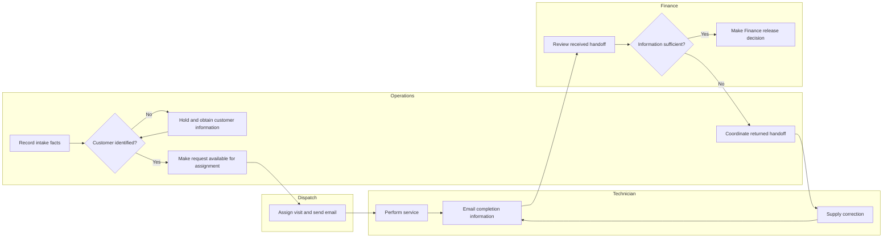
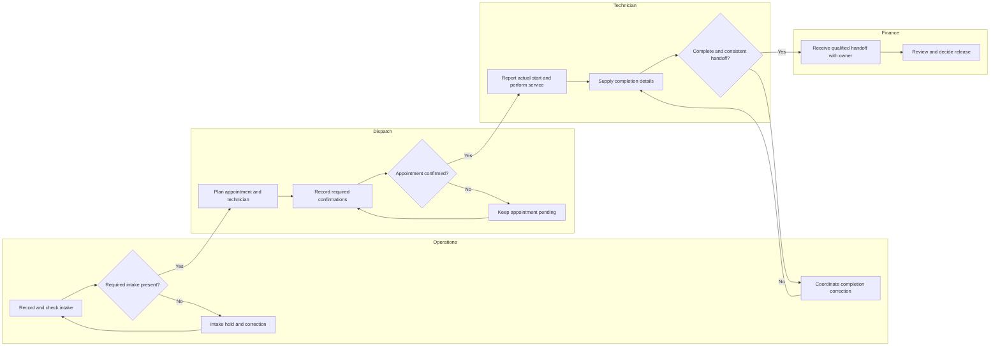

# Process Analysis and Redesign


## 1. What you will learn

An implementation can reproduce an inefficient process very accurately. It can also automate a process that nobody has fully understood.

Process analysis helps you avoid both outcomes. You describe how work happens now, identify where it waits or breaks down, and propose a future process that preserves necessary controls while improving coordination.

By the end of this chapter, you should be able to:

- Build a process model with clear responsibilities and handoffs.
- Use swimlanes to distinguish who performs each activity.
- Model normal work, missing information and operational exceptions.
- Preserve job and appointment history during cancellation and rescheduling.
- Identify possible bottlenecks from reproducible measurements.
- Define operational controls and explain their purpose.
- Validate current-state and future-state models using representative cases.
- Distinguish expected benefits from observed improvement.

Prerequisites and continuity

You need the Chapter 1 evidence classifications and the Chapter 2 discovery notes, decision rights and dependencies.

Evergreen’s carried-forward case state is:


| Record or fact | State entering this chapter |
| --- | --- |
| Client context | Two service teams, twelve technicians and two dispatchers through one dispatch desk |
| Current tools | Phone/email intake and spreadsheet coordination; CRM reported in use, but edition, region and environments remain unverified |
| EVG-REQ-001–003 | Verified business needs for intake identifiers, internal job visibility and Finance review before invoice release |
| EVG-REQ-007 | Verified business need for job reference, customer reference, completion date and completion summary in the Finance handoff |
| EVG-REQ-008 | Verified business need for nonfinancial handoff status and responsible Finance contact to be visible to Dispatch |
| EVG-REQ-004–006 | Candidate reporting, portal and routing needs |
| EVG-CHANGE-001 | Portal/routing assessment deferred by the Sponsor |
| EVG-TEST-001–005 | Proposed checks; no product execution evidence |
| EVG-Q-009 | Cancellation, rescheduling ownership and notifications unresolved |
| Latest charter | Draft v0.3; no final review result or client acceptance supplied |
| Previous estimate | Discovery planning only; not an implementation estimate |

The original six-case sample had a 60% first-pass rate among five completed reviews, with one unfinished handoff. Its representativeness remains unconfirmed. The 80% target and 15 February date remain discussion preferences.

New authorisation and project contribution

EVG-SRC-025 is an explicit new synthetic Sponsor instruction:

“Prepare current-state and proposed future-state models, investigate operational exceptions, and perform paper walkthroughs using the supplied examples. Record unresolved rules and recommendations. This does not authorise configuration, migration, release or a new support service.”

Your chapter artifacts are:

1. A current-state model with evidence limitations.
2. A proposed future-state model and exception rules.
3. A measurement sheet.
4. A model-validation record.

These artifacts help the next chapter turn process needs into traceable requirements.

All case facts, dialogue, records, timestamps and rules are synthetic. Completed models are student drafts. Paper reasoning does not demonstrate product behaviour, client acceptance or production enforcement.


## 2. Lessons


### 2.1 Model work across responsibility boundaries

Skill: show who does what and what passes between them.

A process model describes activities, decisions, information and movement of work. A swimlane groups activities by the role or team responsible for performing them.

Swimlanes are useful because many implementation problems occur between people rather than inside one screen. “Send completion information” is incomplete unless the model also explains who receives it and what happens next.

A process activity should use a clear verb:

- Record the request.
- Confirm the customer reference.
- Assign the technician.
- Review the completion handoff.

Avoid boxes such as “CRM,” “Dispatch” or “Finance data.” Those are systems, roles or information, not activities.

A handoff transfers responsibility for work or information. Define it through five questions:


| Question | Evergreen example |
| --- | --- |
| Who sends? | Technician supplies completion information |
| Who receives? | Finance receives a qualified handoff |
| What is transferred? | Job/customer references, completion date and summary |
| What makes it ready? | Required information is present and agrees with the job |
| Who owns an exception? | Operations coordinates correction; Technician Lead supplies missing completion details |

Do not assume responsibility transfers merely because an email was sent. The receiving activity needs a clear entry condition and an owner.

Your current-state model should describe the reported process, including its weaknesses. Your future-state model should describe proposed behaviour. Mixing them hides the change being recommended.

For example, “Dispatcher records technician acknowledgement” must not appear as a current fact when discovery only established that the Dispatcher sends an email.

Lesson check LC1: What is missing from the process step “Operations emails Finance”? Name at least three details needed to make the handoff usable.


### 2.2 Distinguish a job, an appointment and a financial handoff

Skill: preserve the meaning and history of work during exceptions.

A job is the business request. An appointment is a scheduled visit associated with that request. A financial handoff transfers completion information for review.

They may move through different states at the same time.


| Business object | Example states used in this chapter |
| --- | --- |
| Job | Intake hold, Ready to assign, Scheduled, Work in progress, Service completed, Change review, Cancelled |
| Appointment | Pending acknowledgement, Confirmed, Superseded, Cancelled, Completed |
| Finance handoff | Not ready, Completion correction, Ready for Finance review, Returned for correction, Review complete |

These are modelling labels, not supplied Zoho field names.

A rescheduled job usually remains the same business request. Creating a new job can split its history, duplicate reporting and disconnect later completion information from the original request.

Instead, retain the job reference, preserve the old appointment and create the replacement appointment.

Cancellation also needs careful interpretation. A valid pre-start cancellation can cancel the job while technician notification remains outstanding. The job’s cancellation status does not prove that every participant has received the message.

Once work has started, the exception is different. Deleting the job or marking it as if nothing happened erases facts that may matter to Operations and Finance.

Consider this dialogue:

Operations Manager: “The customer cancelled, so can we remove the row?”  

Implementation Lead: “Has work started, and does Finance already have information?”  

Operations Manager: “The technician has completed an initial diagnostic.”  

Implementation Lead: “Then the model must retain that work and route the remaining decision through change review.”

The correct response depends on the event’s timing and permitted correction choices. It is not simply a different status label.

Lesson check LC2: Why should a reschedule preserve the job reference? Why might a cancelled job still have an outstanding action?


### 2.3 Use controls to prevent unsafe or ambiguous transitions

Skill: state the condition that allows work to move forward.

An operational control is a rule or activity that reduces the chance of an incorrect action or makes it detectable.

Controls can be:

- Preventive: block a Finance handoff with missing required information.
- Detective: identify a mismatch between the handoff customer reference and the approved intake record.
- Corrective: route missing completion information to the responsible person and retain the correction history.

A control needs more than “validate the record.” Explain:

1. What is checked.
2. Who checks it.
3. What happens if it fails.
4. What evidence confirms correction.

For Evergreen, a nonblank customer reference is not enough. It must identify the customer associated with that job in the permitted intake evidence.

Likewise, appointment time arriving does not prove that work started. The model requires a confirmed appointment and a reported actual start.

Controls should not remove legitimate decision rights. A complete handoff allows Finance review; it does not release an invoice automatically. Finance remains the release owner.

Zoho CRM’s Blueprint developer documentation describes transitions and their associated fields and validation.1 That vocabulary may help later technical mapping. It does not establish that Evergreen has the required edition, permissions or configuration, or that Blueprint is the chosen solution. Product fit comes later.

Lesson check LC3: A handoff has all four required fields, but its customer reference differs from the confirmed intake record. Should it qualify for Finance review? Explain the control needed.


### 2.4 Find bottlenecks without guessing their cause

Skill: distinguish active work from elapsed time and identify where to investigate.

A bottleneck is a constraint that limits the flow of work. A large delay is a reason to investigate; it is not automatically proof of inadequate staffing or a need for automation.

Useful time measures include:

- Handoff delay: time between service completion and Finance receipt.
- Finance elapsed time: time between Finance receipt and completion of the first review.
- Active handling time: supplied time spent actively performing that review.
- Non-active elapsed time: Finance elapsed time minus active handling time.

Non-active time can include queueing, interruptions or waiting for information. Without more detailed evidence, do not call all of it queue time.

Use a consistent cohort: the set of records included in a measure. If you compare averages for five completed reviews, use those same five records unless you explicitly state a different denominator.

Unfinished work also matters. Excluding it makes a completed-case measure possible, but does not mean it has disappeared. Report its current age separately.

Lesson check LC4: Why does a large non-active interval suggest investigation rather than prove that Finance needs more staff?


### 2.5 Redesign the whole flow and measure the trade-offs

Skill: avoid improving one measure by moving the problem elsewhere.

Moving a completeness check before Finance may reduce Finance returns. It may also create a correction queue in Operations.

That can still be an improvement: errors are identified earlier and Finance receives better information. But a first-pass rate alone cannot prove it.

Measure the wider flow:


| Measure | What it helps you understand |
| --- | --- |
| Finance first-pass rate | How often reviewed handoffs avoid return |
| Pre-handoff correction count | Work caught before Finance receipt |
| Completion-to-review elapsed time | Total coordination delay to first review |
| Pending handoff age | Unfinished work excluded from completed-case averages |
| Appointment acknowledgement exceptions | Risk of people acting on superseded information |

Do not invent an improvement result from a proposed control. You may say, “The model is expected to reduce incomplete Finance handoffs.” You cannot say, “The implementation increased first-pass performance to 95%,” without supplied observations.

Validate a model using normal, missing-data, permission and exception cases. Ask whether every case has an owner and a permitted next action.

Lesson check LC5: How could the Finance first-pass rate improve while the overall completion-to-review time becomes worse?


## 3. Visual explanation: current-state swimlanes

EVG-SRC-026 supplies these additional walkthrough statements:

Operations: “I record references when available. Missing customer information goes on a hold list and is not assigned.”  

Dispatcher: “I assign by email. For a reschedule I overwrite the slot; some staff keep the earlier details and others do not. I do not consistently record receipt.”  

Technician Lead: “Completion date and summary are emailed. Finance sometimes discovers missing information.”  

Finance: “I review received handoffs. Incomplete ones go back through Operations. I decide invoice release after review.”  

Operations: “Cancellation handling differs. Some rows disappear; others receive a note.”




The swimlanes show reported ownership and the return loop.

The model does not claim that technician acknowledgement is recorded. It also does not invent one consistent current cancellation or rescheduling policy.

The inconsistent exception treatment belongs in the model’s evidence notes:


| Exception | Current evidence | Model limitation |
| --- | --- | --- |
| Missing customer information | Held before assignment | Correction timing not supplied |
| Missing completion information | Finance may return it through Operations | No consistent pre-handoff check evidenced |
| Rescheduling | Slot overwritten; history and acknowledgement inconsistent | Notification completion cannot be assumed |
| Cancellation | Deletion or note reported | Retention, notification and financial treatment not consistently defined |


## 4. Worked case: propose and evaluate a future model


### 4.1 Supplied design basis

EVG-SRC-027 is a synthetic draft design brief for paper evaluation. Its rules are proposed operating rules, not accepted production policy.


| Rule ID | Rule to use in this chapter |
| --- | --- |
| EVG-RULE-001 | Retain the business job reference. Assignment requires a customer reference and received timestamp. Missing intake data remains on hold, owned by Operations. |
| EVG-RULE-002 | Dispatch records technician and appointment details. Work start requires a confirmed appointment and reported actual start; time passing alone does not start work. |
| EVG-RULE-003 | Before work starts, reschedule the existing job by superseding the old appointment and creating a replacement. Operations obtains customer confirmation. Dispatch obtains acknowledgement from the new assigned technician and, if different, acknowledgement that the old technician’s assignment is withdrawn. |
| EVG-RULE-004 | A verified pre-start cancellation retains the job and appointment, records requester/reason/time, and cancels the active appointment. Dispatch owns technician notification and acknowledgement. Any existing financial information goes to Finance for assessment; no automatic deletion or reversal. |
| EVG-RULE-005 | A change request after work starts enters Change review. Retain performed-work facts. Operations and Finance assess the remaining work and financial implications before deciding the next state. |
| EVG-RULE-006 | The Finance handoff needs job reference, customer reference, completion date and completion summary. References must agree with permitted intake evidence. Missing or inconsistent data enters correction, coordinated by Operations. Technician Lead supplies missing completion details. |
| EVG-RULE-007 | A qualified handoff has a named Finance owner and receipt evidence. Finance review remains required before invoice release. |
| EVG-RULE-008 | Dispatch sees nonfinancial handoff status and Finance contact, not cost/margin. Corrections preserve the history of any prior Finance return. |

The replacement appointment becomes Confirmed only after required confirmations and acknowledgements are recorded. Before that, it is Pending acknowledgement.


### 4.2 Proposed future-state swimlanes




This diagram shows the ordinary path and two correction loops. The exception rules in the design-basis table are part of the model; they are not optional annotations.

The completion gate is a proposed operational check. It does not demonstrate that a Zoho validation rule exists.

Record these model recommendations:

- EVG-DEC-007: preserve job identity and appointment history through rescheduling and cancellation.
- EVG-DEC-008: qualify completion handoffs before Finance receipt without removing Finance review.
- EVG-DEC-009: keep job, appointment and Finance-handoff states distinct.

These are Implementation Lead recommendations represented in the draft, not client acceptance.


### 4.3 Measure the current timing sample

EVG-SRC-028 supplies a separate synthetic timing sample. Do not merge it with the original Chapter 1 sample.

All timestamps use UTC. The snapshot is 18 January 2027 at 16:00 UTC. Active minutes are supplied totals within the first-review interval.


```csv
job_ref,customer_ref,service_completed_at,finance_received_at,finance_review_finished_at,finance_active_minutes,returned_for_missing_info,finance_review_state
EVG-JOB-1101,EVG-CUST-0101,2027-01-18T09:00:00Z,2027-01-18T09:20:00Z,2027-01-18T10:10:00Z,10,no,review_complete
EVG-JOB-1102,EVG-CUST-0102,2027-01-18T09:00:00Z,2027-01-18T09:40:00Z,2027-01-18T11:00:00Z,20,yes,review_complete
EVG-JOB-1103,EVG-CUST-0101,2027-01-18T10:00:00Z,2027-01-18T10:15:00Z,2027-01-18T10:45:00Z,15,no,review_complete
EVG-JOB-1104,EVG-CUST-0103,2027-01-18T11:00:00Z,2027-01-18T12:00:00Z,2027-01-18T14:00:00Z,15,no,review_complete
EVG-JOB-1105,EVG-CUST-0104,2027-01-18T12:00:00Z,2027-01-18T12:30:00Z,2027-01-18T14:00:00Z,20,yes,review_complete
EVG-JOB-1106,EVG-CUST-0105,2027-01-18T14:00:00Z,2027-01-18T15:00:00Z,,,,awaiting_review
```

The blank result fields in EVG-JOB-1106 are intentional: its review is unfinished.

For the worked comparisons, use the five completed reviews.

Step 1: calculate intervals


> Handoff delay = Finance received time-service completed time


> Finance elapsed = first review finished time-Finance received time


> Finance non-active elapsed = Finance elapsed-active minutes

For EVG-JOB-1101:

- Handoff delay: 09:20 − 09:00 = 20 minutes.
- Finance elapsed: 10:10 − 09:20 = 50 minutes.
- Non-active elapsed: 50 − 10 = 40 minutes.

Expected intermediate result:


| Job | Handoff delay: minutes | Finance elapsed: minutes | Active: minutes |
| --- | --- | --- | --- |
| EVG-JOB-1101 | 20 | 50 | 10 |
| EVG-JOB-1102 | 40 | 80 | 20 |
| EVG-JOB-1103 | 15 | 30 | 15 |
| EVG-JOB-1104 | 60 | 120 | 15 |
| EVG-JOB-1105 | 30 | 90 | 20 |
| Total | 165 | 370 | 80 |

Step 2: calculate means


> Mean handoff delay=(165) ÷ (5)=33 minutes


> Mean Finance elapsed=(370) ÷ (5)=74 minutes


> Mean active time=(80) ÷ (5)=16 minutes


> Mean non-active elapsed=(290) ÷ (5)=58 minutes

Mean service-completion-to-first-review time:


> (165+370) ÷ (5)=107 minutes

This is not time to invoice release or final resolution. Those timestamps are not supplied.

Step 3: disclose unfinished work

EVG-JOB-1106 has waited in Finance’s received state for:


> 16{:}00-15{:}00=60 minutes

Its handoff delay is also known: 60 minutes. It is excluded from the completed-review comparison, not treated as zero.

If you deliberately measure handoff delay for all six received records, the result differs:


> (165+60) ÷ (6)=37.5 minutes

Both calculations are valid for their stated cohorts.

Step 4: interpret the evidence

Finance non-active elapsed is the largest mean component in the completed-review sample. Investigate review batching, interruptions, prioritisation and information waits.

Do not conclude that Finance is understaffed or that automation will remove all 58 minutes.

The sample first-pass rate is:


> (3) ÷ (5)×100=60%

A proposed completeness gate may improve this measure, but no improvement has been observed.


### 4.4 Completed measurement and validation summary


| Finding | Evidence | Recommendation |
| --- | --- | --- |
| Incomplete handoffs reach Finance | Current walkthrough and two returned sample rows | Check completeness and consistency before receipt |
| Finance non-active time merits investigation | Mean 58 minutes in completed cohort | Examine queue and interruption causes |
| Rescheduling history is inconsistent | EVG-SRC-026 | Preserve old appointment and acknowledgements |
| Cancellation treatment is inconsistent | EVG-SRC-026 | Retain records and distinguish pre/post-start cases |
| Performance evidence is incomplete | One unfinished review | Report pending age with completed-case measures |

A mistake and its correction

Mistake: “The future process removes Finance review because the handoff is complete.”

Correction: “Completeness permits the handoff to enter Finance review. It does not replace Finance’s release decision.”

A control that improves information quality must not silently remove a confirmed business responsibility.


## 5. Try it yourself — guided practice

Learning goal and access

Validate the proposed model against ordinary work, missing data, rescheduling, cancellation and a permission request.

Use a document editor, the supplied rules and the cases below. No Zoho access is needed.

Complete case inputs

EVG-SRC-029 supplies the following cases at a snapshot of 19 January 2027, 10:30 UTC.


| Case | Supplied facts | Permitted correction or next action |
| --- | --- | --- |
| A: normal completion | EVG-JOB-1201; customer EVG-CUST-0101; received 08:00. Appointment EVG-APPT-4001 confirmed for 09:00; customer and technician acknowledgements recorded at 08:30. Actual start 09:00. Completion date 19 January; summary “Replaced filter and checked operation.” Finance has not reviewed. | Qualify the handoff if the supplied references agree with intake. Do not infer invoice release. |
| B: missing customer | EVG-JOB-1202; received 08:15; customer reference missing. No appointment. No identifying customer information is supplied. | Operations must obtain a verified customer reference. Do not choose a customer or create an appointment by guesswork. |
| C: reschedule | EVG-JOB-1203; customer EVG-CUST-0102. Existing EVG-APPT-4003 at 11:00 with Technician T2; work not started. Verified request at 10:00 changes the visit to 14:00 with T2. Customer confirms at 10:05; technician acknowledgement absent. | Create replacement EVG-APPT-4013. Retain the old appointment as superseded. Dispatch obtains acknowledgement of the new arrangement. |
| D: pre-start cancellation | EVG-JOB-1204; customer EVG-CUST-0103. EVG-APPT-4004 at 15:00; work not started. Verified requester customer0103@evergreen.example.com cancels at 10:10, reason “Customer unavailable.” Technician notice sent at 10:15, acknowledgement absent. No financial record supplied. | Retain cancellation evidence. Dispatch follows up on acknowledgement. Do not invent a financial record or reversal. |
| E: incomplete completion | EVG-JOB-1205; customer EVG-CUST-0103. Appointment completed; service completion date 19 January; summary initially missing. Finance has not received the handoff. At 10:25 Technician Lead supplies “Reset controller and tested startup.” References agree with intake. | Record initial correction state, then use the supplied summary to recheck readiness. |
| F: permission request | Dispatcher asks for EVG-JOB-1201 cost and margin. Permitted information is nonfinancial handoff status and finance@evergreen.example.com. | Show only permitted information and route any disclosure change to Finance. No additional permission is supplied. |

Guided steps and expected intermediate results

1. Classify the event.  

Identify ordinary completion, intake exception, pre-start reschedule, pre-start cancellation, completion correction and permission boundary.  

Expected result: six distinct cases, not one generic “exception” branch.

2. Apply the object states.  

Record job, appointment and Finance-handoff states separately.  

Expected result: rescheduling does not create a new job, and cancellation can coexist with outstanding notification.

3. Identify the owner and next evidence.  

Apply the rule table rather than inventing authority.  

Expected result: every unfinished case has a named role and a closure condition.

4. Complete a model-validation record.  

Link cases to existing or new planned checks.  

Expected result: paper-derived expected outcomes, clearly separated from product test results.

5. Record any model changes.  

If your diagram cannot represent a case, correct the model and identify the missing condition.  

Expected result: the final diagram and exception table agree.

Blank process-step worksheet


| Step ID | Lane/owner | Trigger/input | Activity or decision | Output/next state |
| --- | --- | --- | --- | --- |
|  |  |  |  |  |
|  |  |  |  |  |
|  |  |  |  |  |
|  |  |  |  |  |

Blank case-state worksheet


| Case | Job state | Appointment state | Finance-handoff state | Outstanding action and owner |
| --- | --- | --- | --- | --- |
| A |  |  |  |  |
| B |  |  |  |  |
| C |  |  |  |  |
| D |  |  |  |  |
| E |  |  |  |  |
| F |  |  |  |  |

Blank model-validation worksheet


| Check ID | Requirement/rule link | Input case | Expected result | Reasoning or model issue |
| --- | --- | --- | --- | --- |
|  |  |  |  |  |
|  |  |  |  |  |
|  |  |  |  |  |

Final artifacts: validated draft model, case-state sheet and paper-validation record.

Cleanup: retain the supplied evidence and versioned model. Remove redundant scratch diagrams if no longer needed. Do not change product records to demonstrate this exercise.


## 6. Independent challenge

EVG-SRC-030 supplies three new cases and a later snapshot of the timing sample.

Changed operational inputs


| Case | Supplied facts | Permitted decision or correction |
| --- | --- | --- |
| G: cancellation after start | EVG-JOB-1301; customer EVG-CUST-0104; confirmed EVG-APPT-5001 for 09:00. Actual start 09:00. Initial diagnostic performed. Verified customer requests cancellation at 09:20 because they cannot wait. Remaining work is incomplete; Finance has not reviewed. | Retain performed-work facts and enter Change review. Operations and Finance assess remaining work and financial implications. No pre-start cancellation shortcut or automatic financial reversal. |
| H: reschedule with technician change | EVG-JOB-1302; customer EVG-CUST-0105; old EVG-APPT-5002 at 13:00 with T3; work not started. At 10:05, change to 16:00 with T4. Customer confirms at 10:10; T3 acknowledges withdrawal at 10:20; T4 has not acknowledged by 16:00. | Create EVG-APPT-5012 and retain the old appointment. Dispatch must obtain T4 acknowledgement before the replacement becomes confirmed. |
| I: wrong customer in handoff | EVG-JOB-1303 approved intake customer is EVG-CUST-0101. Handoff incorrectly says EVG-CUST-0102; date and summary are present. Finance returned it at 10:30 for mismatch. Operations confirms intake remains correct. | Correct handoff customer to EVG-CUST-0101 and log the change. Retain the Finance-return history; do not change the job reference. |

Later timing snapshot

At 18 January 2027, 17:00 UTC, EVG-JOB-1106 has completed its first review:

- Review finished: 16:20 UTC.
- Active handling: 20 minutes.
- Returned for missing information: yes.
- Review state: review_complete.

All other EVG-SRC-028 rows remain unchanged.

Deliverables

Produce:

1. States, owners and next actions for G–I.
2. A revised exception table showing the technician-change condition.
3. Requirement-to-check links for these cases.
4. The six-case first-pass rate and mean Finance non-active elapsed time.
5. A comparison with the earlier snapshot.
6. A short recommendation explaining what the evidence supports and what remains unproven.

Success criteria

Your model must preserve identifiers and history, distinguish pre-start from post-start changes, prevent unacknowledged appointment confirmation, detect identity mismatch and retain prior return evidence.

Your measures must use the later six-record completed cohort without rewriting the earlier five-record snapshot.


## 7. Common problems and recovery


| Symptom | Diagnosis | Correction |
| --- | --- | --- |
| A reschedule creates a second job | Appointment change confused with new business request | Keep the job reference; supersede the appointment and link its replacement |
| Cancelled records disappear | Deletion used as a process state | Retain cancellation evidence and route financial implications to Finance |
| Technician continues with an old slot | Notification treated as acknowledgement | Track acknowledgement and keep the replacement pending |
| Complete-looking handoff has wrong customer | Only presence was checked | Compare references with permitted intake evidence |
| Corrected Finance return is erased | Current completeness overwrote outcome history | Preserve the original return and correction |
| Finance first-pass rises but backlog grows | Work moved to an earlier queue | Measure pre-handoff corrections and pending age |
| A diagram cannot place a missing-data case | Only the happy path was modelled | Add a hold/correction branch with an owner |
| Paper checks are labelled “UAT passed” | Evidence types confused | Label them paper-derived model checks |

Recovery here repairs the process record and recommendation. It does not restore a database or authorise invoice reversal.

If an incorrect diagram has been circulated, issue a versioned correction identifying the changed branch and affected decision. Operational incidents remain with the existing support owner.


## 8. Check your understanding

1. Why must the current-state model preserve inconsistent exception evidence rather than replace it with the preferred future rule?
2. What information is needed to distinguish cancellation before work starts from a change after work starts?
3. Which confirmations are required when a reschedule changes the technician?
4. Why is “all required fields are nonblank” insufficient for a Finance handoff?
5. Using the original timing sample, explain why the unfinished record cannot be counted as a first-pass failure.
6. What additional evidence would help investigate the 58-minute mean non-active Finance interval?
7. Why does a paper model that handles all supplied cases still require later product testing?

## 9. Solutions and explanations


### 9.1 Lesson checks

LC1: The sender, receiver, required information, readiness condition, receipt evidence and exception owner are all relevant. “Email Finance” identifies a channel but not a reliable responsibility transfer.

LC2: Rescheduling changes the appointment, not necessarily the business request. Retaining the job reference preserves continuity. A cancelled job can still require notification acknowledgement or Finance assessment.

LC3: No. Compare the handoff reference with the confirmed intake relationship. Hold or return inconsistent information for correction by Operations; do not release it merely because a value exists.

LC4: Non-active time can include batching, interruptions, prioritisation or information waits. Staffing is only one possible cause. More detailed event evidence is needed.

LC5: Incomplete work may wait longer in Operations before reaching Finance. Finance sees cleaner submissions, but total elapsed time can increase. Measure both stages and pending work.


### 9.2 Guided practice: completed states


| Case | Job state | Appointment state | Finance-handoff state |
| --- | --- | --- | --- |
| A | Service completed | Completed | Ready for Finance review |
| B | Intake hold | None | Not ready |
| C | Scheduled | EVG-APPT-4003 Superseded; EVG-APPT-4013 Pending acknowledgement | Not ready |
| D | Cancelled | Cancelled | Not ready; no financial record supplied |
| E | Service completed | Completed | Initially Completion correction; after supplied summary, Ready for Finance review |
| F | Service completed, as in A | Completed | Ready for Finance review |

Case C must not become Work in progress because no actual start or required technician acknowledgement is supplied.

Case D demonstrates that cancellation state and notification completion are separate. The verified cancellation can be recorded while the communication exception remains open.

Case E was corrected before Finance receipt. It is not a demonstrated Finance return and must not be invented as one.

Completed early traceability and validation record

New candidate requirements are derived from the proposed design basis:


| Requirement ID | Candidate business need |
| --- | --- |
| EVG-REQ-009 | Preserve appointment history and required acknowledgements during rescheduling |
| EVG-REQ-010 | Retain pre-start cancellation evidence and outstanding notification/Finance actions |
| EVG-REQ-011 | Retain performed work and route post-start changes through review |

They remain candidates pending business confirmation and scope treatment in later chapters.


| Check ID | Links | Case | Paper-derived expected result |
| --- | --- | --- | --- |
| EVG-TEST-004 | EVG-REQ-007; EVG-RULE-006 | A and E | Complete handoff qualifies; missing summary enters correction; supplied correction permits recheck |
| EVG-TEST-001 | EVG-REQ-001; EVG-RULE-001 | B | Missing customer information remains on hold |
| EVG-TEST-006 | EVG-REQ-009; EVG-RULE-003 | C | Same job retained; old appointment superseded; replacement pending acknowledgement |
| EVG-TEST-007 | EVG-REQ-010; EVG-RULE-004 | D | Cancellation retained with technician acknowledgement outstanding |
| EVG-TEST-005 | EVG-REQ-008; EVG-RULE-008 | F | Only nonfinancial status/contact disclosed |

This table extends planned traceability without replacing the earlier test definitions or claiming full execution.

A valid alternative can use an explicitly named “Cancellation notification pending” substate. It must still retain the cancellation and identify the remaining owner and evidence.


### 9.3 Independent challenge solution


| Case | Correct state and treatment | Required next action |
| --- | --- | --- |
| G | Job enters Change review; performed diagnostic and actual start remain recorded | Operations and Finance assess remaining work and financial implications; no invented reversal |
| H | Old appointment Superseded; replacement Pending acknowledgement; job remains Scheduled, not started | Dispatch obtains T4 acknowledgement; T3 withdrawal and customer confirmation are already supplied |
| I | Handoff Returned for correction, then eligible for recheck after logged customer correction | Operations changes handoff customer to EVG-CUST-0101; retains return history and job identity |

Links are:

- G → EVG-REQ-011 → EVG-TEST-008.
- H → EVG-REQ-009 → EVG-TEST-006.
- I → EVG-REQ-007 and EVG-RULE-006 → an expanded EVG-TEST-004 consistency case.

Do not allocate a different business job reference to H or I.

Revised exception entry


| Exception | Required evidence | Blocked transition |
| --- | --- | --- |
| Reschedule with technician change | Customer confirmation, old technician withdrawal acknowledgement and new technician acknowledgement | Replacement cannot become Confirmed until all required evidence exists |

The model must distinguish “old technician no longer assigned” from “new technician accepts the assignment.”

Later snapshot calculations

EVG-JOB-1106 Finance elapsed:


> 16{:}20-15{:}00=80 minutes

Its non-active elapsed:


> 80-20=60 minutes

All six reviews are now complete. Three were not returned.


> First-pass rate=(3) ÷ (6)×100=50%

Updated mean non-active Finance elapsed:


> (290+60) ÷ (6)=58.33 minutes

The first-pass rate changed from 60% to 50%:


> 50%-60%=-10 percentage points

The earlier result remains correct for its snapshot and cohort. The later result includes the formerly unfinished case.

This is not evidence that the proposed future process failed. Both calculations describe supplied synthetic timing records; no redesigned process execution has been observed.

A suitable recommendation is:

Investigate Finance’s non-active intervals and test an earlier completeness/consistency check while preserving Finance review. Measure pre-handoff corrections, pending age and total completion-to-review time alongside first-pass performance so that delay is not merely transferred to Operations.


### 9.4 Understanding check answers

1. Current-state analysis must represent available evidence, including disagreement. Replacing it with a preferred rule hides the gap and prevents a fair explanation of the proposed change.
2. Actual work-start evidence, performed-work facts, cancellation/change time, requester authority and any existing Finance information.
3. Customer confirmation, withdrawal acknowledgement from the old technician and acknowledgement from the new technician.
4. Values can be present but inconsistent. The job/customer relationship and other agreed validity conditions must be checked.
5. Its return outcome is unknown. It may later pass or return, so neither result is justified at the earlier snapshot.
6. Review-start events, interruptions, batching practices, information-wait reasons, priorities and workload context would help distinguish causes.
7. Paper reasoning checks model logic. It does not demonstrate configuration, permissions, integrations, timing or actual user behaviour.

## 10. Chapter recap and next step

Process redesign starts by making work and responsibility visible. It improves delivery judgement when it preserves evidence, models exceptions and measures the whole flow.

The important distinction is between a process that looks clean and a process that gives every representative case a responsible next action.

Completion checklist

- I can distinguish current facts from proposed future rules.
- I can use swimlanes to show responsibility and handoffs.
- I can separate job, appointment and Finance-handoff states.
- I can handle cancellation and rescheduling without erasing history.
- I can define readiness controls and correction ownership.
- I can calculate elapsed, active and non-active time with stated cohorts.
- I can explain unfinished records and changing snapshots.
- I can validate a draft model without claiming product execution.

Your project pack now contains current/future process models, exception rules, measurements and paper-validation evidence.

Chapter 4, Requirements and Traceability, converts these process needs into a structured requirements register with acceptance criteria, priorities, fit-gap analysis and requirement-to-test links.


## 11. Glossary and further reading

Glossary


| Term | Meaning |
| --- | --- |
| Active handling time | Time spent actively performing the measured work |
| Bottleneck | A constraint that limits the flow of work |
| Cohort | The defined set of records included in a measure |
| Current-state model | Description of work as supported by available current evidence |
| Future-state model | Proposed description of how work should operate |
| Handoff | Transfer of work or information between responsible parties |
| Non-active elapsed time | Elapsed time minus supplied active handling time |
| Operational control | Rule or activity that prevents, detects or corrects an undesirable action |
| Paper validation | Reasoning through a model using supplied scenarios, without executing the product |
| State | A defined condition of a business object at a point in its lifecycle |
| Swimlane | Diagram grouping activities by responsible role or team |
| Transition | Movement from one state to another under defined conditions |

Further reading

1. Zoho CRM Developer Documentation — API v8: Get Blueprint Details  
[Open official reference](https://www.zoho.com/crm/developer/docs/api/v8/blueprint-details.html)

Describes available transitions, associated fields and validation for a record in a process, including scope and permission conditions. It supports later technical investigation, not a claim that Evergreen’s proposed model is implemented.

2. Zoho CRM — Feature-wise comparison of editions  
[Open official reference](https://www.zoho.com/crm/complete-feature-list.html)

Use during later product-fit assessment to check edition dependencies. A process diagram does not establish the client’s entitlement.

Consult the official references above for current product details. Research is partially verified: the cited product concepts are documentation-based, while Evergreen’s edition, permissions, configuration and process execution remain unverified.
