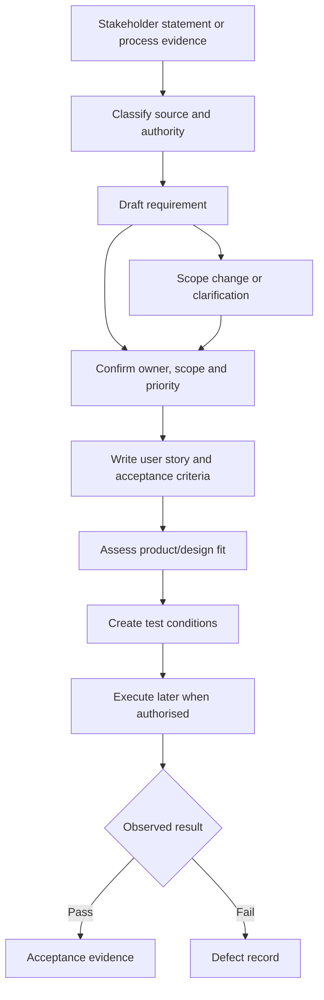

# Requirements and Traceability


## 1. What you will learn

A process model explains how work happens. A requirement states what the delivered process must enable, prevent or demonstrate.

Requirements are the bridge between client needs and delivery evidence. They help you decide what belongs in scope, how a solution should be assessed, what users should be able to do and how testing will show whether the intended behaviour exists.

By the end of this chapter, you should be able to:

- Convert process findings into clear, traceable requirements.
- Distinguish a requirement from a stakeholder statement, design choice, assumption or test.
- Write useful user stories without treating them as complete specifications.
- Define functional and non-functional requirements.
- Write acceptance criteria that are observable and answerable.
- Prioritise requirements using business value, risk and dependency reasoning.
- Perform an initial fit-gap analysis without inventing product capability.
- Link requirements to acceptance criteria, tests, changes and defects.
- Build and review a requirements register.

Prerequisites and continuity

You need the engagement brief from Chapter 1, the discovery notes and charter from Chapter 2, and the current/future process models from Chapter 3.

The following records continue into this chapter:


| Record | State entering this chapter |
| --- | --- |
| EVG-REQ-001 | Unique business job reference, customer reference and received timestamp for each new request |
| EVG-REQ-002 | Internal staff can find a customer’s open jobs, status and assigned technician |
| EVG-REQ-003 | Completion does not release an invoice; Finance reviews before release |
| EVG-REQ-004 | Weekly open/completed reporting; definitions were previously unresolved |
| EVG-REQ-005 | Customer portal request; deferred and not approved for delivery |
| EVG-REQ-006 | Automated route optimisation request; deferred and not approved for delivery |
| EVG-REQ-007 | Completion handoff includes job reference, customer reference, completion date and completion summary |
| EVG-REQ-008 | Dispatch can see nonfinancial handoff status and responsible Finance contact, without cost or margin |
| EVG-REQ-009 | Proposed preservation of appointment history and required acknowledgements during rescheduling |
| EVG-REQ-010 | Proposed retention of pre-start cancellation evidence and outstanding actions |
| EVG-REQ-011 | Proposed treatment of post-start changes through Change review |
| EVG-CHANGE-001 | Portal/routing request deferred for a separate later assessment |
| EVG-TEST-001–008 | Proposed checks; none executed in the product |
| EVG-DEFECT-001 | Reserved; no observed defect opened |
| EVG-DEC-007–009 | Draft process recommendations; not client acceptance |

The process work is authorised for paper analysis and requirements development. Configuration, migration, release and new support services remain outside the supplied authorisation.

Your project contribution

This chapter adds:

- A structured requirements register.
- User stories and acceptance criteria.
- Non-functional requirement records.
- An initial fit-gap analysis.
- A requirement-to-test traceability matrix.
- A prioritised requirements backlog.

All Evergreen facts, dialogue, identifiers and numbers are synthetic. A requirement marked verified business requirement confirms a business need; it does not prove that the need has been configured, tested or accepted. A proposed test describes expected evidence; it is not an observed result.


## 2. Lessons


### 2.1 Turn business evidence into requirements

Skill: state the need precisely enough for later design and testing.

A requirement is a statement of a needed capability, condition or quality that can be evaluated. It should explain what the business needs and the conditions under which the need applies.

A requirement is not the same as:

- A stakeholder’s first wording.
- A preferred screen or application.
- A design decision.
- A project activity.
- A test result.
- A technical field name.

Consider the statement:

“We need a dashboard that shows everything.”

This is a client statement. It does not identify the audience, decisions, records, timing or meaning of “everything.”

A more useful requirement is:

EVG-REQ-002: An authorised internal user can find a customer’s open jobs, current status and assigned technician.

This requirement does not yet specify whether the result is a dashboard, list view, report or another design. That choice belongs in solution design after product fit and access needs are investigated.

A good requirement normally answers:

1. Who or what needs the capability?
2. What must happen?
3. Under what conditions?
4. What information or control is important?
5. What evidence could demonstrate it?

Do not put every condition into one long sentence. Separate independent needs so they can be prioritised and tested separately.

For example, these are different needs:

- A job has a business reference.
- A customer reference is required before assignment.
- A Finance handoff contains a completion summary.
- Finance controls invoice release.

They may be related, but a failure in one should not make it impossible to identify the others.

A requirement also needs a status. Useful statuses include:


| Status | Meaning |
| --- | --- |
| Candidate | A plausible need that still needs confirmation or definition |
| Verified business requirement | The relevant business owner confirmed the need |
| Proposed | A delivery or design recommendation, not yet approved |
| Deferred | Recorded but intentionally held for later assessment |
| Rejected | Considered and not accepted, with a reason recorded |
| Implemented | Configuration or development evidence exists; not necessarily accepted |
| Accepted | The authorised acceptance process supplied evidence of agreement |

Do not label a requirement accepted because it appears in a well-formatted document.

Lesson check LC1: Why is “Use Zoho CRM for dispatch” not yet a complete requirement?


### 2.2 Use user stories to describe value and actor

Skill: write a concise user-centred expression of a requirement.

A user story describes a capability from the perspective of the person or role that needs it.

A common format is:

As a role, I want capability, so that business reason.

For Evergreen:

As a Dispatcher, I want to see the current status and assigned technician for a customer’s open job, so that I can coordinate the next action without contacting several people.

This story identifies:

- The actor: Dispatcher.
- The desired capability: see status and assigned technician.
- The value: coordinate the next action.

A story is not a replacement for acceptance criteria. It is a compact statement of intent. It should be supported by context, rules, conditions and evidence.

Avoid stories that describe a product component:

As a user, I want a custom module with five fields.

That may be a design proposal. It does not explain the business result or why five fields are needed.

Avoid stories that contain multiple unrelated outcomes:

As Finance, I want to review jobs, release invoices, manage technician schedules and view margin.

Split these into separate stories because different permissions, owners and tests may apply.

A role is not automatically a person. “Finance” may mean a team, while the permission to release an invoice may belong to a defined Finance Lead or authorised Finance user. Requirements should identify the business role first; access design later identifies actual users and permissions.

Lesson check LC2: Improve this story: “As a user, I want a dashboard with all job data so everything is easier.”


### 2.3 Write acceptance criteria that can be checked

Skill: define the conditions for a meaningful test.

Acceptance criteria state the conditions a requirement must meet. They should be specific enough that two reasonable people can reach the same pass/fail decision.

A useful scenario form is:

Given the starting condition,  

when the action occurs,  

then the expected result is visible.

For EVG-REQ-003:

- Given a job has a completion date and completion summary,
- when the job is marked complete,
- then the job enters Finance review or an equivalent controlled handoff state,
- and invoice release does not occur automatically,
- and the authorised Finance role can make the release decision.

This criterion includes a negative condition. A system that releases an invoice automatically would fail even if it correctly records the completion date.

Good acceptance criteria cover the normal case and the relevant exception. They do not attempt to describe every possible future scenario in one requirement.

For EVG-REQ-007:


| Criterion ID | Acceptance criterion |
| --- | --- |
| EVG-AC-007A | Given a completed job, when the handoff is prepared, then job reference, customer reference, completion date and completion summary are present. |
| EVG-AC-007B | Given one required item is missing, when the handoff is checked, then it is held or routed for correction and is not represented as ready. |
| EVG-AC-007C | Given the customer reference does not agree with the permitted intake evidence, when the handoff is checked, then it is held for correction. |

The criteria do not prescribe whether a validation rule, workflow, Blueprint transition, function or manual control will be used. That choice belongs to design.

Acceptance criteria should also identify data boundaries:

- Which role performs the action?
- Which records count?
- What happens when data is missing?
- What evidence is visible?
- What is explicitly not demonstrated?

A target is not automatically an acceptance criterion. The 80% first-pass target is still a discussion preference. It cannot be converted into a pass condition without an approved definition, measurement period, cohort and decision owner.

Lesson check LC3: What negative case must be included when testing the Finance handoff?


### 2.4 Define non-functional requirements

Skill: state quality, control and operating conditions in measurable terms.

A functional requirement describes what the process or solution must do. A non-functional requirement describes a quality, constraint or operating condition.

Examples of non-functional concerns include:

- Access restriction.
- Auditability and history.
- Response or completion time.
- Usability.
- Availability.
- Data retention.
- Regional or regulatory constraints.
- Maintainability and supportability.
“Make it secure” is not a useful non-functional requirement because it does not define the protected information, users, action or evidence.

A stronger Evergreen requirement is:

EVG-NFR-001: Cost and margin information must not be visible to Dispatch or Technician roles, while Dispatch may see nonfinancial handoff status and the responsible Finance contact.

This requirement includes a permitted visibility and a prohibited visibility. It can be tested using a role-and-field matrix.

A second example is:

EVG-NFR-002: Job, appointment and Finance-handoff history must retain the previous state and the actor or source of each correction needed for operational review.

This is still a candidate until the client confirms the required retention period, permitted audit evidence and any applicable policy.

Do not invent legal or accounting requirements. If a client says “we need to keep this for seven years,” record the statement and ask who owns the policy. A consultant may capture it without presenting it as a legal obligation.

Non-functional requirements can constrain design choices. For example, field visibility may require permissions or separate views. Auditability may require a history mechanism. These are fit-gap questions, not proven implementation features.

Zoho’s official CRM feature comparison lists security, customization and edition-dependent capabilities, but it does not verify Evergreen’s purchased edition or configuration.1 The CRM Blueprint API documentation describes transitions and fields available for a record in a process, subject to supported modules, scope and permissions.2 These references support product investigation; they do not prove that Evergreen can use a particular feature.

Lesson check LC4: Why is “the process must be secure” weaker than EVG-NFR-001?


### 2.5 Prioritise requirements without hiding trade-offs

Skill: make ordering decisions visible and defensible.

Prioritisation determines the relative importance of requirements. It does not automatically approve scope or promise a release date.

A simple MoSCoW classification is:

- Must: Required for the intended minimum business outcome or control.
- Should: Important, but a safe first release could proceed without it if the decision owner accepts the consequence.
- Could: Useful if capacity and fit permit.
- Won’t this release: Explicitly deferred from the current release or assessment.

Use the classification with reasons. “Must” should not mean “someone mentioned it loudly.”

Evergreen’s current priorities are influenced by:

- Sponsor direction.
- Finance control.
- Operational risk.
- Dependencies.
- The current proposal boundary.
- Whether the requirement is sufficiently defined.

A requirement can be high value but not ready for implementation because its definition is incomplete. Record both dimensions.


| Requirement condition | Priority | Definition state |
| --- | --- | --- |
| Finance review before release | Must | Verified |
| Internal open-job visibility | Must | Verified |
| Automated route optimisation | Won’t this release | Candidate and deferred |
| Customer portal | Won’t this release | Candidate and deferred |
| Weekly reporting | Should | Definitions newly clarified but acceptance not approved |
| Appointment history during reschedule | Should | Proposed process rule pending confirmation |

A deferred item remains visible. Hiding it creates future expectation problems.

Dependencies also affect ordering. You may not finalise a customer portal requirement without knowing the intended customer audience and identity rules. You may not finalise a Finance access requirement without the permitted field list and role boundaries.

Lesson check LC5: Can a requirement be a “Must” and still be unready for implementation? Explain.


### 2.6 Perform an initial fit-gap analysis

Skill: compare a business requirement with available product evidence without overstating certainty.

A fit-gap analysis compares a requirement with a proposed product or design and records what is known, missing or needing change.

Use fit-gap categories carefully:


| Category | Meaning |
| --- | --- |
| Fit evidenced | Available evidence supports the requirement under stated conditions |
| Configuration candidate | Likely to be addressed through configuration, but the actual tenant and design are not verified |
| Extension or integration candidate | May require development, integration or another approved component |
| Process change candidate | The business process may need to change rather than the product alone |
| Gap | Available evidence shows the proposed approach does not meet the requirement |
| Unknown | Evidence is insufficient to classify the requirement responsibly |
| Deferred | The requirement is intentionally outside the current assessment |

“Unknown” is often the most accurate early result. Do not convert missing evidence into either fit or gap.

For each row, record:

1. Requirement ID.
2. Proposed product or design boundary.
3. Evidence inspected.
4. Fit category.
5. Conditions and dependencies.
6. Next action and owner.
7. Impact if the assumption is false.

The product comparison page is useful for edition-dependent investigation. The Blueprint API documentation is useful when considering process transitions and transition fields. Neither source establishes that Evergreen’s edition, module, permissions or configuration meet the requirement.

Do not write:

“Zoho cannot support route optimisation.”

The case has not established the required routing behaviour, selected product boundary or edition. Write:

“Automated route optimisation is deferred. Required routing objectives, inputs, constraints and product boundary are not defined.”

Likewise, do not write:

“Blueprint will solve Finance review.”

Write:

“A process-transition design may be investigated. Tenant support, edition, permissions, field configuration and acceptance evidence are unverified.”

Lesson check LC6: What is the correct fit-gap classification when the requirement is clear but the client’s edition and tenant configuration are unknown?


### 2.7 Build traceability from need to evidence

Skill: allow a reviewer to follow a requirement through delivery.

Traceability is the explicit connection between an originating need and the records that explain, implement or test it.

A useful chain is:

Source statement

    ↓
Requirement

    ↓
User story or business rule

    ↓
Acceptance criterion

    ↓
Test

    ↓
Defect or change, if applicable

    ↓
Acceptance evidence

Each link answers a different question:

- Source: Where did the need come from?
- Requirement: What is needed?
- Story: Who needs it and why?
- Acceptance criterion: What condition must be true?
- Test: How will the condition be checked?
- Defect: What failed, where and under what data?
- Change: What changed the agreed need or boundary?
- Evidence: What was actually observed or accepted?

Use stable IDs. Do not recycle an ID after changing its meaning. If a requirement is split, retain the original record and create new linked IDs with an explanation.

Business identifiers such as EVG-JOB-1401 identify synthetic jobs. They are not product-generated record IDs. Requirement IDs such as EVG-REQ-012 identify project evidence. Test IDs identify planned or executed checks. Keep those namespaces distinct.

A traceability link does not prove success. It proves that the path is recorded.

Lesson check LC7: What does a test link prove, and what does it not prove?


## 3. Visual explanation: requirements lifecycle and traceability




The flow shows that requirements are refined before testing. Fit-gap analysis informs design and may reveal that the requirement, product boundary or process needs further clarification.

A requirement can return to clarification when new evidence appears. A failed test does not automatically mean the requirement is wrong; it may indicate a defect, incomplete design, invalid test data or a changed need.

In plain language: traceability is an evidence path, not a promise that every linked artifact has already been completed.


## 4. Worked case: build Evergreen’s traceable register


### 4.1 New synthetic source packet

The following sources are supplied for this worked case.


| Source ID | Supplied content |
| --- | --- |
| EVG-SRC-031 | Sponsor: “The first priority is internal open-job visibility and a controlled Finance handoff. The portal and route optimisation remain deferred. Weekly reporting should show open jobs at the end of the reporting week and jobs completed during the reporting week.” |
| EVG-SRC-032 | Operations Manager: “An authorised internal user needs to find a customer, see open jobs, status and assigned technician, and know whether the Finance handoff is waiting, returned or under review.” |
| EVG-SRC-033 | Finance Lead: “The handoff must include job reference, customer reference, completion date and completion summary. Completion must not release an invoice. Dispatch may see nonfinancial status and the Finance contact, but not cost or margin.” |
| EVG-SRC-034 | Technician Lead: “A technician must be able to provide the completion date and summary for a completed service. Missing summary information must be corrected before Finance review.” |
| EVG-SRC-035 | Client Administrator: “Zoho CRM is in use. I can provide tenant inventory, edition and environment details through the authorised inventory process. No credentials or record exports are approved for requirements work.” |
| EVG-SRC-036 | Sponsor and Operations clarification: “For a weekly report, open means not cancelled and not completed at the reporting cutoff. Completed means service completion date falls within the reporting week. The reporting timezone is UTC for this exercise.” |
| EVG-SRC-037 | Implementation Lead: “The current record of the proposed process is a design recommendation. No requirement in this packet has product execution or client acceptance evidence.” |

The phrase “for this exercise” is important. The reporting timezone is synthetic case data, not a general Evergreen policy or legal requirement.


### 4.2 Step 1: classify and refine the evidence

The first refinement produces these conclusions:

- EVG-REQ-001, 002, 003, 007 and 008 remain verified business requirements.
- EVG-REQ-004 can now be refined as a candidate or verified business requirement depending on the learner’s treatment of the Sponsor and Operations clarification. In this worked case it becomes a verified business requirement with acceptance still pending, because the relevant business owners supplied a definition.
- EVG-REQ-009, 010 and 011 remain proposed process requirements pending explicit business confirmation.
- EVG-REQ-005 and 006 remain deferred candidates.
- EVG-NFR-001 and EVG-NFR-002 are drafted from Finance’s control and the future-state model. Their approval status remains proposed until the appropriate owner confirms the exact evidence and retention conditions.

Record EVG-DEC-010:

Preserve the previous requirement IDs and refine their wording and status only where the supplied source provides new evidence. Keep proposed process recommendations distinct from verified client requirements.


### 4.3 Step 2: completed user story catalog


| Story ID | Requirement link | User story |
| --- | --- | --- |
| EVG-US-001 | EVG-REQ-001 | As Operations, I want each new service request to receive a unique business job reference with customer reference and received timestamp, so that the request can be followed across dispatch and Finance. |
| EVG-US-002 | EVG-REQ-002 | As an authorised internal user, I want to find a customer’s open jobs with status and assigned technician, so that I can coordinate the next action. |
| EVG-US-003 | EVG-REQ-003 | As Finance, I want completed jobs to enter a controlled review before invoice release, so that completion does not bypass financial review. |
| EVG-US-004 | EVG-REQ-007 | As a Technician Lead or Operations user, I want the completion handoff to contain the required references, date and summary, so that Finance receives usable completion information. |
| EVG-US-005 | EVG-REQ-008 | As a Dispatcher, I want to see nonfinancial handoff status and the responsible Finance contact, so that I can coordinate without seeing cost or margin. |
| EVG-US-006 | EVG-REQ-004 | As a Sponsor, I want weekly open and completed counts using the stated UTC definitions, so that management reporting uses a repeatable basis. |
| EVG-US-007 | EVG-REQ-009 | As a Dispatcher, I want rescheduled appointments to preserve the old appointment and record the replacement acknowledgements, so that staff act on the current arrangement without losing history. |
| EVG-US-008 | EVG-REQ-010 | As Operations, I want a verified cancellation to retain requester, reason, time and outstanding notification actions, so that a cancellation does not erase operational evidence. |
| EVG-US-009 | EVG-REQ-011 | As Operations and Finance, I want a post-start change to enter review with performed-work facts retained, so that remaining work and financial implications can be decided responsibly. |

EVG-US-007 through EVG-US-009 describe proposed future behaviour. Their existence does not turn EVG-REQ-009 through EVG-REQ-011 into approved scope.


### 4.4 Step 3: completed acceptance criteria


| Acceptance ID | Requirement | Acceptance criteria |
| --- | --- | --- |
| EVG-AC-001A | EVG-REQ-001 | Given two valid new requests, when they are recorded, then each receives a different business job reference and preserves its customer reference and received timestamp. |
| EVG-AC-001B | EVG-REQ-001 | Given a request has no verified customer reference, when assignment readiness is checked, then it remains on hold and is not assigned by guesswork. |
| EVG-AC-002A | EVG-REQ-002 | Given an authorised internal user and an open customer job, when the user searches for the customer, then the open job, status and assigned technician are available. |
| EVG-AC-003A | EVG-REQ-003 | Given a completed job, when completion is recorded, then the job enters Finance review or an equivalent controlled handoff state. |
| EVG-AC-003B | EVG-REQ-003 | Given a completed job awaiting Finance review, when completion is recorded, then invoice release does not occur automatically. |
| EVG-AC-004A | EVG-REQ-007 | Given a completed job ready for handoff, then job reference, customer reference, completion date and completion summary are present. |
| EVG-AC-004B | EVG-REQ-007 | Given a required field is missing or a reference disagrees with permitted intake evidence, then the handoff is held for correction and is not marked ready. |
| EVG-AC-005A | EVG-REQ-008 | Given an authorised Dispatcher view, nonfinancial handoff status and the responsible Finance contact are visible. |
| EVG-AC-005B | EVG-REQ-008 | Given the same view, cost and margin are not visible. |
| EVG-AC-006A | EVG-REQ-004 | Given the UTC reporting cutoff, open count includes jobs that are not cancelled and not completed at the cutoff. |
| EVG-AC-006B | EVG-REQ-004 | Given a reporting week, completed count includes jobs whose service completion date falls within that UTC reporting week. |
| EVG-AC-007A | EVG-REQ-009 | Given a pre-start reschedule, the original job reference remains unchanged, the old appointment is retained as superseded and the replacement remains pending until required acknowledgements exist. |
| EVG-AC-008A | EVG-REQ-010 | Given a verified pre-start cancellation, requester, reason and time are retained, the active appointment is cancelled and outstanding notification action remains visible. |
| EVG-AC-009A | EVG-REQ-011 | Given work has started and a customer requests a change, performed-work facts remain retained and the case enters Change review rather than the pre-start cancellation path. |
| EVG-AC-NFR-001A | EVG-NFR-001 | Given a Dispatch or Technician role, cost and margin fields are not visible; Dispatch can see only the permitted nonfinancial status and Finance contact. |
| EVG-AC-NFR-002A | EVG-NFR-002 | Given a correction to a returned Finance handoff, the prior return and the correcting action remain identifiable in the permitted history evidence. |

The criteria use “equivalent controlled handoff state” because the design has not selected a product mechanism. Later chapters can replace that phrase with a confirmed design term.


### 4.5 Step 4: completed requirements register


| Requirement ID | Requirement statement | Source | Status | Priority | Story |
| --- | --- | --- | --- | --- | --- |
| EVG-REQ-001 | Each new request has a unique business job reference, customer reference and received timestamp | EVG-SRC-001, 031, 034 | Verified business requirement | Must | EVG-US-001 |
| EVG-REQ-002 | Authorised internal users can find a customer’s open jobs, status and assigned technician | EVG-SRC-001, 032 | Verified business requirement | Must | EVG-US-002 |
| EVG-REQ-003 | Completion does not release an invoice; Finance reviews before release | EVG-SRC-005, 033 | Verified business requirement | Must | EVG-US-003 |
| EVG-REQ-004 | Weekly open/completed reporting uses the stated UTC definitions | EVG-SRC-006, 031, 036 | Verified business requirement; acceptance pending | Should | EVG-US-006 |
| EVG-REQ-005 | Customer-facing portal access | EVG-SRC-013, 031 | Candidate and deferred | Won’t this release | Not assigned |
| EVG-REQ-006 | Automated route optimisation | EVG-SRC-013, 031 | Candidate and deferred | Won’t this release | Not assigned |
| EVG-REQ-007 | Completion handoff contains job reference, customer reference, completion date and summary | EVG-SRC-017, 033, 034 | Verified business requirement | Must | EVG-US-004 |
| EVG-REQ-008 | Dispatch sees nonfinancial handoff status and Finance contact, not cost or margin | EVG-SRC-017, 032, 033 | Verified business requirement | Must | EVG-US-005 |
| EVG-REQ-009 | Rescheduling preserves appointment history and required acknowledgements | EVG-SRC-027, 029, 030 | Proposed process requirement | Should | EVG-US-007 |
| EVG-REQ-010 | Pre-start cancellation retains evidence and outstanding actions | EVG-SRC-027, 029 | Proposed process requirement | Should | EVG-US-008 |
| EVG-REQ-011 | Post-start changes retain work facts and enter Change review | EVG-SRC-027, 030 | Proposed process requirement | Should | EVG-US-009 |
| EVG-NFR-001 | Dispatch and Technician roles cannot see cost or margin; Dispatch can see permitted nonfinancial status/contact | EVG-SRC-033 | Proposed non-functional requirement | Must | — |
| EVG-NFR-002 | Corrections retain prior Finance-return and correction history | EVG-SRC-027, 033 | Proposed non-functional requirement | Should | — |

The register preserves the difference between verified requirements and proposed process recommendations.


### 4.6 Step 5: completed fit-gap analysis


| Requirement | Proposed boundary | Evidence reviewed | Fit-gap result |
| --- | --- | --- | --- |
| EVG-REQ-001 | CRM/service-request process | Process model and business statements; no tenant configuration | Configuration candidate |
| EVG-REQ-002 | Internal customer/job visibility | Discovery notes and process model; edition and access unverified | Configuration candidate, conditional |
| EVG-REQ-003 | Controlled Finance review | Future-state process and official Blueprint API concept documentation | Unknown-to-configuration candidate |
| EVG-REQ-004 | Weekly reporting | Source definition; no report design or product execution | Configuration candidate |
| EVG-REQ-007 | Completion handoff | Confirmed business fields; no configured form/process | Configuration or extension candidate |
| EVG-REQ-008 / EVG-NFR-001 | Role-based nonfinancial visibility | Finance rules; actual profiles and field permissions unknown | Unknown |
| EVG-REQ-009 | Reschedule history and acknowledgements | Proposed process rule; no product design | Process and configuration candidate |
| EVG-REQ-010 | Cancellation evidence | Proposed process rule | Process and configuration candidate |
| EVG-REQ-005 | Customer portal | Deferred request; audience and identity undefined | Deferred |
| EVG-REQ-006 | Route optimisation | Deferred request; inputs and constraints undefined | Deferred |

The most important result is not the number of “fits.” It is the list of conditions that must be resolved before a fit claim is responsible.


### 4.7 Step 6: completed traceability matrix


| Source | Requirement | Story | Acceptance | Test |
| --- | --- | --- | --- | --- |
| EVG-SRC-033 | EVG-REQ-007 | EVG-US-004 | EVG-AC-004A–B | EVG-TEST-004 |
| EVG-SRC-033 | EVG-REQ-003 | EVG-US-003 | EVG-AC-003A–B | EVG-TEST-003 |
| EVG-SRC-033 | EVG-REQ-008 | EVG-US-005 | EVG-AC-005A–B | EVG-TEST-005 |
| EVG-SRC-031 and 036 | EVG-REQ-004 | EVG-US-006 | EVG-AC-006A–B | EVG-TEST-009 |
| EVG-SRC-027 and 030 | EVG-REQ-009 | EVG-US-007 | EVG-AC-007A | EVG-TEST-006 |
| EVG-SRC-033 | EVG-NFR-001 | — | EVG-AC-NFR-001A | EVG-TEST-010 |
| EVG-SRC-027 | EVG-REQ-011 | EVG-US-009 | EVG-AC-009A | EVG-TEST-008 |

No row claims a pass, failure or client acceptance.


### 4.8 Worked dataset and expected test reasoning

Use this synthetic dataset for EVG-TEST-001 and EVG-TEST-004.


```csv
row_id,job_ref,customer_ref,received_at,completion_date,completion_summary,expected_condition
R1,EVG-JOB-1401,EVG-CUST-0101,2027-01-20T08:00:00Z,2027-01-20,Replaced filter,valid complete handoff
R2,EVG-JOB-1402,EVG-CUST-0102,2027-01-20T08:10:00Z,2027-01-20,Reset controller,valid complete handoff
R3,EVG-JOB-1403,EVG-CUST-0103,2027-01-20T08:15:00Z,2027-01-20,Checked operation,job reference duplicates R2 in invalid variant
R4,EVG-JOB-1404,,2027-01-20T08:20:00Z,2027-01-20,Repaired valve,missing customer reference
R5,EVG-JOB-1405,EVG-CUST-0105,2027-01-20T08:25:00Z,,,missing completion date and summary
For the invalid variant of R3, the job reference is changed to EVG-JOB-1402. The expected result is rejection or correction because business references must be unique.
For R4, the permitted result is an Operations hold. The test does not permit the tester to select a customer.
For R5, the handoff is not ready because both completion date and summary are missing.
```

The dataset demonstrates the difference between:

- A valid record.
- A duplicate identifier.
- Missing intake information.
- Missing completion information.

It does not demonstrate an actual Zoho validation rule, because no product execution has occurred.

A mistake and its correction

Mistake: “EVG-REQ-008 is satisfied because the product has profiles.”

This confuses the existence of a product concept with the client’s configured permissions and the requirement’s specific field-visibility conditions.

Correction: “EVG-REQ-008 requires an authorised Dispatch view showing permitted status/contact fields and hiding cost/margin. The actual tenant configuration, roles, field permissions and evidence are still required.”


## 5. Try it yourself — guided practice

Learning goal and access

Build a traceable register for one new requirement and revise two existing entries.

Use a document editor and the supplied inputs. No Zoho account or tenant access is needed.

Additional supplied inputs


| Source ID | Supplied content |
| --- | --- |
| EVG-SRC-038 | Operations Manager: “The weekly report should list jobs open at Sunday 23:59 UTC and jobs with a service completion date during Monday–Sunday UTC. Cancelled jobs should not count as open.” |
| EVG-SRC-039 | Finance Lead: “A returned handoff must retain the original return reason. A correction must identify who supplied it and when. Dispatch may see only Returned or Under Finance Review, not the return reason if it contains financial detail.” |
| EVG-SRC-040 | Dispatcher: “I need the status and Finance contact. I do not need cost, margin or the detailed reason for a Finance return.” |
| EVG-SRC-041 | Implementation Lead: “The portal and routing requests remain outside the current requirements baseline. Do not create acceptance criteria for them yet.” |

Required work

1. Refine EVG-REQ-004 using EVG-SRC-038.
2. Refine EVG-REQ-008 and EVG-NFR-002 using EVG-SRC-039 and EVG-SRC-040.
3. Write one user story and at least two acceptance criteria for each refined requirement.
4. Assign priorities and explain each choice.
5. Add the requirements to a traceability matrix.
6. Identify whether each item is fit, configuration candidate, unknown or deferred.
7. Create a test input set using the supplied data below.

```csv
job_ref,status,completed_at,cancelled,finance_status,finance_contact
EVG-JOB-1501,open,,no,not_sent,finance@evergreen.example.com
EVG-JOB-1502,completed,2027-01-21T10:00:00Z,no,under_review,finance@evergreen.example.com
EVG-JOB-1503,cancelled,,yes,not_sent,finance@evergreen.example.com
EVG-JOB-1504,completed,2027-01-26T15:00:00Z,no,returned,finance@evergreen.example.com
EVG-JOB-1505,open,,no,returned,finance@evergreen.example.com
For this exercise, the reporting week is Monday 25 January through Sunday 31 January 2027, and the reporting cutoff is Sunday 31 January 2027 at 23:59 UTC. No later records are supplied.
```

Guided steps and expected intermediate results

1. Classify each input.  

Expected result: reporting definitions are business evidence; portal/routing remain deferred; Finance visibility is a control boundary.

2. Write requirement statements before stories.  

Expected result: the statements do not name a dashboard, module or field API name.

3. Write acceptance criteria including a negative case.  

Expected result: cancelled jobs are excluded from open count; restricted fields are not visible.

4. Calculate the report counts.  

Using the supplied reporting rule:

- Open means not cancelled and not completed at the cutoff.
- Completed means completion date falls within the reporting week.

Expected result: open count is 2; completed count is 2. EVG-JOB-1503 is cancelled and excluded from open count. EVG-JOB-1502 is outside the reporting week and does not count as completed for this report.

5. Build traceability.  

Expected result: every refined requirement has a source, acceptance criterion and planned test. No test is labelled executed.

6. Assess fit-gap status.  

Expected result: without tenant configuration and permission evidence, access-related fit remains unknown or a conditional configuration candidate.

Blank requirements register worksheet


| Requirement ID | Requirement statement | Source | Status | Priority and rationale | Story ID | Acceptance IDs |
| --- | --- | --- | --- | --- | --- | --- |
|  |  |  |  |  |  |  |
|  |  |  |  |  |  |  |
|  |  |  |  |  |  |  |

Blank acceptance criteria worksheet


| Acceptance ID | Requirement | Given | When | Then | Negative or boundary case |
| --- | --- | --- | --- | --- | --- |
|  |  |  |  |  |  |
|  |  |  |  |  |  |
|  |  |  |  |  |  |

Blank traceability worksheet


| Source ID | Requirement ID | Story ID | Acceptance ID | Test ID | Change/defect link |
| --- | --- | --- | --- | --- | --- |
|  |  |  |  |  |  |
|  |  |  |  |  |  |
|  |  |  |  |  |  |

Final artifact: a requirements register with traceability and a small report-test dataset.

Cleanup: retain the supplied CSV and versioned worksheets. No product-state cleanup is required.


## 6. Independent challenge

Continue from the guided practice, then apply these changed synthetic inputs.


| Source ID | Changed input |
| --- | --- |
| EVG-SRC-042 | Finance: “Dispatch may see Under Finance Review and Returned, plus the Finance contact. Dispatch must not see the return reason because some reasons contain sensitive financial detail.” |
| EVG-SRC-043 | Sponsor: “Weekly reporting remains a Should for the first delivery scope. Internal visibility and the controlled Finance handoff remain Must items. Portal and automated routing remain Won’t this release.” |
| EVG-SRC-044 | Client Administrator: “Tenant inventory confirms a production organisation and a sandbox organisation. The edition and exact configured permissions are not included in this inventory extract.” |
| EVG-SRC-045 | Operations Manager: “For an urgent same-day reschedule, customer confirmation and new technician acknowledgement are still required. The old technician withdrawal must be recorded before the replacement is confirmed.” |

Deliverables

1. Update the requirements register.
2. Update acceptance criteria for Finance visibility and rescheduling.
3. Reclassify the fit-gap results using the limited tenant evidence.
4. Produce a priority decision note.
5. Add tests for the urgent reschedule and restricted return reason.
6. State whether the new information opens EVG-DEFECT-001.

Success criteria

Your work must:

- Preserve the original requirement IDs.
- Distinguish production/sandbox inventory from edition and permission evidence.
- Keep sensitive return reasons hidden from Dispatch.
- Keep reporting as Should and portal/routing as Won’t this release.
- Preserve the technician-withdrawal condition.
- Avoid opening a defect without an observed product failure.

## 7. Common problems and recovery


| Symptom | Diagnosis | Correction |
| --- | --- | --- |
| Requirement says “build a dashboard” | Solution prescribed before need is defined | State actor, information and business decision first |
| One requirement contains four unrelated outcomes | Requirement is not atomic | Split it and preserve parent/source links |
| Acceptance criterion says “works correctly” | Result is not observable | Specify data, role, action and expected outcome |
| A blank field is treated as valid because it exists | Presence confused with validity | Define requiredness and relationship checks |
| A product page is treated as tenant proof | General documentation confused with client evidence | Record product fact as conditional and request tenant inventory |
| A test ID is marked passed before execution | Planned and observed evidence confused | Mark it planned or paper-derived |
| Deferred portal work disappears from the register | Deferred scope was mistaken for rejected scope | Retain the requirement with deferred status and reason |
| A changed requirement receives the old ID without history | Traceability was overwritten | Version the wording and record the source/change |
| A permission concern opens a defect | Requirement gap confused with product failure | Record an access design question or risk |
| A client statement is labelled accepted | Attendance or silence treated as approval | Record owner, status and missing approval |

Safe recovery limits

If a requirement is found to be ambiguous after testing begins, do not rewrite the requirement to make the result pass. Record the clarification, preserve the original wording, assess whether the test remains valid and obtain the appropriate decision.

If a test exposes a real configured failure, open a defect with the requirement, test, input, expected result, observed result, severity and owner. The current chapter has no observed product failure, so EVG-DEFECT-001 remains reserved.

If a product permission is unavailable, do not work around it by sharing credentials or exporting restricted data. Record the permission dependency and use an authorised alternative evidence path.


## 8. Check your understanding

1. What is the difference between a verified business requirement and an accepted requirement?
2. Why should a user story not prescribe a particular Zoho module?
3. Write one negative acceptance criterion for EVG-REQ-003.
4. Which Evergreen requirements are currently deferred rather than rejected?
5. What makes a non-functional requirement testable?
6. Why is “unknown” a legitimate fit-gap result?
7. What is the difference between a planned test and an executed test?
8. A test fails because the requirement changed after the test was designed. Should you automatically open a defect? Explain.
9. Why should the old requirement ID be preserved when wording is refined?

## 9. Solutions and explanations


### 9.1 Lesson checks

LC1: “Use Zoho CRM for dispatch” names a product choice but does not state the business need, users, information or success condition. A requirement might state that an authorised internal user can find a customer’s open jobs, status and assigned technician.

LC2: One acceptable revision is:

As a Dispatcher, I want to see the status and assigned technician for a customer’s open jobs, so that I can coordinate the next action without contacting several people.

The story is better because it identifies the actor, capability and value. A separate reporting story may be needed for management counts.

LC3: The negative case is that completion does not automatically release an invoice. The job must enter Finance review, and Finance retains the release decision.

LC4: EVG-NFR-001 identifies the protected information, restricted roles, permitted information and required visibility. “Secure” does not identify a test boundary or expected evidence.

LC5: Yes. A Must describes business importance, not readiness. A requirement can be essential but remain undefined, dependent on missing evidence or outside the current authorisation.

LC6: Classify it as unknown, or as a conditional configuration candidate if the requirement and likely design path are clear. Request edition, tenant configuration and permission evidence before making a stronger claim.

LC7: A test link proves that a planned evidence path exists. It does not prove execution, a pass result, product support or client acceptance.


### 9.2 Guided practice solution

Refined requirements


| Requirement ID | Requirement statement | Status | Priority | Story | Acceptance |
| --- | --- | --- | --- | --- | --- |
| EVG-REQ-004 | Produce weekly open and completed counts using the UTC cutoff and definitions supplied by the Sponsor and Operations Manager | Verified business requirement; acceptance pending | Should | EVG-US-006 | EVG-AC-006A–B |
| EVG-REQ-008 | Dispatch can see permitted nonfinancial handoff status and Finance contact, but not cost, margin or restricted return reason | Verified business requirement, refined | Must | EVG-US-005 | EVG-AC-005A–C |
| EVG-NFR-002 | A returned Finance handoff retains the return event and correction actor/time while restricting sensitive return detail from Dispatch | Proposed non-functional requirement | Should | — | EVG-AC-NFR-002A–B |

A valid alternative is to create a new requirement for sensitive return-reason restriction, provided the original EVG-REQ-008 link is preserved.

Acceptance criteria


| Acceptance ID | Requirement | Given | When | Then | Boundary case |
| --- | --- | --- | --- | --- | --- |
| EVG-AC-006A | EVG-REQ-004 | The cutoff is 31 January 2027 23:59 UTC | The weekly open report is produced | It includes jobs not cancelled and not completed at the cutoff | A cancelled job is excluded even if it has no completion date |
| EVG-AC-006B | EVG-REQ-004 | The reporting week is 25–31 January UTC | The weekly completed report is produced | It includes jobs with a service completion date in that week | A job completed on 21 January is excluded |
| EVG-AC-005C | EVG-REQ-008 | The user is in the Dispatch role | The user views a returned Finance handoff | Status and Finance contact are visible | Sensitive return reason is not visible |
| EVG-AC-NFR-002B | EVG-NFR-002 | A handoff was returned and corrected | An authorised reviewer examines history | Original return and correction actor/time remain identifiable | Sensitive reason detail remains restricted from Dispatch |

Report calculation

The reporting week is 25–31 January 2027.

- EVG-JOB-1501 is open at the cutoff and counts as open.
- EVG-JOB-1502 completed on 21 January, outside the reporting week; it does not count as completed in this report.
- EVG-JOB-1503 is cancelled and does not count as open.
- EVG-JOB-1504 completed on 26 January and counts as completed.
- EVG-JOB-1505 is open at the cutoff and counts as open.

Therefore:


> Open count=2


> Completed count=2

The two completed records in the report are not the same as all records whose status is completed; the date rule controls inclusion.

Guided traceability


| Source | Requirement | Story | Acceptance | Test |
| --- | --- | --- | --- | --- |
| EVG-SRC-038 | EVG-REQ-004 | EVG-US-006 | EVG-AC-006A–B | EVG-TEST-009 |
| EVG-SRC-039–040 | EVG-REQ-008 | EVG-US-005 | EVG-AC-005A–C | EVG-TEST-005, EVG-TEST-010 |
| EVG-SRC-039 | EVG-NFR-002 | — | EVG-AC-NFR-002A–B | EVG-TEST-011 |

EVG-REQ-005 and EVG-REQ-006 remain deferred and have no acceptance criteria or test assigned in this baseline.


### 9.3 Independent challenge solution

Updated priority note


| Item | Priority decision | Reason |
| --- | --- | --- |
| EVG-REQ-001, 002, 003, 007, 008 | Must | Directly support internal coordination and the Finance control |
| EVG-REQ-004 | Should | Valuable and now defined, but Sponsor does not require it as a minimum first-delivery capability |
| EVG-REQ-005 | Won’t this release | Portal remains outside the current baseline; identity and audience unresolved |
| EVG-REQ-006 | Won’t this release | Routing objectives and constraints remain unresolved |
| EVG-REQ-009 | Should | Important operational control, subject to confirmation and design |
| EVG-NFR-001 | Must | Protects cost and margin and preserves the Finance boundary |
| EVG-NFR-002 | Should | Supports history and review; retention mechanism still requires definition |

Updated fit-gap result

The tenant inventory confirms that production and sandbox organisations exist. It does not confirm edition or configured permissions.


| Requirement | Updated result | Reason |
| --- | --- | --- |
| EVG-REQ-002 | Configuration candidate, conditional | Organisation environments are known, but access design and permission evidence are missing |
| EVG-REQ-003 | Unknown-to-configuration candidate | Process transition may be investigated, but edition and permissions remain unverified |
| EVG-REQ-008 / EVG-NFR-001 | Unknown | The inventory does not show field-level or role visibility |
| EVG-REQ-004 | Configuration candidate, conditional | Reporting definition exists; actual report capability and configuration remain unverified |
| EVG-REQ-005 and EVG-REQ-006 | Deferred | Inventory does not resolve their scope or business definition |

The production/sandbox fact supports environment planning. It does not prove that configuration has been promoted or that the environments are ready.

Additional checks

EVG-TEST-012 — restricted return reason

- Given a returned handoff with status Returned, Finance contact and a sensitive return reason,
- when a Dispatch user views the handoff,
- then the status and Finance contact are visible,
- and the sensitive reason is hidden.

EVG-TEST-013 — urgent technician-change reschedule

- Given an unstarted appointment with an old technician,
- when a same-day reschedule changes the appointment time and technician,
- then customer confirmation, old technician withdrawal and new technician acknowledgement are required,
- and the replacement remains pending until the new technician acknowledges.

These are planned tests. No product result is supplied.

EVG-DEFECT-001 decision

Do not open EVG-DEFECT-001. The new inputs expose a requirement and access-design condition, but no observed product behaviour has failed.

A defect would be appropriate only if, for example, an executed access test showed that a Dispatch user could actually see a sensitive return reason despite the approved requirement. The current evidence does not show that.


### 9.4 Understanding check answers

1. A verified business requirement has been confirmed as a business need. An accepted requirement has completed the authorised acceptance process with appropriate evidence.
2. The need may be met by different designs, applications or configurations. Prescribing a module too early makes the requirement unnecessarily dependent on an unverified design.
3. “Given a completed job awaiting Finance review, when completion is recorded, then invoice release does not occur automatically and Finance remains the release decision owner.”
4. EVG-REQ-005 and EVG-REQ-006 are deferred. They remain recorded, not rejected.
5. It must identify the role, protected information, allowed action or visibility, restricted action and evidence used to check the condition.
6. Missing evidence is not evidence of failure or success. “Unknown” prevents an unsupported product claim and identifies the next investigation.
7. A planned test contains inputs and expected results. An executed test also contains actual observations, date, actor/environment and a result.
8. No. First determine whether the test became invalid, whether the requirement changed through an authorised process or whether a real implementation failed. Open a defect only for an observed nonconformance against the applicable requirement.
9. Preserving the ID maintains the historical evidence path. If the meaning materially changes, create a new linked requirement rather than silently rewriting the old one.

## 10. Chapter recap and next step

Requirements make implementation work reviewable. They connect a client need to a measurable condition, a product investigation and later evidence.

A strong requirements register does not pretend uncertainty has disappeared. It shows what is verified, what is proposed, what is deferred, what must be tested and what product evidence is still missing.

Completion checklist

- I can distinguish a business requirement from a proposed solution.
- I can write an actor-and-value user story.
- I can create positive and negative acceptance criteria.
- I can define measurable non-functional conditions.
- I can prioritise requirements with reasons and dependencies.
- I can record unknown fit-gap results without inventing product limitations.
- I can link sources, requirements, stories, acceptance criteria and tests.
- I can distinguish planned evidence from observed results.
- I can preserve IDs when requirements are clarified or changed.

Your project pack now contains a traceable requirements register and an initial fit-gap assessment.

Chapter 5, Scope and Statement of Work, uses this register to define deliverables, assumptions, exclusions, responsibilities, dependencies, acceptance terms, initial estimates and change mechanisms. Requirements marked deferred or proposed will need clear treatment in the scope baseline.


## 11. Glossary and further reading

Glossary


| Term | Meaning |
| --- | --- |
| Acceptance criterion | Observable condition used to determine whether a requirement is met |
| Candidate requirement | A possible need that still requires confirmation or definition |
| Fit-gap analysis | Comparison of a requirement with available product or design evidence |
| Functional requirement | Requirement describing behaviour or capability |
| Non-functional requirement | Requirement describing quality, constraint or operating condition |
| Priority | Relative importance of a requirement for a defined delivery context |
| Requirement | Evaluatable statement of a needed capability, condition or quality |
| Requirements register | Structured record of requirements, status, ownership, priority and traceability |
| Traceability | Explicit links between sources, requirements and delivery evidence |
| User story | Concise statement of a role’s desired capability and business value |
| Verified business requirement | Business need confirmed by an appropriate stakeholder |
| Unknown fit | Fit status used when available evidence is insufficient for a responsible conclusion |

Further reading

1. Zoho CRM — Feature-wise comparison of editions  
[Open official reference](https://www.zoho.com/crm/complete-feature-list.html)

Useful when assessing edition-dependent product capability and limits. It does not verify Evergreen’s entitlement or tenant configuration.

2. Zoho CRM Developer Documentation — API v8: Get Blueprint Details  
[Open official reference](https://www.zoho.com/crm/developer/docs/api/v8/blueprint-details.html)

Describes process transitions, fields and validation information available through the API under specified module, scope and permission conditions. It does not prove that Evergreen has a suitable edition, configured process or approved API access.

3. Zoho CRM Developer Documentation — API v8: Get Organization Details  
[Open official reference](https://www.zoho.com/crm/developer/docs/api/v8/get-org-data.html)

Describes organisation metadata, including environment type and licence details, subject to authorization and scope. Use it only as part of an authorised inventory process.

Consult the official references above for current product details. Research is partially verified: the cited product statements are documentation-based, while Evergreen’s purchased edition, permissions, configuration and execution evidence remain unverified.
