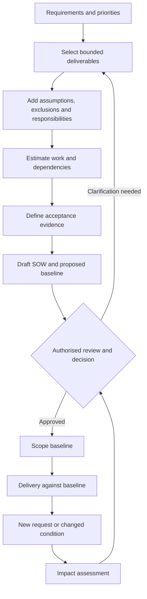

# Scope and Statement of Work


## 1. What you will learn

A requirements register describes business needs. It does not establish that every recorded need is included in the supplier’s work.

A statement of work, often shortened to SOW, connects selected needs to deliverables, responsibilities, dependencies, acceptance arrangements and change control. A scope baseline is the approved reference used to determine whether later work is included or represents a change.

Your task is to make the proposed engagement understandable enough that the client and supplier can make an informed decision.

By the end of this chapter, you should be able to:

- Translate requirements into bounded deliverables.
- State assumptions, exclusions and responsibilities clearly.
- Identify dependencies that affect effort or schedule.
- Describe acceptance evidence and decision ownership.
- Build an initial estimate using a work breakdown.
- Separate staff effort from elapsed schedule.
- Explain how changes affect scope, effort, timing and acceptance.
- Draft an SOW and proposed scope baseline without inventing approval.

Prerequisites and continuity

You need the engagement brief, discovery findings, process models and requirements register from Chapters 1–4.

Evergreen’s current case state includes:


| Record or fact | State entering this chapter |
| --- | --- |
| EVG-REQ-001, 002, 003, 007 and 008 | Verified business needs for intake, internal visibility and controlled Finance handoff |
| EVG-REQ-004 | Weekly reporting defined as a business need; priority is Should |
| EVG-REQ-005 and 006 | Customer portal and automated routing remain deferred |
| EVG-REQ-009–011 | Proposed rescheduling, cancellation and post-start change rules |
| EVG-NFR-001 | Proposed restrictions on cost, margin and sensitive Finance information |
| EVG-NFR-002 | Proposed operational history; retention period and evidence mechanism unresolved |
| EVG-TEST-001–013 | Planned checks, not executed product tests |
| EVG-CHANGE-001 | Portal/routing request deferred for separate assessment |
| EVG-DEFECT-001 | Reserved; no observed product failure recorded |
| Environment evidence | Production and sandbox organisations identified in a synthetic inventory; edition and configured permissions remain unverified |
| Delivery authority | No configuration, migration, release or new support service authorised |

A requirement marked Must is important to the intended outcome. That priority does not itself authorise implementation.

Your project contribution

You will produce:

1. An educational draft SOW for a bounded non-production pilot.
2. A proposed scope baseline linked to requirements and tests.
3. An initial work breakdown and estimate.
4. An assumption and dependency register.
5. A change-impact record.

The pilot is an intermediate part of the Evergreen project. Later chapters address architecture, migration, integration, release and operational handover. The proposed pilot does not replace those activities.

All client facts, rules, quantities, dialogue and estimates are synthetic. Sample SOW language is educational, not approved legal language or Wooplix policy. No client signature, acceptance or observed delivery result is supplied.


## 2. Lessons


### 2.1 Define deliverables through observable boundaries

Skill: explain what the supplier will produce and how far the work extends.

A deliverable is an output the engagement will produce. It may be a working configuration, document, test pack, training session or handover artifact.

A deliverable needs boundaries. “Implement service management” is too broad because it leaves the applications, users, workflows, environments and evidence undefined.

A better description is:

Produce a non-production pilot covering one intake-to-Finance workflow for Evergreen’s dispatch desk, using a bounded synthetic dataset and the listed exception scenarios.

This is more useful, but it still needs detail:

- Which requirements are included?
- Which business roles are represented?
- What data is used?
- What evidence is delivered?
- What is excluded?
- What decisions must happen before work begins?

Distinguish three things:


| Item | Evergreen example |
| --- | --- |
| Business outcome | More reliable coordination and fewer incomplete Finance handoffs |
| Deliverable | A pilot of intake, dispatch, completion and Finance review |
| Acceptance evidence | Recorded checks showing that the included behaviours and controls meet their criteria |

A pilot can demonstrate a capability without proving a business improvement. The earlier 80% first-pass discussion target is not a pilot acceptance threshold.

A common mistake is to define deliverables only by document names:

“Requirements document, test document and training document.”

Those names do not describe the content or completeness conditions. Instead, state that the test pack covers the included requirements, contains expected and actual results, identifies unresolved failures and supports an acceptance decision.

Lesson check LC1: What is missing from “Deliver a dispatch solution”? Give four boundaries that would make the deliverable clearer.


### 2.2 Make assumptions, exclusions and responsibilities actionable

Skill: expose the conditions behind the proposed scope.

An assumption is an unconfirmed condition used for planning. An exclusion identifies work outside the stated boundary. A responsibility identifies who performs an activity or supplies an input.

These categories solve different problems.


| Category | Example | Why it matters |
| --- | --- | --- |
| Assumption | Required controls can be implemented within the selected product design without an additional integration | If false, effort and architecture may change |
| Exclusion | No production data migration is included in the pilot | Prevents a demonstration dataset from becoming an unlimited migration commitment |
| Responsibility | Finance confirms permitted handoff fields and disclosure boundaries | Names the owner of the business evidence |
| Dependency | Configuration starts only after the approved environment and appropriate access are available | Connects the input to affected work |

Avoid using assumptions to conceal essential decisions. “Assume security is acceptable” does not explain which controls are required or who evaluates them.

An actionable assumption states:

1. The planning condition.
2. The evidence still needed.
3. The impact if it is false.
4. The owner and response.

Exclusions should also be precise. “Integrations excluded” is useful only if the reader understands how the pilot will demonstrate the Finance handoff without live financial transactions.

For this chapter, the pilot represents Finance review within the demonstration process. It does not create or release live invoices in another system.

Responsibilities do not transfer unrestricted access. The Client Administrator may supply authorised inventory evidence while Finance remains the owner of finance-data disclosure.

Zoho CRM’s API v8 organisation documentation describes environment type and licence information, subject to scope and permission conditions.1 Such evidence can support inventory. It does not prove that the selected workflow or access design meets Evergreen’s requirements.

Lesson check LC2: Why is “the client will provide everything needed” weaker than a named dependency with a required date and affected activity?


### 2.3 Define acceptance without manufacturing approval

Skill: describe how completion will be evaluated.

Acceptance terms explain how deliverables will be reviewed, what evidence is required and who makes the decision.

They should distinguish:

- Delivery of an artifact.
- Review of that artifact.
- Correction of a defect.
- Acceptance of a deliverable.
- Authorisation of further work.

A submitted test pack is not accepted merely because the client received it.

For Evergreen’s proposed pilot, useful acceptance conditions include:

- All listed deliverables are present.
- Every included requirement has a linked check.
- Checks contain inputs, expected results and actual observations.
- No unresolved failure prevents an included essential workflow or control.
- Other deviations have an explicit owner and agreed treatment.
- The Sponsor records the acceptance decision using Operations and Finance input.

An unresolved control failure cannot be hidden behind a high overall pass rate. If eleven checks pass but Dispatch can see restricted margin information, the control still requires attention.

A review interval can be proposed for scheduling, but silence is not evidence of acceptance. If reviewers are unavailable, record the dependency and revise the plan.

Defects and changes also need different treatment:

A defect is an observed failure against the applicable agreed requirement. A change adds, removes or materially alters that requirement or its delivery boundary.

Correcting a baseline defect is not automatically extra scope. Equally, a request for a new customer portal is not defect correction simply because the client calls it “a small fix.”

Lesson check LC3: Why should a pilot not be accepted solely because most tests pass?


### 2.4 Estimate the work you have actually bounded

Skill: build an initial estimate whose units and dependencies are visible.

A work breakdown divides the scope into activities that can be estimated and sequenced.

The estimate should identify:

- Work included.
- Role performing it.
- Effort unit.
- Dependencies.
- Capacity.
- Uncertainty.
- Client participation.
- Conditions that require re-estimation.

Staff effort measures work, commonly in person-hours. Elapsed schedule includes waiting, availability and sequencing.

For example, four hours of configuration can take one working day at four hours of available capacity. If access arrives three days late, those four hours have not become sixteen hours of work; the schedule has changed.

Uncertainty needs explicit treatment. In this chapter, a 15% reserve is a supplied planning convention for bounded correction and rechecking. It is not a universal consulting rule.

A reserve should not cover undefined new scope. Additional reports, integrations or interviews need an impact assessment.

Detailed delivery estimation comes in Chapter 9. Here, you need a credible first model that makes its limitations understandable.

Lesson check LC4: What information must accompany a statement that a pilot needs “68 hours”?


### 2.5 Control change through comparison and decision

Skill: evaluate a request against the proposed or approved reference.

A change mechanism should answer:

1. What is being requested?
2. Which baseline item is affected?
3. What business value does it add?
4. What changes in effort, timing, dependencies, tests or support?
5. What options exist?
6. Who can approve the change?
7. What happens while the decision is pending?

A client can ask for a change without approving its delivery.

Consider this exchange:

Sponsor: “The weekly report is already in the requirements register. Why is adding it a change?”  

Implementation Lead: “It is a verified business need, but the pilot proposal excludes it. Adding it changes the pilot deliverables, estimate and acceptance evidence. We can assess that addition without changing its requirement ID.”

Keep the requirement ID stable. Use a separate change ID for the scope decision.

Possible responses include approving the addition, deferring it, trading out another item or requesting further analysis. Removing an essential control to make an estimate fit is not a neutral trade. It requires an explicit business and delivery decision about the changed outcome.

Lesson check LC5: Can a verified requirement still be outside the proposed scope? Explain how it should be recorded.


## 3. Visual explanation: from requirements to controlled scope




The diagram separates a proposal from an approved baseline.

Requirements inform the proposal, but selection, estimation and acceptance terms still need review. After approval, the baseline becomes the reference for delivery and change decisions.

A document labelled “baseline” does not become approved simply because its filename says so.


## 4. Worked case: draft Evergreen’s pilot SOW


### 4.1 Supplied inputs


| Source ID | Synthetic input |
| --- | --- |
| EVG-SRC-046 | Sponsor authorises drafting an SOW, proposed scope baseline and initial estimate. This is document work only; pilot implementation is not authorised. |
| EVG-SRC-047 | Operations and Finance confirm the Chapter 3 business rules for rescheduling, pre-start cancellation and post-start Change review. Finance confirms the cost/margin and sensitive return-reason restrictions. Long-term history retention remains unresolved. |
| EVG-SRC-048 | Sponsor requests a proposal for one non-production intake-to-Finance pilot through the existing dispatch desk. Use at most ten synthetic customer records and twenty synthetic jobs. Include one orientation session of sixty minutes for at most six client participants. No production migration, live financial transactions or launch. |
| EVG-SRC-049 | Supplier supplies the work breakdown below. One Implementation Lead performs the supplier work at four hours of capacity per working day. Reserve is 15% of base effort. |
| EVG-SRC-050 | Planning availability: inventory needed before day 1; administrator support for environment readiness on day 3; business review on day 18; orientation on day 19. Working day 1 begins only after scope authority and prerequisite evidence are available. |
| EVG-SRC-051 | Proposed acceptance approach: require complete deliverables and traceable evidence; no unresolved failure of an essential workflow, access control or retained operational history. Sponsor decides acceptance after Operations and Finance review. No review outcome is supplied. |

The newly supplied confirmations support updating EVG-REQ-009–011 to verified business requirements. They do not approve implementation.

EVG-NFR-001’s visibility boundary is confirmed. EVG-NFR-002 remains proposed because long-term retention and the history mechanism are unresolved. The pilot can still propose a narrow operational-history demonstration.


### 4.2 Check evidence before reusing it

The Chapter 4 reporting exercise contained a counting error. For its supplied week of 25–31 January:

- EVG-JOB-1501 and EVG-JOB-1505 were open.
- EVG-JOB-1504 completed on 26 January and counted as completed.
- EVG-JOB-1502 completed on 21 January, outside the week.

The correct counts were two open and one completed, not two completed.

Record EVG-DEC-011: correct the report sample’s expected completed count to one while preserving the supplied records and requirement IDs.

This is an expected-answer correction, not an observed product defect. It illustrates why acceptance data must be checked before it becomes part of a contract or test pack.


### 4.3 Select the proposed pilot boundary

Proposed Scope Baseline SB-01 v0.1 — not approved


| Requirement group | Proposed treatment |
| --- | --- |
| EVG-REQ-001–003 | Include intake, internal visibility and controlled Finance review |
| EVG-REQ-007–008 | Include qualified handoff and permitted nonfinancial visibility |
| EVG-REQ-009–011 | Include confirmed exception rules in the pilot |
| EVG-NFR-001 | Include role-based visibility controls |
| EVG-NFR-002 | Include demonstration of prior return and correction actor/time; exclude unresolved long-term retention implementation |
| EVG-REQ-004 | Exclude from this pilot proposal; retain Should priority in the wider register |
| EVG-REQ-005–006 | Deferred; outside this proposal |

Twelve checks are proposed for the pilot: EVG-TEST-001–008 and EVG-TEST-010–013. The reporting check, EVG-TEST-009, is excluded.

Record EVG-DEC-012: use SB-01 as the proposed pilot boundary, subject to approval and product-fit confirmation.


### 4.4 Completed educational SOW

Artifact: Evergreen Pilot SOW v0.1 — draft for review

Purpose and scope

The proposed engagement will produce a non-production pilot demonstrating Evergreen’s selected intake, dispatch, completion, Finance-review and exception behaviours.

The pilot covers one dispatch-desk workflow with representative Operations, Dispatch, Technician, Finance and Administrator roles. It uses no more than ten synthetic customers and twenty synthetic jobs. These are dataset limits, not migration commitments or licence counts.

Deliverables


| Deliverable ID | Output and boundary | Completion evidence |
| --- | --- | --- |
| EVG-DEL-001 | Pilot design and access plan for included requirements | Requirement coverage, role boundaries, product-fit conditions and environment plan |
| EVG-DEL-002 | Intake, assignment, completion and exception workflow | Demonstration of intake hold, rescheduling, cancellation and post-start review |
| EVG-DEL-003 | Controlled Finance handoff and permitted Dispatch visibility | Qualified handoff, Finance review boundary and restricted-information checks |
| EVG-DEL-004 | Bounded synthetic dataset and operational-history example | Identified records; prior return and correction actor/time retained in the demonstration |
| EVG-DEL-005 | Traceable test and issue pack | Twelve included checks, inputs, expected/actual results and unresolved-item treatment |
| EVG-DEL-006 | One orientation session and pilot handover pack | Session materials, administrator notes, known limitations and named support ownership |

Responsibilities

The Implementation Lead owns supplier design recommendations, configuration work if later authorised, supplier checks, documentation and issue communication.

The Client Administrator provides authorised environment and access evidence. Operations confirms process facts and coordinates missing operational information. Finance confirms disclosure rules and reviews the Finance control. The Sponsor approves scope and records the acceptance decision.

Client responsibilities do not require shared credentials or unrestricted exports.

Assumptions and dependencies

The estimate assumes the selected product design can meet the included behaviours without an additional live integration. This remains unverified.

Scope approval, product/edition evidence and appropriate permissions are prerequisites for implementation. If the initial design assessment disproves the assumption, affected work pauses for re-estimation and a scope decision.

Business review and orientation depend on the supplied participant availability.

Exclusions

The proposal excludes:

- Production data migration and historical-record cleansing.
- Live invoice creation, release or financial-system integration.
- Production launch and cutover.
- Customer portal and automated routing.
- Weekly management reporting.
- Long-term retention or archival implementation.
- Additional training sessions and ongoing operational support.

Acceptance approach

Deliverables will be evaluated using the listed requirement links and recorded checks. Essential workflow, access-control and operational-history failures must be resolved before acceptance.

Other deviations require an explicit treatment agreed by the Sponsor with relevant owner input. Submission, attendance and silence do not constitute acceptance.

The estimate includes bounded correction/rechecking effort. A defect against the agreed scope is not automatically a new chargeable requirement. New scope requires the change mechanism.

Handover and support boundary

The pilot pack identifies the Client Administrator for environment administration and the Operations Manager for business-process questions. Product issues follow the client’s existing support arrangements.

No production recovery capability is promised. Before pilot changes, the Administrator and Implementation Lead must establish an authorised method for preserving or recreating the permitted pilot configuration and synthetic data. Chapters 14 and 15 develop release recovery and operational support handover.

Commercial status

This is a proposed work boundary and planning estimate. Fees, payment terms and other commercial terms are not supplied. No implementation authority or client acceptance is recorded.


### 4.5 Initial work breakdown


| Work ID | Supplier activity | Person-hours |
| --- | --- | --- |
| E01 | Design and product-fit confirmation | 8 |
| E02 | Environment and access readiness | 6 |
| E03 | Intake and dispatch workflow | 12 |
| E04 | Reschedule, cancellation and post-start exceptions | 8 |
| E05 | Finance handoff and visibility controls | 10 |
| E06 | Synthetic dataset and operational history | 6 |
| E07 | Supplier checks and evidence preparation | 10 |
| E08 | Business review, orientation and final pack | 8 |

E08 consists of four hours of preparation, two hours of business review, one hour of orientation and one hour of final-pack completion.

All supplier work is performed by one Implementation Lead in this estimate.


> Base effort=8+6+12+8+10+6+10+8=68 person-hours


> Reserve=68×0.15=10.2 person-hours


> Planning range=68–78.2 supplier person-hours

Client participation is separate:


| Client activity | Person-hours |
| --- | --- |
| Administrator readiness support | 1 |
| Operations and Finance business review: two hours each | 4 |
| Six participants attending one-hour orientation | 6 |
| Sponsor scope and acceptance decisions: half-hour each | 1 |
| Total | 12 |

These are planned participation allowances, not observed attendance.


### 4.6 Derive the elapsed schedule

Desk work may be split across days. Dependent work may start on the same day if capacity remains.


| Working days | Planned supplier activity |
| --- | --- |
| 1–2 | E01: 8 hours |
| 3–4 | E02: 6 hours; E03 starts with day 4’s remaining 2 hours |
| 5–7 | E03 finishes; E04 starts on day 7 |
| 8–9 | E04 finishes; E05 starts on day 9 |
| 10–11 | E05 finishes |
| 12–13 | E06; E07 starts on day 13 |
| 14–15 | E07 finishes |
| 16 | E08 preparation: 4 hours |
| 18 | Business review: 2 hours |
| 19 | Orientation and final pack: 2 hours |

Base completion is day 19.

If the full reserve is needed after the final pack, day 19 has two hours remaining. Days 20 and 21 provide eight more hours, and the remaining 0.2 hours use day 22.

The conditional elapsed range is therefore 19–22 working days.

The capacity calculation alone gives:


> 68÷4=17 capacity-days

That is not the elapsed schedule because participant availability introduces waiting.

The reserve assumes desk corrections and supplier rechecking. A further client review or new approval dependency requires a revised schedule.

A mistake and its correction

Mistake: “The 78.2-hour estimate guarantees completion before 15 February.”

Correction: “The estimate is 68–78.2 supplier person-hours. Its conditional schedule is 19–22 working days from an authorised start with the stated inputs and availability. No calendar start or supported 15 February commitment is supplied.”


## 5. Try it yourself — guided practice

Learning goal and access

Revise the draft SOW and proposed baseline when dependencies change without adding scope.

Use the worked case, a document editor and calculator. No tenant access is needed.

Changed inputs


| Source ID | Supplied change |
| --- | --- |
| EVG-SRC-052 | Administrator readiness support moves from day 3 to day 5. E01’s inventory is still available before day 1. E02 cannot start before day 5. |
| EVG-SRC-053 | Business review moves to day 20 and orientation to day 21. All effort values and scope boundaries remain unchanged. |

Keep these rules:

- One Implementation Lead has four hours daily capacity.
- E01–E07 retain their sequential dependencies.
- E08 preparation follows E07.
- Reserve follows final-pack completion.
- No work or attendance has been observed.

Guided steps and expected intermediate results

1. Separate dependency change from scope change.  

Expected result: deliverables and requirement coverage remain unchanged.

2. Update the dependency register.  

Expected result: E02’s earliest start becomes day 5; downstream work is resequenced.

3. Recalculate effort.  

Expected result: base and reserve remain 68 and 10.2 person-hours.

4. Build a feasible schedule.  

Expected result: all activities respect four-hour capacity and the new review/orientation slots.

5. Revise the SOW and proposed baseline status.  

Expected result: v0.2 remains a draft for review, with no invented approval.

Blank scope worksheet


| Field | Your entry | Guidance |
| --- | --- | --- |
| Artifact identity/status |  | Name, version, owner and approval state |
| Purpose and phase |  | Explain the outcome and current work boundary |
| Included deliverables |  | List IDs, contents and quantitative limits |
| Requirements/tests |  | State included and excluded IDs |
| Assumptions |  | Condition, evidence and impact if false |
| Exclusions |  | Identify work outside this phase |
| Responsibilities |  | Name supplier and client owners |
| Dependencies |  | Required input, date and affected activity |
| Acceptance |  | Evidence, decision owner and unresolved-failure treatment |
| Effort/schedule |  | Units, roles, reserve, capacity and elapsed range |
| Support/change |  | Ownership and approval mechanism |

Blank dependency and estimate worksheet


| Record ID | Condition or activity | Owner/role | Effort or required date |
| --- | --- | --- | --- |
|  |  |  |  |
|  |  |  |  |
|  |  |  |  |

Final artifacts: Pilot SOW v0.2, proposed SB-01 v0.2 and a revised dependency/estimate sheet.

Cleanup: preserve the original draft and supplied evidence. Remove duplicate scratch schedules if no longer needed. No product-state cleanup applies.


## 6. Independent challenge

Continue from the guided schedule.

New request and constraints


| Source ID | Supplied input |
| --- | --- |
| EVG-SRC-054 | Sponsor requests adding one weekly open/completed report, EVG-REQ-004, to the proposed pilot. The requested supplier effort ceiling is 80 hours. This is a request for a revised proposal, not implementation approval. |
| EVG-SRC-055 | Supplier estimates the report at eight additional hours: definitions/mapping 2, report preparation 3, checks 2, documentation 1. E09 follows E07 and precedes E08 preparation. If reporting is added, business review is available on day 22 and orientation on day 23. |
| EVG-SRC-056 | The 15% reserve remains the planning rule unless the Sponsor and Implementation Lead explicitly agree a reduction after impact review. No reduction is currently authorised. |

Use EVG-CHANGE-002 for the reporting addition. Preserve EVG-REQ-004 and EVG-TEST-009.

Complete reporting inputs

The week is Monday 25 January through Sunday 31 January 2027 UTC. The cutoff is 31 January at 23:59 UTC.

Open means not cancelled and not completed at the cutoff. Completed means service completion occurred within the reporting week.


```csv
job_ref,status,completed_at,cancelled
EVG-JOB-1501,open,,no
EVG-JOB-1502,completed,2027-01-21T10:00:00Z,no
EVG-JOB-1503,cancelled,,yes
EVG-JOB-1504,completed,2027-01-26T15:00:00Z,no
EVG-JOB-1505,open,,no
```

Deliverables

Produce:

1. A change-impact record.
2. A proposed SOW amendment.
3. A revised base effort, reserve and total.
4. A feasible elapsed range using the full 15% reserve.
5. Options addressing the 80-hour ceiling.
6. Correct expected report counts and traceability.
7. A short recommendation to the Sponsor.

Success criteria

Your proposal must preserve essential controls, identify the ceiling conflict, retain the correct report counts and distinguish a requested addition from approved scope.

Do not reduce reserve or remove controls silently to make the numbers fit.


## 7. Common problems and recovery


| Symptom | Diagnosis | Correction |
| --- | --- | --- |
| Every requirement is described as included | Register confused with scope | Explicitly select included requirements and retain exclusions |
| “Migration included” has no limits | Unbounded data responsibility | State sources, volume boundaries and cleansing ownership, or exclude migration from this phase |
| Acceptance depends on “client satisfaction” | Evidence is not reproducible | Define deliverable completeness, criteria and decision owner |
| A missed meeting is treated as approval | Silence confused with acceptance | Record the unavailable review and revise dependency dates |
| Estimate omits client availability | Effort confused with schedule | Sequence work against actual planning slots |
| Reserve absorbs a new report | New scope hidden in uncertainty | Estimate the addition and reassess reserve |
| Permission is missing | Environment dependency unresolved | Pause affected work and request authorised evidence/access |
| A scope error has already been circulated | Recipients hold inconsistent references | Issue a versioned correction identifying affected items |
| A pilot is called production-ready | Demonstration boundary exceeded | State the remaining architecture, migration, UAT and release work |
| Support owner is absent from handover | Deliverable ends without ownership | Name business and technical owners and escalation boundaries |

Recovery in this chapter repairs the scope record and delivery plan. It does not restore data or establish a production recovery service.


## 8. Check your understanding

1. Why can EVG-REQ-004 remain a Should while being excluded from the initial pilot?
2. What makes an assumption different from an exclusion?
3. Why does identifying a sandbox not prove environment readiness?
4. What evidence is needed before calling SB-01 an approved baseline?
5. Which parts of the estimate change when a client meeting moves but the work remains the same?
6. Why is an access-control failure not offset by other passing tests?
7. When is correcting a failed handoff a defect correction, and when is it a scope change?
8. Why should acceptance of the pilot not be described as approval to launch?

## 9. Solutions and explanations


### 9.1 Lesson checks

LC1: Useful boundaries include workflow, represented roles, environment, data limits, exception cases, deliverables and acceptance evidence. Application names alone do not define these.

LC2: A named dependency identifies who supplies what, when it is needed and which activity is affected. “Everything needed” cannot be tracked or assessed.

LC3: An essential failure can remain despite a high pass rate. A restricted-information exposure or automatic invoice release violates a control that cannot be averaged away.

LC4: Identify the work boundary, supplier role, person-hour unit, client participation, reserve, capacity, dependencies and conditions requiring re-estimation.

LC5: Yes. Business confirmation establishes the need; scope selection establishes whether the current engagement will deliver it. Keep the requirement visible and state its treatment.


### 9.2 Guided practice solution

Effort is unchanged:


> 68+(68×0.15)=78.2 supplier person-hours at the upper planning bound

Client participation remains 12 person-hours. Availability changed, not the planned duration of the activities.

Revised feasible schedule


| Working day | Supplier work |
| --- | --- |
| 1–2 | E01 |
| 5 | E02 |
| 6 | E02 remaining 2; E03 starts 2 |
| 7–8 | E03 |
| 9 | E03 remaining 2; E04 starts 2 |
| 10 | E04 |
| 11 | E04 remaining 2; E05 starts 2 |
| 12–13 | E05 |
| 14 | E06 |
| 15 | E06 remaining 2; E07 starts 2 |
| 16–17 | E07 |
| 18 | E08 preparation |
| 20 | Business review |
| 21 | Orientation and final pack |

Base completion is day 21.

The full 10.2-hour reserve uses:

- Day 21: 2 hours remaining.
- Day 22: 4 hours.
- Day 23: 4 hours.
- Day 24: 0.2 hours.

The revised elapsed range is 21–24 working days.

Completed scope amendment

Pilot SOW v0.2 / Proposed SB-01 v0.2


| Field | Revised content |
| --- | --- |
| Scope | Unchanged from v0.1 |
| Requirement/test coverage | Unchanged; reporting remains excluded |
| Administrator dependency | E02 earliest start is day 5 |
| Review dependency | Business review day 20 |
| Orientation dependency | Orientation day 21 |
| Supplier effort | 68–78.2 person-hours |
| Client participation | 12 person-hours |
| Elapsed schedule | 21–24 working days under supplied conditions |
| Approval status | Draft; no implementation authorisation or baseline approval |
| Next action | Submit revised dependency and schedule implications for decision |

A valid alternative schedule may arrange preparatory desk work differently only if it respects the supplied dependencies. The exercise does not permit starting E02 early.


### 9.3 Independent challenge solution

Revised effort

Additional report effort:


> 2+3+2+1=8 person-hours

Revised base:


> 68+8=76 person-hours

Revised reserve:


> 76×0.15=11.4 person-hours

Upper planning bound:


> 76+11.4=87.4 person-hours

Ceiling difference:


> 87.4-80=7.4 person-hours

The full-reserve proposal does not fit the requested ceiling.

Revised schedule

E07 still finishes on day 17.


| Working day | Added or remaining work |
| --- | --- |
| 18–19 | E09 reporting |
| 20 | E08 preparation |
| 22 | Business review |
| 23 | Orientation and final pack |

Base completion is day 23.

The 11.4-hour reserve uses two remaining hours on day 23, four hours each on days 24 and 25, and 1.4 hours on day 26.

The full-reserve elapsed range is 23–26 working days, conditional on the supplied availability.

Completed change-impact record


| Field | EVG-CHANGE-002 |
| --- | --- |
| Request | Add one weekly report to the proposed pilot |
| Requirement/test | EVG-REQ-004 / EVG-TEST-009 |
| Current treatment | Excluded from SB-01 v0.2 |
| Added deliverable | One report with stated UTC open/completed definitions and test evidence |
| Effort impact | Base increases by 8 hours; reserve rises from 10.2 to 11.4 hours |
| Total impact | Upper bound increases from 78.2 to 87.4 hours |
| Schedule impact | Guided range 21–24 becomes 23–26 working days |
| Ceiling conflict | Full-reserve proposal exceeds 80 hours by 7.4 |
| Status | Revised proposal requested; addition not approved |
| Decision owners | Sponsor for scope/ceiling; Implementation Lead for supplier estimate and reserve recommendation |

Options


| Option | Supplier effort | Consequence |
| --- | --- | --- |
| Retain original pilot; defer reporting | 68–78.2 hours | Fits the 80-hour ceiling; retains 21–24-day guided range |
| Add reporting and revise ceiling | 76–87.4 hours | Preserves full reserve; uses 23–26-day range |
| Add reporting with explicitly approved reduced reserve | 76–80 hours | Only 4 reserve hours remain; uncertainty is less covered and requires both decision owners’ agreement |
| Remove another bounded item | Requires a new estimate | Must assess lost outcome, test coverage and controls before proposing approval |

Reduced reserve percentage would be:


> (4) ÷ (76)×100≈5.26%

That is not the supplied 15% rule. It is a proposed exception, not an authorised adjustment.

If explicitly approved, four reserve hours would finish by day 24 using two hours on day 23 and two on day 24. This conditional schedule does not apply to the current unapproved proposal.

Correct reporting evidence

- Open: EVG-JOB-1501 and EVG-JOB-1505.
- Completed within the week: EVG-JOB-1504.
- Cancelled: EVG-JOB-1503 excluded from open.
- Completed before the week: EVG-JOB-1502 excluded from the week’s completed count.

> Open=2, Completed=1

The trace is:

EVG-SRC-038 → EVG-REQ-004 → EVG-AC-006A–B → EVG-TEST-009 → proposed reporting deliverable → EVG-CHANGE-002.

No report execution or client acceptance is claimed.

A suitable recommendation is:

The reporting addition is eight base hours and changes the full-reserve estimate to 87.4 hours, above the requested 80-hour ceiling. Retaining the original pilot fits the ceiling; adding reporting requires a higher ceiling or an explicit decision about reduced reserve or changed scope. I recommend preserving essential controls and the full reserve until that decision is recorded.


### 9.4 Understanding check answers

1. Priority expresses business importance. Scope expresses what this engagement will deliver. A Should may be deferred from a bounded pilot without being rejected.
2. An assumption is an unconfirmed planning condition. An exclusion is a deliberate work boundary.
3. Environment existence does not prove edition capability, access, configuration, permitted data or an authorised recovery method.
4. An explicit approval from the authorised decision owner identifying the version and applicable terms.
5. Elapsed schedule and dependency dates change. Staff effort changes only if the delay creates additional work.
6. The access control is an independent acceptance condition. Other successes do not remove the exposure.
7. It is defect correction when observed behaviour fails the applicable agreed requirement. It is a change when the requested behaviour adds or alters the agreed need or boundary.
8. Pilot acceptance concerns the stated non-production deliverables. Launch needs separate readiness, migration, release, recovery and support decisions.

## 10. Chapter recap and next step

A useful SOW makes the engagement’s boundaries understandable before delivery starts.

It identifies what will be produced, what is excluded, who supplies inputs, how completion will be evaluated and what happens when the request changes. Its estimate is credible because the work, units, uncertainty and schedule conditions are visible.

Completion checklist

- I can translate selected requirements into bounded deliverables.
- I can distinguish assumptions, exclusions and dependencies.
- I can assign supplier and client responsibilities.
- I can describe acceptance without inventing approval.
- I can build a work breakdown with person-hour estimates.
- I can separate client participation from supplier effort.
- I can derive a feasible elapsed schedule.
- I can assess a change against scope, reserve, timing and evidence.
- I can keep a proposed baseline distinct from an approved one.

Your project pack now includes a draft SOW, proposed scope baseline, estimate and change-impact record.

Chapter 6, Solution Architecture and Product Fit, investigates application selection, native versus custom design, record ownership, integration boundaries, edition constraints and architecture decisions. It will test the assumptions behind this proposed scope.


## 11. Glossary and further reading

Glossary


| Term | Meaning |
| --- | --- |
| Acceptance terms | Arrangements defining review, evidence and decision ownership |
| Change mechanism | Process for evaluating and deciding changes to the work boundary |
| Deliverable | Output the engagement will produce |
| Dependency | Required input or condition affecting another activity |
| Exclusion | Work deliberately outside the stated scope |
| Proposed baseline | Draft reference awaiting the appropriate approval |
| Reserve | Explicit effort allowance for identified uncertainty |
| Scope baseline | Approved reference for included work and later change comparison |
| Statement of work | Description of deliverables, boundaries, responsibilities and completion arrangements |
| Work breakdown | Division of scope into estimable activities |

Further reading

1. Zoho CRM Developer Documentation — API v8: Get Organization Details  
[Open official reference](https://www.zoho.com/crm/developer/docs/api/v8/get-org-data.html)

Describes organisation metadata, including environment type and licence details, and the scope and permission conditions for retrieval. Useful when identifying authorised inventory evidence needed before making product-fit commitments.

The official reference was accessed on 5 October 2026. Research is partially verified: the cited inventory claim is documentation-based. Evergreen’s edition, permissions, selected architecture and implementation behaviour remain unverified. No product execution is claimed.
