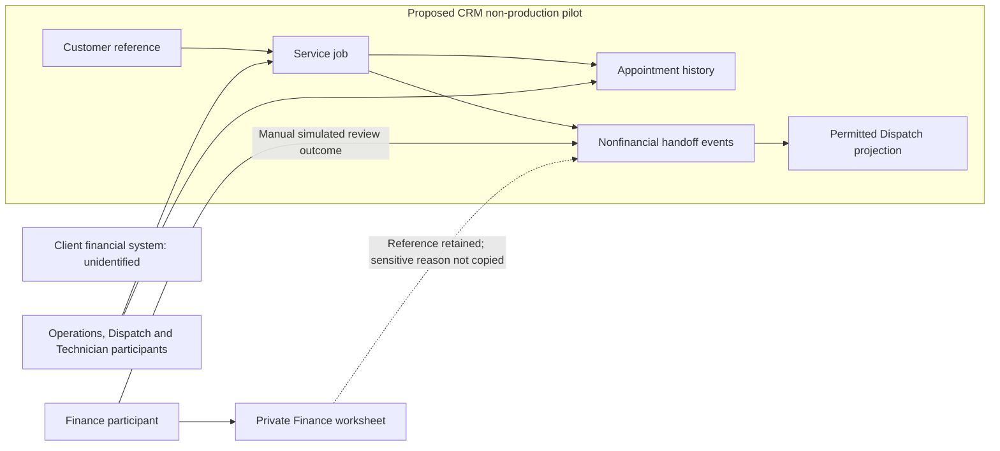

# Solution Architecture and Product Fit

## 1. What you will learn

A product can contain relevant features without being a good fit for the complete engagement. It may support individual records but not the required ownership model. It may provide process transitions while leaving a cross-record exception unresolved. It may also introduce dependencies that exceed the approved work boundary.

Solution architecture describes the major components of a solution, their responsibilities, their data and their boundaries. Product fit evaluates whether a proposed application and design can meet the requirements under the client’s actual conditions.

By the end of this chapter, you should be able to:

- Compare application choices against the intended business process.
- Distinguish native configuration from custom code and integration.
- Define authoritative records and business ownership.
- Keep business identifiers distinct from product-generated identifiers.
- Describe integration boundaries without inventing a live interface.
- Identify edition, permission, environment and region dependencies.
- Record architecture decisions with alternatives and reopening conditions.
- Produce an architecture and fit-gap pack linked to requirements and tests.

Prerequisites and continuity

You need the requirements register from Chapter 4 and the proposed pilot scope from Chapter 5.

| Carried-forward item | Current state |
| --- | --- |
| Proposed pilot | One non-production intake-to-Finance workflow through Evergreen’s dispatch desk |
| Dataset boundary | At most ten synthetic customers and twenty synthetic jobs |
| Included business requirements | EVG-REQ-001–003 and EVG-REQ-007–011 |
| Restricted information | Cost, margin and sensitive Finance return reasons must not be visible to Dispatch |
| Operational history | A bounded demonstration is proposed; long-term retention remains unresolved |
| Weekly reporting | EVG-REQ-004 remains Should; addition requested through EVG-CHANGE-002, not approved |
| Portal and routing | EVG-REQ-005–006 deferred through EVG-CHANGE-001 |
| Pilot estimate | 68–78.2 supplier person-hours; latest dependency-based range 21–24 working days |
| Reporting option | Full-reserve upper bound 87.4 hours, above the requested 80-hour ceiling |
| Authority | Scope and design documents only; no implementation, migration, release or new support service |
| Evidence | Tests planned; no product results, approved baseline or client acceptance |

The corrected Chapter 4 reporting sample contains two open jobs and one completed job for its stated week. That correction remains part of the case.

Your contribution to the project

You will add:

1. An application comparison.
2. A logical architecture diagram.
3. A record and ownership model.
4. An interface-boundary register.
5. Architecture decision records.
6. A requirement-to-design fit-gap matrix.

All Evergreen facts, documents, quantities and dialogues are synthetic. A completed architecture artifact is a student model draft, not an approved client design. Documentation support and paper reasoning do not demonstrate configured product behaviour.

## 2. Lessons

### 2.1 Select applications for the process and the engagement

Skill: compare products without choosing solely from familiarity.

Application selection starts with the business process and the proposed work boundary.

Evergreen needs intake, internal customer visibility, dispatch coordination, completion information and Finance review. These needs overlap several product categories:

- Customer relationship management.
- Field-service management.
- Custom business applications.
- Financial systems.

That does not mean Evergreen needs all four in the pilot.

Zoho CRM documentation describes standard and custom modules and an API for discovering the modules available in an organisation.1 This supports investigating CRM as a record-and-process platform.

Zoho FSM documentation describes work orders and service appointments as product records. Its work-order API includes service and address inputs; its appointment API uses work-order service-line identifiers and scheduled times.5 Those concepts are relevant to Evergreen’s field-service work.

However, relevance is not complete fit. A switch to FSM would require investigation of customer, address, service-catalogue and resource mappings, as well as subscriptions, access and financial boundaries. Existing CRM use does not establish FSM entitlement.

Consider this dialogue:

Operations Manager: “We are a field-service company, so should we use FSM?”  

Implementation Lead: “FSM is a relevant candidate. We must compare its service model with your requirements and the pilot boundary. We also need to distinguish the best pilot choice from the longer-term operating platform.”

A short pilot may reasonably reuse an existing application to investigate business behaviour. A production architecture may later select a different application after broader evidence is available.

Use explicit criteria. Useful criteria include:

- Coverage of the required workflow and exceptions.
- Compatibility with current authority and scope.
- Clear data ownership.
- Administration and support burden.
- Unresolved product dependencies.

Avoid unsupported claims such as “CRM cannot do dispatch” or “FSM automatically solves rescheduling.” Define the required behaviour and inspect the relevant capability.

Lesson check LC1: Why might the preferred application for a bounded pilot differ from the preferred long-term operating platform?

### 2.2 Choose native configuration, custom code or integration deliberately

Skill: identify the smallest supportable design that meets the requirement.

Native configuration uses capabilities provided by the application: available records, fields, relationships, views, permissions and process controls.

A configured custom module can still be native configuration. “Custom” in a module label does not necessarily mean custom code.

Custom code adds behaviour through scripts, functions or another programmed component. An integration exchanges information across an application or service boundary.

These approaches differ in what you must maintain and verify:

| Approach | Appropriate when | Additional questions |
| --- | --- | --- |
| Native configuration | Available capabilities meet the business behaviour | Does the actual edition, module and permission model support it? |
| Custom code | A specific rule is not adequately supported by configuration | Who maintains it, how does it fail, and how is it tested? |
| Integration | Another system must exchange authoritative information | Who owns each field, identity, mapping, retry and reconciliation? |
| Manual controlled handoff | The current phase needs a bounded demonstration or human decision | What is transferred, who records receipt, and what remains outside the application? |

“Native first” is a useful investigation order, not proof that native configuration will meet every requirement.

For example, a process transition may collect a completion summary. It does not automatically prove that the same design can preserve appointment history, coordinate acknowledgements and handle partial changes across several records.

Zoho CRM’s Blueprint API describes transitions, associated fields and validation for a record in a process.4 This supports investigating transition-based controls. It does not prove that a selected design enforces all Evergreen rules.

Before adding code, write the precise gap:

“The proposed design needs to preserve the old appointment and create a pending replacement without allowing an incomplete change to appear confirmed.”

That is more useful than “write a rescheduling function.”

Chapter 10 will validate difficult assumptions through prototypes. Chapter 11 will develop integration and failure behaviour in detail.

Lesson check LC2: Why is “use Blueprint” a design candidate rather than a complete answer to Evergreen’s exception requirements?

### 2.3 Define record ownership at three levels

Skill: identify the authoritative source and the people allowed to change information.

“Record owner” can refer to three different things:

1. Business owner: the role accountable for the meaning and quality of the information.
2. Authoritative system: the place treated as the source of truth for that information.
3. Product record owner: an application’s assigned owner, which may affect access or routing.

These are related but not interchangeable.

For Evergreen, Operations may own customer-reference quality. A CRM account record could hold the pilot’s customer information. The product record might be assigned to a particular administrator or user. That assignment does not make the administrator the business authority for invoice release.

Ownership may also differ by field:

| Information | Business authority |
| --- | --- |
| Customer reference and intake facts | Operations |
| Appointment and assigned technician | Dispatch |
| Customer confirmation | Operations supplies the evidence |
| Technician acknowledgement | Technician supplies the evidence; Dispatch records coordination |
| Completion date and summary | Technician Lead supplies the facts |
| Finance review status | Finance |
| Invoice release | Finance, outside the pilot’s live-transaction boundary |

Define a logical entity before mapping it to a product module. A logical entity is a business object in your design, such as Job or Appointment.

The logical model should preserve:

- One customer’s relationship to multiple jobs.
- One job’s relationship to appointment history.
- One job’s relationship to multiple handoff events.
- Distinct job, appointment and Finance-review states.

Do not overwrite an appointment merely because a job is rescheduled. Do not use one field called “Status” to represent all three objects.

Business identifiers and product identifiers

EVG-JOB-1601 is a business job reference. A Zoho-generated record ID identifies a particular record in a particular product environment.

You may need both. A business reference supports communication and cross-system reconciliation. A product ID supports an application operation.

The CRM Blueprint endpoint requires a module API name and product record ID.4 Substituting an Evergreen business reference does not turn it into a valid product record ID.

Do not assume production and sandbox records share IDs. Record mappings explicitly when later migration or promotion work requires them.

Lesson check LC3: Who owns the meaning of a Finance review status? Does assigning the job record to a Dispatcher transfer that authority?

### 2.4 Draw integration boundaries before specifying an interface

Skill: show what crosses a boundary and what remains under its owner.

An integration boundary is a responsibility boundary, not merely a line between application logos.

For each proposed exchange, ask:

- Which system owns the source information?
- Which fields may cross?
- Which fields must remain restricted?
- Who owns the destination update?
- What identifies the business event?
- How is incomplete or conflicting information handled?

The pilot can demonstrate a Finance handoff without creating a live financial integration.

For example:

A qualified completion record becomes ready for Finance review. A Finance participant records a simulated review outcome in the pilot. No invoice is created or released in a financial system.

That is a controlled manual demonstration. It must not be described as “CRM integrated with Finance.”

A particularly important boundary concerns sensitive return reasons. Dispatch needs status and a Finance contact, not the full explanation.

Use an allowlist: an explicit list of information permitted in the public handoff view. Do not copy everything and try to hide it later.

A candidate public projection could contain:

- Business job reference.
- Nonfinancial handoff status.
- Responsible Finance contact.

A projection is a selected representation of information for a particular purpose. It can help minimise disclosure, but its design alone does not prove technical access control. Views, APIs, exports and other permitted channels need later verification.

Lesson check LC4: Why is a permitted status projection safer than copying the complete Finance return note into a shared job record?

### 2.5 Treat edition and metadata evidence as conditions, not guarantees

Skill: distinguish documented capability, tenant evidence and executed proof.

Three kinds of evidence matter:

| Evidence type | What it establishes |
| --- | --- |
| Official documentation | Described capability and documented conditions |
| Client inventory or configuration evidence | Facts about the supplied tenant or environment |
| Executed check | Observed behaviour under a stated user, environment and dataset |

None replaces the others.

Zoho CRM’s organisation API describes environment type and licence details.2 Its module metadata describes available module API names and attributes, including Blueprint support.1 Its field metadata describes fields, API names, types and permission-related information.3

Important limits follow from the documentation:

- Use actual module and field API names, not assumed labels.1
- Field metadata is not a complete source of layout-specific requiredness.3
- A field with “Don’t Show” permissions can still appear in the field metadata response. That is metadata visibility, not proof that record values are readable.3
- The APIs have scope and permission requirements.
- The client’s hosting region must be established through relevant tenant evidence; a business address is not enough.

A read-only evidence request can therefore be planned as follows:

| Evidence requested | Documented API v8 route | Example read scope |
| --- | --- | --- |
| Organisation inventory | GET /org | ZohoCRM.org.READ |
| Available modules | GET /settings/modules | ZohoCRM.settings.modules.READ |
| Module fields | GET /settings/fields?module={module_API_name} | ZohoCRM.settings.fields.READ |
| Record process transitions | GET /{module_API_name}/{record_ID}/actions/blueprint | Relevant module READ scope |

These are documented route patterns, not requests executed for Evergreen. An authorised administrator must establish the correct regional API domain, identity and permissions before any retrieval.

Lesson check LC5: If field metadata reports system_mandatory: false, can you conclude that the field is optional in every layout and transition?

### 2.6 Record decisions and their reopening conditions

Skill: make the architecture explainable to a future delivery team.

An architecture decision record states a significant choice, the alternatives considered, the reasoning, consequences and conditions that would require reconsideration.

A useful decision record contains:

- Stable decision ID.
- Requirement and scope links.
- Context.
- Options.
- Recommended choice.
- Evidence and uncertainty.
- Consequences.
- Owner and status.
- Reopening trigger.
“Use CRM” is not enough. A future reader needs to know whether CRM was selected for the pilot, the full programme or one component.

Similarly, a decision to avoid live integration in the pilot must not later become an assumption that Finance never needs integration.

Architecture is allowed to change. Good records make that change controlled and explainable.

Lesson check LC6: What new information could justify reopening a conditional CRM pilot recommendation?

## 3. Visual explanation: the proposed pilot boundary

The diagram shows logical responsibilities, not a deployed configuration.

CRM is the proposed pilot boundary. Customer, job, appointment and handoff records are separate logical objects. Their final mapping to available standard or custom modules remains to be verified.

Finance manually supplies a simulated outcome. Sensitive reason text remains in a restricted worksheet for the paper exercise. The financial system is outside the pilot and has no live interface.

The absence of an arrow to the financial system is intentional: the pilot does not create or release live invoices.

## 4. Worked case: prepare the architecture and fit-gap pack

### 4.1 New synthetic inputs

| Source ID | Supplied fact |
| --- | --- |
| EVG-SRC-057 | Sponsor authorises an architecture and fit-gap document pack. The proposed SOW remains unapproved; no tenant changes or API calls are authorised. |
| EVG-SRC-058 | Administrator inventory states Zoho CRM Enterprise, EU hosting region, and production and sandbox organisations. Exact module configuration, field permissions, available capacity and process configuration are not supplied. |
| EVG-SRC-059 | Operations confirms that each pilot customer reference identifies a business customer rather than an individual person. The supplied pilot examples have one current visit per job; broader multi-visit behaviour is not established. |
| EVG-SRC-060 | Finance permits public job reference, nonfinancial handoff status and Finance contact. Sensitive return reasons remain outside the shared operational pilot. A private synthetic worksheet may retain the original reason, actor and time for the demonstration. |
| EVG-SRC-061 | The team supplies comparison weights and provisional ratings below. Ratings are scenario judgements, not measured product performance or verified fit. |

The Enterprise and EU details are new supplied inventory evidence. They resolve those earlier inventory gaps for the scenario. Feature-level and permission evidence remain missing.

### 4.2 Step 1: compare applications

Use ratings from 1, weak, to 5, strong.

| Criterion | Weight | CRM pilot | FSM-based pilot | Separate application |
| --- | --- | --- | --- | --- |
| Expected business-process coverage | 4 | 4 | 5 | 4 |
| Compatibility with current scope and inventory | 3 | 5 | 2 | 2 |
| Simplicity of ownership boundaries | 2 | 5 | 3 | 4 |
| Expected supportability | 1 | 4 | 4 | 2 |

Weighted score:

> Score=Σ(weight×rating)

CRM:

> (4×4)+(3×5)+(2×5)+(1×4)=45

FSM:

> (4×5)+(3×2)+(2×3)+(1×4)=36

Separate application:

> (4×4)+(3×2)+(2×4)+(1×2)=32

Maximum possible score:

> (4+3+2+1)×5=50

The relative scores are 90%, 72% and 64% of the scoring maximum. They are not percentages of requirements proven to work.

Expected intermediate result: CRM ranks first under the supplied pilot assumptions.

Mandatory controls remain gates. A high score cannot compensate for a failed restricted-information control or an inability to preserve required history.

### 4.3 Step 2: define the logical records and writers

| Logical record | Proposed mapping | Authoritative business information |
| --- | --- | --- |
| Business customer | Investigate CRM Accounts | Customer reference and identity |
| Service job | Evaluate available suitable records, then a custom-module candidate if needed | Intake facts and job lifecycle |
| Appointment | Evaluate native appointment suitability before selecting a separate configured object | Visit time, assigned technician and acknowledgements |
| Handoff event | Separate operational event record candidate | Receipt, review status and correction event |
| Private Finance note | Restricted synthetic worksheet for this pilot demonstration | Original sensitive reason, Finance actor and time |
| Public projection | Selected information derived from handoff state | Job reference, nonfinancial status and Finance contact |

Accounts is an investigation candidate because the pilot customers are businesses. It is not a declaration that all future Evergreen customer data belongs there.

All new object labels are logical design labels. Their API names and product-generated IDs are unallocated. Do not invent them.

Record EVG-ASM-005: the bounded pilot assumes one current visit per job. This assumption must be reopened if multi-visit requirements appear.

### 4.4 Step 3: define the interface boundary

Boundary EVG-BOUNDARY-001 — manual Finance review demonstration

| Field | Completed definition |
| --- | --- |
| Source | Qualified pilot completion information |
| Destination | Finance participant’s simulated review |
| Business key | Evergreen business job reference |
| Outbound information | Job reference, customer reference, completion date and operational summary |
| Returned operational information | Nonfinancial status, Finance contact and event actor/time |
| Restricted information | Cost, margin and sensitive return reason |
| Sensitive reason location | Private synthetic Finance worksheet, referenced by a note identifier |
| Transaction boundary | No live invoice creation or release |
| Failure or missing-data treatment | Keep handoff pending/correction; do not invent a review outcome |
| Technical interface | None implemented or authorised |
| Future dependency | Identify the financial system and approved interface owner before specifying integration |

A private note identifier is a business reference to evidence. It is not an authentication mechanism and does not prove that the referenced location is technically protected.

### 4.5 Step 4: completed architecture decisions

| Decision ID | Recommendation | Reason and consequences |
| --- | --- | --- |
| EVG-DEC-013 | Recommend CRM for the bounded pilot | Existing inventory and scope compatibility; avoids adding an unassessed application boundary |
| EVG-DEC-014 | Separate jobs, appointments and handoff events | Preserves independent lifecycles and history |
| EVG-DEC-015 | Assign business authority by information type | Prevents record assignment from transferring Finance authority |
| EVG-DEC-016 | Use an allowlisted public projection and manual Finance bridge | Meets coordination need without copying financial detail or adding live integration |
| EVG-DEC-017 | Require tenant and prototype evidence before declaring fit | Documentation and inventory do not prove configured behaviour |

### 4.6 Step 5: completed fit-gap and traceability matrix

| Requirements | Candidate design | Evidence available | Remaining proof |
| --- | --- | --- | --- |
| EVG-REQ-001–002 | Customer/job relationship and internal view | Business requirements; CRM metadata documentation | Uniqueness, search, relationship and permitted role behaviour |
| EVG-REQ-003 and 007 | Qualified handoff and Finance-review transition | Confirmed business rule; transition documentation | Missing-data hold, reference consistency and no automatic invoice release |
| EVG-REQ-008 / EVG-NFR-001 | Allowlisted view and restricted Finance details | Finance disclosure rule | Role, field, API and other applicable access paths |
| EVG-REQ-009 | Separate appointment history and acknowledgements | Confirmed exception rule | Technician-change and urgent-reschedule behaviour |
| EVG-REQ-010–011 | Retained cancellation/change events | Confirmed business rules | Pre-start/post-start routing and evidence retention |
| EVG-NFR-002 | Retained handoff events plus private reason reference | Bounded pilot proposal | Actor/time, original return evidence and permitted retrieval |
| EVG-REQ-004 | Reporting candidate | Defined UTC counting rule | Scope approval and report execution |
| EVG-REQ-005–006 | No selected design | Deferred requests | Future scope and business definitions |

The included rows are conditional design candidates, not evidenced tenant fits.

A mistake and its correction

Mistake: Put appointment time, technician and Finance status directly on the job and overwrite them after every change.

This loses appointment history and mixes operational and Finance lifecycles.

Correction: Retain related appointment and handoff events. Present current information through a controlled view while preserving historical records and business authority.

## 5. Try it yourself — guided practice

Learning goal and access

Refine the architecture pack using complete synthetic records and a permission boundary.

This is document-based work. You need an editor and calculator. No account, credential or tenant access is required.

Supplied records

EVG-SRC-062 supplies this paper dataset. No product record IDs have been allocated.

Customers and jobs

| Business job reference | Customer reference | Job state | Completion information |
| --- | --- | --- | --- |
| EVG-JOB-1601 | EVG-CUST-0101, business customer | Scheduled | None; work not started |
| EVG-JOB-1602 | Missing | Intake hold | None |
| EVG-JOB-1603 | EVG-CUST-0102, business customer | Service completed | 22 January 2027; “Reset controller and tested startup.” |

Appointment history for EVG-JOB-1601

| Appointment reference | Slot: UTC | Technician | State | Evidence |
| --- | --- | --- | --- | --- |
| EVG-APPT-6001 | 22 January, 09:00–10:00 | T1 | Superseded | Withdrawal acknowledged at 08:20 |
| EVG-APPT-6002 | 22 January, 13:00–14:00 | T2 | Pending acknowledgement | Customer confirmed at 08:15; T2 acknowledgement missing |

Finance evidence for EVG-JOB-1603

| Evidence record | Supplied content |
| --- | --- |
| EVG-HANDOFF-6001 | Received at 10:00 UTC; returned at 10:20; Finance actor Luis Chen |
| EVG-FIN-NOTE-001 | Private synthetic reason: “Customer billing arrangement requires clarification.” |
| Permitted public status | Returned |
| Permitted Finance contact | finance@evergreen.example.com |

The private reason is visible to you as exercise input. That does not mean it is permitted in the Dispatch projection.

EVG-SRC-063 confirms that the Implementation Lead has document access only. No module metadata retrieval, record inspection or configuration is authorised.

Steps and expected intermediate results

1. Map the logical relationships.  

Expected result: EVG-JOB-1601 retains both appointments; EVG-JOB-1603 retains the handoff event and a reference to private evidence.

2. Handle missing customer data.  

Expected result: EVG-JOB-1602 remains on Operations hold. Do not create or select a customer by guesswork.

3. Construct the public projection.  

Expected result: job reference, Returned status and Finance contact are included; private reason, cost and margin are excluded.

4. Identify unresolved product proof.  

Expected result: edition inventory is available, but actual object mapping, requiredness and access behaviour remain unverified.

5. Recalculate the supplied application scores.  

Expected result: the ranking is reproduced without describing it as measured fit.

6. Complete Architecture Pack v0.2.  

Expected result: diagram, ownership table, decisions and fit-gap rows agree.

Blank architecture worksheet

| Component/entity | Business responsibility | Proposed application/object | Authoritative writer | Relationship/key |
| --- | --- | --- | --- | --- |
|  |  |  |  |  |
|  |  |  |  |  |
|  |  |  |  |  |

Blank decision worksheet

| Decision ID | Context and requirement links | Options | Recommendation | Evidence/uncertainty |
| --- | --- | --- | --- | --- |
|  |  |  |  |  |
|  |  |  |  |  |

Blank fit-gap worksheet

| Requirement | Candidate design | Documentation evidence | Tenant evidence | Fit status |
| --- | --- | --- | --- | --- |
|  |  |  |  |  |
|  |  |  |  |  |

Final artifact: Architecture Pack v0.2 with a sanitised public projection.

Cleanup: retain the private exercise input separately from the public-projection artifact. Remove accidental copies of the private reason from public draft tables. No product-state cleanup applies.

This paper exercise demonstrates modelling and information selection. It cannot demonstrate actual permission enforcement or runtime recovery.

## 6. Independent challenge

Changed requirements

EVG-SRC-064 supplies a new Operations request:

“Some jobs cover two sites with concurrent visits. A reschedule of one visit must not supersede the other site’s visit. Keep one business job reference.”

Use EVG-REQ-012 as a candidate requirement and EVG-CHANGE-003 for its scope impact.

At 08:15 UTC on 23 January 2027, the supplied case is:

| Record | Facts |
| --- | --- |
| Job | EVG-JOB-1604; customer EVG-CUST-0101 |
| Visit 1 | EVG-VISIT-0101; North Depot, EVG-SITE-01; appointment EVG-APPT-6011, 09:00–10:00, T1 |
| Visit 2 | EVG-VISIT-0102; South Yard, EVG-SITE-02; appointment EVG-APPT-6012, 09:00–10:00, T2 |
| Initial evidence | Both original appointments have customer and technician acknowledgements |
| Visit 1 change | Before work starts, move to 14:00–15:00 with T3; replacement EVG-APPT-6021 |
| Change evidence | Customer confirmed 08:10; T1 withdrawal acknowledged 08:12; T3 has not acknowledged |
| Visit 2 | No change requested; work not started |

Additional product-assessment input

EVG-SRC-065 asks you to reconsider FSM. The supplied assessment manifest contains:

| FSM-related input | Current evidence |
| --- | --- |
| Work-order summary/type | “Multi-site maintenance”; Service |
| Contact/company mapping | Unresolved |
| Service and billing address identifiers | Missing |
| Service catalogue and line-item identifiers | Missing |
| Service-resource identifiers | Missing |
| Subscription, region and API permissions | Not supplied |

The official work-order and appointment documents describe relevant inputs and conditional requirements.5 Do not invent missing product IDs or assume every conditional field is universally mandatory.

EVG-SRC-066 authorises analysis of the request only. No amended scope, new application or implementation is approved. EVG-CHANGE-002 remains pending.

Deliverables

1. A revised logical relationship model.
2. A change-impact record for EVG-CHANGE-003.
3. An updated architecture decision explaining whether CRM remains a pilot recommendation.
4. An FSM fit-gap assessment using the manifest.
5. A planned EVG-TEST-014 with inputs and expected results.
6. A recommendation identifying the next decision.

Success criteria

Your work must preserve the business job reference, distinguish visits from appointment history, leave Visit 2 unchanged, keep Visit 1’s replacement pending and treat missing FSM data as a dependency.

Do not describe the new request as an observed defect or an approved scope change.

## 7. Common problems and recovery

| Symptom | Diagnosis | Correction |
| --- | --- | --- |
| Product chosen because the team knows it | Familiarity substituted for fit | Compare workflow, boundaries and ownership |
| A custom module is called custom code | Configuration and programming confused | Identify the actual mechanism |
| One status field drives all objects | Independent lifecycles collapsed | Separate job, appointment and handoff states |
| Business reference used as API record ID | Identifier types confused | Obtain the actual record mapping through authorised evidence |
| Field metadata treated as full permission proof | Schema evidence confused with runtime access | Verify actual roles and applicable access paths later |
| Sensitive reason copied to a shared record | Boundary defined too broadly | Use the permitted projection and restricted source reference |
| New FSM inputs guessed | Missing dependencies hidden | Record missing addresses, catalogue and resource mappings |
| Partial appointment change appears confirmed | Multi-record consistency not addressed | Keep the change pending and reconcile records under the business owner |
| Architecture change treated as free rework | New requirement confused with design defect | Record scope impact and request a decision |

A proposed pending state is a recovery design, not proof of automated rollback. No atomic cross-record update or restoration capability has been demonstrated.

If a circulated diagram contains an incorrect ownership boundary, issue a versioned correction naming the affected records and decisions. Existing client support retains operational incidents.

## 8. Check your understanding

1. What does the supplied Enterprise inventory establish, and what does it leave unresolved?
2. Why should native appointment suitability be investigated before creating another appointment object?
3. What is the difference between business ownership and product record ownership?
4. Why can the pilot’s manual Finance bridge meet a demonstration need without meeting a live integration requirement?
5. What does a 90% weighted comparison score mean in this chapter?
6. Why does field metadata containing a hidden field not prove its record values are readable?
7. How does the multi-site request affect the single-current-visit assumption?
8. When should EVG-DEFECT-001 be opened?

## 9. Solutions and explanations

### 9.1 Lesson checks

LC1: The pilot has a narrow scope, existing application inventory and limited data. The long-term platform must support broader operating requirements, scale, integration and support. A pilot recommendation should state those limits.

LC2: Blueprint documentation describes record transitions and associated fields. Evergreen also needs related appointment history, acknowledgements, restricted information and exception consistency. Those require design and evidence beyond a feature name.

LC3: Finance owns the meaning of the review status. Assigning a job to Dispatch does not transfer Finance’s decision authority.

LC4: An allowlist limits the information intended to cross the boundary. Copying the complete note introduces restricted content into another location and expands the access problem.

LC5: No. system_mandatory concerns system-level metadata. Layout-specific and transition conditions require additional evidence.

LC6: Examples include inability to meet essential controls, a broader multi-visit requirement, unacceptable maintenance burden, an approved FSM assessment or a financial integration that changes the application boundary.

### 9.2 Guided practice solution

Completed relationship and state summary

| Job | Correct model treatment | Owner/next action |
| --- | --- | --- |
| EVG-JOB-1601 | Customer EVG-CUST-0101; old appointment retained as Superseded; replacement Pending acknowledgement | Dispatch obtains T2 acknowledgement; no start inferred |
| EVG-JOB-1602 | Customer unresolved; job remains Intake hold | Operations obtains verified customer evidence |
| EVG-JOB-1603 | Completed job with Returned handoff event and private-note reference | Finance owns review clarification; Operations coordinates required correction |

Completed public projection

| Job reference | Handoff status | Finance contact |
| --- | --- | --- |
| EVG-JOB-1603 | Returned | finance@evergreen.example.com |

The reason text is excluded. The public projection is a paper artifact, not a permission test.

Completed pack status

| Artifact element | Result |
| --- | --- |
| Application comparison | CRM 45/50; FSM 36/50; separate application 32/50 |
| Logical model | Customers, jobs, appointments and handoff events separated |
| Ownership | Operations, Dispatch, Technician Lead and Finance retain their information authorities |
| Interface | Manual Finance demonstration; no live financial transaction |
| Product fit | Conditional design candidates |
| Outstanding proof | Object mapping, requiredness, process behaviour, role permissions and history mechanism |
| Approval/execution | None supplied |

The chapter’s architecture decisions remain conditional. Neither the edition inventory nor the weighted score closes the outstanding proof.

### 9.3 Independent challenge solution

Revised relationship model

Business customer

    └── Service job
          ├── Visit 1
          │     ├── Original appointment: superseded
          │     └── Replacement: pending acknowledgement
          └── Visit 2
                └── Original appointment: confirmed and unchanged
The plain-text diagram introduces Visit as the stable scheduled-work segment. Appointment history belongs to a visit. A job can now have multiple visits.

An alternative can use an appointment-series identifier rather than a separate Visit record, provided it preserves stable grouping, history and independent change behaviour. Its product fit must still be assessed.

The single-current-visit assumption no longer describes the requested broader behaviour. Do not silently apply the expanded model to the proposed baseline.

Completed change-impact entry

| Field | EVG-CHANGE-003 |
| --- | --- |
| Request | Multiple concurrent site visits under one business job |
| Candidate requirement | EVG-REQ-012 |
| Current assumption affected | EVG-ASM-005: one current visit per pilot job |
| Design impact | Visit grouping, site relationship and per-visit appointment history |
| Test impact | New EVG-TEST-014; revise relevant reschedule cases |
| Ownership impact | Dispatch manages each visit; Operations confirms site/customer relationships |
| Estimate impact | Requires assessment; no revised hours supplied |
| Status | Analysis authorised; scope and implementation not approved |

Planned EVG-TEST-014

| Field | Planned content |
| --- | --- |
| Inputs | EVG-JOB-1604, two supplied visits and original appointments, Visit 1 replacement and acknowledgement evidence |
| Action | Evaluate the Visit 1 pre-start reschedule |
| Expected result | Job reference unchanged; Visit 1 old appointment superseded; replacement pending T3 acknowledgement |
| Unaffected result | Visit 2’s appointment remains confirmed and unchanged |
| Negative condition | T3 acknowledgement missing must not be treated as confirmation |
| Evidence status | Planned/paper-derived; product execution not performed |

FSM fit-gap assessment

FSM remains a relevant candidate because its documented model includes work orders and service appointments.5 The supplied manifest is insufficient to conclude fit.

| Area | Assessment |
| --- | --- |
| Field-service concepts | Documentation-supported candidate |
| Customer/address mapping | Unresolved |
| Service and resource mapping | Unresolved |
| Multi-site grouping and independent reschedule | Requires specific design and proof |
| Finance control and disclosure | Requires assessment against Evergreen’s rules |
| Entitlement, region and permissions | Unknown |
| Overall result | Conditional candidate; not evidenced fit |

The documentation’s address and line-item inputs create concrete discovery questions. They do not justify fabricated IDs or a claim that FSM cannot support the requested process.

A suitable recommendation is:

Retain CRM as a conditional recommendation for the original bounded pilot. Treat multi-site work as a separate scope-impact decision and compare a revised CRM design with an FSM design using the missing address, service and resource evidence. Do not approve implementation until ownership, controls and representative behaviour are demonstrated.

### 9.4 Understanding check answers

1. It establishes the edition and region stated in the synthetic inventory. It leaves feature-level configuration, permissions, available capacity and actual behaviour unresolved.
2. Reusing a suitable native object may reduce duplicate structures and maintenance. Suitability must be checked rather than assumed.
3. Business ownership concerns meaning and decision authority. Product ownership is an application assignment with configuration-dependent effects.
4. The bridge demonstrates transfer and review decisions through a participant. It does not implement automated exchange, retries, identity or live financial transactions.
5. It is 45 out of 50 under supplied weights and provisional ratings. It is not a verified requirement-coverage percentage.
6. Field metadata describes schema. Documentation explicitly allows hidden fields to appear in that metadata response; record-value access is a separate question.
7. The broader request requires multiple stable visits under one job. The original assumption remains a limit of the earlier pilot proposal until scope is changed.
8. After an executed check observes nonconformance against the applicable requirement. A new request, missing evidence or paper design concern is not an observed product defect.

## 10. Chapter recap and next step

Architecture connects business needs to application boundaries, records, writers and evidence.

A defensible recommendation explains why a product is suitable for the stated phase, what remains conditional and which new facts would change the decision. It preserves identifiers and ownership while making the integration and recovery limits visible.

Completion checklist

- I can compare application choices against a bounded engagement.
- I can distinguish configuration, code, integration and manual controls.
- I can separate logical entities from product modules.
- I can identify business and system ownership.
- I can keep business references distinct from product IDs.
- I can define an allowlisted information boundary.
- I can explain edition and permission dependencies.
- I can record conditional architecture decisions.
- I can link design assumptions to planned tests without claiming success.

Your project pack now contains an architecture and fit-gap pack.

Chapter 7, Access, Identity and Environments, develops roles, profiles, sharing, connection identities, sensitive-data controls, audit needs and environment readiness from this ownership model.

## 11. Glossary and further reading

Glossary

| Term | Meaning |
| --- | --- |
| Allowlist | Explicit list of permitted information or actions |
| Architecture decision record | Record of a significant choice, reasoning, consequences and reopening conditions |
| Authoritative system | System treated as the source of truth for defined information |
| Business owner | Role accountable for the meaning and quality of information |
| Integration boundary | Limit defining information exchange and responsibility between components |
| Logical entity | Business object defined before product mapping |
| Metadata | Information describing modules, fields or other product structures |
| Native configuration | Use of capabilities provided by the application without added custom code |
| Product fit | Suitability of a product and design under stated requirements and conditions |
| Projection | Selected representation of information for a particular purpose |
| Record ID | Product-generated identifier for a record |
| Visit | Stable segment of service work that can have its own appointment history |

Further reading

1. Zoho CRM API v8 — Get Modules  
[Open official reference](https://www.zoho.com/crm/developer/docs/api/v8/modules-api.html)

Module discovery, actual API names, permission-related attributes and Blueprint-support metadata.

2. Zoho CRM API v8 — Get Organization Details  
[Open official reference](https://www.zoho.com/crm/developer/docs/api/v8/get-org-data.html)

Environment and licence metadata, subject to authorisation.

3. Zoho CRM API v8 — Fields Metadata  
[Open official reference](https://www.zoho.com/crm/developer/docs/api/v8/field-meta.html)

Field API names, types, metadata visibility and limits of layout-specific evidence.

4. Zoho CRM API v8 — Get Blueprint Details  
[Open official reference](https://www.zoho.com/crm/developer/docs/api/v8/blueprint-details.html)

Available transitions and associated fields for a record in a process.

5. Zoho FSM API v1 — Create a Work Order  
[Open official reference](https://www.zoho.com/fsm/developer/help/api/create-work-order.html)

Work-order inputs, address and service references, and conditional customer requirements.

6. Zoho FSM API v1 — Create a Service Appointment  
[Open official reference](https://www.zoho.com/fsm/developer/help/api/create-service-appointment.html)

Appointment inputs, work-order service-line references and resource-related conditions.

Consult the official references above for current product details. Research is partially verified: the cited product statements are documentation-based. Evergreen’s configured controls, detailed product fit and runtime behaviour remain unverified. No API or product execution is claimed.
