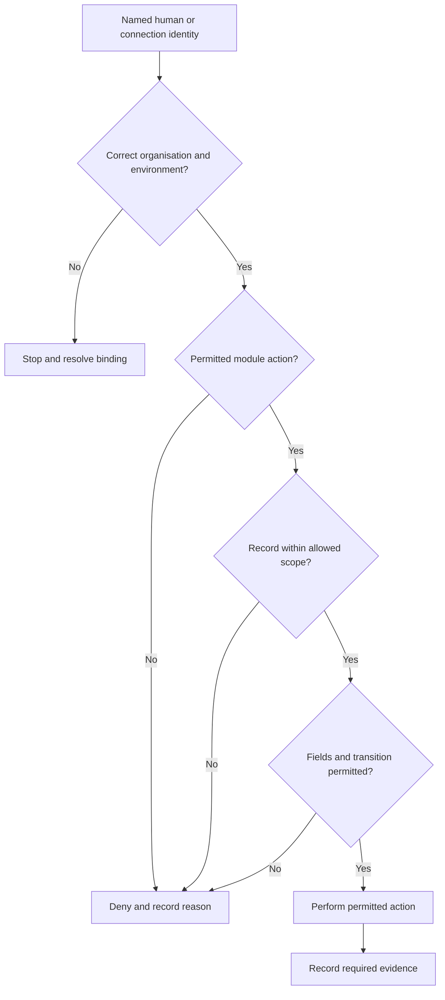

# Access, Identity and Environments

## 1. What you will learn

A sound architecture can still fail if the wrong person can change a record, a connection acts with excessive authority, or a demonstration sends information outside its intended environment.

Access design answers three related questions:

1. Who or what is acting?
2. What information and actions are permitted?
3. Where may the action occur?

You must answer all three. A suitable profile does not establish that a user should see every record. A sandbox label does not establish that its connections, data and notifications are ready for testing.

By the end of this chapter, you should be able to:

- Translate business responsibilities into an access matrix.
- Distinguish roles, profiles, record sharing and field permissions.
- Design human and connection identities with clear ownership.
- Protect sensitive information across relevant access paths.
- Define audit evidence without assuming every required event is automatically recorded.
- Plan test environments and identify readiness blockers.
- Review normal, denied-access and failure/recovery scenarios.
- Produce an access matrix and environment plan linked to requirements and tests.

Prerequisites and continuity

You need the ownership model and architecture decisions from Chapter 6.

| Carried-forward item | Current state |
| --- | --- |
| Application recommendation | CRM is conditionally recommended for the original bounded pilot |
| Inventory | Synthetic inventory states CRM Enterprise, EU hosting, production and sandbox organisations |
| Logical records | Business customer, job, appointment history and nonfinancial handoff events |
| Business authorities | Operations owns intake; Dispatch owns appointment coordination; Technician Lead supplies completion facts; Finance owns review outcomes |
| Public handoff projection | Job reference, nonfinancial status and Finance contact |
| Sensitive Finance reason | Kept in private synthetic Finance evidence, outside the shared operational pilot |
| Pilot limits | At most ten synthetic customers and twenty synthetic jobs |
| EVG-CHANGE-001 | Portal/routing deferred |
| EVG-CHANGE-002 | Reporting addition pending |
| EVG-CHANGE-003 | Multi-site/multi-visit request under analysis only |
| Product evidence | No executed tests, configured permissions or approved implementation |
| Support | Existing client support retains operational incidents; no new support service established |

The supplied edition and region resolve earlier inventory questions for this fictional scenario. They do not establish effective permissions or environment readiness.

Your project contribution

You will add:

1. An access matrix covering actions, records and sensitive information.
2. An identity and connection register.
3. An audit-evidence specification.
4. A non-production environment plan.
5. Readiness and access-check records.

All Evergreen people, rules, records and numbers are synthetic. Proposed labels are not created Zoho roles, profiles or modules. Expected results are paper-derived unless an actual observation is explicitly supplied. This chapter supplies no product observations.

## 2. Lessons

### 2.1 Separate business authority from technical access

Skill: translate responsibilities into permitted actions.

A person can need information without needing permission to change it.

Dispatch needs to know whether Finance has returned a handoff. That does not mean Dispatch should change Finance’s review outcome or read its sensitive explanation.

Start with business actions:

- Read intake information.
- Create a service request.
- Assign a technician.
- Supply completion details.
- Record Finance review.
- Correct a customer reference.
- Administer the pilot environment.

Then identify the conditions around each action.

“Technicians can edit jobs” is too broad. A more useful rule is:

Delegated technicians may supply completion date and summary for jobs currently assigned to them. They may not change the customer reference, appointment assignment or Finance outcome.

This rule identifies an actor, record boundary and information boundary.

Apply least privilege: grant the access needed for assigned work, with no unnecessary additional authority. Least privilege should still support ordinary work. If Dispatch must coordinate both service teams, limiting it to one team would be too restrictive.

Also distinguish approval from application access. The Sponsor can approve scope through a documented decision without receiving administrator access to CRM.

Sponsor: “I approve the pilot, so should I be an administrator?”  

Implementation Lead: “Your approval role is a business decision right. We should give you the application access needed for your participation. Scope authority does not require configuration authority.”

Lesson check LC1: Which permissions should a technician need to supply completion information, and which Evergreen authorities should remain elsewhere?

### 2.2 Combine profiles, roles, sharing and field controls

Skill: design access as several interacting layers.

In Zoho CRM, an administrator assigns each user a profile, which determines access permissions. The Profiles API can return details of module view, create, edit and delete permissions for a specific profile.1

A role represents a user’s position in the organisation’s role structure. The Roles API exposes role information, including its reporting relationship.2 Roles and hierarchy settings can affect record visibility; verify their actual effect in the client’s configuration.

A sharing arrangement makes specified records available to additional users, groups or roles. Sharing does not replace module permission. Zoho’s record-sharing documentation states that a receiving user must have access to the module; for user-to-user sharing, the recipient must also be confirmed and active.3

A field permission determines whether particular information can be viewed or changed. A user may need a job record while being prohibited from reading cost, margin or a sensitive Finance reason.

A useful reasoning model is:

Identity and environment

    + permitted module actions
    + permitted record set
    + permitted fields and transitions
    = intended effective access
This is a design aid, not a mathematical description of every Zoho permission interaction.

| Layer | Evergreen design question |
| --- | --- |
| Profile | Can Dispatch read jobs and create/update appointments? |
| Role and sharing | Can Dispatch coordinate jobs across both service teams? |
| Record restriction | Can a technician access only currently assigned work? |
| Field restriction | Can Dispatch see status/contact but not restricted Finance information? |
| Process control | Can only Finance record a review outcome? |
| Tool permission | Is export or direct record sharing needed for this activity? |

Profile-level edit permission does not prove that a technician can edit only the intended fields on only the intended records. The chosen configuration must enforce the complete rule.

Do not put Finance above Operations in a role hierarchy merely to make a handoff visible. Model the organisational structure and investigate the appropriate sharing arrangement.

The sharing API also has a share_related_records option.3 Review whether related information should cross the boundary. Enabling related-record sharing for convenience can broaden the information exposed.

Lesson check LC2: Why would sharing a job record with a user still fail to establish the intended access?

### 2.3 Inspect product evidence before declaring access correct

Skill: request the right evidence and understand its limits.

An authorised access review should inspect:

- Actual users and assigned profiles/roles.
- Specific profile permissions.
- Module availability.
- Relevant field permissions.
- Ownership, hierarchy and sharing arrangements.
- Tool permissions such as export and direct sharing.
- Representative user behaviour.

Official API routes can support inventory:

| Evidence | Documented API v8 route | Read scope | Expected evidence |
| --- | --- | --- | --- |
| Profile list | GET /settings/profiles | ZohoCRM.settings.profiles.READ | Profile names and IDs |
| Specific profile | GET /settings/profiles/{profile_ID} | Same profile READ scope | Detailed module permissions |
| Role structure | GET /settings/roles | ZohoCRM.settings.roles.READ | Role names and reporting relationships |
| Field metadata | GET /settings/fields?module={module_API_name} | ZohoCRM.settings.fields.READ | Field API names and relevant metadata |
| Organisation | GET /org | ZohoCRM.org.READ | Organisation ID, environment type and licence details |

The profile list does not provide the same permission detail as retrieving a specific profile.1 Field metadata is not a complete description of layout-specific requiredness. Hidden fields may still appear in the metadata response; that does not prove their record values are readable.4

Use actual module API names and product-generated IDs. EVG-ENV-S01, introduced later as an environment-plan identifier, is not a Zoho organisation ID.

After inventory, check behaviour under the intended identity. An administrator’s successful view cannot establish what Dispatch or a technician can do.

Relevant access paths may include record pages, search, reports, related records, exports and APIs. Check the paths enabled or used by the design. Do not assume hiding a field on a layout protects it through every channel.

Lesson check LC3: Why is an administrator’s successful record view insufficient evidence for a Dispatch access check?

### 2.4 Design connection identities as accountable actors

Skill: describe who a connection acts for and how its authority is limited.

A connection identity is the identity under which an automated or API action runs. It needs an owner, an environment, a purpose and a defined permission boundary.

An OAuth scope limits the resources and operations delegated to a client application.5 It does not replace the underlying user permissions. A broad scope is not evidence of appropriate business authority.

For a proposed Evergreen inventory connection, the purpose might be:

Retrieve approved organisation, role, profile, module and field metadata for the sandbox access review.

That purpose does not require business-record export or updates.

A connection register should state:

- Business and technical owner.
- Authorising identity.
- Target organisation and environment.
- Required scopes.
- Where secrets are managed.
- How access is reviewed and withdrawn.
- What happens if the authorising identity becomes unavailable.

Do not silently make a consultant’s personal account the permanent owner.

Zoho documents organisation-specific authorisation: a token generated for a production organisation cannot be used for sandbox organisations.6 Region also matters. CRM’s multi-data-centre documentation describes region-dependent authentication and API domains.7

A sandbox connection therefore needs the intended regional domain and organisation. The word “test” in its label proves neither.

Record secret references rather than tokens, refresh tokens or client-secret values. The project pack should explain ownership without becoming a credential store.

Lesson check LC4: Why is “the token works” insufficient evidence that a connection is suitable for the pilot?

### 2.5 Define sensitive-data and audit requirements precisely

Skill: specify protected information and evidence needed to explain changes.

Evergreen’s public projection is deliberately narrow. Dispatch sees nonfinancial status and Finance contact. It does not need the private reason.

A reference to a private note is not an access control. The note’s location needs its own permissions. An unrestricted attachment or link could defeat the intended boundary.

An audit need is a requirement to explain an action or change. Useful pilot evidence includes:

- Business record reference.
- Event type.
- Actor identity.
- UTC timestamp.
- Previous and new operational state.
- Source of confirmation or correction.
- Related decision or private-note reference.

Sensitive reason text should not be copied into a public audit record.

| Evidence mechanism | Appropriate use | Limit |
| --- | --- | --- |
| Product audit evidence | Investigate recorded administrative or user actions | Coverage and retention must be checked |
| Business event history | Explain rescheduling, return and correction | Does not automatically capture every technical action |
| Test evidence | Show a particular expected/observed behaviour | Does not prove continuous enforcement |
| Access decision record | Explain why access was granted or withdrawn | Does not itself enforce access |

Map each required event to an evidence source. Do not promise that one native log captures every event or retains it indefinitely.

Long-term retention remains unresolved. The pilot’s history demonstration is not a legal or accounting retention commitment.

Lesson check LC5: Which audit fields can explain a Finance return without disclosing its sensitive reason to Dispatch?

### 2.6 Establish environment readiness before exercising access

Skill: make non-production work identifiable, isolated and recoverable within stated limits.

A test environment is used to investigate or verify behaviour. A sandbox is not automatically ready.

Readiness includes:

- Correct organisation and environment.
- Appropriate authority.
- Permitted users and identities.
- Known configuration.
- Suitable data.
- Controlled outbound actions.
- Evidence capture.
- An authorised correction and cleanup method.

Synthetic data reduces exposure, but notification destinations still matter. An address under example.com is not proof that email, webhooks or scheduled actions are disabled.

Evergreen’s proposed plan uses recorded notification previews with no outbound delivery. The Administrator must establish how the selected configuration meets that condition.

Recovery is also bounded. Recreating a disposable synthetic dataset from a manifest does not demonstrate production restoration, atomic rollback or reversal of an external transaction.

Chapter 14 develops cutover and recovery. Here, identify what can be corrected or recreated, who owns the action and what the proposed method cannot recover.

Lesson check LC6: Why should notifications and connection bindings be checked even when every record is synthetic?

## 3. Visual explanation: how an action is authorised

The diagram shows the order of reasoning, not an exact Zoho permission algorithm.

A denied action may indicate correct enforcement. A wrong-environment binding is different: resolve the identity/environment relationship before considering the business action.

Evidence must identify the actor and environment. A result without that context may be impossible to interpret.

## 4. Worked case: design Evergreen’s access and environment pack

### 4.1 New synthetic inputs

| Source ID | Supplied information |
| --- | --- |
| EVG-SRC-067 | Sponsor authorises access, identity and environment-plan documents plus paper checks. No configuration, token creation, API calls or tenant inspection is authorised. |
| EVG-SRC-068 | Operations and Finance confirm the business access rules below. Technician Lead may delegate completion entry to assigned technicians while retaining accountability. |
| EVG-SRC-069 | Administrator manifest states CRM Enterprise, EU, production and sandbox. Actual organisation IDs, user/profile assignments and field-permission evidence are intentionally absent. |
| EVG-SRC-070 | Pilot proposal: synthetic data within existing limits; no outbound notifications or live financial connections. Client Administrator owns technical correction/cleanup. |
| EVG-SRC-071 | Required pilot history includes return/correction, appointment supersession, acknowledgement, access grant/withdrawal and connection-authorisation changes, with actor and UTC time. Retention and native event coverage are unconfirmed. |

### 4.2 Step 1: completed business access matrix

This is desired access, not configured access.

| Business actor | Record scope | Permitted read | Permitted change |
| --- | --- | --- | --- |
| Operations | All pilot customers/jobs | Intake, operational history and public handoff status | Create/correct intake; coordinate completion correction |
| Dispatcher | Both teams’ pilot jobs and appointments | Customer/job context, assignment and public status/contact | Schedule, reschedule and record supplied acknowledgement evidence |
| Assigned technician | Jobs currently assigned to that technician | Assigned job and appointment context | Supply completion date/summary and own acknowledgement evidence |
| Finance Lead | Qualified handoffs and necessary job context | Completion facts and private synthetic Finance evidence | Record Finance review/return and private reason |
| Client Administrator | Required configuration and technical evidence | Configuration/access evidence; operational content when needed for technical work | Authorised administration after implementation approval |
| Implementation Lead | Documents only at this stage | Supplied pack | Edit design documents |
| Sponsor | Decision documents; no CRM login required by this plan | Scope, findings and acceptance proposal | Record business decisions |

Delete, export and direct sharing are not proposed for routine pilot business users. Separate justification and approval are needed if those actions become necessary.

Administrative privilege may be broader than business-user privilege. The plan governs its use and evidence; it does not claim Finance restrictions automatically constrain every administrator.

### 4.3 Step 2: completed field and transition ownership

| Information/action | Operations | Dispatch | Assigned technician |
| --- | --- | --- | --- |
| Customer reference | Read/correct with evidence | Read | Read assigned context |
| Technician assignment | Read | Change | Read own assignment |
| Completion date/summary | Coordinate correction | Read operational facts | Supply/correct assigned work |
| Finance outcome | Read public status | Read public status | No access requested |
| Finance contact | Read | Read | No access needed |
| Private return reason | No | No | No |
| Cost/margin | No | No | No |
| Invoice release | No | No | No |

The design must distinguish module-level edit from field and transition authority. If configuration cannot enforce the combination, reopen the architecture recommendation instead of broadening access silently.

Record EVG-DEC-018: use this matrix as the proposed access reference and require role-specific proof.

Introduce EVG-REQ-013, verified from EVG-SRC-068:

Delegated technicians can supply completion information only for currently assigned jobs, without changing customer identity, assignment or Finance decisions.

This clarifies business access. It does not approve implementation or amend the SOW automatically.

### 4.4 Step 3: completed identity register

| Plan ID | Identity/purpose | Owner | Environment |
| --- | --- | --- | --- |
| EVG-ID-001 | Named business users | Relevant process owner | Proposed sandbox pilot |
| EVG-ID-002 | Client Administrator, admin@evergreen.example.com | Client Sponsor/Administrator | Administration boundary to be confirmed |
| EVG-ID-003 | Jordan Ellis, implementation@partner.example.com | Implementation Lead | Documents |
| EVG-CONN-001 | Future metadata inventory connection | Client Administrator | Intended sandbox, EU |

Proposed scopes for EVG-CONN-001 are:

- ZohoCRM.org.READ
- ZohoCRM.settings.profiles.READ
- ZohoCRM.settings.roles.READ
- ZohoCRM.settings.modules.READ
- ZohoCRM.settings.fields.READ

Underlying permissions must also be appropriate. No business-record read/write scope is proposed.

EVG-NFR-004 — proposed identity/environment requirement:

A pilot connection targets the intended organisation and region, uses only justified delegated permissions, and keeps credentials out of the project evidence pack.

Record EVG-DEC-019: keep the connection dormant until authorised and bind any later authorisation to the intended sandbox organisation.

### 4.5 Step 4: audit specification

EVG-NFR-003 — proposed audit requirement:

Required business and access events identify the affected record or configuration, actor, UTC time and relevant change, without exposing restricted Finance text through public evidence.

| Event | Required evidence | Proposed location |
| --- | --- | --- |
| Finance return/correction | Job, actor, time, state, correction source and private-note reference | Business history plus private Finance evidence |
| Appointment supersession | Job, old/replacement appointment, actor and time | Appointment/event history |
| Acknowledgement | Appointment, identity, time and source | Appointment/event history |
| Access grant/withdrawal | Identity, changed access, approver, administrator and time | Restricted decision/evidence pack |
| Connection change | Connection, organisation, scopes, owner and time | Restricted connection register |

This specification does not claim a native log already captures these events.

### 4.6 Step 5: environment plan and readiness

EVG-ENV-P01 and EVG-ENV-S01 are plan identifiers, not Zoho organisation IDs.

| Environment | Intended use | Data/actions | Owner |
| --- | --- | --- | --- |
| EVG-ENV-P01: production | Existing client operations | No chapter actions permitted | Administrator and existing support |
| EVG-ENV-S01: sandbox | Proposed future pilot | Bounded synthetic data; no live invoices or outbound delivery | Administrator |
| Document workspace | Current design/paper checks | Supplied synthetic artifacts | Implementation Lead |
| Gate | Evidence supplied |  |  |
| Correct organisation | Types supplied; actual IDs missing |  |  |
| Implementation authority | Documents only |  |  |
| Product/access fit | Edition supplied; mappings/permissions missing |  |  |
| Users and connection | Proposed identities only |  |  |
| Data manifest | Boundaries known; final manifest pending |  |  |
| Outbound isolation | Required, not evidenced |  |  |
| Audit capture | Needs specified; coverage unknown |  |  |
| Correction/cleanup | Owner named; method not demonstrated |  |  |

Record EVG-DEC-020: proceed with documents; do not declare the sandbox ready for product testing.

A mistake and its correction

Mistake: Give the Implementation Lead an Administrator profile so every test succeeds.

Correction: Separate configuration authority from representative business access. Test with the intended actor, records and fields. Supplier technical access requires a later authorised decision.

## 5. Try it yourself — guided practice

Learning goal and access

Complete paper access decisions and refine the environment plan.

Use an editor and the supplied matrix. No Zoho access is needed. This demonstrates reasoning, not permission enforcement.

Complete inputs

EVG-SRC-072 supplies these records.

| Job | Customer | Current technician | State |
| --- | --- | --- | --- |
| EVG-JOB-1701 | EVG-CUST-0101 | T1 | Work in progress |
| EVG-JOB-1702 | EVG-CUST-0102 | T2 | Work in progress |
| EVG-JOB-1703 | EVG-CUST-0103 | T1 | Service completed; handoff Returned |

T1 is technician.t1@evergreen.example.com. T2 is technician.t2@evergreen.example.com.

For EVG-JOB-1703, public information is Returned and finance@evergreen.example.com. Private note EVG-FIN-NOTE-002 says “Margin adjustment requires Finance review.”

| Request | Actor and action |
| --- | --- |
| A | T1 supplies completion summary for EVG-JOB-1701 |
| B | T1 opens EVG-JOB-1702 |
| C | Dispatcher reads EVG-JOB-1703 public status/contact |
| D | Dispatcher reads EVG-FIN-NOTE-002 |
| E | Operations changes EVG-JOB-1703 Finance outcome to Review complete |
| F | Finance records review outcome for EVG-JOB-1703 |
| G | Implementation Lead creates a token to inspect sandbox |

A connection proposal labelled “Pilot Inventory” selects production and requests ZohoCRM.modules.ALL.

Guided steps and expected intermediate results

1. Evaluate A–G.  

Expected result: separate permitted business actions from denied actions and current execution authority.

2. Construct the public projection.  

Expected result: status/contact only; private reason excluded.

3. Review the connection.  

Expected result: identify wrong organisation, excessive scope and missing authorisation.

4. Write an evidence request to the Administrator.  

Expected result: request organisation IDs, specific profile details and applicable sharing/field evidence through an authorised route.

5. Update traceability.  

Expected result: link technician scope, connection binding and audit capture to planned checks.

Blank access worksheet

| Actor | Action | Record scope | Permitted fields | Decision |
| --- | --- | --- | --- | --- |
|  |  |  |  |  |
|  |  |  |  |  |
|  |  |  |  |  |

Blank identity and environment worksheet

| Plan ID | Purpose | Owner/identity | Organisation/environment | Permissions/scopes |
| --- | --- | --- | --- | --- |
|  |  |  |  |  |
|  |  |  |  |  |

Final artifact: Access and Environment Pack v0.2 with decisions, projection and readiness gaps.

Cleanup: separate private inputs from public artifacts. Remove accidental private-reason copies from public worksheets. No tenant changes or token cleanup should be necessary.

## 6. Independent challenge

Changed inputs

EVG-SRC-073 supplies a temporary-access request:

| Condition | Supplied rule |
| --- | --- |
| Request | Dispatcher Tessa Reed needs completion-entry access to EVG-JOB-1702 because T2 is unavailable |
| Decision authority | Operations may approve this narrow delegation; it cannot change Finance disclosure |
| Time boundary | 24 January 2027, from 13:00 UTC until before 16:00 UTC |
| Allowed change | Completion date and summary for EVG-JOB-1702 only |
| Unchanged restrictions | No customer-reference, assignment or Finance-outcome edits; no private reason |
| Technical owner | Client Administrator |
| Current authority | Plan the delegation only; no configuration grant authorised |

Evaluate these attempts:

1. Tessa supplies EVG-JOB-1702’s completion summary at 15:59 UTC.
2. Tessa supplies it at 16:00 UTC.
3. Tessa changes the customer reference at 14:00 UTC.
4. Tessa reads EVG-FIN-NOTE-002 at 14:00 UTC.

EVG-SRC-074 supplies a connection-recovery scenario:

For a future authorised simulation, assume EVG-CONN-001 stops authenticating after its authorising employee’s access is withdrawn. The connection’s registration references the production organisation. There is no evidence of a record write. Available choices are to keep the action pending, request Administrator-owned sandbox authorisation with the justified READ scopes, or request a separately approved operator-provided metadata extract. Shared credentials and production fallback are not permitted.

No actual connection failure or recovery result is observed.

Deliverables

Produce:

1. A time-, record- and field-bounded delegation record.
2. Expected decisions for the four attempts.
3. A proposed enforcement and withdrawal plan.
4. A connection-recovery recommendation.
5. Updated audit and test links.
6. A readiness recommendation.

Success criteria

Your work must preserve Finance restrictions, deny the exact expiry-time attempt, avoid a broad permanent profile change and distinguish a business-approved rule from configured enforcement.

If the required combination cannot be demonstrated technically, propose an authorised alternative rather than claiming the grant is safe.

## 7. Common problems and recovery

| Symptom | Diagnosis | Correction |
| --- | --- | --- |
| A technician can change assignment | Edit authority is too broad | Restrict intended fields/actions; reassess design if necessary |
| Dispatch cannot coordinate both teams | Sharing scope is too narrow | Investigate role/sharing design without exposing Finance details |
| Private reason appears in a report | Only one interface was checked | Remove disclosure through the affected path and examine other enabled paths |
| “Test” connection targets production | Label mistaken for environment binding | Stop, verify organisation, and use separately authorised sandbox binding |
| Token has scope but request is denied | Underlying permission or another condition is missing | Inspect authorised identity and documented endpoint conditions |
| Temporary access remains after expiry | Withdrawal/enforcement not established | Remove the grant through the technical owner and retain evidence |
| Audit event lacks actor/time | History cannot explain responsibility | Correct the capture design; do not invent missing past facts |
| Authorising user becomes unavailable | Connection ownership is fragile | Keep action pending and arrange authorised replacement or extract |

A changed view is not proof that an already downloaded copy disappeared. If an actual exposure occurs, identify the recipients and route handling through the client’s responsible owner.

Recovery limits are explicit: a replacement authorisation restores permitted access only after verification. It does not undo earlier transactions, restore configuration or establish production recovery.

## 8. Check your understanding

1. What is the difference between a profile and a record-sharing arrangement?
2. Why should an access matrix include allowed records and fields, not just module actions?
3. What does a production-specific token imply for sandbox access?
4. Why is a private-note reference insufficient protection?
5. What evidence identifies a connection’s accountable owner?
6. Why does a sandbox containing synthetic records still need outbound-action checks?
7. What must be recorded when an audit event was not captured?
8. Why should a temporary completion-entry grant not be implemented as unrestricted permanent edit access?

## 9. Solutions and explanations

### 9.1 Lesson checks

LC1: A technician needs assigned-job context and permission to supply completion date/summary and their acknowledgement evidence. Customer identity remains with Operations, assignment with Dispatch, and Finance decisions with Finance.

LC2: Sharing does not establish module permission, field authority or process authority. Related records may also require separate consideration.

LC3: Administrator access may be broader than Dispatch access. Evidence must use the intended identity and configuration.

LC4: A working token could target production, use excessive scopes or belong to an unsuitable owner. Purpose, organisation, region and underlying permissions also matter.

LC5: Job reference, return event, Finance actor, UTC time, nonfinancial state and restricted-note reference can explain the event. The sensitive reason remains private.

LC6: A notification can reach an unintended recipient and a connection can target an unintended organisation regardless of data quality.

### 9.2 Guided practice solution

These are expected business-access decisions. Current authority still permits documents only.

| Request | Expected decision | Explanation |
| --- | --- | --- |
| A | Permit under proposed business rules | T1 supplies completion information for assigned work |
| B | Deny | EVG-JOB-1702 is assigned to T2 |
| C | Permit | Public status/contact meet coordination needs |
| D | Deny | Private Finance reason is outside Dispatch access |
| E | Deny | Operations cannot decide Finance outcome |
| F | Permit under proposed rules | Finance owns the review decision |
| G | Deny under current authority | No token creation or tenant inspection authorised |

Completed public projection

| Job reference | Handoff status | Finance contact |
| --- | --- | --- |
| EVG-JOB-1703 | Returned | finance@evergreen.example.com |

The private reason is excluded.

Connection correction

Keep EVG-CONN-001 proposed and dormant. Before authorisation:

- Replace production with the verified sandbox organisation.
- Use the justified metadata READ scopes.
- Confirm the authorising identity and technical owner.
- Establish regional domain and organisation evidence.
- Record secret ownership without secret values.

A suitable Administrator request is:

Please provide an authorised inventory identifying the production and intended sandbox organisation IDs, named user/profile/role assignments, specific profile permission details and applicable field/sharing configuration. The current work is document-only; please identify any evidence that requires additional authority rather than granting access automatically.

Planned traceability

| Test ID | Requirement links | Planned input and expected result |
| --- | --- | --- |
| EVG-TEST-015 | EVG-REQ-013 | T1 with jobs 1701/1702: assigned completion allowed, unassigned access denied |
| EVG-TEST-016 | EVG-NFR-004 | Inspect organisation, authorising identity and scope manifest: sandbox and justified READ authority required |
| EVG-TEST-017 | EVG-NFR-003 / EVG-NFR-002 | Exercise required events: actor/time/history retained without public sensitive reason |
| EVG-TEST-010 and 012 | EVG-NFR-001 / EVG-REQ-008 | Dispatch view and enabled access paths: restricted Finance content unavailable |

No defect is opened from these expected results.

### 9.3 Independent challenge solution

Completed delegation record

Proposed grant EVG-GRANT-001

| Field | Proposed content |
| --- | --- |
| Recipient | Tessa Reed, dispatch@evergreen.example.com |
| Approver | Operations Manager |
| Technical owner | Client Administrator |
| Record | EVG-JOB-1702 only |
| Allowed fields | Completion date and summary |
| Start | 24 January 2027, 13:00 UTC |
| End | 24 January 2027, 16:00 UTC, exclusive |
| Unchanged restrictions | Customer identity, assignment, Finance outcome and private reason |
| Evidence | Approval, implementing actor/time, effective start/end, withdrawal evidence |
| Status | Proposed; not configured |

The interval is:

> 13{:}00 ≤ action time < 16{:}00

It covers three hours, but not the instant 16:00.

| Attempt | Expected decision | Reason |
| --- | --- | --- |
| Summary at 15:59 | Permit under the bounded rule | Correct record/field and within interval |
| Summary at 16:00 | Deny | End is exclusive |
| Customer change at 14:00 | Deny | Field not included |
| Private reason at 14:00 | Deny | Finance restriction unchanged |

Enforcement and withdrawal

First establish whether the chosen configuration can enforce this exact record, field and time combination. Test it before using the proposed grant.

A planned manual withdrawal alone does not prove exact expiry enforcement. If a missed withdrawal could allow access after 16:00, the design has not met the stated condition.

An acceptable alternative is an authorised operator entering the supplied completion information. Record the operator as the action’s actor and Tessa as the information source. Do not falsely attribute the application action to Tessa.

Introduce EVG-NFR-005, proposed:

Temporary access is limited to its stated identity, record, fields and exclusive expiry time, with grant and withdrawal evidence.

Add EVG-TEST-018 for the four attempts above, linked to EVG-NFR-005 and EVG-REQ-007. It remains planned.

Connection recovery

Keep the metadata action pending. Do not attempt production fallback or shared credentials.

The preferred recovery proposal is Administrator-owned authorisation for the verified sandbox with the justified READ scopes. A separately approved metadata extract is also valid if direct retrieval is unnecessary.

Record:

- Why the old identity is no longer usable.
- The intended organisation and region.
- Replacement authority or approved extract owner.
- Scope/purpose review.
- Verification evidence once available.

Do not claim old tokens have been revoked or replacement retrieval succeeded unless those observations are supplied.

The environment remains not ready for execution. Document work may continue.

### 9.4 Understanding check answers

1. A profile concerns permitted actions; sharing concerns access to specified records. Field and process restrictions remain separate considerations.
2. Module edit can be broader than the intended business permission. Record and information boundaries prevent unintended access.
3. Zoho documents organisation-specific authorisation; production authorisation cannot be reused for sandbox organisations.
4. The referenced location may still be accessible. Its permissions and access paths need their own controls.
5. A register naming technical owner, authorising identity, purpose, organisation, scopes and lifecycle responsibility.
6. Outbound actions and environment bindings can have consequences independent of whether records are synthetic.
7. Record the evidence gap and its effect. Do not reconstruct a historical actor/time as fact without supporting evidence.
8. It exceeds the record, information and duration needed, and can leave persistent authority after the business need ends.

## 10. Chapter recap and next step

Access design turns responsibility into a checkable permission model. It connects actors, actions, records, information and environments.

A reliable environment plan also explains what evidence is missing, how outbound actions are controlled and who owns correction, identity changes and cleanup.

Completion checklist

- I can distinguish profiles, roles, sharing and field controls.
- I can define permitted records and actions for each business actor.
- I can separate administrator privilege from business authority.
- I can design an accountable, environment-bound connection identity.
- I can keep restricted information out of public projections.
- I can specify audit needs without inventing event coverage.
- I can identify environment-readiness blockers.
- I can design and check a temporary access boundary.
- I can distinguish expected access results from actual observations.

Your project pack now contains an access matrix, identity register, audit specification and environment plan.

Chapter 8, Data Migration Strategy, uses these boundaries to assess sources, define cleansing ownership, map identifiers, plan import order and reconcile trial results. Environment and permission readiness will be explicit migration dependencies.

## 11. Glossary and further reading

Glossary

| Term | Meaning |
| --- | --- |
| Audit evidence | Information identifying an event, actor, time and relevant change |
| Connection identity | Identity under which an automated or API action runs |
| Effective access | Actions and information actually available under the combined configuration |
| Environment readiness | Evidence that the intended activity can proceed in the identified environment |
| Exclusive expiry | End time at which permission no longer applies |
| Field permission | Rule controlling access to particular information |
| Least privilege | Granting the authority needed for assigned work without unnecessary access |
| OAuth scope | Delegated resource/operation boundary for a client application |
| Profile | Application permission set assigned to a user |
| Role | Position in the application’s organisational role structure |
| Sharing | Additional access to specified records |
| Test environment | Identified environment used to investigate or verify behaviour |

Further reading

1. Zoho CRM API v8 — Get Profiles  
[Open official reference](https://www.zoho.com/crm/developer/docs/api/v8/get-profiles.html)

Profile retrieval and specific-profile permission details.

2. Zoho CRM API v8 — Get Roles  
[Open official reference](https://www.zoho.com/crm/developer/docs/api/v8/get-roles.html)

Role metadata, including reporting relationships.

3. Zoho CRM API v8 — Share Records  
[Open official reference](https://www.zoho.com/crm/developer/docs/api/v8/share-record.html)

Sharing conditions, module access and related-record sharing options.

4. Zoho CRM API v8 — Fields Metadata  
[Open official reference](https://www.zoho.com/crm/developer/docs/api/v8/field-meta.html)

Field metadata and limits of layout-specific or hidden-field evidence.

5. Zoho CRM API v8 — Scopes  
[Open official reference](https://www.zoho.com/crm/developer/docs/api/v8/scopes.html)

Delegated resource and operation boundaries.

6. Zoho CRM API v8 — Authorization Request  
[Open official reference](https://www.zoho.com/crm/developer/docs/api/v8/auth-request.html)

Organisation-specific authorisation across production, sandbox and developer environments.

7. Zoho CRM API v8 — Multi DC Support  
[Open official reference](https://www.zoho.com/crm/developer/docs/api/v8/multi-dc.html)

Region-dependent authentication and API domains.

8. Zoho CRM API v8 — Get Organization Details  
[Open official reference](https://www.zoho.com/crm/developer/docs/api/v8/get-org-data.html)

Organisation, environment and licence metadata.

Consult the official references above for current product details. Research is partially verified: the cited product statements are documentation-based. Evergreen’s effective permissions, audit coverage, temporary-access mechanism and runtime environment behaviour remain unverified. No API or product execution is claimed.
