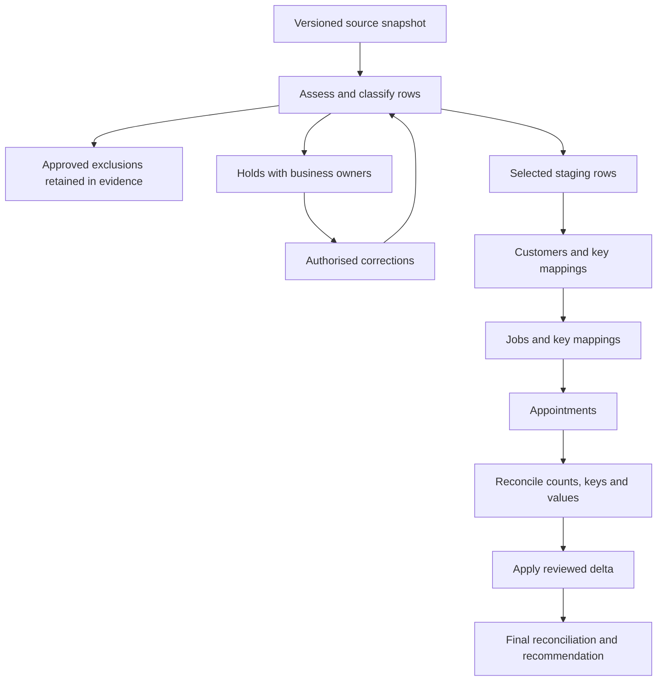

# Data Migration Strategy


## 1. What you will learn

Data migration is a controlled transfer of business information into a new structure or environment. It includes deciding what belongs in the transfer, correcting problems, preserving identifiers and relationships, accounting for exceptions and proving that the result is complete enough for its intended use.

An import tool can accept records while the migration remains wrong. A job may point to the wrong customer, a reschedule may lose its history, or a retry may create a duplicate.

By the end of this chapter, you should be able to:

- Assess a source dataset and define its migration boundary.
- Assign cleansing decisions to the correct business owners.
- Build a mapping workbook that distinguishes business fields from product API names.
- Preserve business identifiers and resolve parent relationships.
- Plan import order and trial migrations.
- Separate source exclusions, held records, target rejections and accepted records.
- Handle corrections, retries and changes since the source snapshot.
- Reconcile counts, keys, relationships and important field values.
- Explain what a rehearsal demonstrates and what remains unverified.

Prerequisites and continuity

You need the architecture from Chapter 6 and the access/environment plan from Chapter 7.


| Carried-forward item | State entering this chapter |
| --- | --- |
| Proposed pilot | Non-production, with at most ten synthetic customers and twenty synthetic jobs |
| Production migration | Excluded from the proposed pilot SOW |
| Architecture | CRM recommended conditionally; exact object mapping remains unverified |
| Environment | Enterprise and EU supplied; production/sandbox exist, but actual organisation IDs and readiness evidence are missing |
| Access | Business responsibilities defined; no configuration, tokens, API calls or tenant inspection authorised |
| EVG-CONN-001 | Proposed metadata READ connection; not created |
| Sensitive Finance information | Outside the shared operational pilot |
| Long-term retention | Unresolved |
| EVG-CHANGE-001–003 | Portal/routing deferred; reporting pending; multi-site request under analysis |
| EVG-TEST-001–018 | Planned checks; no product execution |
| EVG-DEFECT-001 | Reserved; no observed product failure |

This chapter supplies authority for migration planning and a paper rehearsal. It does not expand the pilot SOW into production migration.

Your project contribution

You will produce:

1. A source-assessment sheet.
2. A migration mapping workbook.
3. A cleansing and exception register.
4. An import-order plan.
5. Rehearsal reconciliation evidence.
6. A delta-change and recovery recommendation.

All Evergreen records, quantities, rules and outcomes are synthetic. A paper rehearsal applies supplied rules to a document-based target ledger. It cannot demonstrate actual Zoho permissions, automation, import performance or recovery.


## 2. Lessons


### 2.1 Assess the source before choosing an import method

Skill: establish what exists, what should move and what could prevent transfer.

A source assessment describes the datasets available for migration. It should establish:

- Source owner and permitted access.
- Extraction time and selection rule.
- Record counts.
- Business identifiers.
- Duplicate and missing-data conditions.
- Relationships to other datasets.
- Sensitive information.
- Proposed treatment.

Do not begin with “Which button imports CSV?” Start with “What business information is represented, and who can confirm it?”

An extract is a copy of source information at a stated point. A snapshot is the state represented by that extract. A staging dataset is the working copy used for validation and transformation.

Keep the original extract unchanged. Correct the staging copy with a record of the original value, new value, source and owner.

For example:

Operations Manager: “These two customer rows are the same customer.”  

Implementation Lead: “Which reference should remain, and which name is authoritative?”  

Operations Manager: “Keep EVG-CUST-0101 and the name from row C01.”  

Implementation Lead: “I will record C03 as a duplicate exclusion rather than delete its source evidence.”

The decision is explicit. You have not silently chosen a preferred spelling.

A source file may include records that should not move. Excluding a duplicate is different from failing to migrate a valid customer. Keep both visible in reconciliation.

Lesson check LC1: Why must the original extract remain unchanged even after the client confirms a correction?


### 2.2 Assign cleansing ownership and do not manufacture missing facts

Skill: separate technical transformation from business correction.

Cleansing identifies and resolves data problems. Some changes are deterministic:

- Trim permitted surrounding whitespace.
- Convert a supplied timestamp into an agreed format.
- Map a confirmed source state to a target state.

Other changes require business authority:

- Decide which customer owns a job.
- Choose between conflicting customer names.
- Supply a missing completion summary.
- Confirm a cancellation requester.
- Decide whether a historical record belongs in scope.

The Implementation Lead can detect a missing customer reference. Operations must confirm the correct relationship. A matching name or email is evidence to investigate, not permission to merge.

Use a cleansing register:


| Element | Purpose |
| --- | --- |
| Source row and business key | Identify the affected information |
| Problem | Explain why it cannot proceed |
| Owner | Identify who can supply or decide the correction |
| Permitted treatment | Correct, hold, exclude or escalate |
| Evidence | Record the supplied authority |
| Status | Distinguish pending from resolved |

A hold means the record has not yet met the conditions for selection or transfer. It is not a licence to invent a placeholder customer.

Migration also preserves controls. A completed job must not become an automatically released invoice. Sensitive Finance reasons must not appear in a shared operational dataset because they happened to be in a source file.

Lesson check LC2: Who should decide the correct customer for a job with an unresolved reference, and what should happen meanwhile?


### 2.3 Map fields, identifiers and relationships

Skill: describe how each selected value reaches its target meaning.

A mapping connects a source value to a target field or relationship.

A useful mapping states:

1. Source field.
2. Target business meaning.
3. Transformation.
4. Requiredness.
5. Validation.
6. Owner.
7. Product mapping still needed.

A business field such as job_ref is not automatically a Zoho field API name. Zoho’s API documentation requires actual field API names; field metadata helps identify those names and data types.1

Keep three identifier types distinct:


| Identifier | Example | Meaning |
| --- | --- | --- |
| Source row identifier | J04 | Row in an extract |
| Business identifier | EVG-JOB-1804 | Job reference used across business work |
| Product-generated identifier | Not allocated in this chapter | Identifier needed for a particular product record |

A source row identifier can change between extracts. It is unsuitable as the sole long-term business key.

Relationships need more than importing text. In a later CRM API implementation, a lookup uses the target record’s product-generated ID.2 Therefore, the loader needs a mapping from business customer reference to the accepted target customer.

Do not fabricate those IDs. In this paper exercise, relationships are checked by business key. The real crosswalk remains a prerequisite for product execution.

Choose duplicate matching carefully. CRM upsert inserts or updates based on duplicate-check fields, including supported system-defined fields and user-defined unique fields.1 A default match on name is not automatically the correct business identity.

The intended key and all applicable uniqueness rules must be assessed. Do not assume that listing job_ref in a spreadsheet has configured it as a unique product field.

Lesson check LC3: Why is a customer reference in a job row insufficient to construct a real API lookup?


### 2.4 Plan import order and trial migrations

Skill: establish dependencies before submitting records.

Parent records usually need to exist before dependent records can reference them.

For Evergreen’s bounded exercise:

1. Validate customer records.
2. Establish customer-key mappings.
3. Transfer eligible jobs.
4. Establish job-key mappings.
5. Transfer eligible appointments.
6. Verify relationships and retained evidence.

Appointment transfer also depends on resolving technician identities. A business label such as T1 is not a product user ID.

A trial migration is a controlled rehearsal of the transfer method. It should use a known dataset, mapping version, target state and expected reconciliation.

Before a real trial, establish:

- Target organisation and authority.
- Selected modules and layouts.
- Field mappings and unique-key behaviour.
- Import identity and permissions.
- Relevant validation.
- Automation and outbound-action treatment.
- Evidence collection and permitted cleanup.

Zoho’s Insert and Upsert APIs document record-level responses and partial success.1 A successful request or accepted subset is not proof that every submitted record loaded.

The documentation also describes automation-related controls. Do not infer that one setting disables every possible feature or outbound effect. Check the selected method and configured features specifically.

Lesson check LC4: Why should appointments remain held when their jobs have not been accepted?


### 2.5 Reconcile transfer results and recover deliberately

Skill: account for every source record without double-counting retries.

Reconciliation compares expected and resulting information.

At source assessment:


> Source rows = selected rows + held rows + approved exclusions

For a completed submission attempt:


> Submitted rows = accepted rows + rejected rows

If a submission outcome is unknown, keep it in an unresolved outcome category until verified. Do not call it rejected and retry blindly.

After retries:


> Final distinct target records ≠ total successful attempts

An update or replay can succeed without creating another record.

Reconcile more than counts:

- Expected business-key set.
- Parent relationships.
- State mapping.
- Dates and timestamps.
- Completion information.
- Cancellation and appointment history.
- Restricted-information boundaries.

Two datasets can have equal counts but different customers attached to their jobs.

Recovery should target the problem. Correct a rejected mapping and retry that identified record. Do not reload the entire dataset into a nonempty target without understanding matching and side effects.

Lesson check LC5: Why can nine submission attempts result in only eight distinct target records?


### 2.6 Handle delta changes and conflicts

Skill: account for changes after the original extract.

A delta contains additions or changes since a stated snapshot.

A delta plan needs:

- Snapshot cutoff.
- Change-window boundaries.
- Stable keys.
- Selection method.
- Create/update/no-change treatment.
- Conflict rule.
- Related-record sequencing.
- Reconciliation.

Timestamp windows alone may be insufficient if timestamps have limited precision or source updates can arrive late. A production design needs a repeatable extraction and overlap/deduplication strategy. This chapter supplies a complete delta manifest rather than inventing an extraction procedure.

A conflict occurs when applying the source change could overwrite a different target change. Do not resolve it through “latest wins” unless that rule has been approved for the affected information.

Upsert can update an existing record. That does not make arbitrary replay safe: it may overwrite information or execute configured behaviour.1

For an unchanged replay, a migration controller can detect equality and skip the write. That is a proposed controller rule, not a universal Zoho guarantee.

Lesson check LC6: Why should a source cancellation be reviewed when the target customer relationship has changed since the snapshot?


## 3. Visual explanation: controlled migration flow




The diagram separates selection from loading. A held source row has not disappeared; it remains assigned to an owner.

Corrections return to validation. Parent acceptance supports child transfer. Final reconciliation includes both the original snapshot and the reviewed delta.

This is a logical flow, not a deployed import process.


## 4. Worked case: build Evergreen’s migration workbook


### 4.1 Authority and scenario rules


| Source ID | Synthetic input |
| --- | --- |
| EVG-SRC-075 | Sponsor authorises a migration workbook and document-based rehearsal using supplied synthetic records. No source-system export, target writes or production migration is authorised. |
| EVG-SRC-076 | Operations and Finance supply selection, correction and relationship rules below. Sensitive Finance data remains excluded. |
| EVG-SRC-077 | Snapshot datasets below, representing 24 January 2027 at 12:00 UTC |
| EVG-SRC-078 | Paper target-validator rules and mapping-version issue described below |

Apply these rules:

- Preserve business references as text.
- C01 is authoritative for EVG-CUST-0101. C03 is an approved duplicate exclusion.
- A customer requires reference and business name.
- A job requires reference, accepted customer reference and received timestamp.
- A completed job requires completion date and summary.
- A cancelled job requires the supplied cancellation evidence.
- An appointment requires an accepted job, recognised technician label, start/end and state.
- T1 and T2 are recognised paper identities; their real product IDs remain unallocated.
- Confirmed appointments require customer and technician acknowledgement evidence.
- Completed appointments retain supplied acknowledgement and actual-start evidence.
- No relationship is inferred from a similar name.

### 4.2 Complete source datasets

Customers


```csv
source_row,customer_ref,business_name,contact_email
C01,EVG-CUST-0101,North Depot Ltd,customer0101@evergreen.example.com
C02,EVG-CUST-0102,South Yard Ltd,customer0102@evergreen.example.com
C03,EVG-CUST-0101,North Depot Limited,customer0101@evergreen.example.com
C04,,Unidentified caller,
C05,EVG-CUST-0103,Greenway Services,customer0103@evergreen.example.com
```

Jobs


```csv
source_row,job_ref,customer_ref,received_at,job_state,completion_date,completion_summary
J01,EVG-JOB-1801,EVG-CUST-0101,2027-01-24T08:00:00Z,Scheduled,,
J02,EVG-JOB-1802,EVG-CUST-0102,2027-01-24T08:10:00Z,Completed,2027-01-24,Reset controller and tested startup
J03,EVG-JOB-1803,EVG-CUST-0103,2027-01-24T08:20:00Z,Completed,2027-01-24,
J04,EVG-JOB-1804,EVG-CUST-0999,2027-01-24T08:30:00Z,Scheduled,,
J05,EVG-JOB-1805,EVG-CUST-0101,,Scheduled,,
J06,EVG-JOB-1806,EVG-CUST-0103,2027-01-24T08:40:00Z,Cancelled,,
J06 has verified pre-start cancellation evidence: requester customer0103@evergreen.example.com, reason “Customer unavailable,” time 24 January at 09:00 UTC. No appointment existed and no financial record is supplied.
```

Appointments


```csv
source_row,appointment_ref,job_ref,technician_ref,scheduled_start,scheduled_end,appointment_state,customer_confirmed_at,technician_ack_at,actual_started_at
A01,EVG-APPT-7001,EVG-JOB-1801,T1,2027-01-25T09:00:00Z,2027-01-25T10:00:00Z,Confirmed,2027-01-24T09:00:00Z,2027-01-24T09:05:00Z,
A02,EVG-APPT-7002,EVG-JOB-1804,T2,2027-01-25T11:00:00Z,2027-01-25T12:00:00Z,Pending acknowledgement,2027-01-24T10:00:00Z,,
A03,EVG-APPT-7003,EVG-JOB-1802,T2,2027-01-24T10:00:00Z,2027-01-24T11:00:00Z,Completed,2027-01-24T09:00:00Z,2027-01-24T09:05:00Z,2027-01-24T10:00:00Z
Blank fields are intentional exception inputs, not omitted chapter content.
```


### 4.3 Step 1: completed assessment and selection


| Dataset | Source rows | Selected | Held | Excluded | Reason |
| --- | --- | --- | --- | --- | --- |
| Customers | 5 | 3 | 1 | 1 | C04 missing reference; C03 approved duplicate |
| Jobs | 6 | 3 | 3 | 0 | J03 missing summary; J04 unresolved customer; J05 missing received time |
| Appointments | 3 | 2 | 1 | 0 | A02 depends on held J04 |
| Total | 14 | 8 | 5 | 1 | Every row accounted for |


> 14=8+5+1

Expected intermediate result: eight eligible rows, five holds and one approved exclusion.


### 4.4 Step 2: completed mapping workbook

These are logical mappings. Actual modules, API names, layouts and product IDs remain unresolved.


| Source | Target business meaning | Transformation/validation | Owner |
| --- | --- | --- | --- |
| Customer reference | Stable customer key | Preserve text; no duplicate selected key | Operations |
| Business name | Customer name | Use approved authoritative row | Operations |
| Contact email | Synthetic contact information | Preserve supplied value; no outbound use | Operations |
| Job reference | Stable job key | Preserve text; one selected row per key | Operations |
| Job customer reference | Customer relationship | Resolve only through accepted customer keys | Operations |
| Received timestamp | Intake receipt | Preserve supplied UTC instant; do not fabricate | Operations |
| Job state | Job lifecycle | Scheduled → Scheduled; Completed → Service completed; Cancelled → Cancelled | Operations |
| Completion date/summary | Completion facts | Required for completed jobs | Technician Lead |
| Cancellation evidence | Retained cancellation event | Preserve requester, reason and time | Operations |
| Appointment job reference | Job relationship | Resolve only after job acceptance | Dispatch |
| Technician label | Assigned identity | T1/T2 through approved identity map | Dispatch/Administrator |
| Appointment evidence | State, times and acknowledgements | Preserve values; no invented acknowledgement | Dispatch |

Record EVG-DEC-021: preserve the source snapshot, business keys and authorised correction history.


### 4.5 Step 3: completed exception register


| Exception ID | Row | Problem | Owner |
| --- | --- | --- | --- |
| EVG-MIG-EXC-001 | C04 | Customer reference missing | Operations |
| EVG-MIG-EXC-002 | J03 | Completion summary missing | Technician Lead |
| EVG-MIG-EXC-003 | J04 | EVG-CUST-0999 not in accepted customer set | Operations |
| EVG-MIG-EXC-004 | J05 | Received timestamp missing | Operations |
| EVG-MIG-EXC-005 | A02 | Parent J04 held | Dispatch/Implementation Lead |
| EVG-MIG-EXC-006 | J06 | Mapping M1 produces unsupported paper state | Implementation Lead |

C03’s exclusion is a recorded business decision, not an unresolved exception.


### 4.6 Step 4: paper trial and recovery

The paper target begins empty. It accepts the logical job states Scheduled, Service completed and Cancelled.

Mapping version M1 incorrectly maps source Cancelled to Closed. Therefore J06 is rejected by the supplied paper validator.

This is a simulated mapping issue, not a claim about Zoho picklist behaviour or an observed product defect.


| Entity | Submitted | Accepted |
| --- | --- | --- |
| Customers | 3 | 3 |
| Jobs | 3 | 2 |
| Appointments | 2 | 2 |
| Total | 8 | 7 |

A01 and A03 have accepted job parents. A02 remains held.

Correct mapping M2 to map Cancelled → Cancelled. Retry J06 only. The paper validator accepts it.


| Measure | Reconciled result |
| --- | --- |
| Submission attempts | 8 initial + 1 retry = 9 |
| Successful attempts | 7 initial + 1 retry = 8 |
| Final distinct target records | 3 customers + 3 jobs + 2 appointments = 8 |
| Outstanding source holds | 5 |
| Approved exclusion | 1 |


> 14=8 loaded+5 held+1 excluded

Initial submission acceptance:


> (7) ÷ (8)×100=87.5%

Coverage of non-excluded source rows after retry:


> (8) ÷ (14-1)×100≈61.54%

These are migration measures, not Evergreen’s Finance first-pass measure.

Record EVG-DEC-022: establish accepted parent keys before dependent transfer and reconcile each stage.


### 4.7 Completed trial recommendation

Artifact: Evergreen Migration Rehearsal R1 — paper result

Mapping M2 resolves the supplied state-mapping rejection. Eight distinct records are represented in the paper target. Five source holds remain, including one dependent appointment. The rehearsal is incomplete. Product execution also remains blocked by authority, organisation, mapping, identity and environment-readiness gaps.

The recommendation does not invent a client approval or describe the sandbox as ready.


## 5. Try it yourself — guided practice

Learning goal and access

Resolve supplied corrections, rerun affected paper stages and produce Rehearsal R2.

Use a spreadsheet or document editor. No source export or Zoho account is needed.

Additional complete inputs

EVG-SRC-079 supplies these authorised corrections:


| Row | Supplied correction |
| --- | --- |
| J03 | Technician Lead provides summary: “Replaced sensor and checked operation.” |
| J04 | Operations confirms intended customer is EVG-CUST-0102. Preserve original EVG-CUST-0999 in correction history. |
| J05 | Operations confirms received time: 2027-01-24T08:35:00Z |
| C04 | Still unresolved; no reference may be assigned |
| A02 | Source values unchanged; eligible once J04 is accepted |

For R2, use M2. All newly eligible records pass the supplied paper validator. The existing accepted records remain unchanged.

A proposed runner requests use of EVG-CONN-001 for target writes. That connection remains a proposed metadata READ identity; no execution authority exists.

Steps and expected intermediate results

1. Version the staging data.  

Expected result: original values preserved; three corrections have owners and sources.

2. Revalidate held jobs.  

Expected result: J03, J04 and J05 become eligible; C04 remains held.

3. Load corrected jobs before A02.  

Expected result: A02’s parent relationship becomes resolvable after J04 acceptance.

4. Reconcile the complete source.  

Expected result: distinguish new accepted rows from retries and existing rows.

5. Evaluate the runner permission.  

Expected result: reject reuse of metadata-only authority for writes and retain document-only status.

6. Produce the final artifact.  

Expected result: Migration Workbook v0.2 and Rehearsal R2, with remaining exceptions and readiness limits.

Blank assessment worksheet


| Dataset/version | Owner/access | Snapshot cutoff | Source count | Selected |
| --- | --- | --- | --- | --- |
|  |  |  |  |  |
|  |  |  |  |  |

Blank mapping and cleansing worksheet


| Row/field | Target meaning | Original value | Proposed value/rule | Validation |
| --- | --- | --- | --- | --- |
|  |  |  |  |  |
|  |  |  |  |  |

Blank reconciliation worksheet


| Stage | Opening target | Creates | Updates | Rejected/unknown | Closing target | Held/excluded source |
| --- | --- | --- | --- | --- | --- | --- |
|  |  |  |  |  |  |  |
|  |  |  |  |  |  |  |

Cleanup: retain the original snapshot, corrected staging version and trial evidence. Remove duplicate scratch copies. No target deletion or application cleanup is authorised.

The paper alternative demonstrates selection, mapping and reconciliation. It cannot demonstrate actual lookup resolution, permissions, automation or import-tool results.


## 6. Independent challenge

Continue from the guided R2 paper target.

Delta manifest

EVG-SRC-080 supplies a complete delta for changes after the original snapshot, through 25 January 2027 at 10:00 UTC.


| Delta row | Operation and complete relevant input |
| --- | --- |
| D01 | Create customer EVG-CUST-0104, business name “East Ridge Services,” contact customer0104@evergreen.example.com |
| D02 | Create EVG-JOB-1807 for EVG-CUST-0104; received 2027-01-25T09:10:00Z; state Scheduled; no appointment or completion information |
| D03 | Change EVG-JOB-1801 to Cancelled; verified requester customer0101@evergreen.example.com; reason “Customer unavailable”; event 2027-01-25T08:00:00Z; expected target revision 1 |
| D04 | Cancel EVG-APPT-7001 as part of D03; customer request and technician cancellation acknowledgement supplied at 08:00 and 08:05 UTC respectively |
| D05 | Retransmit EVG-JOB-1802 with exactly the same mapped values already accepted; no source change |

Additional paper-target facts and rules:

- The R2 ledger has three customers, six jobs and three appointments.
- An authorised local Operations correction changed EVG-JOB-1801’s customer to EVG-CUST-0103 and its paper revision to 2. Its job state is still Scheduled.
- EVG-APPT-7001 is still Confirmed at revision 1.
- D03 and D04 form one consistency group: hold both if either conflicts.
- No resolution of the customer conflict is supplied.
- D01 must precede D02.
- D05 is skipped without a write because mapped values are unchanged.
- All other valid selected delta rows pass the paper validator.
- C04 remains unresolved.
- No production or product execution is authorised.

Deliverables

Produce:

1. A delta-treatment register.
2. Revised paper target counts.
3. A conflict record and owner recommendation.
4. Final source and pending-change reconciliation.
5. Requirement-to-test links.
6. A recommendation explaining why counts alone are insufficient.

Success criteria

Preserve identifiers, keep the conflicting cancellation group unapplied, create the new customer before its job and avoid a duplicate for D05.

Distinguish held updates from missing new entities. Do not overwrite the local customer correction or claim that migration is complete.


## 7. Common problems and recovery


| Symptom | Diagnosis | Correction |
| --- | --- | --- |
| Counts match but jobs have wrong customers | Relationship validation omitted | Compare expected business-key relationships |
| Retry creates duplicates | Insert/replay behaviour not controlled | Establish key matching and inspect prior outcomes |
| Child records fail | Parents held or target IDs unavailable | Resolve parent acceptance and crosswalk first |
| Missing timestamp filled with current time | Business fact manufactured | Hold and request authorised evidence |
| Cancelled row omitted silently | Transformation lost a valid source state | Correct mapping and retry identified row |
| Metadata connection used for writes | Purpose and permission boundary exceeded | Request separate justified authority after readiness |
| Whole batch retried after uncertain response | Unknown outcomes treated as failures | Verify per-record outcomes before replay |
| Latest delta overwrites local correction | Conflict rule missing | Hold and route to business owner |
| Import accepted but emails were sent | Automation/isolation not verified | Stop affected activity and involve technical owner |
| Cleanup deletes unrelated records | Dataset boundary not tracked | Use an authorised manifest-based method |

Recovery values are limited to supplied corrections and approved mappings. Do not change source keys, invent parents or delete production records.

A paper-ledger correction does not prove product rollback. Real cleanup and recovery need environment-specific evidence and owner authority.


## 8. Check your understanding

1. Explain the difference between an approved exclusion, a source hold and a target rejection.
2. Why should a completed job with no summary remain held?
3. Which identifiers belong in a real target crosswalk?
4. What should happen after a timeout when record outcomes are unknown?
5. Why does an accepted upsert not prove a replay was harmless?
6. How can a target have the expected number of records while still failing reconciliation?
7. Why is the original pilot estimate not a production-migration estimate?
8. What prevents the current workbook from authorising actual imports?

## 9. Solutions and explanations


### 9.1 Lesson checks

LC1: The original preserves what was supplied at the snapshot. A corrected staging version preserves both the business correction and the evidence needed to reconstruct it.

LC2: Operations confirms the customer relationship. Hold the job and dependent records until that evidence is supplied.

LC3: A real lookup requires the accepted target record identifier and actual field mapping. The business reference supports finding the relationship but is not the product ID.

LC4: Their parent relationship cannot be established responsibly. Creating guessed parents or importing disconnected appointments would hide the problem.

LC5: Attempts count submissions, including retries. Distinct target records count entities. Updates and repeated attempts need not create additional records.

LC6: The source request may refer to a customer relationship superseded by a valid local correction. The business owner must resolve the conflicting facts before cancellation is applied.


### 9.2 Guided practice solution

Completed corrections


| Row | Original condition | Corrected staging value | Owner/source |
| --- | --- | --- | --- |
| J03 | Summary blank | Replaced sensor and checked operation | Technician Lead; EVG-SRC-079 |
| J04 | EVG-CUST-0999 | EVG-CUST-0102 | Operations; EVG-SRC-079 |
| J05 | Received timestamp blank | 24 January 2027, 08:35 UTC | Operations; EVG-SRC-079 |
| A02 | Parent unavailable | Parent J04 now accepted | Dependency resolved |
| C04 | Reference missing | No correction supplied | Operations |

R2 reconciliation

R1 ended with eight distinct records. R2 adds three jobs and one appointment.


> 8+3+1=12 distinct records


| Entity | Final accepted | Held | Excluded |
| --- | --- | --- | --- |
| Customers | 3 | 1 | 1 |
| Jobs | 6 | 0 | 0 |
| Appointments | 3 | 0 | 0 |
| Total | 12 | 1 | 1 |


> 14=12+1+1

Coverage of non-excluded rows:


> (12) ÷ (14-1)×100≈92.31%

The final selected relationships include:


| Record | Confirmed parent |
| --- | --- |
| EVG-JOB-1803 | EVG-CUST-0103 |
| EVG-JOB-1804 | EVG-CUST-0102 |
| EVG-JOB-1805 | EVG-CUST-0101 |
| EVG-APPT-7002 | EVG-JOB-1804 |

All six job states and completion/cancellation values must also be checked. A2’s missing technician acknowledgement remains intentional: its state is Pending acknowledgement, not Confirmed.

Permission decision

EVG-CONN-001 is a metadata READ proposal. It cannot be treated as a migration writer, and no target execution is authorised.

A later write identity needs separate purpose, owner, organisation, scope and underlying-permission evidence. Current work continues offline.

Completed R2 recommendation

The paper target contains twelve records with the supplied corrections and parent relationships. C04 remains unresolved. The selected records reconcile, but complete source coverage and product readiness are not established. Retain the hold and request Operations evidence; do not authorise import from this result.


### 9.3 Independent challenge solution

Delta treatment


| Row | Treatment | Explanation |
| --- | --- | --- |
| D01 | Create | New valid customer |
| D02 | Create after D01 | New job depends on accepted customer |
| D03 | Hold | Expected revision 1 conflicts with target revision 2 and changed customer |
| D04 | Hold with D03 | Cancellation group must remain consistent |
| D05 | No-change skip | Mapped payload is unchanged; no duplicate or write needed |

Delta accounting:


> 5=2 creates+2 held updates+1 unchanged skip

Target counts:


| Entity | Before delta | Creates | Applied updates |
| --- | --- | --- | --- |
| Customers | 3 | 1 | 0 |
| Jobs | 6 | 1 | 0 |
| Appointments | 3 | 0 | 0 |
| Total | 12 | 2 | 0 |

D03 and D04 do not represent new entities. Their holds do not subtract existing records from the target.

The expanded source contains six customer rows, seven jobs and three appointments:


> 16=14 represented entities+1 held customer+1 duplicate exclusion

However, two delta changes remain unapplied. This is a separate completeness condition. Entity counts cannot prove current-state completeness.

EVG-JOB-1801 remains Scheduled with the locally corrected customer relationship. EVG-APPT-7001 remains Confirmed. No cancellation is inferred.

Conflict record


| Field | Completed content |
| --- | --- |
| Affected records | EVG-JOB-1801 and EVG-APPT-7001 |
| Source request | Cancel original customer’s job/appointment |
| Target difference | Customer locally corrected to EVG-CUST-0103; revision 2 |
| Owner | Operations, with Finance input if financial implications arise |
| Required evidence | Which customer relationship and cancellation request apply |
| Interim action | Hold the group; preserve both versions |
| Status | Unresolved; no outcome invented |

Record EVG-DEC-023: treat unchanged replay as no-write, and hold conflicting related changes for owner resolution.

Traceability

Introduce EVG-REQ-014, a candidate migration requirement:

An authorised transfer preserves business identifiers and required relationships, accounts for exceptions and applies reviewed changes without uncontrolled duplication or overwrite.


| Planned check | Requirement links | Intended evidence |
| --- | --- | --- |
| EVG-TEST-019 | EVG-REQ-014 and EVG-REQ-001 | Source/selection/target totals and stable keys reconcile |
| EVG-TEST-020 | EVG-REQ-014, EVG-REQ-002 and EVG-REQ-009 | Parent relationships and appointment history preserved |
| EVG-TEST-021 | EVG-REQ-014, EVG-NFR-002 and EVG-NFR-003 | Retry, unchanged replay and conflict history |
| EVG-TEST-022 | EVG-NFR-004 and EVG-NFR-001 | Correct identity/environment and restricted-information boundary |

These are planned checks with paper evidence. They are not executed product tests or an approved production-migration scope.

A suitable recommendation is:

The paper target has fourteen entities, but migration remains incomplete because C04 is unresolved and the cancellation group is held. Resolve the customer conflict with Operations, then revalidate both related changes. Product import remains blocked by authority and environment/mapping evidence.


### 9.4 Understanding check answers

1. An exclusion is an authorised decision not to select a row. A hold lacks required evidence. A rejection concerns a submitted row that the target did not accept.
2. The confirmed completion handoff requires a summary. Migrating it as ready would bypass the business condition.
3. Source provenance, stable business key, target product ID, target organisation/environment and relevant mapping version.
4. Keep outcomes unresolved, inspect permitted target/result evidence and retry only after determining what happened.
5. It may overwrite fields or execute configured behaviour. Matching alone does not establish safe replay.
6. Wrong keys, customer relationships, states or unapplied updates can exist despite equal counts.
7. Its scope used bounded synthetic pilot records and excluded production migration, cleansing and historical coverage.
8. Current authority permits documents and paper rehearsal only. Organisation IDs, exact mappings, permissions, isolation and recovery evidence remain unresolved.

## 10. Chapter recap and next step

Migration quality depends on accountable decisions and reproducible reconciliation.

A useful workbook preserves source evidence, names cleansing owners, distinguishes identifier types and explains every held or excluded row. A credible rehearsal checks relationships and values as well as counts.

Completion checklist

- I can assess a source snapshot and its access boundary.
- I can distinguish cleansing from business correction.
- I can build mappings without inventing product API names.
- I can plan parent-first transfer.
- I can account for exclusions, holds, rejects and retries.
- I can reconcile distinct records rather than submission attempts.
- I can handle delta replay and related-record conflicts.
- I can state rehearsal and recovery limits honestly.

Your project pack now contains a migration workbook and paper rehearsal evidence.

Chapter 9, Delivery Planning and Estimation, uses the unresolved mappings, cleansing work, trial evidence and environment dependencies to refine work breakdown, capacity, contingency and schedule.


## 11. Glossary and further reading

Glossary


| Term | Meaning |
| --- | --- |
| Cleansing | Identifying and resolving data-quality problems |
| Crosswalk | Mapping between source/business identifiers and target identifiers |
| Delta | Additions or changes since a stated snapshot |
| Extract | Copy of selected source information |
| Hold | Record awaiting required evidence or dependency |
| Mapping | Rule connecting source information to target meaning |
| Reconciliation | Comparison of expected and resulting counts, keys, relationships and values |
| Rejection | Submitted record not accepted by the target |
| Replay | Repeating a previously submitted operation |
| Snapshot | Source state represented at a stated cutoff |
| Staging dataset | Working copy used for validation and transformation |
| Upsert | Insert or update based on supported duplicate matching |

Further reading

1. Zoho CRM API v8 — Upsert Records  
[Open official reference](https://www.zoho.com/crm/developer/docs/api/v8/upsert-records.html)

Duplicate matching, insert/update behaviour, automation-related conditions and per-record outcomes.

2. Zoho CRM API v8 — Insert Records  
[Open official reference](https://www.zoho.com/crm/developer/docs/api/v8/insert-records.html)

Required fields, lookup record IDs, actual field API names and partial-result handling.

3. Zoho CRM API v8 — Fields Metadata  
[Open official reference](https://www.zoho.com/crm/developer/docs/api/v8/field-meta.html)

Field discovery and limits of layout-specific metadata evidence.

Consult the official references above for current product details. Research is partially verified: the cited API statements are documentation-based. Evergreen’s target modules, layouts, permissions, actual imports and recovery behaviour remain unverified. No product execution is claimed.
