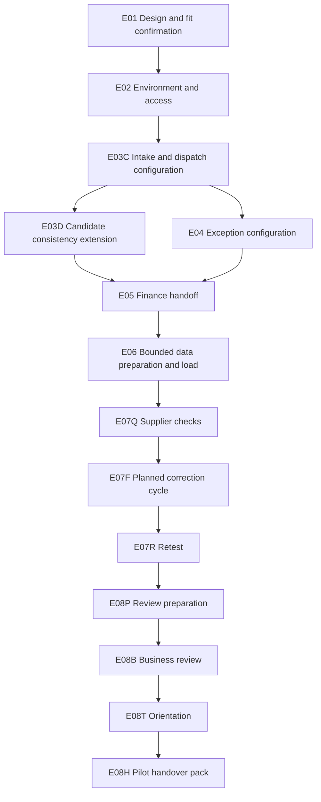

# Delivery Planning and Estimation

## 1. What you will learn

A delivery estimate is a reasoned forecast of the work required under stated conditions. A delivery plan explains how that work can be performed with the available people, dependencies and decision points.

Neither is simply a number of hours or a preferred completion date.

You need to explain:

- What work the estimate covers.
- Who performs it.
- How much staff effort it requires.
- Which activities can overlap.
- Which inputs and decisions must arrive first.
- What uncertainty remains.
- What would cause the estimate to change.

By the end of this chapter, you should be able to:

- Build a work breakdown linked to deliverables and requirements.
- Separate configuration, development, testing, data preparation, training and handover effort.
- Calculate supplier and client participation separately.
- Derive an elapsed schedule from dependencies and capacity.
- Explain contingency and its limits.
- Refine an estimate when design evidence or availability changes.
- Defend a delivery plan without inventing approval or observed results.

Prerequisites and continuity

You need the proposed SOW, architecture, access plan and migration workbook from Chapters 5–8.

| Carried-forward item | Current state |
| --- | --- |
| Proposed pilot | One non-production intake-to-Finance workflow |
| Original supplier estimate | 68–78.2 person-hours, including a supplied 15% reserve |
| Latest original schedule | 21–24 working days under Chapter 5’s revised dependencies |
| Reporting addition | EVG-CHANGE-002 pending; earlier full-reserve proposal was 87.4 hours against an 80-hour request |
| Portal/routing | EVG-CHANGE-001 deferred |
| Multi-site/multi-visit | EVG-CHANGE-003 under analysis only |
| Migration paper target | Four customers, seven jobs and three appointments after the reviewed delta treatment |
| Outstanding migration matters | C04 unresolved; two conflicting cancellation updates held |
| Authority | Documents and paper exercises only |
| Product evidence | No configured behaviour, actual import, test execution or acceptance |

The migration paper target contains fourteen entities. That count does not prove that every source row or latest change has been transferred.

Your project contribution

You will produce:

1. A refined work breakdown.
2. A role-capacity and dependency plan.
3. An initial schedule with explicit uncertainty.
4. An estimate comparison and refinement record.
5. A short client recommendation.

All Evergreen people, effort values, availability and rules are synthetic. Estimates are planned work, not timesheets. Working-day numbers are relative planning positions, not promised calendar dates or course duration.

## 2. Lessons

### 2.1 Estimate the scope you have actually defined

Skill: establish the estimate boundary before calculating effort.

An estimate needs a reference scope. Without it, two people can quote different numbers while apparently discussing the same project.

For Evergreen, “the implementation” could mean:

- A bounded pilot.
- The pilot plus weekly reporting.
- A multi-site operating solution.
- Production migration and release.
- Ongoing support.

Those are different estimates.

A work breakdown structure divides the selected scope into manageable activities. The breakdown should cover the work needed to produce and verify the deliverables, rather than just the visible configuration.

For example:

“Configure completion fields” is not the whole Finance-handoff task.

The work may include confirming field meaning, implementing readiness checks, restricting edits, preparing test inputs, checking invalid data, correcting failures and documenting ownership.

Use the existing deliverable and requirement IDs as anchors. Preserve earlier estimate versions so that a reviewer can explain why the new figure differs.

A useful estimate boundary states:

- Included deliverables and requirement groups.
- Dataset and user-role limits.
- Environment.
- Excluded work.
- Planning origin.
- Evidence maturity.
- Required client inputs.

Do not extend the pilot estimate to historical migration because a migration workbook now exists. Chapter 8 developed planning and paper evidence; production migration remains outside the proposed pilot.

Lesson check LC1: Why is “configuration: 40 hours” insufficient as a delivery estimate?

### 2.2 Separate effort, participation and capacity

Skill: use units that make the estimate interpretable.

Staff effort is the time people spend working. This chapter uses person-hours.

A two-hour review attended by two supplier staff requires:

> 2 hours×2 people=4 supplier person-hours

The meeting still occupies two elapsed hours.

Client participation is separate. If Operations and Finance also attend for two hours each, that adds four client person-hours, not four supplier hours.

Capacity is the amount of time a person can allocate to this engagement. A person may have an eight-hour working day but only four hours of project capacity because of other responsibilities.

For optional reporting in person-days, this chapter defines one person-day as eight person-hours. Thus:

> 88÷8=11 supplier person-days

That does not mean the project finishes in eleven working days.

Estimates also depend on capability. Assigning a development activity to someone with spare time does not establish that they can perform it. Name the role and relevant responsibility.

Distinguish:

- Forecast effort: planned work.
- Actual effort: recorded work already performed.
- Estimate to complete: forecast remaining work.
- Forecast at completion: actual effort plus estimate to complete.

No actual effort is supplied for Evergreen. Therefore, this chapter compares future planning estimates rather than claiming project expenditure.

Lesson check LC2: How much supplier effort is used by a two-hour review with an Implementation Lead and Quality Lead? Does that determine its elapsed duration?

### 2.3 Sequence dependencies and respect resource capacity

Skill: build a schedule that people can actually perform.

A dependency defines what must happen before an activity can proceed. Dependencies may involve work, people, evidence or decisions.

A schedule must respect both:

- Logical dependencies: Finance-handoff work follows the agreed exception design.
- Resource dependencies: one Implementation Lead cannot perform two four-hour activities on the same day with four hours of capacity.

Some work can overlap. A Developer can investigate a consistency extension while the Implementation Lead configures exception behaviour, provided both have their required inputs.

A critical path is the dependency chain that determines the earliest finish under the scheduling model. Resource limits and fixed client meetings can also determine completion.

Do not assume that adding staff shortens every task. A review awaiting Finance cannot be accelerated by adding another Developer.

For the exercises, successors start on the next working day after predecessors finish. This simple rule makes the schedule reproducible. Real plans may allow same-day handoffs, but they need more detailed availability.

For a task requiring six hours at four hours per day:

> Required workdays=⌈(6) ÷ (4)⌉=2

The ceiling brackets mean round up to the next whole number. Two hours of unused capacity on the second day do not automatically make a dependent activity ready under the exercise’s next-day rule.

Lesson check LC3: Why might removing development effort fail to bring the final handover date forward?

### 2.4 Include quality, data, training and handover

Skill: plan the work that makes a pilot usable and reviewable.

Configuration and development are only part of delivery.

Testing needs preparation, representative identities, normal and invalid inputs, evidence and a correction/retest process. It should cover access restrictions and operational exceptions, not only the happy path.

Data work includes:

- Preparing the permitted manifest.
- Applying authorised corrections.
- Resolving target identifiers and relationships.
- Loading the bounded dataset through an authorised method.
- Reconciling keys, counts and important values.

The current paper migration evidence helps size those tasks, but it does not prove actual lookup resolution or permission enforcement.

Official CRM documentation describes upsert matching and per-record results.1 Field metadata helps identify actual API names and types, while leaving some layout-specific evidence unresolved.2 These are concrete investigation tasks that need time in the plan.

Training also needs preparation. A one-hour orientation is not one hour of total delivery effort. Materials must explain the actual pilot, role responsibilities and known limitations.

Handover needs named business and technical owners, administrator notes, outstanding issues and support boundaries. A pilot handover does not establish a production incident-response service.

Avoid hiding all these tasks in an unexplained percentage. Estimate them as work, then apply contingency separately.

Lesson check LC4: Which data and quality tasks remain after a paper migration has reconciled correctly?

### 2.5 Use contingency and refine estimates honestly

Skill: explain uncertainty without treating it as unlimited extra scope.

Contingency, called reserve in the Evergreen case, is an explicit allowance for identified uncertainty within a stated boundary.

The supplied planning convention remains 15% of base supplier effort. It is not a universal consulting rule.

A reserve should state:

- What uncertainty it covers.
- How it is allocated.
- What approvals govern its use.
- How it affects schedule.
- Which conditions require re-estimation instead.

A product-fit failure that introduces another application or integration can exceed the estimate boundary. It should trigger a revised estimate rather than be concealed inside reserve.

Separate ordinary planned correction from contingency. Evergreen’s base plan includes one bounded correction/retest cycle. Reserve covers additional bounded corrections and evidence updates, not an unlimited number of cycles.

Refine the estimate when information changes. Explain the cause:

- Additional work increases effort.
- Lower availability increases elapsed time.
- A simpler design may reduce effort.
- A new dependency can delay completion.
- Removed uncertainty may justify a revised reserve, but only through the stated decision process.

Do not reduce reserve silently to meet a requested ceiling.

Sponsor: “Can you make the estimate fit one hundred hours?”  

Implementation Lead: “We can compare scope and design options. The current full-reserve forecast is 101.2 hours. Changing the reserve or removing work requires an explicit decision about the consequences.”

Lesson check LC5: What is the difference between refining an estimate from new evidence and changing a number to satisfy a budget request?

## 3. Visual explanation: parallel work and convergence

The two branches after E03C can overlap because they use different supplier roles. They converge before E05.

The diagram does not show client availability. A meeting can therefore remain the finish driver even when all its predecessor work is ready.

The candidate extension is an estimate assumption. Its inclusion is not proof that custom code is required.

## 4. Worked case: refine the original pilot estimate

### 4.1 New synthetic planning inputs

| Source ID | Supplied input |
| --- | --- |
| EVG-SRC-081 | Sponsor authorises a revised delivery-plan proposal only. The new requested supplier ceiling is 100 person-hours including reserve. This replaces the earlier 80-hour request for this proposal comparison, without approving implementation. |
| EVG-SRC-082 | Supplier supplies the detailed work breakdown below. It covers the original single-current-visit pilot; reporting, multi-site work and production migration remain excluded. |
| EVG-SRC-083 | Each supplier has four project hours per working day. Successors start on the next working day. Reserve is 15%; its upper-envelope sequence is Developer, Quality Lead, then Implementation Lead. |
| EVG-SRC-084 | Proposed data work uses the paper-reconciled set of four customers, seven jobs and three appointments, retaining C04 and the held cancellation group as exceptions. The approved target manifest is still required before E06. |

Three supplier roles are proposed:

| Role | Synthetic person/contact | Responsibility |
| --- | --- | --- |
| Implementation Lead | Jordan Ellis; implementation@partner.example.com | Configuration, coordination, training and pack |
| Developer | Riley Park; developer@partner.example.com | Candidate extension and technical corrections |
| Quality Lead | Sam Torres; quality@partner.example.com | Checks, evidence, retest and review participation |

These staffing facts are new scenario inputs. They are not evidence that staff have been assigned.

### 4.2 Step 1: completed work breakdown

| Work ID | Activity | Supplier role | Person-hours |
| --- | --- | --- | --- |
| E01 | Refine design and confirm product fit | Implementation Lead | 8 |
| E02 | Establish environment/access readiness | Implementation Lead | 6 |
| E03C | Intake/dispatch configuration | Implementation Lead | 10 |
| E03D | Candidate reference/consistency extension | Developer | 8 |
| E04 | Reschedule, cancellation and change-review configuration | Implementation Lead | 8 |
| E05 | Finance handoff and visibility controls | Implementation Lead | 8 |
| E06 | Prepare, load and reconcile bounded synthetic dataset/history | Implementation Lead | 6 |
| E07Q | Supplier checks and evidence | Quality Lead | 12 |
| E07F | One planned technical correction allowance | Developer | 6 |
| E07R | Retest and evidence update | Quality Lead | 4 |
| E08P | Business-review preparation | Implementation Lead | 4 |
| E08B | Business review | Implementation Lead and Quality Lead | 2 each |
| E08T | One-hour orientation | Implementation Lead | 1 |
| E08H | Pilot handover pack | Implementation Lead | 3 |

E07F is forecast capacity for a bounded correction cycle, not an observed defect. Its actual use will be reassessed after testing.

The core coverage includes the original pilot checks plus the technician, identity, audit and bounded-data checks developed in Chapters 7–8. Reporting check EVG-TEST-009, multi-site check EVG-TEST-014 and temporary-grant check EVG-TEST-018 remain outside this core proposal.

### 4.3 Step 2: calculate supplier and client effort

Implementation Lead:

> 8+6+10+8+8+6+4+2+1+3=56 person-hours

Developer:

> 8+6=14 person-hours

Quality Lead:

> 12+4+2=18 person-hours

Total base:

> 56+14+18=88 supplier person-hours

Reserve:

> 88×0.15=13.2 person-hours

Full-reserve upper bound:

> 88+13.2=101.2 person-hours

Proposed reserve allocation:

| Role | Base | Reserve |
| --- | --- | --- |
| Implementation Lead | 56 | 6 |
| Developer | 14 | 4 |
| Quality Lead | 18 | 3.2 |
| Total | 88 | 13.2 |

Client participation is separate:

| Client activity | Person-hours |
| --- | --- |
| Administrator readiness support | 1 |
| Operations dataset-manifest review | 1 |
| Operations and Finance business review: two hours each | 4 |
| Six participants attending one-hour orientation | 6 |
| Sponsor scope and acceptance decision slots: half-hour each | 1 |
| Total | 13 |

The Sponsor slots are planning allowances. No decision outcome is supplied.

### 4.4 Step 3: explain the refinement from Chapter 5

Keep the old estimate as a historical proposal.

| Parent work | Earlier base | Refined base |
| --- | --- | --- |
| E01 design/fit | 8 | 8 |
| E02 readiness | 6 | 6 |
| E03 intake/dispatch and extension | 12 | 18 |
| E04 exceptions | 8 | 8 |
| E05 Finance controls | 10 | 8 |
| E06 data/history | 6 | 6 |
| E07 checks, correction and retest | 10 | 22 |
| E08 review, orientation and pack | 8 | 12 |
| Total | 68 | 88 |

The new proposal makes the candidate extension, correction/retest cycle and second supplier’s review participation explicit. It also revises the Finance configuration estimate.

This is a scope-and-method refinement, not a claim that twenty extra hours have been spent.

### 4.5 Step 4: construct the base schedule

Working day 1 begins only after implementation authority and prerequisite evidence are available. Those conditions have not been met.

| Working days | Activity | Capacity reasoning |
| --- | --- | --- |
| 1–2 | E01 | 8 ÷ 4 = 2 days |
| 3–4 | E02 | 6 hours requires 2 days |
| 5–7 | E03C | 10 hours requires 3 days |
| 8–9 | E03D and E04 in parallel | Different roles; each needs 2 days |
| 10–11 | E05 | Both branches complete |
| 12–13 | E06 | 6 hours requires 2 days |
| 14–16 | E07Q | 12 hours requires 3 days |
| 17–18 | E07F | 6 hours requires 2 days |
| 19 | E07R | 4 hours |
| 20 | E08P | 4 hours |
| 21 | E08B | Fixed business-review slot |
| 22 | E08T | Fixed orientation slot |
| 23 | E08H | 3 hours |

Base completion is day 23.

For the upper envelope, the full reserve follows the base handover pack:

- Developer: four hours on day 24.
- Quality Lead: 3.2 hours on day 25.
- Implementation Lead: six hours across days 26–27.

The conditional range is 23–27 working days.

The reserve assumes bounded desk correction, rechecking and pack updates. Additional client meetings, a repeat orientation or an architecture change require schedule review.

### 4.6 Completed plan summary

Artifact: Evergreen Delivery Plan v0.1 — proposed

| Field | Completed content |
| --- | --- |
| Scope | Original bounded single-current-visit pilot |
| Supplier base/reserve | 88 + 13.2 = 101.2 hours |
| Client participation | 13 person-hours |
| Elapsed range | 23–27 working days from an authorised start |
| Requested ceiling | 100 supplier hours |
| Difference | Upper bound exceeds ceiling by 1.2 hours |
| Gates | Scope authority, product fit, readiness, approved manifest and business review |
| Exclusions | Reporting, multi-site expansion, production migration/release and new support |
| Evidence status | Planning assumptions; no actual work or test results |
| Recommendation | Review design/scope options; preserve essential controls and stated reserve |

Record EVG-DEC-024: estimate all supplier roles and client participation separately, then derive schedule from dependencies.

Record EVG-DEC-025: retain the supplied 15% reserve and disclose the ceiling conflict.

A mistake and its correction

Mistake: “Three people provide twelve hours daily, so 101.2 hours takes about nine days.”

Correction: “Aggregate capacity does not remove dependencies or role constraints. The supplied plan needs 23–27 working days because configuration, testing, correction and client meetings are sequenced.”

## 5. Try it yourself — guided practice

Learning goal and access

Revise the schedule when availability changes but the work remains the same.

Use the worked case, an editor and calculator. No product access is needed.

Changed inputs

EVG-SRC-085 replaces these availability conditions:

| Condition | New input |
| --- | --- |
| E03D Developer availability | Cannot start before day 10 |
| E07Q Quality Lead availability | Cannot start before day 17 |
| Business review | Day 25 |
| Orientation | Day 26 |

All effort, dependencies, capacity and reserve rules remain unchanged.

Steps and expected intermediate results

1. Classify the change.  

Expected result: availability changes the schedule; it does not add work.

2. Schedule both branches after E03C.  

Expected result: E04 can proceed before E03D; E05 waits for both.

3. Apply Quality Lead availability.  

Expected result: testing starts only after data readiness and the supplied availability date.

4. Place review, orientation and handover.  

Expected result: no meeting occurs before its preparation is complete.

5. Apply the reserve sequence.  

Expected result: role-specific reserve is sequenced after the base pack.

6. Produce Delivery Plan v0.2.  

Expected result: effort and ceiling comparison remain unchanged, with a revised elapsed range.

Blank work and schedule worksheet

| Work ID | Role | Effort | Predecessors | Availability constraint | Start day |
| --- | --- | --- | --- | --- | --- |
|  |  |  |  |  |  |
|  |  |  |  |  |  |
|  |  |  |  |  |  |

Blank estimate-refinement worksheet

| Item | Previous value | Revised value | Cause | Effort impact | Schedule impact |
| --- | --- | --- | --- | --- | --- |
|  |  |  |  |  |  |
|  |  |  |  |  |  |

Final artifact: Delivery Plan v0.2 with a feasible schedule and client dependency statement.

Cleanup: retain the earlier estimate and revised version. Remove redundant scratch schedules. No application cleanup applies.

## 6. Independent challenge

Continue from the guided availability.

New design and scope inputs

| Source ID | Supplied input |
| --- | --- |
| EVG-SRC-086 | Design analysis supplies a native-only candidate for the original single-current-visit pilot. E03D becomes zero hours; E07F reduces from six to four hours. E05 now depends on E04 only. All checks and remaining work stay in place. This is planning evidence, not observed product fit. |
| EVG-SRC-087 | Sponsor requests two options: core pilot and core plus weekly reporting. Reporting remains EVG-CHANGE-002 pending. E09 adds eight hours: Implementation Lead definitions/configuration 5, Quality Lead checks 2, Implementation Lead documentation 1. |
| EVG-SRC-088 | E09 starts after E07R. Its three parts are sequential using the next-day rule. E08P follows E09 documentation for the reporting option. Core review/orientation remain days 25/26; reporting-option review/orientation are days 28/29. |

Further rules:

- Supplier capacity remains four hours each per working day.
- Quality Lead testing availability remains no earlier than day 17.
- Reserve remains 15%.
- Core reserve allocation: Implementation Lead 5 hours, Developer 3, Quality Lead 3.7.
- Reporting-option reserve allocation: Implementation Lead 6 hours, Developer 3, Quality Lead 3.9.
- Reserve sequence remains Developer, Quality Lead, Implementation Lead after the base pack.
- The requested ceiling remains 100 supplier hours.
- Client participation remains 13 hours for this exercise; no extra client meeting is supplied.
- Native fit must still be demonstrated during later authorised checks.
- No implementation or reporting addition is approved.

Deliverables

Produce:

1. Revised core and reporting-option estimates.
2. Role totals and reserve reconciliation.
3. Feasible schedules for both options.
4. A revised EVG-CHANGE-002 impact record.
5. A recommendation explaining whether the ceiling is met.
6. Conditions that would reopen the estimate.

Success criteria

Preserve essential controls and all remaining checks. Do not remove testing because custom code is removed.

Distinguish reduced effort from reduced elapsed time. Keep the native-only design conditional and the reporting addition unapproved.

## 7. Common problems and recovery

| Symptom | Diagnosis | Correction |
| --- | --- | --- |
| Estimate covers only configuration | Quality/data/handover omitted | Add explicit work packages |
| Two activities use the same person simultaneously | Resource capacity ignored | Resequence or assign a qualified additional person |
| Client meeting occurs before evidence is ready | Dependency ignored | Move meeting or revise availability |
| Migration allowance assumes every source row is clean | Cleansing uncertainty hidden | Bound dataset and name exception owners |
| Reserve is called extra scope | Uncertainty and change confused | State reserve purpose and change mechanism |
| Estimate is lowered by dropping retest | Quality work traded silently | Preserve retest or record an explicit changed acceptance decision |
| “Native” means zero investigation | Product-fit proof omitted | Keep design and representative checks |
| Old estimate is overwritten | Refinement history lost | Version and explain differences |
| Delay is described as extra staff effort | Waiting and work confused | State schedule effect separately |

Recovery limits

If a plan proves infeasible, revise the dependency and capacity model rather than continuing to report the old date.

If a product-fit assumption fails, preserve the evidence and pause affected work for an architecture/scope decision. Reserve does not authorise another application, integration or production migration.

If client evidence is unavailable, keep the activity blocked. Do not mark an unperformed review complete.

## 8. Check your understanding

1. What is the difference between staff effort and elapsed schedule?
2. Why must a work breakdown include testing and handover?
3. What makes a client dependency actionable?
4. When should uncertainty trigger re-estimation rather than reserve use?
5. Why does removing eight development hours not necessarily reduce the final date?
6. Which current migration exceptions remain outside an unlimited cleansing commitment?
7. What would be needed to report actual effort or forecast at completion?
8. Why should the revised pilot proposal not be called an approved delivery baseline?

## 9. Solutions and explanations

### 9.1 Lesson checks

LC1: The number does not identify scope, tasks, roles, dependencies, quality work, client participation or uncertainty. It also does not explain elapsed time.

LC2: Four supplier person-hours. The meeting occupies two elapsed hours, assuming both people attend together.

LC3: Fixed meetings, another critical dependency or role availability can still determine completion. Removing noncritical work can reduce effort without changing the date.

LC4: Actual target mappings, IDs, authorised loading, relationship checks, automation isolation, role-based verification and evidence remain. Paper reconciliation does not prove those behaviours.

LC5: Evidence-based refinement explains which work or condition changed. Budget-fitting changes a number without a defensible change to scope, method, capacity or uncertainty.

### 9.2 Guided practice solution

Revised schedule

| Working days | Activity | Explanation |
| --- | --- | --- |
| 1–2 | E01 | Unchanged |
| 3–4 | E02 | Unchanged |
| 5–7 | E03C | Unchanged |
| 8–9 | E04 | Implementation Lead available |
| 10–11 | E03D | Developer’s earliest start is day 10 |
| 12–13 | E05 | Both branches complete |
| 14–15 | E06 | Follows E05 |
| 17–19 | E07Q | Quality Lead unavailable before day 17 |
| 20–21 | E07F | Six hours requires two days |
| 22 | E07R | Four hours |
| 23 | E08P | Four hours |
| 25 | E08B | New business-review slot |
| 26 | E08T | New orientation slot |
| 27 | E08H | Next day after orientation |

Reserve uses:

- Developer day 28.
- Quality Lead day 29.
- Implementation Lead days 30–31.

The revised conditional range is 27–31 working days.

Supplier effort remains:

> 88+13.2=101.2 hours at the upper bound

Client participation remains 13 hours.

Completed refinement record

| Item | Previous | Revised | Cause |
| --- | --- | --- | --- |
| Developer branch | Days 8–9 | Days 10–11 | Availability |
| Supplier checks | Days 14–16 | Days 17–19 | Upstream delay and QA availability |
| Base pack | Day 23 | Day 27 | New dependency/meeting sequence |
| Full-reserve pack | Day 27 | Day 31 | Reserve follows revised base |
| Supplier hours | 88–101.2 | 88–101.2 | No work added |

A suitable client statement is:

The work estimate is unchanged, but the revised availability moves the conditional completion range to 27–31 working days. The full-reserve estimate remains 1.2 hours above the requested ceiling, so the scope/design decision is still open.

### 9.3 Independent challenge solution

Core effort

Remove eight extension hours and two correction-allowance hours:

> 88-8-2=78 supplier base hours

Reserve:

> 78×0.15=11.7 hours

Upper bound:

> 78+11.7=89.7 hours

| Role | Base | Reserve |
| --- | --- | --- |
| Implementation Lead | 56 | 5 |
| Developer | 4 | 3 |
| Quality Lead | 18 | 3.7 |
| Total | 78 | 11.7 |

Headroom against the requested ceiling:

> 100-89.7=10.3 hours

This is planning headroom, not approved extra scope.

Core schedule

| Working days | Activity |
| --- | --- |
| 1–2 | E01 |
| 3–4 | E02 |
| 5–7 | E03C |
| 8–9 | E04 |
| 10–11 | E05 |
| 12–13 | E06 |
| 17–19 | E07Q |
| 20 | E07F: four hours |
| 21 | E07R |
| 22 | E08P |
| 25 | E08B |
| 26 | E08T |
| 27 | E08H |

The base still finishes on day 27. Earlier data readiness cannot overcome the day 17 QA availability and day 25 review slot.

Reserve uses Developer day 28, Quality Lead day 29 and Implementation Lead days 30–31.

Core range: 27–31 working days.

Core plus reporting effort

> 78+8=86 supplier base hours

> 86×0.15=12.9 reserve hours

> 86+12.9=98.9 hours

| Role | Base | Reserve |
| --- | --- | --- |
| Implementation Lead | 62 | 6 |
| Developer | 4 | 3 |
| Quality Lead | 20 | 3.9 |
| Total | 86 | 12.9 |

Headroom:

> 100-98.9=1.1 hours

The reporting option fits the requested ceiling under the supplied assumptions.

Reporting-option schedule

Work through E07R remains as in the revised core plan.

| Working days | Activity |
| --- | --- |
| 22–23 | E09 definitions/configuration: five Implementation Lead hours |
| 24 | E09 report checks: two Quality Lead hours |
| 25 | E09 documentation: one Implementation Lead hour |
| 26 | E08P |
| 28 | E08B |
| 29 | E08T |
| 30 | E08H |

Reserve uses Developer day 31, Quality Lead day 32 and Implementation Lead days 33–34.

Reporting-option range: 30–34 working days.

Revised EVG-CHANGE-002 record

| Field | Completed content |
| --- | --- |
| Request | Add weekly reporting to the pilot |
| Requirement/test | EVG-REQ-004 / EVG-TEST-009 |
| Proposed deliverable | EVG-DEL-007: one report with the agreed UTC definitions and evidence |
| Added base effort | Eight hours |
| Added full-reserve effort | 98.9 − 89.7 = 9.2 hours |
| Schedule effect | Core 27–31; reporting option 30–34 working days |
| Ceiling | Both options fit 100 hours under the native-only estimate |
| Status | Proposed; no reporting or implementation approval |
| Condition | Native-only approach and remaining readiness assumptions must be demonstrated |

The report’s earlier corrected example remains two open and one completed. The counting rule and expected result are not changed to fit the plan.

Record EVG-DEC-026: present conditional native-only core and reporting options while retaining checks, reserve and approval boundaries.

Recommendation

The native-only candidate reduces the core forecast to 78–89.7 supplier hours. Adding reporting gives 86–98.9 hours, within the requested ceiling, with a later 30–34-day range. Both remain conditional proposals. Confirm product fit, readiness, the bounded data manifest and the selected scope before authorising delivery.

Reopen the estimate if:

- Native-only design fails an essential behaviour.
- Another application or integration is required.
- Data scope exceeds the curated manifest.
- Client availability changes.
- Additional training or review cycles are needed.
- Multi-site or production work is added.

A valid alternative is to recommend the core pilot first because its headroom is larger. That is a business trade-off, not a mathematical requirement.

### 9.4 Understanding check answers

1. Effort counts working time. Elapsed schedule includes sequencing, capacity and waiting.
2. The deliverable must be verified and transferred to usable ownership, not merely configured.
3. It names the owner, required input, needed date and affected activity.
4. When the changed condition exceeds the defined design, work or uncertainty boundary.
5. Other constraints can determine the finish, as QA and review availability do here.
6. C04’s unresolved identity and the held cancellation group remain explicit exceptions. No unlimited source cleansing is included.
7. Reliable actual-work records and a current estimate of remaining work.
8. No authorised approval of the version or implementation scope is supplied.

## 10. Chapter recap and next step

A defensible plan connects scope, work, people, evidence and decisions.

Its strength is not an exact-looking completion date. It is the ability to explain how the date follows from capacity and dependencies, why uncertainty exists and which changed conditions require a new decision.

Completion checklist

- I can build a work breakdown covering the whole deliverable.
- I can separate supplier effort and client participation.
- I can respect role capacity and dependencies.
- I can include testing, data work, training and handover.
- I can calculate and explain reserve.
- I can distinguish lower effort from earlier completion.
- I can refine estimates without erasing previous versions.
- I can defend a conditional proposal without inventing approval.

Your project pack now contains a delivery plan, refined estimates and a reporting-option impact record.

Chapter 10, Prototyping and Design Validation, tests difficult assumptions through small end-to-end prototypes, demonstrations and feedback. The native-only candidate and access/history controls are important proof points.

## 11. Glossary and further reading

Glossary

| Term | Meaning |
| --- | --- |
| Base effort | Planned work before contingency |
| Capacity | Time a person or role can allocate to the engagement |
| Contingency | Explicit allowance for identified uncertainty within a defined boundary |
| Critical path | Dependency chain determining earliest completion under the model |
| Estimate to complete | Forecast effort remaining |
| Forecast at completion | Actual effort plus forecast remaining effort |
| Person-hour | One person working for one hour |
| Refinement | Evidence-based revision of an estimate or plan |
| Resource constraint | Limit caused by available people or their capacity |
| Work breakdown | Division of scope into estimable activities |

Further reading

1. Zoho CRM API v8 — Upsert Records  
[Open official reference](https://www.zoho.com/crm/developer/docs/api/v8/upsert-records.html)

Relevant to estimating key matching, result handling and replay verification.

2. Zoho CRM API v8 — Fields Metadata  
[Open official reference](https://www.zoho.com/crm/developer/docs/api/v8/field-meta.html)

Relevant to estimating schema discovery and unresolved layout-specific evidence.

These official sources were accessed on 5 October 2026 during the preceding product research. They support the investigation dependencies described here. Research remains partially verified because Evergreen’s implementation behaviour and actual delivery effort are unobserved. No product execution is claimed.
