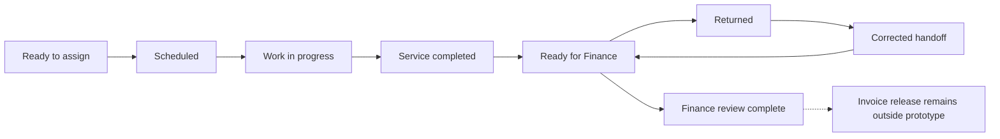

# Prototyping and Design Validation


## 1. What you will learn

A prototype helps you investigate a design before committing to the full delivery. Its value comes from the questions it answers, the assumptions it exposes and the decisions it improves.

A convincing demonstration is not automatically convincing evidence. You must distinguish what the prototype actually exercises from what remains an assumption.

By the end of this chapter, you should be able to:

- Build a small prototype covering the full business process.
- Select representative normal and exception scenarios.
- Demonstrate behaviour using complete inputs and expected results.
- Collect feedback and classify it correctly.
- Refine requirements without silently changing scope.
- Review architecture decisions against evidence.
- Explain which difficult assumptions still need product verification.
- Present a working prototype and an updated decision record.

Prerequisites and continuity

You need the process models, requirements, access design and conditional delivery plan from Chapters 3–9.


| Carried-forward item | Current state |
| --- | --- |
| Core pilot | Single-current-visit, non-production intake-to-Finance workflow |
| Native-only design | Planning candidate; not observed product fit |
| Core estimate | 78–89.7 supplier hours; conditional 27–31 working days |
| Reporting option | 86–98.9 hours; conditional 30–34 working days |
| Scope approval | None supplied |
| Product readiness | Organisation IDs, exact mappings and effective permissions remain unverified |
| Migration | Paper target has fourteen entities; C04 and the cancellation conflict remain unresolved |
| Changes | Portal/routing deferred; reporting pending; multi-site assessment only |
| Product tests | None executed |
| EVG-DEFECT-001 | Reserved; no observed product failure |

Your project contribution

You will produce:

1. A working local reference prototype.
2. A demonstration and evidence card.
3. A feedback classification record.
4. Refined acceptance criteria.
5. Architecture decisions reviewed against the supplied evidence.

EVG-SRC-089 explicitly authorises a locally runnable model and document-based design review using synthetic data. It does not authorise Zoho configuration, tokens, API calls or tenant inspection.

The local model is the usable alternative while tenant authority and readiness are missing. It demonstrates business-rule logic and expected states. It cannot demonstrate Zoho configuration, authentication, field security, API enforcement or production recovery.

All Evergreen inputs, dialogue and numbers remain synthetic. Supplied feedback is a fictional review exercise, not client acceptance.


## 2. Lessons


### 2.1 Give the prototype a question

Skill: choose the uncertainty you need to reduce.

A prototype is a deliberately limited implementation used to investigate an idea. Its purpose should be narrower than “show the client something.”

Useful Evergreen questions include:

- Can a completed service reach Finance without releasing an invoice?
- Can Dispatch obtain useful status without reading a private Finance reason?
- Can a reschedule preserve the original appointment and remain pending until acknowledged?
- What happens if the proposed change is interrupted before completion?
- Does the proposed native design enforce these behaviours through every relevant access path?

Write each question with an expected result and a boundary.


| Prototype objective | Expected evidence | Boundary |
| --- | --- | --- |
| End-to-end coordination | Intake, assignment, work, completion and Finance review are represented | Local model only |
| Missing-data control | Blank completion summary prevents handoff readiness | Does not prove a Zoho validation rule |
| Information separation | Dispatch projection excludes private reason | Does not prove authenticated access |
| Reschedule history | Original retained; replacement pending until acknowledgement | Does not prove cross-record product consistency |

A prototype can answer one question while leaving another open. That is useful if the evidence boundary is explicit.

A common mistake is to add attractive screens while avoiding the difficult assumption. If the uncertainty concerns related-record consistency, a polished dashboard does not resolve it.

Lesson check LC1: Which prototype would better investigate rescheduling: a dashboard showing appointment counts, or a controlled technician-change scenario? Explain.


### 2.2 Build a vertical slice across the process

Skill: demonstrate connected behaviour rather than disconnected features.

A vertical slice is a small implementation that follows one meaningful path through the process.

Evergreen’s slice is:

1. Record intake.
2. Plan and acknowledge an appointment.
3. Record actual work start.
4. Supply completion information.
5. Qualify the Finance handoff.
6. Record Finance review.
7. Preserve correction history.
8. Show the permitted operational projection.

This is stronger than demonstrating eight unrelated fields.

Choose the prototype form according to the question:


| Form | Useful for | Evidence limitation |
| --- | --- | --- |
| Clickable mock-up | Language, layout and navigation | Does not execute business controls |
| Runnable reference model | States, decisions and exception logic | Does not establish product fit |
| Configured product prototype | Actual configuration and role behaviour | Needs authorised environment and representative evidence |
| Integration prototype | Interface, identity and failure behaviour | Needs defined boundaries and controlled endpoints |

The reference code in this chapter implements the business model for learning. Its use of Python does not establish that the Zoho solution needs custom code.

Keep the prototype small enough to understand. Use representative records instead of a large dataset whose outcomes are difficult to inspect.

Lesson check LC2: What does a runnable reference model demonstrate that a clickable mock-up does not?


### 2.3 Demonstrate the controls as well as the happy path

Skill: make the important decisions visible.

A demonstration should show why a transition is permitted.

For example:

“The appointment is confirmed because customer confirmation and technician acknowledgement are present.”

This is better than:

“The status changed successfully.”

Then challenge the control:

- Try completion with no summary.
- Try an acknowledgement from the wrong technician.
- Try Finance review through Dispatch.
- Interrupt a reschedule before committing the change.

Use a demonstration card with inputs, actor, action, expected result and evidence type.

Do not convert expected output into observed output. After you run the local model, you may record your actual local result. That still does not become a Zoho test result.

Likewise, a model’s successful execution does not prove adoption. A stakeholder may still find the sequence confusing or operationally impractical.

Lesson check LC3: Why should a demonstration include an action that is expected to be denied?


### 2.4 Turn feedback into the right kind of record

Skill: distinguish clarification, defect, design improvement and scope change.

Feedback can mean different things:


| Feedback type | Treatment |
| --- | --- |
| Clarification of an existing need | Refine wording or acceptance criteria; preserve the requirement ID |
| Design improvement within the need | Update the decision and assess effort |
| New capability | Record a change request and impact |
| Observed failure against the applicable requirement | Record a defect with evidence |
| Concern without observed behaviour | Record an assumption, risk or proof requirement |

Consider the comment:

“The label ‘Service completed’ looks as though Finance has approved everything.”

The underlying rule already exists: completion must not release an invoice. The response may be clearer labels and separate Finance status, not a new invoicing feature.

By contrast:

“Automatically email the customer when the job is complete.”

This introduces an outbound action. It affects scope, wording, trigger timing, recipients and environment isolation.

Do not label a designed denial as a defect. “Wrong technician acknowledgement denied” is expected behaviour.

Lesson check LC4: How should you classify a request for automatic customer notification when the current pilot excludes outbound delivery?


### 2.5 Validate difficult assumptions in the actual product

Skill: use the model to plan product proof without claiming it already exists.

Three Evergreen assumptions need particular attention.

Native cross-record consistency

The local model can prepare changes and commit them together in memory. That does not prove that the selected Zoho design updates the old appointment, replacement appointment and job consistently.

Investigate normal completion and interrupted or partial operations. State the permitted recovery behaviour before testing.

Effective access

A model can select permitted fields. It does not authenticate the actor or prevent someone from bypassing the model.

Zoho’s Profiles API supplies detailed module permissions for a specific profile.2 A profile list alone is insufficient. Actual roles, sharing, field controls and enabled access paths still need verification.

Control coverage across entry paths

A UI check may differ from an API or import path. CRM’s Upsert documentation describes validation and feature-execution conditions.3 The design must establish which paths are relevant and how the required rule is enforced.

An authorised product-proof sequence would be:

1. Establish the intended organisation and identities.
2. Inspect actual modules, fields, layouts and profile permissions.
3. Configure the smallest approved slice.
4. Run the same representative business cases through relevant entry paths.
5. Record actual results, gaps and recovery evidence.
6. Update the architecture decision and estimate.

For a record already in a process, the Blueprint API can describe available transitions and associated fields/validation.1 This is useful inspection evidence, not proof that every Evergreen control works.

Lesson check LC5: Why does a successful Python reschedule not justify removing the native-fit condition from the delivery estimate?


## 3. Visual explanation: separate service and Finance outcomes




The diagram shows linked but distinct outcomes.

Service completion describes work performed. Finance review describes a separate decision. Neither the reference model nor the current pilot performs a live invoice release.

The return loop preserves the original return and records the correction. A current clean handoff must not erase its earlier history.


## 4. Worked case: run the end-to-end reference model


### 4.1 Inputs and rules

EVG-SRC-090 supplies these model rules:

- OPS represents Operations, DSP Dispatch, FIN Finance, and T1/T2 delegated technicians.
- Customer references 0101–0103 are recognised.
- Missing customer information creates Intake hold.
- Only the assigned technician can acknowledge, start or complete work.
- For this synthetic fixture, actual start cannot precede the scheduled start.
- Completion needs a date and nonblank summary.
- Finance alone records review outcomes.
- Private reasons are omitted from the public projection.
- A failed change before commit leaves the prior in-memory state intact.
- No live invoice or outbound notification exists.

These are model rules, not universal Zoho behaviour.

EVG-SRC-091 supplies the normal fixture:


| Step | UTC time on 26 January 2027 | Actor/input |
| --- | --- | --- |
| Intake | 08:00 | OPS; EVG-JOB-1901; EVG-CUST-0101 |
| Plan | 08:30 | DSP; EVG-APPT-8001; T1; slot 09:00–10:00; customer confirmed 08:20 |
| Acknowledge | 08:35 | T1 |
| Start | 09:00 | T1 |
| Invalid completion | 09:30 | T1; date 26 January; blank summary |
| Valid completion | 10:00 | T1; summary “Replaced filter” |
| Finance return | 10:10 | FIN; private reason “Contract-rate clarification required” |
| Correction | 10:15 | T1; summary “Replaced filter and confirmed service details” |
| Finance review | 10:20 | FIN; Review complete |

This is a separate prototype fixture. It does not alter Chapter 8’s migration ledger.


### 4.2 Complete runnable prototype

You need Python 3.7 or later and no additional packages. Save the following as evergreen_prototype.py, then run:


```bash
python3 evergreen_prototype.py
```

The program uses memory only. It makes no network calls and writes no data files.


```python
from copy import deepcopy
from datetime import datetime, date
import json

ACTORS = {
    "OPS": "Operations", "DSP": "Dispatch",
    "T1": "Technician", "T2": "Technician", "FIN": "Finance"
}
CUSTOMERS = {"EVG-CUST-0101", "EVG-CUST-0102", "EVG-CUST-0103"}


def need(condition, message):
    if not condition:
        raise ValueError(message)


def instant(text):
    value = datetime.fromisoformat(text.replace("Z", "+00:00"))
    need(
        value.utcoffset() is not None
        and value.utcoffset().total_seconds() == 0,
        "UTC timestamp required"
    )
    return value


class Prototype:
    def __init__(self):
        self.jobs, self.private, self.events = {}, {}, []

    def request(self, action, actor, at, ref, **data):
        need(actor in ACTORS, "Unknown actor")
        now, role = instant(at), ACTORS[actor]
        before = self.jobs.get(ref, {})
        before_state = before.get("state")
        before_handoff = before.get("handoff")
        jobs, private = deepcopy(self.jobs), deepcopy(self.private)

        if action == "intake":
            need(role == "Operations", "Operations required")
            need(ref not in jobs, "Duplicate job reference")
            customer = data.get("customer_ref", "")
            need(not customer or customer in CUSTOMERS, "Unknown customer")
            jobs[ref] = {
                "customer_ref": customer, "received_at": at,
                "state": "Ready to assign" if customer else "Intake hold",
                "appointments": [], "current": None, "started_at": None,
                "completion": {}, "handoff": "Not ready",
                "invoice_released": False
            }
        else:
            need(ref in jobs, "Unknown job")
            j = jobs[ref]
            ap = (
                j["appointments"][j["current"]]
                if j["current"] is not None else None
            )

            if action in {"ack", "start", "complete", "correct", "cancel_ack"}:
                need(
                    role == "Technician" and ap is not None
                    and ap["technician"] == actor,
                    "Assigned technician required"
                )

            if action == "repair":
                need(role == "Operations", "Operations required")
                need(j["state"] == "Intake hold", "Intake hold required")
                need(data["customer_ref"] in CUSTOMERS,
                     "Verified customer required")
                j["customer_ref"] = data["customer_ref"]
                j["state"] = "Ready to assign"

            elif action == "plan":
                need(role == "Dispatch", "Dispatch required")
                need(j["state"] in {"Ready to assign", "Scheduled"},
                     "Job not ready for scheduling")
                need(data["technician"] in {"T1", "T2"},
                     "Recognised technician required")
                need(instant(data["start"]) < instant(data["end"]),
                     "Invalid appointment interval")
                need(
                    all(a["ref"] != data["appointment_ref"]
                        for job in jobs.values()
                        for a in job["appointments"]),
                    "Duplicate appointment reference"
                )
                confirmation = data.get("customer_confirmed_at")
                if confirmation:
                    need(instant(confirmation) <= now,
                         "Future confirmation evidence")
                if ap is not None and ap["technician"] != data["technician"]:
                    need(data.get("withdrawal_at"),
                         "Withdrawal evidence required")
                    need(instant(data["withdrawal_at"]) <= now,
                         "Future withdrawal evidence")
                if ap is not None:
                    ap["state"] = "Superseded"
                    ap["withdrawal_at"] = data.get("withdrawal_at")
                j["appointments"].append({
                    "ref": data["appointment_ref"],
                    "technician": data["technician"],
                    "start": data["start"], "end": data["end"],
                    "state": "Pending acknowledgement",
                    "customer_confirmed_at": confirmation,
                    "technician_ack_at": None, "cancel_ack_at": None
                })
                j["current"] = len(j["appointments"]) - 1
                j["state"] = "Scheduled"
                need(not data.get("fail_before_commit"),
                     "Simulated interruption")

            elif action == "confirm":
                need(
                    role == "Operations" and ap is not None
                    and ap["state"] == "Pending acknowledgement",
                    "Pending appointment and Operations required"
                )
                ap["customer_confirmed_at"] = at
                if ap["technician_ack_at"]:
                    ap["state"] = "Confirmed"

            elif action == "ack":
                need(ap["state"] == "Pending acknowledgement",
                     "Pending appointment required")
                ap["technician_ack_at"] = at
                if ap["customer_confirmed_at"]:
                    ap["state"] = "Confirmed"

            elif action == "start":
                need(j["state"] == "Scheduled"
                     and ap["state"] == "Confirmed",
                     "Confirmed appointment required")
                need(now >= instant(ap["start"]),
                     "Scheduled start not reached")
                j["state"], j["started_at"] = "Work in progress", at

            elif action in {"complete", "correct"}:
                if action == "complete":
                    need(j["state"] == "Work in progress",
                         "Work in progress required")
                else:
                    need(j["state"] == "Service completed"
                         and j["handoff"] == "Returned",
                         "Returned handoff required")
                need(data.get("summary", "").strip(),
                     "Completion summary required")
                completed = date.fromisoformat(data["completion_date"])
                need(
                    instant(j["started_at"]).date() <= completed <= now.date(),
                    "Invalid completion date"
                )
                j["completion"] = {
                    "date": data["completion_date"],
                    "summary": data["summary"]
                }
                j["state"] = "Service completed"
                j["handoff"], ap["state"] = "Ready for Finance", "Completed"

            elif action == "review":
                need(role == "Finance", "Finance required")
                need(j["handoff"] == "Ready for Finance",
                     "Qualified handoff required")
                need(data["outcome"] in {"Returned", "Review complete"},
                     "Invalid Finance outcome")
                if data["outcome"] == "Returned":
                    need(data.get("reason", "").strip(),
                         "Private return reason required")
                    private.setdefault(ref, []).append({
                        "actor": actor, "at": at, "reason": data["reason"]
                    })
                j["handoff"] = data["outcome"]

            elif action == "cancel":
                need(role == "Operations", "Operations required")
                need(
                    data.get("verified") is True
                    and data.get("requester") and data.get("reason"),
                    "Verified cancellation evidence required"
                )
                need(
                    j["state"] in {
                        "Ready to assign", "Scheduled",
                        "Work in progress", "Service completed"
                    },
                    "Cancellation/change not available"
                )
                j["change_request"] = {
                    "requester": data["requester"],
                    "reason": data["reason"], "at": at
                }
                if j["started_at"]:
                    j["state"] = "Change review"
                else:
                    j["state"] = "Cancelled"
                    if ap:
                        ap["state"] = "Cancelled"

            elif action == "cancel_ack":
                need(j["state"] == "Cancelled"
                     and ap["state"] == "Cancelled",
                     "Cancelled appointment required")
                ap["cancel_ack_at"] = at

            else:
                raise ValueError("Action not implemented")

        j = jobs[ref]
        self.jobs, self.private = jobs, private
        self.events.append({
            "job_ref": ref, "action": action, "actor": actor, "at": at,
            "before_state": before_state, "after_state": j["state"],
            "before_handoff": before_handoff, "after_handoff": j["handoff"]
        })
        return self.view(actor, ref)

    def view(self, actor, ref):
        need(actor in ACTORS and ref in self.jobs,
             "Known actor and job required")
        j, role = self.jobs[ref], ACTORS[actor]
        ap = (
            j["appointments"][j["current"]]
            if j["current"] is not None else None
        )
        if role == "Technician":
            need(ap is not None and ap["technician"] == actor,
                 "Assigned technician required")
        result = {
            "job_ref": ref, "customer_ref": j["customer_ref"],
            "job_state": j["state"],
            "technician": ap["technician"] if ap else None,
            "appointment_state": ap["state"] if ap else None
        }
        if role != "Technician":
            result.update(
                handoff_status=j["handoff"],
                finance_contact="finance@evergreen.example.com"
            )
        if role == "Finance":
            result.update(
                private_notes=deepcopy(self.private.get(ref, [])),
                model_invoice_released=j["invoice_released"]
            )
        return result


if __name__ == "__main__":
    p = Prototype()
    r = "EVG-JOB-1901"
    p.request("intake", "OPS", "2027-01-26T08:00:00Z", r,
              customer_ref="EVG-CUST-0101")
    p.request(
        "plan", "DSP", "2027-01-26T08:30:00Z", r,
        appointment_ref="EVG-APPT-8001", technician="T1",
        start="2027-01-26T09:00:00Z", end="2027-01-26T10:00:00Z",
        customer_confirmed_at="2027-01-26T08:20:00Z"
    )
    p.request("ack", "T1", "2027-01-26T08:35:00Z", r)
    p.request("start", "T1", "2027-01-26T09:00:00Z", r)
    try:
        p.request("complete", "T1", "2027-01-26T09:30:00Z", r,
                  completion_date="2027-01-26", summary="")
    except ValueError as error:
        print("Blocked:", error)
    p.request("complete", "T1", "2027-01-26T10:00:00Z", r,
              completion_date="2027-01-26", summary="Replaced filter")
    p.request("review", "FIN", "2027-01-26T10:10:00Z", r,
              outcome="Returned", reason="Contract-rate clarification required")
    p.request("correct", "T1", "2027-01-26T10:15:00Z", r,
              completion_date="2027-01-26",
              summary="Replaced filter and confirmed service details")
    p.request("review", "FIN", "2027-01-26T10:20:00Z", r,
              outcome="Review complete")
    print(json.dumps(p.view("DSP", r), sort_keys=True))
    print("Prior returns:", len(p.private[r]))
    print("Committed events:", len(p.events))
    print("Model invoice released:", p.jobs[r]["invoice_released"])
```


### 4.3 Reason through the intermediate states


| Point | Expected state | Why |
| --- | --- | --- |
| Intake | Ready to assign | Recognised customer and received time exist |
| Plan | Scheduled; appointment pending | Technician has not acknowledged |
| Acknowledgement | Appointment Confirmed | Customer confirmation and assigned technician acknowledgement exist |
| Start | Work in progress | Confirmed appointment and actual start |
| Blank summary | State unchanged | Required completion information absent |
| Valid completion | Service completed; Ready for Finance | Handoff information supplied |
| Finance return | Returned | Finance owns the outcome |
| Correction | Ready for Finance | Assigned technician supplies corrected completion facts |
| Final review | Review complete | Finance records the decision |

The model validates a proposed change on a copy before committing it. An exception leaves stored state unchanged.

This is a property of this local implementation. It is not evidence of Zoho transaction or rollback behaviour.


### 4.4 Expected reference output

Blocked: Completion summary required

{"appointment_state": "Completed", "customer_ref": "EVG-CUST-0101", "finance_contact": "finance@evergreen.example.com", "handoff_status": "Review complete", "job_ref": "EVG-JOB-1901", "job_state": "Service completed", "technician": "T1"}

Prior returns: 1

Committed events: 8

Model invoice released: False

Nine actions were attempted. Eight committed; the invalid completion did not.

The retained return remains visible in private history after correction. Dispatch’s projection contains no private reason.

The invoice_released flag is a model marker. It is always false because the prototype has no invoice-release action.


### 4.5 Completed prototype card


| Field | Completed content |
| --- | --- |
| Artifact | Evergreen Reference Prototype v0.1 |
| Purpose | Exercise the connected business flow and representative controls |
| Dataset | Separate local fixture using recognised synthetic customer references |
| Evidence | Expected reference output; learner records actual local execution |
| Requirement links | EVG-REQ-001–003, 007–011 and 013 |
| Remaining proof | Actual Zoho mappings, authenticated roles, enabled access paths, cross-record consistency and audit coverage |
| Release recommendation | No product or release readiness established |

The actor labels are supplied by the caller. The program therefore models permission decisions but is not an authentication or security boundary.

A mistake and its correction

Mistake: “The program runs, so the native-only architecture is verified.”

Correction: “The program demonstrates the business model. Native fit remains conditional until the selected Zoho configuration meets the same cases under authorised identities and relevant entry paths.”


## 5. Try it yourself — guided practice

Learning goal and requirements

Run exception cases, present the results and review the design decisions.

Use the supplied code and Python, or reason through the exact cases if a runtime is unavailable. Without execution, label your evidence paper-derived, not locally observed.

For each fixture, create a fresh Prototype().

Method pattern:

```python
p.request(action, actor, timestamp, job_reference, **input_fields)
```

Catch expected denials:

```python
try:
    p.request("ack", "T1", "2027-01-26T08:20:00Z", "EVG-JOB-1903")
except ValueError as error:
    print(error)
```
Complete exception inputs

EVG-SRC-093 supplies these fixtures.

Fixture A: missing intake and pre-start cancellation

Use EVG-JOB-1902.


| Action | Actor/time on 26 January UTC | Inputs |
| --- | --- | --- |
| intake | OPS 08:10 | No customer reference |
| plan attempt | DSP 08:15 | Appointment 8002; T1; slot 14:00–15:00 |
| repair | OPS 08:20 | EVG-CUST-0102, confirmed by Operations |
| plan | DSP 08:30 | Appointment 8002; T1; slot 14:00–15:00; customer confirmed 08:25 |
| ack | T1 08:35 | No additional fields |
| cancel | OPS 09:00 | verified=True; requester customer0102@evergreen.example.com; reason “Customer unavailable” |
| cancel_ack | T1 09:05 | No additional fields |

Appointment reference is EVG-APPT-8002. All times use the date 2027-01-26.

Fixture B: permission, interruption and post-start change

Use EVG-JOB-1903.


| Action | Actor/time | Inputs |
| --- | --- | --- |
| intake | OPS 08:00 | EVG-CUST-0103 |
| plan | DSP 08:10 | EVG-APPT-8003; T2; 11:00–12:00; customer confirmed 08:05 |
| ack | T2 08:15 | No additional fields |
| view attempt | T1 | Attempt to view EVG-JOB-1903 |
| interrupted plan | DSP 09:00 | Replacement EVG-APPT-8013; T1; 13:00–14:00; customer confirmed 08:50; T2 withdrawal 08:55; fail_before_commit=True |
| retry plan | DSP 09:05 | Same replacement inputs, without failure flag |
| ack | T1 09:10 | No additional fields |
| start | T1 13:00 | No additional fields |
| cancel | OPS 13:20 | verified=True; requester customer0103@evergreen.example.com; reason “Customer cannot wait” |

Use the view(actor, ref) method for the view attempt.

Steps and expected intermediate results

1. Run the missing-customer case.  

Expected: Intake hold; scheduling denied; no appointment created.

2. Apply the supplied correction and cancellation.  

Expected: same job reference retained; cancellation recorded; notification acknowledgement is separate.

3. Run the wrong-technician view.  

Expected: denied while T2 is assigned.

4. Capture state before the interrupted reschedule.  

Use deepcopy(p.jobs[ref]).  

Expected: failure leaves the original appointment unchanged.

5. Retry the replacement.  

Expected: old appointment Superseded; replacement pending until T1 acknowledges.

6. Apply the post-start request.  

Expected: Change review, with actual-start facts retained.

7. Present the prototype.  

Explain one normal flow, one denial and one recovery. State the evidence boundary and next product proof.

Blank demonstration and feedback worksheet


| Scenario/test | Actor/input | Expected result | Actual local result or paper reasoning |
| --- | --- | --- | --- |
|  |  |  |  |
|  |  |  |  |
|  |  |  |  |

Blank decision-review worksheet


| Decision ID | Original assumption | Evidence considered | Keep/change/reopen |
| --- | --- | --- | --- |
|  |  |  |  |
|  |  |  |  |

Final artifact: a presented prototype, evidence card and decision record reviewed against the supplied inputs.

Cleanup: restarting the program discards its in-memory fixture. Keep your evidence and code version. Remove duplicate scratch files you created if unnecessary. No Zoho or external-system cleanup is involved.


## 6. Independent challenge

Changed inputs and feedback

EVG-SRC-094 supplies a new fixture:

- EVG-JOB-1904, customer EVG-CUST-0101.
- Intake OPS at 08:00 UTC on 27 January.
- Plan DSP at 08:20: EVG-APPT-8004, T1, 09:00–10:00, customer confirmation 08:10.
- T1 acknowledges at 08:25 and starts at 09:00.
- T1 completes at 10:00, date 27 January, summary “Reset controller.”
- Finance has not reviewed.

EVG-SRC-092 supplies fictional review comments:

Finance: “Service completed must not look like Finance approval.”  

Dispatcher: “I need the original and replacement appointment in the demonstration, not just the current slot.”  

Operations: “Does this mean we can now commit to the launch date?”

EVG-SRC-095 supplies limited product evidence:

The Administrator provides a profile list containing names and IDs. No specific-profile permission details, role-based observations or related-record recovery evidence are supplied.

EVG-SRC-096 supplies two further comments:

Sponsor: “Add an automatic customer completion email. We have not decided whether it should happen at service completion or after Finance review.”  

Supplier teammate: “A UI-only required-field check should be enough; we do not need to examine API or import entry.”

Record the notification request as EVG-CHANGE-004 and its undefined business need as candidate EVG-REQ-015.

Deliverables

Produce:

1. Expected service and Finance states for EVG-JOB-1904.
2. A feedback classification table.
3. A clearer display/acceptance criterion linked to EVG-REQ-003.
4. A notification change entry with unresolved timing and wording.
5. A decision on whether native fit is verified.
6. A product-proof plan and client recommendation.

Success criteria

Preserve Finance authority, keep notification delivery outside current authority and distinguish a profile list from effective-access evidence.

Do not claim that the local prototype supports a launch commitment or that UI checks cover every entry path.


## 7. Common problems and recovery


| Symptom | Diagnosis | Correction |
| --- | --- | --- |
| Demo contains disconnected features | No vertical slice | Follow one job through every handoff |
| Only successful inputs are shown | Controls unchallenged | Add missing-data and denied-action cases |
| Private reason appears in public output | Projection too broad | Remove restricted information from the projection |
| Interrupted replacement loses old appointment | Change applied before validation/commit | Preserve prior state and verify recovery design |
| “Service completed” implies approval | Lifecycle labels conflated | Show separate service and Finance states |
| New notification treated as cosmetic | Outbound scope hidden | Record trigger, recipient, wording and isolation needs |
| Local result called UAT acceptance | Evidence maturity confused | Label model/local/product evidence precisely |
| Native-only estimate treated as proven | Model evidence substituted for product evidence | Retain proof conditions |

The reference model’s recovery is limited to its in-memory commit boundary. It does not recover an external email, transaction, concurrent update or product outage.

If an actual configured prototype later fails, capture actor, environment, inputs, expected result and observed result before opening a defect. Designed denials and simulated interruptions are not observed product defects.


## 8. Check your understanding

1. What makes a prototype question useful?
2. Why is end-to-end coverage more informative than showing separate screens?
3. What distinguishes expected model output from product evidence?
4. Why must a corrected Finance return remain in history?
5. What should happen when feedback introduces an outbound action?
6. Which evidence is missing from the supplied profile list?
7. Why can a UI-only validation assumption be risky?
8. What can this reference model establish about the launch date?

## 9. Solutions and explanations


### 9.1 Lesson checks

LC1: The technician-change scenario exercises identity, history, acknowledgement and replacement behaviour. Counts do not demonstrate those controls.

LC2: It executes rules and produces states from inputs. A clickable mock-up can show navigation without enforcing behaviour.

LC3: A denial demonstrates a boundary. It can reveal whether an invalid action changes data or whether the intended role control exists.

LC4: It is a new capability and scope-impact request. Record it with trigger, recipient, content and isolation questions.

LC5: The model’s in-memory implementation is different from the product design. Actual mappings, permissions and cross-record behaviour remain unverified.


### 9.2 Guided practice solution

Fixture A


| Point | Expected result |
| --- | --- |
| Intake | Intake hold |
| Plan attempt | “Job not ready for scheduling”; no appointment |
| Repair | Ready to assign; original job reference unchanged |
| Plan | Scheduled; appointment Pending acknowledgement |
| T1 acknowledgement | Confirmed |
| Cancellation | Job and appointment Cancelled; requester/reason/time retained |
| Cancellation acknowledgement | cancel_ack_at records 09:05 UTC |

Cancellation does not create a financial reversal. No financial record exists in the fixture.

Fixture B


| Point | Expected result |
| --- | --- |
| T1 view before reassignment | “Assigned technician required” |
| Interrupted replacement | “Simulated interruption”; old appointment still current and Confirmed |
| Retry | Old 8003 Superseded; replacement 8013 Pending acknowledgement |
| T1 acknowledgement | Replacement Confirmed |
| Actual start | Work in progress; start time retained |
| Post-start request | Change review; no deletion or pre-start cancellation shortcut |

The appointment can remain Confirmed while the job enters Change review. Its booking state and the job’s operational decision are different facts.

A useful local recovery comparison is:

```python
before = deepcopy(p.jobs["EVG-JOB-1903"])

# Run the supplied interrupted plan and catch ValueError.

print(before == p.jobs["EVG-JOB-1903"])
```

Expected result: True.

Reviewed decision record

Review type: self-study review against supplied scenario evidence.


| Decision ID | Reviewed conclusion | Status |
| --- | --- | --- |
| EVG-DEC-027 | Use the reference model to investigate business rules and exceptions | Local prototype decision |
| EVG-DEC-028 | Retain native-fit conditions from EVG-DEC-013 and the estimate | Product proof pending |
| EVG-DEC-029 | Separate service completion and Finance status visibly | Proposed design clarification |
| EVG-DEC-030 | Require preserved prior state and explicit recovery for related-record changes | Local behaviour demonstrated by reasoning; product behaviour pending |

Traceability


| Check | Requirement links | Evidence boundary |
| --- | --- | --- |
| EVG-TEST-023: connected prototype flow | EVG-REQ-001–003, 007–008 and 013 | Local model; not Zoho/UAT |
| EVG-TEST-024: interrupted reschedule | EVG-REQ-009 and EVG-NFR-002 | Local commit boundary |
| Existing EVG-TEST-007–008 | EVG-REQ-010–011 | Cancellation/change model cases |
| EVG-TEST-025: entry-path proof | EVG-REQ-003 and 007 | Planned actual-product investigation |

EVG-DEFECT-001 remains reserved.


### 9.3 Independent challenge solution

Expected fixture state


| Field | Expected result |
| --- | --- |
| Job | Service completed |
| Appointment | Completed |
| Handoff | Ready for Finance |
| Finance review | Not performed |
| Model invoice release | False |
| Customer notification | Not implemented or authorised |

Feedback classification


| Comment | Classification | Treatment |
| --- | --- | --- |
| Finance approval ambiguity | Existing-rule clarification | Separate service and Finance display |
| Show old/replacement appointments | Design/evidence improvement | Include appointment history in demo evidence |
| Commit launch date | Unsupported readiness inference | Explain remaining product, acceptance and release gates |
| Automatic email | New scope request | EVG-CHANGE-004; candidate EVG-REQ-015 |
| UI-only validation | Unverified technical assumption | Add entry-path proof |

Refined acceptance criterion

EVG-AC-003C, proposed:

Given a service-completed job awaiting Finance review, when an authorised internal user views the job, the display distinguishes service completion from Finance review and does not state or imply invoice approval.

This refines EVG-REQ-003 without replacing its original ID or release-control criteria.

Completed notification change entry


| Field | EVG-CHANGE-004 |
| --- | --- |
| Requested capability | Automatic customer completion notification |
| Candidate requirement | EVG-REQ-015 |
| Unresolved timing | Service completion or Finance review |
| Unresolved content | Must not imply unperformed Finance approval |
| Recipient rule | Not defined beyond the supplied synthetic customer contact |
| Boundary affected | Current pilot has no outbound delivery |
| Permitted next step | Analyse and prepare a non-delivering message preview |
| Status | Requested; not approved |

A reasonable preview is:

“Service work for EVG-JOB-1904 has been recorded as completed. Finance review is pending.”

This is preview wording, not a sent message or an approved communication policy.

Native-fit decision

Native fit is not verified.

The profile list establishes names and IDs only. Specific-profile permissions, field controls, record scope, representative role results and related-record recovery evidence are missing.

The product-proof plan should include:

1. Appropriate authority and verified sandbox organisation.
2. Actual profile, role, sharing and field evidence.
3. Normal, missing-summary and denied-role cases.
4. Relevant UI, API and import paths.
5. Reschedule interruption/consistency checks.
6. History and restricted-information checks.
7. Recorded actual outcomes and updated decisions.

A suitable client response is:

The working model supports the business-rule discussion and exposes important controls. It does not yet verify the native Zoho design or release readiness. Keep the launch date conditional, resolve the notification request separately and complete the authorised product proof before updating delivery commitments.


### 9.4 Understanding check answers

1. It identifies an uncertainty, representative inputs, expected evidence and a boundary.
2. Handoff and ownership problems appear between activities, not only within screens.
3. Expected output follows supplied rules. Product evidence records actual behaviour in an identified product environment and identity.
4. Correction does not turn the original returned handoff into a first-pass success or erase responsibility.
5. Record a change and assess timing, recipients, wording, isolation, ownership and effort.
6. Specific permissions and actual role/field/record behaviour.
7. Other enabled entry paths may not exercise the same checks. Their behaviour must be verified.
8. It establishes no supported launch date. Product fit, acceptance, release, recovery and support decisions remain.

## 10. Chapter recap and next step

A useful prototype connects the whole process while keeping its evidence boundary clear.

You should leave the demonstration with better questions, refined criteria and explainable decisions. A successful model can justify further investigation; it cannot replace product proof or client acceptance.

Completion checklist

- I can define a prototype objective.
- I can build and present a connected working slice.
- I can exercise missing-data, permission and recovery cases.
- I can preserve history through correction and rescheduling.
- I can classify feedback and protect scope boundaries.
- I can refine acceptance criteria while preserving IDs.
- I can explain the remaining native-fit assumptions.
- I can distinguish local evidence from product/UAT evidence.

Your project pack now contains a working reference prototype and decisions reviewed against supplied feedback.

Chapter 11, Integration and Quality Management, develops interface ownership, mappings, duplicate/retry behaviour, test strategy, defects, root cause and retesting. The entry-path and recovery questions identified here become important quality inputs.


## 11. Glossary and further reading

Glossary


| Term | Meaning |
| --- | --- |
| Demonstration card | Record of inputs, actions, expected outcomes and evidence |
| Design validation | Evaluation of whether a proposed design meets its intended business use |
| Evidence boundary | Limit on what an observation or artifact demonstrates |
| Mock-up | Representation of appearance or interaction without necessarily executing rules |
| Native-fit proof | Evidence that the selected product configuration meets the required behaviour |
| Prototype | Limited working implementation used to investigate a design |
| Reference model | Executable expression of business rules for comparison and learning |
| Vertical slice | Small connected path through the full process |

Further reading

1. Zoho CRM API v8 — Get Blueprint Details  
[Open official reference](https://www.zoho.com/crm/developer/docs/api/v8/blueprint-details.html)

Available transitions and associated fields/validation for a record in a process.

2. Zoho CRM API v8 — Get Profiles  
[Open official reference](https://www.zoho.com/crm/developer/docs/api/v8/get-profiles.html)

Specific-profile permission evidence, distinct from a profile list.

3. Zoho CRM API v8 — Upsert Records  
[Open official reference](https://www.zoho.com/crm/developer/docs/api/v8/upsert-records.html)

Matching, validation/feature conditions and per-record outcomes relevant to entry-path checks.

Consult the official references above for current product details. Research is partially verified: the cited product statements are documentation-based. The reference model does not establish Evergreen’s configured Zoho behaviour. No Zoho execution or client acceptance is claimed.
