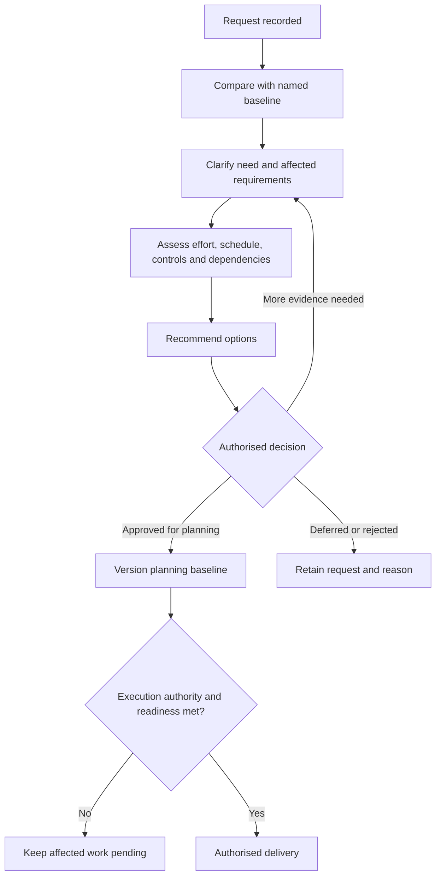

# Scope Change and Communication


## 1. What you will learn

Change is normal in an implementation. Discovery improves understanding, prototypes expose assumptions and stakeholders develop new expectations.

The consulting problem is not that requests change. It is that work, effort or commitments can change without a clear decision.

Your job is to make each material change understandable: what is requested, why it matters, what it affects, which options exist and who can decide.

By the end of this chapter, you should be able to:

- Compare a request with the applicable scope baseline.
- Analyse effects on requirements, architecture, effort, schedule, testing and ownership.
- Prioritise competing needs without hiding essential controls.
- Distinguish approval of planning scope from execution authority and acceptance.
- Record risks, issues, assumptions and dependencies.
- Produce a concise, evidence-based status report.
- Handle a steering review and preserve its decisions.
- Communicate exceptions and uncertainty without inventing progress.

Prerequisites and continuity

You need the scope, estimates, prototype and quality evidence from Chapters 5–11.


| Carried-forward item | State entering this chapter |
| --- | --- |
| Conditional core pilot | 78 base supplier hours plus 11.7 reserve; upper bound 89.7 |
| Conditional reporting option | 86 base hours plus 12.9 reserve; upper bound 98.9 |
| Requested ceiling | 100 supplier person-hours, including reserve |
| Elapsed ranges | Core 27–31 working days; reporting option 30–34 |
| Actual supplier effort | Not supplied |
| Native fit | Unverified |
| EVG-CHANGE-001 | Portal/routing deferred |
| EVG-CHANGE-002 | Weekly reporting pending |
| EVG-CHANGE-003 | Multi-site/multi-visit assessment only |
| EVG-CHANGE-004 | Automatic customer notification requested |
| EVG-CHANGE-005 | Automated Finance-handoff assessment requested |
| EVG-DEFECT-001 | Corrected and retested in local receiver V2 only |
| EVG-DEFECT-002 | Proposed sender-wrapper defect; recorded reproduction pending |
| Product readiness | No Zoho execution, client UAT or release acceptance |
| Migration exceptions | C04 unresolved; cancellation group held |

Your project contribution

You will produce:

1. A change-impact pack.
2. A prioritisation recommendation.
3. A risks/issues/assumptions/dependencies sheet.
4. A planning status report.
5. A steering decision record and updated planning baseline.

All Evergreen facts, estimates, dates and decisions are synthetic. Sample approval language is educational, not approved legal language or Wooplix policy.

This chapter supplies explicit fictional planning decisions. They are exercise evidence, not client signatures or approval of actual implementation.


## 2. Lessons


### 2.1 Compare the request with a named baseline

Skill: establish whether the request changes the work boundary.

A baseline is the reference against which proposed work is compared. Name its version and authority.

A request can already appear in the requirements register and still be outside the current scope. EVG-REQ-004 is a verified reporting need, but earlier pilot proposals excluded it.

Likewise, a new stakeholder request does not automatically alter an approved requirement or delivery plan.

Classify the request before estimating:


| Request type | Typical treatment |
| --- | --- |
| Clarification of existing behaviour | Refine wording and assess whether effort changes |
| Defect against the applicable requirement | Correct through quality management |
| Additional capability | Change-impact analysis |
| Removed capability | Assess lost outcome, controls and evidence |
| Changed constraint or availability | Revise assumptions, dependencies and forecast |
| Product-fit failure | Reopen architecture and scope assumptions |

Do not call every correction a change. Fixing a demonstrated failure against the applicable baseline is different from adding automatic customer emails.

Do not use “small change” as a classification. A small screen adjustment can affect access, integrations or acceptance criteria.

A useful response is:

“I have recorded the request. I will compare it with SB-02 v1.0 and identify the affected work and decision.”

That acknowledges the need without promising delivery.

Lesson check LC1: Why can reporting be a scope change even though EVG-REQ-004 is already verified?


### 2.2 Analyse impact across the engagement

Skill: explain what changes besides configuration effort.

Impact analysis examines the consequences of a request.

Cover:

- Business value and affected users.
- Requirement and acceptance changes.
- Product and architecture assumptions.
- Data, identity and environment needs.
- Configuration/development work.
- Tests, defects and retesting.
- Training, handover and support.
- Staff effort, reserve and elapsed schedule.
- Dependencies and decision owners.

A request for customer notification affects more than an email template. You need a trigger, recipient rule, permitted wording, outbound isolation and ownership.

For Evergreen, “service completed” must not imply that Finance has approved an invoice. A notification request therefore touches EVG-REQ-003 even if it does not change that requirement’s underlying control.

Separate quantities:

- Additional base effort: new work.
- Additional reserve: uncertainty associated with the revised base.
- Revised total: current scope plus the requested change.
- Elapsed impact: derived from dependencies and availability.

Do not put new features inside existing reserve. Reserve covers defined uncertainty, not unapproved scope.

Also distinguish supplier-hour ceilings from prices. One hundred person-hours is an effort constraint; no fee or payment arrangement is supplied.

Lesson check LC2: Name four impacts of an automatic completion email beyond preparing its text.


### 2.3 Prioritise conflicting needs using value, readiness and constraints

Skill: recommend an order without treating budget fit as the only criterion.

Priority and readiness are different.

A high-value request may remain unready because its rules or product fit are undefined. A lower-priority request may be ready and fit the current delivery boundary.

Use questions such as:

1. Does an essential control depend on this work?
2. What happens if it is deferred?
3. Is an authorised temporary method available?
4. Is the need sufficiently defined?
5. Does it introduce a new application or interface boundary?
6. Can it fit the effort and schedule constraints?
7. Who must accept the trade-off?

A Must control should not be removed silently to make another request fit. “Skip permission checks so we can add reporting” changes the quality and acceptance basis.

A temporary method must also be evidenced. “Staff can handle it manually” is not enough. Identify the records, owner, procedure and closure evidence.

Consider this disagreement:

Operations: “Multi-site coordination is urgent.”  

Sponsor: “Management reporting is what I need first.”  

Implementation Lead: “We need to distinguish the immediate operating need from the pilot expansion. Let us check whether the temporary site register is ready for the identified jobs, then compare the implementation options.”

This avoids deciding by volume, seniority or familiarity alone.

Lesson check LC3: Why can a high-priority multi-site request remain outside the current pilot while still requiring an immediate operational action?


### 2.4 Establish approval boundaries and decision rights

Skill: record exactly what was decided.

A steering group brings business and supplier owners together to review material decisions. Attendance does not give every participant authority over every subject.

Evergreen’s supplied decision rights remain:


| Decision | Owner |
| --- | --- |
| Planning scope and additional supplier work | Client Sponsor |
| Operational facts and temporary dispatch controls | Operations Manager |
| Finance disclosure, review and invoice authority | Finance Lead |
| Technical feasibility and supplier estimate recommendation | Implementation Lead |
| Product access and connection administration | Authorised Client Administrator |
| Acceptance evidence | Sponsor using relevant business-owner input |

Record approvals precisely:

- Which change?
- Which version?
- Which deliverable and requirement?
- Which effort and schedule assumptions?
- Which exclusions remain?
- Is this planning approval, execution authority or acceptance?
“Approved” without this context is ambiguous.

A planning baseline can be approved while execution remains blocked. Native-fit, access and environment evidence still matter.

Zoho’s Profiles API returns detailed permission information for a specific profile; a list of profile names and IDs is not equivalent evidence.1 A steering decision cannot turn that limited evidence into verified access.

Lesson check LC4: What is missing from the statement “The Sponsor approved reporting”?


### 2.5 Use risks, issues, assumptions and dependencies correctly

Skill: make uncertainty and current blockers actionable.

The common abbreviation RAID refers to risks, assumptions, issues and dependencies.


| Category | Meaning | Evergreen example |
| --- | --- | --- |
| Risk | An uncertain future event with an effect | Native-fit failure could increase effort |
| Issue | A condition that already exists | Specific permission evidence is missing |
| Assumption | An unconfirmed condition used for planning | One weekly report satisfies the reporting addition |
| Dependency | An input or decision needed before work proceeds | Authority and readiness evidence before product execution |

These categories can be linked. Missing permission evidence is an issue; its possible delay to delivery is a risk.

A useful entry includes owner, consequence, action and due date or decision trigger. “Permissions risk” is not actionable.

Do not record a requested date as a promised delivery date. State whether it is a request, confirmed commitment or unresolved expectation.

Do not mark an assumption resolved because nobody challenged it.

Lesson check LC5: Why is “we might lack permission details” the wrong description when those details are already missing?


### 2.6 Report status from evidence and ask for a decision

Skill: help stakeholders act rather than merely read updates.

A useful status report explains:

- Current phase and baseline.
- What evidence exists.
- What remains incomplete.
- Forecast effort and schedule.
- Material risks and issues.
- Decisions needed, owners and timing.
- Next authorised actions.

Do not invent a completion percentage. A local prototype running successfully does not mean the implementation is 80% complete.

This chapter uses synthetic status rules:


| Status | Rule for the current phase |
| --- | --- |
| Green | Current-phase forecast fits constraints, with no material unresolved decision threatening progression |
| Amber | Evidence or decisions remain that could affect the forecast or block progression |
| Red | A stated constraint is breached, or an essential operating control for an affected case is not satisfied |

Report dimensions separately. Planning can be Amber while a particular operational case is Red and product execution is Not ready.

A concise decision request is better than a vague warning:

“Please select the reporting-only option or authorise a revised ceiling. Reporting plus notification has a full-reserve forecast of 110.4 hours against 100.”

Lesson check LC6: Why should a status report separate planning forecast from execution readiness?


## 3. Visual explanation: controlled change




The diagram separates approving a proposal from starting work.

Deferred requests remain visible. Approval updates a specific reference; it does not silently erase assumptions or establish product readiness.


## 4. Worked case: prepare Evergreen’s steering options


### 4.1 New planning baseline

EVG-SRC-105 supplies this synthetic Sponsor instruction:

“Approve SB-02 v1.0 as the planning reference for the original single-current-visit pilot: 78 base supplier hours, 15% reserve and a 27–31-working-day range. The supplier ceiling is 100 hours including reserve. This is planning approval only. No tenant implementation or release is authorised.”

Earlier SB-01 drafts retain their earlier status.

Record EVG-DEC-035: use the explicitly supplied SB-02 v1.0 planning decision without implying execution authority.


### 4.2 Complete change-effort inputs

EVG-SRC-106 supplies conditional additional work estimates. All values are supplier person-hours.


| Change | Definition/design: Implementation Lead | Construction: Developer | Checks: Quality Lead |
| --- | --- | --- | --- |
| EVG-CHANGE-001: portal/routing assessment and candidate delivery | 6 | 14 | 4 |
| EVG-CHANGE-002: one weekly report | 5 | 0 | 2 |
| EVG-CHANGE-003: multi-site/multi-visit | 6 | 4 | 2 |
| EVG-CHANGE-004: customer notification | 3 | 4 | 2 |
| EVG-CHANGE-005: automated Finance handoff | 3 | 10 | 4 |

For reporting, the five Implementation Lead hours include definitions and configuration, consistent with Chapter 9.

Dependencies and uncertainty:


| Change | Dependency | Condition behind the estimate |
| --- | --- | --- |
| 001 | Audience/identity and routing rules; product boundary | No additional unassessed application/integration |
| 002 | Existing UTC definitions and approved report fields | One report, no extra dashboards |
| 003 | Visit/site model and independent rescheduling proof | Bounded original pilot, not fleet-wide redesign |
| 004 | Trigger, recipient, wording and outbound controls | No additional notification channel |
| 005 | Identified system, contract, identity and durable recovery design | No broader financial-process redesign |

Only the reporting option has a complete supplied elapsed schedule. Staff-hour estimates for the other requests are not delivery-date commitments.


### 4.3 Calculate the options

For any selected change:


> Revised upper bound = (core base+added base)×1.15

Reporting:


> (78+8)×1.15=98.9 hours

Multi-site:


> (78+14)×1.15=105.8 hours


| Option added to core | Revised base | Reserve | Upper bound |
| --- | --- | --- | --- |
| None | 78 | 11.7 | 89.7 |
| Portal/routing | 104 | 15.6 | 119.6 |
| Reporting | 86 | 12.9 | 98.9 |
| Multi-site | 92 | 13.8 | 105.8 |
| Notification | 88 | 13.2 | 101.2 |
| Automated handoff | 96 | 14.4 | 110.4 |
| Reporting and notification | 96 | 14.4 | 110.4 |
| Reporting and multi-site | 100 | 15 | 115 |

Headroom is not approved extra scope. A 1.1-hour margin does not authorise another feature.


### 4.4 Inspect the competing operational need

EVG-SRC-107 supplies ten upcoming synthetic jobs. This is a separate planning sample, not the migration dataset.

The temporary multi-site method is ready only when all four readiness fields are yes. Single-site rows are excluded from that readiness measure.


```csv
job_ref,site_count,site_register_ready,dispatcher_named,customer_confirmations_recorded,technician_acknowledgements_recorded
EVG-JOB-2101,1,not_applicable,not_applicable,not_applicable,not_applicable
EVG-JOB-2102,2,yes,yes,yes,yes
EVG-JOB-2103,1,not_applicable,not_applicable,not_applicable,not_applicable
EVG-JOB-2104,1,not_applicable,not_applicable,not_applicable,not_applicable
EVG-JOB-2105,2,yes,yes,yes,yes
EVG-JOB-2106,1,not_applicable,not_applicable,not_applicable,not_applicable
EVG-JOB-2107,1,not_applicable,not_applicable,not_applicable,not_applicable
EVG-JOB-2108,2,yes,yes,yes,yes
EVG-JOB-2109,1,not_applicable,not_applicable,not_applicable,not_applicable
EVG-JOB-2110,1,not_applicable,not_applicable,not_applicable,not_applicable
```

Three of ten have multiple sites:


> (3) ÷ (10)×100=30%

All three meet the supplied temporary-readiness rule:


> (3) ÷ (3)×100=100%

These describe the synthetic sample, not Evergreen’s normal operating performance.

The temporary method preserves one business job reference with site-labelled visit rows. Operations oversees it; Dispatch maintains coordination evidence.


### 4.5 Resolve the discussion without inventing agreement

EVG-SRC-108 supplies a fictional steering conversation:

Operations: “Multi-site coordination is urgent.”  

Sponsor: “Can we add reporting and notification within one hundred hours?”  

Finance: “Any customer wording must distinguish service completion from my review.”  

Implementation Lead: “Reporting and notification total 110.4 hours with the supplied reserve. Reporting alone is 98.9. The three identified multi-site cases currently meet the temporary control rule, while the expanded product design still needs proof.”

EVG-SRC-109 confirms that native-fit and specific permission evidence remain missing. Administrator evidence is requested by 2 February 2027; that date is not a confirmed promise.

EVG-SRC-110 confirms Finance’s review/disclosure controls cannot be removed through a majority vote.

EVG-SRC-111 confirms no actual supplier hours, product progress percentage or supported calendar launch date is available.

A defensible recommendation is:

- Approve reporting for the planning baseline if the Sponsor accepts the stated conditions.
- Retain multi-site as a high operational priority, using the evidenced temporary method for the identified cases.
- Keep notification and automated integration outside the baseline.
- Preserve essential tests and reserve.
- Obtain readiness evidence before execution.

Record EVG-DEC-036: recommend the reporting-only planning option while preserving controls and unresolved proof conditions.


### 4.6 Completed change-impact entry


| Field | EVG-CHANGE-002 assessment |
| --- | --- |
| Request | Add one weekly open/completed report |
| Requirement/test | EVG-REQ-004 / EVG-TEST-009 |
| Deliverable | EVG-DEL-007 |
| Baseline affected | SB-02 v1.0 excludes reporting |
| Added base | Eight hours: six Implementation Lead, two Quality Lead |
| Added full-reserve forecast | 98.9 − 89.7 = 9.2 hours |
| Elapsed effect | Core 27–31 becomes reporting option 30–34 working days |
| Assumption | One report using established UTC definitions |
| Exclusions retained | Notification, portal/routing, multi-site expansion, live integration, production migration/release |
| Decision needed | Sponsor’s planning-scope decision |
| Execution status | Not authorised |


### 4.7 Completed RAID sheet


| ID/type | Condition and effect | Owner | Action/trigger |
| --- | --- | --- | --- |
| EVG-RISK-001 | Native-fit failure could increase effort or alter architecture | Implementation Lead | Complete authorised product proof before commitment |
| EVG-ISSUE-001 | Specific permissions/readiness evidence is missing now | Client Administrator | Supply permitted evidence; 2 February requested, unconfirmed |
| EVG-ASM-006 | One weekly report satisfies the addition | Sponsor/Operations | Confirm fields/output before design |
| EVG-DEP-001 | Authority and environment evidence required before product execution | Sponsor/Administrator | Record authority and readiness separately |
| EVG-RISK-002 | Temporary multi-site coordination may lose synchronisation | Operations | Monitor site register and acknowledgements for identified cases |
| EVG-ISSUE-002 | Sender-wrapper reproduction evidence is absent | Developer/Quality Lead | Reproduce EVG-DEFECT-002 locally and record result |
| EVG-RISK-003 | Notification wording could imply Finance approval | Finance Lead | Resolve trigger/content before any delivery decision |

A mistake and its correction

Mistake: “Reporting fits, so the project is Green and ready to build.”

Correction: “The reporting forecast fits the effort ceiling. Planning remains Amber because product-fit and readiness evidence are unresolved. Execution remains Not ready.”


## 5. Try it yourself — guided practice

Learning goal and complete inputs

Handle a supplied steering decision and produce an updated baseline and status report.

Use all worked-case inputs plus these new synthetic sources:


| Source ID | Supplied input |
| --- | --- |
| EVG-SRC-112 | Sponsor: “Approve EVG-CHANGE-002 for SB-02 v1.1 planning scope: 86 base hours, 12.9 reserve, upper bound 98.9 and 30–34 working days from a future authorised start. No execution authority or approval of other changes.” |
| EVG-SRC-113 | Administrator has not confirmed the evidence-delivery date. The requested 2 February date remains unconfirmed. |
| EVG-SRC-114 | Developer has not supplied recorded reproduction of EVG-DEFECT-002. EVG-DEFECT-001 remains locally retested only. |

Use 31 January 2027 as the synthetic status date.

Steps and expected intermediate results

1. Classify the approval.  

Expected: reporting is planning-approved; execution and acceptance are not.

2. Update SB-02’s version.  

Expected: v1.0 preserved; v1.1 adds EVG-REQ-004, EVG-DEL-007 and EVG-TEST-009.

3. Update the forecast.  

Expected: 98.9 upper bound with 1.1 hours of headroom, not discretionary scope.

4. Update RAID and change states.  

Expected: missing evidence and reproduction remain open.

5. Write a one-page status report.  

Expected: current phase, evidence, forecast, blockers and decisions are distinguishable.

6. Respond to the launch-date question.  

Expected: no calendar commitment inferred from planning approval.

Blank change-impact worksheet


| Field | Your entry | Guidance |
| --- | --- | --- |
| Change ID/requester |  | Preserve the original request |
| Baseline/version |  | Identify the comparison reference |
| Need and affected records |  | Requirement, deliverable and test links |
| Work breakdown |  | Roles, person-hours and dependencies |
| Forecast/reserve |  | Revised total and uncertainty |
| Elapsed schedule |  | Use a supplied feasible plan or state the missing dependency |
| Options/consequences |  | Include deferral and control implications |
| Decision/status |  | Planning, execution or acceptance; source |
| Communication |  | Owner, next action and date status |

Blank status worksheet


| Status field | Your entry | Guidance |
| --- | --- | --- |
| As-of date/current phase |  | Identify the reporting point |
| Applicable baseline |  | Version and supplied authority |
| Evidence/progress |  | Observations without invented percentages |
| Effort/schedule forecast |  | Separate staff units and elapsed range |
| Material RAID |  | Owner and action |
| Change decisions |  | Approved, pending, deferred or rejected |
| Decision requests |  | Specific question and decision owner |
| Next authorised activity |  | Respect readiness and authority |

Final artifacts: SB-02 v1.1, updated change/RAID sheets and Planning Status Report v0.1.

Cleanup: retain prior versions and source decisions. Remove duplicate scratch drafts. No tenant cleanup applies.


## 6. Independent challenge

Changed constraints

Use 1 February 2027 as the new synthetic status date.


| Source ID | Changed input |
| --- | --- |
| EVG-SRC-115 | Operations reports EVG-JOB-2105’s second technician acknowledgement is missing. Other readiness fields and jobs are unchanged. The affected visit is planned for 3 February. Operations may hold dispatch until the rule is satisfied. |
| EVG-SRC-116 | Sponsor requests one additional technician dashboard beyond the approved weekly report. No change approval is supplied. |
| EVG-SRC-117 | Dashboard estimate: Implementation Lead definitions/configuration 3 hours, documentation 1 hour, Quality Lead checks 2 hours. It follows reporting preparation and requires revised review availability; no elapsed schedule is supplied. |
| EVG-SRC-118 | Sponsor is unavailable for another scope decision until 4 February, with no delegated scope approver. Administrator evidence date remains unconfirmed. |

Record the dashboard request as EVG-CHANGE-006, linked to candidate EVG-REQ-017.

Deliverables

Produce:

1. Dashboard impact analysis against SB-02 v1.1.
2. Revised effort/reserve calculation and ceiling comparison.
3. Temporary-method readiness calculation.
4. Updated RAID and status report.
5. Immediate recommendation for EVG-JOB-2105.
6. A decision request for the Sponsor.

Success criteria

Preserve the approved planning baseline while the dashboard remains pending. Do not start new work or use reserve for it.

Recognise the missing acknowledgement as a current issue. Do not wait for the Sponsor to exercise Operations’ existing authority over dispatch readiness.

Do not invent dashboard schedule dates or claim the visit has actually been held.


## 7. Common problems and recovery


| Symptom | Diagnosis | Correction |
| --- | --- | --- |
| Request treated as approval | Decision state omitted | Record requester, owner and explicit approval type |
| Reserve funds a dashboard | New scope hidden as uncertainty | Add base work and recalculate reserve |
| Urgent request bypasses controls | Priority confused with authority | Use authorised operational containment; assess scope separately |
| “Agreed” without version | Approval reference unclear | Identify change, version, effort and boundaries |
| Local defect described as product-fixed | Evidence scope broadened | State local retest and remaining product checks |
| Date request reported as a promise | Schedule certainty overstated | Label requested/unconfirmed dates |
| Status percentage has no denominator | Progress fabricated | Report completed evidence and remaining work |
| Two current baseline copies differ | Version control failed | Issue a clearly identified superseding planning version |
| New issue remains called a risk | Existing problem hidden | Record issue and immediate action |

If an inaccurate commitment has been circulated, issue a versioned correction identifying the affected statement and decision. Editing your own copy does not correct everyone’s understanding.

Scope communication does not establish technical recovery. Existing client support retains operational incidents unless a separate service is authorised.


## 8. Check your understanding

1. What makes a change-impact analysis more than an added-hour estimate?
2. Why can planning approval coexist with execution Not ready?
3. Which current Evergreen items are issues rather than only risks?
4. What should happen when a requested dashboard exceeds the effort ceiling?
5. Why should high priority not override Finance’s review boundary?
6. What evidence is needed before calling a requested date a commitment?
7. How should an unconfirmed assumption appear in a status report?
8. Why must a status report distinguish local tests from product acceptance?

## 9. Solutions and explanations


### 9.1 Lesson checks

LC1: Verification confirms the need. Scope selection determines whether the current engagement delivers it. Reporting was previously excluded.

LC2: Trigger, recipient identity, Finance wording, outbound isolation, testing, support ownership and delivery authority are all relevant.

LC3: The product expansion may lack definition or fit evidence. The immediate operating case still needs a safe temporary method or hold.

LC4: Change ID, version, deliverable, effort, schedule conditions, exclusions and whether approval concerns planning, execution or acceptance.

LC5: The absence exists now, so it is an issue. A possible future delay from that absence is a linked risk.

LC6: A forecast fitting the ceiling does not establish product permissions, readiness, authority or acceptance.


### 9.2 Guided practice solution

Updated planning baseline

SB-02 v1.1 — case-approved for planning only


| Field | Completed content |
| --- | --- |
| Authority | EVG-SRC-112 |
| Added scope | One weekly report, EVG-REQ-004 / EVG-DEL-007 |
| Added check | EVG-TEST-009 |
| Base/reserve | 86 + 12.9 = 98.9 supplier hours |
| Client participation | 13 hours under the prior supplied plan |
| Elapsed range | 30–34 working days from a future authorised start |
| Exclusions | Other change requests, production migration/release and new support |
| Execution/acceptance | Not authorised/not supplied |
| Version treatment | SB-02 v1.0 retained as prior planning reference |

Record EVG-DEC-037: apply the supplied reporting planning decision to v1.1 without extending its authority.

Completed status report

Evergreen Planning Status Report v0.1 — 31 January 2027


| Item | Status/content |
| --- | --- |
| Current phase | Planning and local/reference investigation |
| Baseline | SB-02 v1.1, reporting planning-approved |
| Planning status | Amber |
| Execution readiness | Not ready |
| Supplier forecast | 86–98.9 person-hours; 1.1 below ceiling at upper bound |
| Elapsed forecast | Conditional 30–34 working days; calendar start unassigned |
| Evidence available | Requirements, proposed design/access/migration packs; local receiver V2 reference checks |
| Evidence limitations | No Zoho execution, client UAT or release acceptance |
| Material issues | Readiness evidence missing; sender-wrapper reproduction pending |
| Other changes | 001 deferred; 003 assessment; 004/005 requested, not approved |
| Immediate actions | Obtain permitted evidence; maintain temporary multi-site controls; complete local reproduction |
| Decisions requested | Confirm reporting output boundary and readiness route |
| Launch statement | Earlier preferred date is not a supported commitment |

No actual-effort total or implementation completion percentage is supplied.

A suitable response is:

Reporting is now in the planning baseline, with a conditional 30–34-working-day range. The calendar start depends on authority and readiness, and native fit remains unverified. We cannot present the preferred launch date as a supported commitment.


### 9.3 Independent challenge solution

Dashboard estimate

Additional base:


> 3+1+2=6 hours

Revised base:


> 86+6=92 hours

Reserve:


> 92×0.15=13.8 hours

Upper bound:


> 92+13.8=105.8 hours

Ceiling excess:


> 105.8-100=5.8 hours

The dashboard does not fit the current ceiling with the supplied reserve rule.

Options include:

- Defer the dashboard and retain SB-02 v1.1.
- Request a revised ceiling.
- Assess an explicitly authorised scope trade.
- Propose a separately reviewed reserve change.

No option is approved merely because it is listed.

Completed change entry


| Field | EVG-CHANGE-006 |
| --- | --- |
| Need | Technician dashboard |
| Candidate requirement | EVG-REQ-017 |
| Baseline | Outside SB-02 v1.1 |
| Additional base | Six hours |
| Revised upper bound | 105.8 hours |
| Constraint | Exceeds 100 by 5.8 |
| Schedule | Not baselined; revised review availability missing |
| Decision owner | Sponsor, next available 4 February |
| Status | Requested, pending |
| Recommendation | Keep outside the baseline until decision |

Readiness

The three multi-site jobs remain the denominator. Two satisfy all four conditions.


> (2) ÷ (3)×100≈66.67%

EVG-JOB-2105 is not ready because one required acknowledgement is missing.

This is a temporary-method readiness measure, not project completion.

Add EVG-ISSUE-003:


| Field | Completed entry |
| --- | --- |
| Condition | Second technician acknowledgement missing for EVG-JOB-2105 |
| Effect | Temporary dispatch-readiness rule not satisfied |
| Owner | Operations Manager; Dispatch obtains evidence |
| Immediate recommendation | Hold the affected dispatch until acknowledgement is confirmed |
| Scope effect | Does not approve multi-site software expansion |
| Evidence status | Issue supplied; hold action not observed |

Record EVG-DEC-038: recommend using Operations’ existing readiness authority while the scope request waits.

Revised status summary

Planning Status Report v0.2 — 1 February 2027


| Dimension | Status |
| --- | --- |
| Applicable baseline | SB-02 v1.1 unchanged |
| Baseline forecast | 98.9 upper bound remains within 100 |
| Dashboard option | 105.8; exceeds ceiling; not approved |
| Overall planning | Amber |
| Affected operational case | Red: EVG-JOB-2105 readiness incomplete |
| Product execution | Not ready |
| Next scope decision | Sponsor available 4 February |
| Immediate owner action | Operations/Dispatch address missing acknowledgement before affected visit |

A suitable Sponsor request is:

The additional dashboard requires six base hours and produces a 105.8-hour full-reserve forecast, 5.8 above the ceiling. Please decide whether to defer it, revise the ceiling or assess a scope trade. SB-02 v1.1 remains the planning reference. Separately, Operations is being asked to contain the incomplete acknowledgement for EVG-JOB-2105 under its existing authority.


### 9.4 Understanding check answers

1. It covers outcomes, architecture, data, controls, tests, responsibilities, dependencies and schedule as well as effort.
2. Approval of selected work does not supply product evidence or execution authority.
3. Missing readiness evidence, missing sender reproduction and the newly missing acknowledgement are current issues.
4. Keep it pending and present options; do not absorb it silently into reserve.
5. Priority does not remove the Finance decision right or the confirmed control.
6. An authorised, explicit commitment with a defined scope and supported conditions.
7. State its owner, impact if false and required confirmation.
8. Local evidence checks a model/component. Product acceptance requires appropriate actual environment and business evidence.

## 10. Chapter recap and next step

Change control makes decisions visible. Good communication explains what changed, what remains conditional and who must act.

Your strongest status report is not the most optimistic one. It is the one that lets the client distinguish approved scope, unresolved requests, current issues and supported forecasts.

Completion checklist

- I can compare requests with a named baseline.
- I can analyse effort, schedule, control and ownership effects.
- I can prioritise competing needs with evidence.
- I can distinguish planning, execution and acceptance decisions.
- I can maintain actionable RAID information.
- I can report status without invented progress.
- I can handle an urgent operational exception within existing authority.
- I can preserve decisions and baseline versions.

Your project pack now contains handled change scenarios, a steering recommendation, a supplied planning decision and status communication.

Chapter 13, User Acceptance Testing, builds business-led scenarios, representative roles, expected results, traceability, defect decisions and acceptance evidence. The approved planning scope and unresolved readiness conditions provide its starting boundary.


## 11. Glossary and further reading

Glossary


| Term | Meaning |
| --- | --- |
| Change-impact analysis | Evaluation of a request’s effects across delivery |
| Decision right | Authority to make a defined decision |
| Headroom | Difference between a forecast and a stated ceiling |
| Issue | Existing condition requiring action |
| Planning baseline | Approved reference for planned scope and forecast |
| RAID | Risks, assumptions, issues and dependencies |
| Risk | Uncertain event that could affect an outcome |
| Scope trade | Explicit exchange of included work and its consequences |
| Steering review | Business/supplier review of material decisions and exceptions |
| Status report | Evidence-based account of position, forecast, blockers and decisions |

Further reading

1. Zoho CRM API v8 — Get Profiles  
[Open official reference](https://www.zoho.com/crm/developer/docs/api/v8/get-profiles.html)

Useful when evaluating whether access evidence is sufficient: detailed permissions require specific-profile retrieval rather than a profile list alone.

The official reference was accessed on 5 October 2026. Confirm the applicable edition, permissions and environment before using product-specific procedures. The cited product-evidence distinction is documentation-based; Evergreen’s configured permissions and product behaviour remain unverified. No Zoho execution, actual client signature or release acceptance is claimed.
