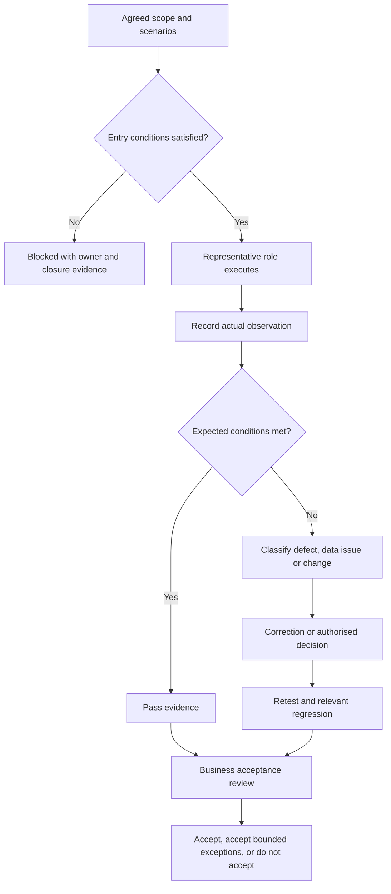

# User Acceptance Testing


## 1. What you will learn

Supplier testing asks whether the solution behaves as specified. User acceptance testing, or UAT, asks whether authorised business representatives can use the delivered solution to perform the agreed work under representative conditions.

UAT is more than a demonstration. Participants need scenarios, suitable data, their intended access, expected results and a way to record what actually happened.

By the end of this chapter, you should be able to:

- Build business-led acceptance scenarios.
- Select representative roles and records.
- Define observable expected results.
- Link scenarios to requirements, acceptance criteria and supplier tests.
- Record pass, fail, blocked and not-run results accurately.
- Handle defects, retesting and proposed exceptions.
- Produce acceptance evidence without inventing participation or signatures.
- Explain whether the evidence supports acceptance or further investigation.

Prerequisites and continuity

You need the requirements register, Chapter 10 reference prototype, Chapter 11 quality records and Chapter 12 planning baseline.


| Carried-forward item | State entering this chapter |
| --- | --- |
| Planning baseline | SB-02 v1.1 includes one weekly report |
| Supplier forecast | 86–98.9 person-hours |
| Planning authority | Supplied as a fictional case decision; execution remains unauthorised |
| Native fit and permissions | Unverified |
| EVG-CHANGE-006 | Additional technician dashboard pending |
| EVG-JOB-2105 | Missing second technician acknowledgement; operational hold recommended, not observed |
| EVG-DEFECT-001 | Local receiver defect corrected/retested |
| EVG-DEFECT-002 | Sender-wrapper reproduction pending |
| Actual product UAT | Not started |
| Release acceptance | None supplied |

EVG-SRC-119 authorises a local UAT rehearsal and acceptance-plan documents. It does not authorise Zoho execution.

This chapter therefore gives you a complete rehearsal using the Chapter 10 model and a reporting adapter. The rehearsal supports scenario design and evidence handling. It does not substitute for business-led testing of the actual product.

Your project contribution

You will produce:

1. A UAT plan and scenario pack.
2. A role and readiness sheet.
3. A traceable evidence ledger.
4. Defect and retest records.
5. An acceptance recommendation with explicit limits.

All Evergreen facts, records, rules and dialogue are synthetic. Local reference observations are identified separately from product observations and client decisions.


## 2. Lessons


### 2.1 Start from business work, not screens

Skill: define what a participant must accomplish.

A UAT scenario should describe a business task.

Weak scenario:

“Open the job screen and click Complete.”

Better scenario:

“As the assigned technician, record a completed service. Confirm that incomplete information does not enter Finance review and that completion does not release an invoice.”

The second scenario explains the purpose and control.

A scenario needs:

- Business objective.
- Requirement and acceptance links.
- Intended participant.
- Starting state.
- Complete input records.
- Actions.
- Expected intermediate and final results.
- Evidence to capture.
- Cleanup or reset conditions.

Use ordinary business language. Technical checks can support the scenario, but they should not obscure the work.

A participant should be able to explain why a result is correct. If Finance sees “Received,” ask whether that represents receipt, review or release. The expected interpretation matters as much as the visible label.

A happy-path scenario alone is insufficient. Include exceptions that materially affect the agreed process: incomplete completion data, wrong-role access, rescheduling and cancellation.

Lesson check LC1: Why is “the Complete button works” insufficient evidence for EVG-REQ-003?


### 2.2 Use representative people, roles and data

Skill: make the acceptance exercise resemble intended use.

Representative users are not simply the people available first.

Evergreen needs Operations, Dispatch, assigned technicians and Finance because they perform different work and hold different authority.

A consultant using an administrator account cannot prove a Dispatcher’s field visibility. A Technician Lead may explain the process, but actual technician access still needs representative evidence.

Plan participant coverage:


| Business role | Intended representative | Responsibility in UAT |
| --- | --- | --- |
| Sponsor | Morgan Shaw | Acceptance decision using owner input |
| Operations | Priya Rao | Intake, corrections and operational exceptions |
| Dispatch | Tessa Reed | Visibility, scheduling and acknowledgements |
| Technicians | T1/T2, selected through Daniel Okafor | Assigned-work completion and reschedule participation |
| Finance | Luis Chen | Handoff review and disclosure controls |
| Supplier support | Jordan Ellis and Sam Torres | Clarify, record evidence and investigate; do not impersonate client acceptance |

These are planned synthetic participants, not evidence of attendance.

Data should include ordinary records and relevant exceptions. Preserve stable business references so that evidence can be traced.

Use a known snapshot and build. If configuration changes during testing, record which cases used each version. Do not attach results from an earlier build to a later one without assessing their validity.

Lesson check LC2: Why should an administrator’s view not be recorded as a successful Dispatch access test?


### 2.3 Establish entry conditions before recording product results

Skill: identify whether the test can legitimately begin.

Entry conditions are prerequisites for the intended UAT activity.

For actual product UAT, Evergreen needs:

- Applicable scope and acceptance criteria.
- Execution authority.
- Identified environment and build.
- Representative user identities and effective permissions.
- Approved, loaded test data.
- Supplier checks and known-defect information.
- Evidence-capture and correction arrangements.

The organisation API can supply environment type and organisation identity under appropriate permission.2 The Profiles API gives detailed permissions when retrieving a specific profile.1 Neither route has been executed for this chapter.

A known edition or profile name is not enough.

When prerequisites are missing, record Blocked or Not started, with an owner and required evidence. Do not fill the observation column with the expected result.

A local rehearsal can still proceed under its own authority. Its environment is the local reference model, its identities are model labels and its evidence is limited accordingly.

Lesson check LC3: What should you record when a confidential-field scenario cannot be executed with an actual Dispatch identity?


### 2.4 Separate expected results from observations

Skill: create evidence another reviewer can interpret.

An expected result comes from the requirement and scenario rules. An observation records what happened during execution.

A useful evidence record contains:


| Field | Purpose |
| --- | --- |
| Scenario and test IDs | Link the observation to the intended check |
| Build/environment | Identify what was exercised |
| Participant/identity | Identify who acted |
| Input records | Make the case reproducible |
| Expected result | State the acceptance condition |
| Actual observation | Describe the result without interpretation being hidden |
| Status | Pass, fail, blocked or not run |
| Defect/change link | Route exceptions |
| Evidence location | Identify the capture or record |
| Business decision | Record the authorised interpretation separately |

A screenshot without identity, build or scenario context may be insufficient. A typed “Pass” is not evidence of the action.

Use statuses consistently:

- Pass: the stated case was executed and its expected conditions met.
- Fail: execution produced nonconformance.
- Blocked: a prerequisite prevented execution.
- Not run: the case was not attempted.

A correct denial is a pass for a negative-access scenario. A blocked scenario is not a failure of the solution.

Lesson check LC4: Why must blocked cases remain visible when calculating executed-case pass rate?


### 2.5 Handle defects and exceptions through business decisions

Skill: avoid accepting a failure by changing the expected result.

When a result differs, first classify it:

- Defect against the applicable criterion.
- Invalid test data.
- Incorrect execution.
- Ambiguous requirement.
- New request.
- Missing prerequisite.

Do not rewrite the expected result to match the screen.

A requirement marked Should can still be included in the agreed scope. Evergreen’s weekly report is now included in SB-02 v1.1. Its incorrect count requires correction or an explicit scope/acceptance decision.

An acceptance exception records a proposed deviation, impact, workaround, owner and treatment. It is not automatically acceptable.

For this exercise, EVG-SRC-120 supplies these rules:

- Actual product UAT must cover all eight agreed scenario groups.
- No unresolved S1 or S2 failure may be accepted.
- S3/S4 deviations require an explicit Sponsor decision with the affected business owner.
- A workaround must be demonstrated, owned and bounded.
- Local rehearsal results cannot accept the actual product.
- There is no percentage-pass threshold that overrides these conditions.

These are synthetic case rules, not course passing rules.

Lesson check LC5: Why is “reporting is only a Should” insufficient justification for ignoring a wrong report?


### 2.6 Retest changes and record acceptance precisely

Skill: connect the decision to the applicable evidence.

Retest the original failure after correction. Then check related behaviour affected by the change.

For a report filter correction, test:

- The original weekly dataset.
- Week-start and week-end boundaries.
- Cancelled/open treatment.
- Older completions.

For a public projection correction, test:

- Dispatch output.
- Other permitted operational views.
- Finance’s permitted private view.
- Relevant enabled product access paths.

Do not rerun unrelated work merely to make the evidence pack larger. Choose regression from the changed component and risk.

An acceptance record should identify scope, version, evidence, open exceptions, owners and decision source. Do not invent a signature, participant or approval.

Acceptance also differs from release. Even accepted functionality may lack migration, cutover, recovery or support readiness. Chapter 14 addresses those conditions.

Lesson check LC6: Why does a corrected local reporting result not establish product acceptance?


## 3. Visual explanation: evidence and decision flow




The flow begins with readiness. Expected behaviour cannot fill a missing observation.

The final decision belongs to the authorised business process. Supplier support provides evidence and recommendations.


## 4. Worked case: build and rehearse Evergreen’s UAT pack


### 4.1 Scope and readiness

EVG-SRC-120 approves the scenario-plan boundary for the exercise, not the implemented product.

EVG-SRC-124 supplies the current readiness manifest:


| Entry condition | Evidence |
| --- | --- |
| Planning scope | SB-02 v1.1 supplied |
| Product execution authority | None |
| Actual environment/build | Organisation types known; IDs/build not supplied |
| Representative identities | Intended roles known; effective accounts not evidenced |
| Loaded test data | Local fixtures only |
| Supplier product checks | Local reference checks only |
| Defect information | Local defects distinguished from product issues |
| Evidence/correction plan | Designed in this chapter |

The local rehearsal can proceed. Actual product UAT cannot.

Record EVG-DEC-039: maintain separate local-rehearsal and product-UAT evidence.


### 4.2 Completed scenario and traceability pack


| UAT ID | Business scenario | Requirements | Acceptance/test links |
| --- | --- | --- | --- |
| EVG-UAT-001 | Record two requests and prevent duplicate business reference | EVG-REQ-001 | EVG-AC-001A–B; EVG-TEST-001 |
| EVG-UAT-002 | Find a customer’s open jobs, status and technician | EVG-REQ-002 | EVG-AC-002A; EVG-TEST-002 |
| EVG-UAT-003 | Complete service, reject missing summary and preserve Finance review | EVG-REQ-003, 007, 013 | EVG-AC-003A–C, 004A–B; EVG-TEST-003–004, 015 |
| EVG-UAT-004 | Permit nonfinancial visibility and deny restricted Finance content | EVG-REQ-008, EVG-NFR-001 | EVG-AC-005A–C; EVG-TEST-005, 010, 012 |
| EVG-UAT-005 | Reschedule with technician change and retain history | EVG-REQ-009 | EVG-AC-007A; EVG-TEST-006, 013 |
| EVG-UAT-006 | Produce the agreed weekly counts | EVG-REQ-004 | EVG-AC-006A–B; EVG-TEST-009 |
| EVG-UAT-007 | Distinguish pre-start cancellation from post-start change | EVG-REQ-010–011 | EVG-AC-008A, 009A; EVG-TEST-007–008 |
| EVG-UAT-008 | Retain return and correction evidence | EVG-REQ-007, EVG-NFR-002 | EVG-AC-NFR-002A–B; EVG-TEST-011 |

Other access, identity, migration and supplier checks remain readiness/supporting evidence. These eight groups do not erase their requirements.


### 4.3 Complete workflow inputs

Use the complete Prototype class from Chapter 10 as an explicitly supplied prerequisite. Its actor labels are OPS, DSP, T1, T2 and FIN.

EVG-SRC-121 supplies these fixtures. All workflow times are UTC on 4 February 2027.

Intake and Finance fixture


| Action | Actor/time | Inputs |
| --- | --- | --- |
| intake | OPS 08:00 | EVG-JOB-2201, EVG-CUST-0101 |
| intake | OPS 08:05 | EVG-JOB-2202, EVG-CUST-0101 |
| duplicate intake attempt | OPS 08:06 | EVG-JOB-2201 again |
| plan job 2201 | DSP 08:20 | EVG-APPT-9001, T1, slot 09:00–10:00, customer confirmed 08:10 |
| ack | T1 08:25 | Job 2201 |
| start | T1 09:00 | Job 2201 |
| invalid complete | T1 09:30 | Date 4 February; blank summary |
| complete | T1 10:00 | Summary “Replaced filter” |
| review | FIN 10:10 | Returned; private reason “Rate clarification required” |
| correct | T1 10:15 | Summary “Replaced filter and confirmed service details” |
| review | FIN 10:20 | Review complete |

Reschedule fixture


| Action | Actor/time | Inputs |
| --- | --- | --- |
| intake | OPS 08:00 | EVG-JOB-2203, EVG-CUST-0102 |
| plan | DSP 08:20 | EVG-APPT-9003, T2, 11:00–12:00, customer confirmed 08:10 |
| ack | T2 08:25 | Job 2203 |
| replacement plan | DSP 08:30 | EVG-APPT-9013, T1, 13:00–14:00, customer confirmed 08:26, T2 withdrawal 08:28 |
| ack | T1 08:35 | Job 2203 |

Designed cancellation cases

These inputs are complete, but the worked reference session stops before executing them:

- Pre-start: EVG-JOB-2204, customer 0103; appointment 9004 with T1 at 14:00–15:00; customer confirmed 08:10 and technician acknowledged 08:25; work not started. Verified request at 09:00 from customer0103@evergreen.example.com, reason “Customer unavailable.”
- Post-start: EVG-JOB-2205, customer 0102; appointment 9005 with T2 at 11:00–12:00; customer confirmed 08:10 and technician acknowledged 08:25; actual start 11:00. Verified request at 11:20 from customer0102@evergreen.example.com, reason “Customer cannot wait.”

Use ordinary intake at 08:00 and planning at 08:20 for each cancellation fixture.


### 4.4 Complete reporting data and faulty adapter

The reporting week is 25–31 January 2027 UTC. Completed count uses:


> 2027-01-25\ 00{:}00 ≤ completion time <2027-02-01\ 00{:}00

Open count uses the supplied state at 31 January 23:59 UTC.


| Job | State at cutoff | Completion timestamp |
| --- | --- | --- |
| EVG-JOB-1501 | open | None |
| EVG-JOB-1502 | completed | 21 January 10:00 UTC |
| EVG-JOB-1503 | cancelled | None |
| EVG-JOB-1504 | completed | 26 January 15:00 UTC |
| EVG-JOB-1505 | open | None |

EVG-SRC-123 supplies the local reporting adapter:


```python
from datetime import datetime

ROWS = [
    ("EVG-JOB-1501", "open", None, False),
    ("EVG-JOB-1502", "completed", "2027-01-21T10:00:00Z", False),
    ("EVG-JOB-1503", "cancelled", None, True),
    ("EVG-JOB-1504", "completed", "2027-01-26T15:00:00Z", False),
    ("EVG-JOB-1505", "open", None, False),
]


def utc(text):
    return datetime.fromisoformat(text.replace("Z", "+00:00"))


def weekly_report(rows, version):
    opened = sum(
        not cancelled and state != "completed"
        for _, state, _, cancelled in rows
    )
    if version == "V1":
        completed = sum(state == "completed"
                        for _, state, _, _ in rows)
    else:
        start = utc("2027-01-25T00:00:00Z")
        end = utc("2027-02-01T00:00:00Z")
        completed = sum(
            timestamp is not None and start <= utc(timestamp) < end
            for _, _, timestamp, _ in rows
        )
    return {"open": opened, "completed": completed}


if __name__ == "__main__":
    print("V1:", weekly_report(ROWS, "V1"))
    print("V2:", weekly_report(ROWS, "V2"))
```

V1 counts all completed statuses, regardless of week. V2 applies the agreed date window.


### 4.5 Reference observations and defect

The workflow, reschedule, history and report conditions above were checked in a local reference verification. No business participant or Zoho identity is claimed.


| Scenario | Local observation or limitation |
| --- | --- |
| 001 | Two distinct jobs; duplicate rejected; timestamps retained |
| 002 | Model has no customer-search implementation |
| 003 | Blank summary rejected; valid handoff enters review; model invoice marker stays false |
| 004 | No authenticated product roles or effective-permission evidence |
| 005 | Original retained as Superseded; replacement pending, then Confirmed after T1 acknowledgement |
| 006 | V1 returns open 2, completed 2; expected completed count is 1 |
| 007 | Complete inputs supplied, but case not attempted |
| 008 | Original private return retained; correction actor/time and eight job-2201 events retained |

The reporting reference output is:

V1: {'open': 2, 'completed': 2}

V2: {'open': 2, 'completed': 1}

EVG-DEFECT-003 — local weekly report includes out-of-week completion


| Field | Completed record |
| --- | --- |
| Requirement/test | EVG-REQ-004 / EVG-TEST-009 / EVG-UAT-006 |
| Component | Local report adapter V1 |
| Expected | Open 2; completed 1 |
| Observed reference result | Open 2; completed 2 |
| Severity | S3 Moderate under the supplied exercise scale |
| Root cause | Completed count checks status but omits the reporting window |
| Correction | V2 applies inclusive start/exclusive end |
| Retest | Same five records |
| Reference retest | Open 2; completed 1 |
| Remaining proof | Actual report configuration and business UAT |

This is separate from the earlier correction to Chapter 4’s answer. The expected count remains one; V1 is a newly supplied faulty adapter.

Record EVG-DEC-040: preserve the agreed date criterion and correct the adapter rather than changing the expected count.


### 4.6 Interpret the measures

Initial local session:


> 8=4 pass+1 fail+2 blocked+1 not run

Executed cases:


> 4+1=5

Executed-case pass rate:


> (4) ÷ (5)×100=80%

Execution coverage:


> (5) ÷ (8)×100=62.5%

After the report retest, five executed local cases pass. Coverage remains 62.5%.

A 100% pass rate among five local cases does not mean all eight cases ran, or that product UAT occurred.


## 5. Try it yourself — guided practice

Learning goal and access

Facilitate a local rehearsal, complete evidence and prepare a business acceptance recommendation.

You need:

- The complete Chapter 10 evergreen_prototype.py.
- The reporting adapter above.
- Python 3.7 or later, or a paper-reasoning alternative.
- The supplied fixtures and rules.

If you use paper reasoning, record that evidence type. You cannot create your own execution observations without running the model.

Guided steps and expected intermediate results

1. Confirm the scope and entry conditions.  

Expected: reporting included; actual product UAT not ready.

2. Assign intended business roles.  

Expected: named business responsibilities, with model labels distinguished from actual participants.

3. Execute the intake and Finance fixture.  

Use the Chapter 10 method:

```python
p.request(action, actor, timestamp, job_reference, **fields)
```

Expected: duplicate and missing-summary attempts denied without advancing the handoff.

4. Execute the reschedule fixture.  

Expected: one business job with two appointment records and required acknowledgement.

5. Run V1 and V2 reporting.  

Expected: the incorrect out-of-week inclusion is reproduced, then removed.

6. Complete the evidence ledger.  

Expected: build, input, expected, actual and status remain distinct.

7. Handle review feedback.  

EVG-SRC-125 supplies:

Finance requires the original return to remain identifiable. The Sponsor asks whether “five passes” is enough to accept the product. No acceptance decision is supplied.

Expected: explain retained history and reject the inference from local pass count to product acceptance.

Blank scenario worksheet


| UAT ID | Business goal | Role/participant | Preconditions and records | Actions | Expected results |
| --- | --- | --- | --- | --- | --- |
|  |  |  |  |  |  |
|  |  |  |  |  |  |

Blank evidence worksheet


| UAT ID | Build/environment | Actor/witness | Inputs | Expected | Actual observation or reason blocked |
| --- | --- | --- | --- | --- | --- |
|  |  |  |  |  |  |
|  |  |  |  |  |  |

Blank decision worksheet


| Scope/version | Evidence reviewed | Open failures/gaps | Proposed exception | Owner and treatment |
| --- | --- | --- | --- | --- |
|  |  |  |  |  |

Final artifacts: UAT Pack v0.2, local evidence ledger and product-UAT readiness/acceptance recommendation.

Cleanup: reset in-memory fixtures between runs. Retain original results and retest records. Do not delete the failed result or overwrite it with the retest.


## 6. Independent challenge

Changed reporting inputs

Add these two rows to the reporting dataset:


| Job | State at 31 January cutoff | Completion timestamp |
| --- | --- | --- |
| EVG-JOB-1506 | open | 1 February 00:00 UTC |
| EVG-JOB-1507 | completed | 25 January 00:00 UTC |

This is retrospective input: state at cutoff and later completion timestamps are supplied separately. All original rows remain unchanged.

Changed display adapter

EVG-SRC-126 supplies a faulty local display wrapper V3. Use the completed EVG-JOB-2201 fixture, whose private reason is “Rate clarification required.”

```python
def dispatch_display_v3(prototype, job_ref):

    result = prototype.view("DSP", job_ref)
    result["private_reason"] = prototype.private[job_ref][0]["reason"]
    return result
```

EVG-SRC-127 supplies candidate correction V4:

```python
def dispatch_display_v4(prototype, job_ref):

    return prototype.view("DSP", job_ref)
```
Finance must still be able to obtain its permitted private note through view("FIN", job_ref).

EVG-SRC-128 supplies the review conditions:

- Use the Chapter 11 severity scale.
- No exception to the restricted-reason condition is approved.
- Hiding a column while retaining its value in the Dispatch result is not an acceptable correction.
- The Sponsor asks about a manually prepared report but supplies no exception approval.
- Product authority and readiness gaps remain.

Deliverables

Produce:

1. Correct report counts for the seven-row dataset.
2. Reporting boundary-check evidence linked to EVG-TEST-035.
3. EVG-DEFECT-004 for the local V3 disclosure.
4. A retest plan for V4 and permitted Finance access.
5. An exception/acceptance recommendation.
6. Updated coverage statements distinguishing local and product evidence.

Success criteria

Include the week-start completion and exclude the 1 February completion. Use the supplied state-at-cutoff values for open count.

Do not waive the private-reason failure, invent a workaround approval or claim that V4 proves actual product security.


## 7. Common problems and recovery


| Symptom | Diagnosis | Correction |
| --- | --- | --- |
| Administrator executes every case | Intended roles not represented | Use authorised representative identities |
| Expected text copied into observations | Evidence fabricated | Record actual behaviour or blocked reason |
| Blocked cases omitted from summary | Coverage overstated | Retain all planned cases |
| Should requirement ignored | Priority confused with included scope | Correct or obtain explicit treatment |
| Retest overwrites original fail | History lost | Keep linked original/retest records |
| Private field hidden only visually | Disclosure path remains | Correct the projection/access source |
| New dashboard added during UAT | Change bypasses baseline | Link to EVG-CHANGE-006 |
| All local tests pass, so release recommended | Evidence boundary exceeded | Separate model, product and release decisions |

Recovery means restoring a controlled test state and preserving evidence. It does not mean deleting a failed observation or changing the acceptance rule after seeing the result.


## 8. Check your understanding

1. How does UAT differ from a supplier demonstration?
2. What must be known before an actual product observation is meaningful?
3. When is a negative-access scenario a pass?
4. Why is blocked different from failed?
5. What does 100% executed-case pass rate conceal in this worked session?
6. Why can a report defect remain relevant even though reporting is a Should?
7. What evidence would support a bounded acceptance exception?
8. Why is acceptance distinct from release readiness?

## 9. Solutions and explanations


### 9.1 Lesson checks

LC1: EVG-REQ-003 includes the Finance boundary. Completion must enter controlled review and must not release an invoice automatically.

LC2: Administrator authority can exceed Dispatch authority. It does not establish the intended role’s behaviour.

LC3: Blocked, with the missing identity/permission evidence and closure owner. A model projection can be supporting evidence, not the product result.

LC4: Pass rate covers only executed cases. Blocked and not-run cases expose incomplete coverage.

LC5: Reporting is included in the current planning scope. Priority does not remove its acceptance criterion.

LC6: The correction proves a local adapter condition. Actual configuration, role execution, business interpretation and decision evidence remain missing.


### 9.2 Guided practice solution

A complete local evidence entry for the Finance case could be:


| Field | Completed content |
| --- | --- |
| Scenario | EVG-UAT-003 |
| Environment/build | Local Chapter 10 reference model |
| Actors | OPS, DSP, T1, FIN labels; no actual client witness claimed |
| Inputs | EVG-JOB-2201 / EVG-APPT-9001 and supplied timestamps |
| Expected | Missing summary blocked; completion qualifies handoff; Finance review separate |
| Local observation | Blank attempt leaves Work in progress/Not ready; valid completion gives Ready for Finance; model release flag false |
| Result | Local case Pass |
| Product result | Not executed; readiness unmet |

For EVG-UAT-008, retain:

- Original return at 10:10 by FIN.
- Correction at 10:15 by T1.
- Later review at 10:20 by FIN.
- Original private reason.
- Eight committed job-2201 events with actor/time.

This is return-history evidence, not complete proof of every administrative audit need.

Completed recommendation

Evergreen Acceptance Review Note — local rehearsal


| Field | Completed content |
| --- | --- |
| Scope | Scenario pack for SB-02 v1.1 |
| Local evidence | Five executed case groups; report corrected in V2 |
| Remaining local coverage | Customer search and authenticated access blocked; cancellation group not run |
| Actual product UAT | Not started |
| Product acceptance | Not recommended |
| Required next action | Resolve authority, environment, identities, loaded data and supplier product evidence |
| Decision status | Recommendation only; no client acceptance supplied |

Record EVG-DEC-041: retain Not ready for product UAT and no product acceptance, regardless of local pass rate.


### 9.3 Independent challenge solution

Reporting counts

Open at cutoff:

- EVG-JOB-1501.
- EVG-JOB-1505.
- EVG-JOB-1506.

Completed within the week:

- EVG-JOB-1504, 26 January.
- EVG-JOB-1507, exactly 25 January 00:00.

Therefore:


> Open=3, Completed=2

EVG-JOB-1506’s completion is exactly at the exclusive end and is excluded.

Add EVG-TEST-035 to EVG-REQ-004 / EVG-AC-006A–B for the boundary regression. Record your actual run or paper reasoning; do not assume observation.

Display defect

The V3 wrapper copies the private reason into the Dispatch output. That local disclosure was reproduced in a reference check.

EVG-DEFECT-004


| Field | Completed entry |
| --- | --- |
| Component | Local Dispatch display wrapper V3 |
| Requirement | EVG-REQ-008 / EVG-NFR-001 |
| UAT/test | EVG-UAT-004 / EVG-TEST-036 |
| Expected | Nonfinancial status/contact; no private reason |
| Reference observation | Output includes private_reason |
| Severity | S1 under the supplied exercise scale |
| Owner | Developer |
| Root cause | Wrapper copies restricted data after obtaining the permitted projection |
| Correction | Remove that copy at the output source |
| Reference V4 check | Restricted field absent |
| Remaining evidence | Relevant regression and actual authenticated product paths |

S1 is the model’s impact classification. No real client-data exposure is claimed.

Retest plan

Check:

1. V4 Dispatch output excludes the reason.
2. Public state/contact remain correct.
3. Finance’s permitted view retains the original reason.
4. Other intended operational projections do not introduce it.
5. Actual enabled product paths are tested after readiness.

A hidden column is insufficient because the value still crosses the boundary.

Record EVG-DEC-042: no restricted-reason exception; correct the disclosure source and verify intended paths.

The manual report request remains a proposed exception. It needs a demonstrated correct process, named owner, duration and explicit decision. None is supplied.

The final recommendation remains:

Continue controlled local correction and evidence work. Do not recommend product acceptance or release. The reference disclosure must be addressed, incomplete scenario coverage remains visible, and actual product UAT prerequisites are unmet.


### 9.4 Understanding check answers

1. UAT is business-led execution against agreed work and acceptance conditions. A demonstration may show selected behaviour without representative execution or a decision.
2. Scope, criterion, build/environment, identity, inputs and evidence source.
3. When the intended unauthorised action is denied under the appropriate identity and conditions.
4. Blocked means execution could not occur. Failed means execution contradicted the expectation.
5. Only five of eight groups executed locally; no actual product UAT occurred.
6. It is included in SB-02 v1.1.
7. Impact, demonstrated workaround, owner, duration, residual risk and explicit authorised approval.
8. Release also needs migration, cutover, recovery, communications and support readiness.

## 10. Chapter recap and next step

UAT makes business acceptance evidence explicit. It requires representative work, complete inputs, observable outcomes and accountable decisions.

Keep scope, evidence type and status separate. A corrected model is useful evidence, but it cannot become an unobserved product pass or an invented client approval.

Completion checklist

- I can write business-led scenarios.
- I can identify representative roles and readiness gaps.
- I can separate expected results from observations.
- I can reconcile pass, fail, blocked and not-run counts.
- I can preserve defect and retest history.
- I can assess proposed exceptions without inventing approval.
- I can distinguish local rehearsal, product UAT and release readiness.

Your project pack now contains a UAT plan, local rehearsal evidence, defect decisions and an acceptance recommendation.

Chapter 14, Cutover, Release and Recovery, uses acceptance and unresolved readiness evidence to plan sequencing, communications, go/no-go decisions, smoke tests and bounded recovery.


## 11. Glossary and further reading

Glossary


| Term | Meaning |
| --- | --- |
| Acceptance exception | Explicitly proposed or approved treatment of a deviation |
| Blocked | Test prevented by an unmet prerequisite |
| Business-led scenario | Test organised around work and decisions users perform |
| Entry condition | Prerequisite for the intended test activity |
| Execution coverage | Executed cases divided by planned cases |
| Exit condition | Evidence and conditions needed for the acceptance decision |
| Not run | Planned case not attempted |
| Representative role | Intended business role with appropriate identity and access |
| UAT | Business-led evaluation of delivered behaviour against agreed conditions |

Further reading

1. Zoho CRM API v8 — Get Profiles  
[Open official reference](https://www.zoho.com/crm/developer/docs/api/v8/get-profiles.html)

Specific-profile permissions relevant to representative-role readiness.

2. Zoho CRM API v8 — Get Organization Details  
[Open official reference](https://www.zoho.com/crm/developer/docs/api/v8/get-org-data.html)

Organisation identity and environment metadata, subject to authority and permissions.

Consult the official references above for current product details. Confirm the applicable edition, permissions and environment before using product-specific procedures. Local reference checks do not establish Evergreen’s actual Zoho permissions, product UAT or acceptance. No client signature or release approval is claimed.
