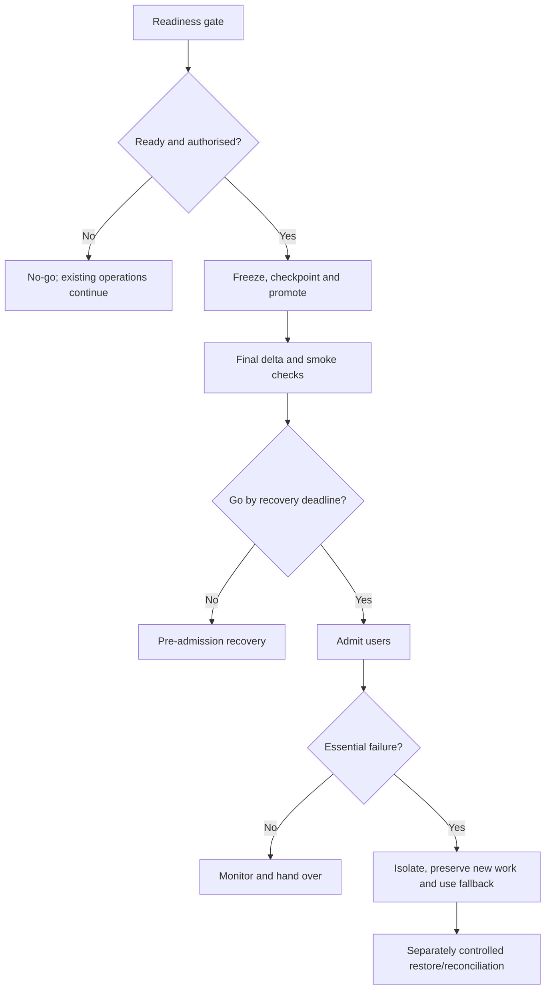

# Cutover, Release and Recovery

## 1. What you will learn

A release changes how people perform their work. It can introduce new configuration, data, access and operating procedures at the same time.

Cutover is the controlled transition to the intended operating state. A release makes an identified version available for use. Recovery restores a defined safe operating position when the transition or released service does not behave as required.

By the end of this chapter, you should be able to:

- Evaluate release readiness using evidence.
- Define a configuration-promotion manifest.
- Plan final data changes and reconcile their effects.
- Sequence a cutover with owners, checkpoints and stop conditions.
- Communicate normal progress, delay and recovery.
- Make a defensible go/no-go recommendation.
- Design representative smoke tests.
- Calculate recovery deadlines and explain recovery limits.
- Run a complete tabletop go-live simulation.

Prerequisites and continuity

You need the scope baseline, migration workbook, access plan and UAT evidence from Chapters 5–13.

| Carried-forward item | Current state |
| --- | --- |
| SB-02 v1.1 | Approved for fictional planning only |
| Actual product UAT | Not started; prerequisites unmet |
| Product acceptance | Not recommended |
| Native fit and permissions | Unverified |
| Local defects | Receiver/report corrections are reference results; display V4 has limited local evidence |
| Migration paper target | Four customers, seven jobs and three appointments |
| Unresolved source matters | C04 and the cancellation conflict remain open |
| EVG-JOB-2105 | Operational acknowledgement issue remains unresolved unless later evidence is supplied |
| Actual release authority | None |
| Support service | Existing client ownership; no new supplier service established |

EVG-SRC-129 authorises a cutover runbook and offline simulation only.

This chapter has two clearly identified states:

- Current case: the actual fictional project evidence still supports No-go.
- Conditional exercise: a separate tabletop overlay supplies assumptions and event cards so that you can practise cutover and recovery.

The overlay does not close earlier issues, supply actual UAT results or authorise tenant changes.

Your project contribution

You will produce:

1. A readiness sheet.
2. A configuration and data manifest.
3. A cutover/recovery runbook.
4. Smoke-test and decision records.
5. A communication pack.
6. A post-release ownership checkpoint.

All times, records, durations and observations in the tabletop are synthetic inputs or expected simulated outcomes. No Zoho deployment, restore, client signature or release approval is claimed.

## 2. Lessons

### 2.1 Readiness is an evidence decision

Skill: distinguish a planned release from a ready release.

A release plan can be complete while the release itself remains unready.

Readiness should cover:

- Scope and release authority.
- Identified target environment and version.
- Acceptance and unresolved defects.
- Data and final-change reconciliation.
- Effective access and connection identities.
- Configuration-promotion method.
- Recovery capability.
- Communications, business procedures and support ownership.

A green estimate is not release evidence. Neither is a locally corrected prototype.

For Evergreen, actual product UAT remains unperformed. That is enough to prevent a supported live-release recommendation under the supplied acceptance rules.

Readiness gaps need owners and closure evidence:

“Client Administrator must provide the identified target organisation and verified access configuration.”

This is more useful than:

“Technical readiness pending.”

A gate cannot be marked passed because the team expects the evidence to arrive.

Lesson check LC1: Why can a complete cutover runbook coexist with a No-go decision?

### 2.2 Promote identified configuration, not an undefined environment

Skill: specify what changes and how dependencies are checked.

Configuration promotion transfers selected, tested configuration into the target environment. It may use a product-supported mechanism or an approved manual recreation procedure.

The manifest should identify:

- Artifact and version.
- Source and target.
- Dependencies.
- Environment-specific values.
- Verification.
- Recovery treatment.

Do not assume that a promotion transfers every role, field, relationship, connection or data record correctly.

Zoho CRM’s Modules API describes available modules and their API names.2 This supports inventory and comparison; it is not a deployment API or proof that all artifacts are promotable.

The exact Zoho promotion navigation, supported artifact coverage and reversal procedure remain unverified for Evergreen. The runbook therefore specifies a logical manifest and requires an authorised, rehearsed tenant-specific method before actual execution.

Connection bindings require particular care. Zoho documents organisation-specific authorisation: a production organisation’s token cannot be reused for sandbox organisations.1 Record the intended organisation, identity and regional domain rather than copying a credential because it worked elsewhere.

Do not copy source-environment product IDs into target lookups without verified mappings.

Lesson check LC2: Why should connections and access be verified after configuration promotion?

### 2.3 Control the final data interval

Skill: explain what happens between the last rehearsal and admission of users.

A freeze stops specified changes during a controlled interval. It must state which writes stop, where new requests go and who owns them.

A freeze does not mean customers stop contacting the business. Operations may need a source worksheet or intake queue.

A final delta contains approved changes after the earlier dataset or rehearsal. It needs:

- Source cutoff.
- Stable keys.
- Create/update treatment.
- Conflict handling.
- Result accounting.
- Preservation for recovery.

Count creates and updates separately:

> Closing record count = opening count + creates - deletions

Updates change values, not entity count.

Do not automatically apply the older held cancellation group. It remains unresolved. The final delta must identify its own authorised changes.

A checkpoint also needs clear meaning. A data copy alone is not necessarily a configuration restore, access restore or complete recovery method.

Lesson check LC3: If a final delta creates one job and updates another, how many records does it add?

### 2.4 Sequence gates and communications

Skill: make each transition accountable.

A runbook is an executable sequence of actions, conditions, owners and verification.

Each step should state:

- Entry condition.
- Action.
- Owner.
- Expected result.
- Time or duration.
- Failure/stop behaviour.
- Evidence to retain.

Separate:

- Readiness decision before starting.
- Go/no-go after promotion and smoke checks.
- Admission of business users.
- Monitoring and handover.

A gate can require an immediate decision. If recovery needs thirty minutes and the window ends at 10:30, waiting until 10:05 to decide is already too late for that recovery path.

Communications should tell people what to do:

“Continue intake in the source worksheet. Do not enter the same request in both systems.”

Avoid vague messages such as “technical work ongoing.”

Use separate notices for planned start, delay/no-go, admission and fallback. Identify sender, audience and decision source.

Lesson check LC4: Why should a “release complete” message wait until the admission decision and verification are recorded?

### 2.5 Use smoke tests to check essential target behaviour

Skill: confirm a small set of high-value conditions after change.

A smoke test is a short check of essential behaviour after deployment or transition. It does not replace full supplier testing or UAT.

Evergreen’s smoke checks should include:

- Intake and customer relationship.
- Intended role restrictions.
- Finance handoff visibility and invoice boundary.
- Report availability and agreed counting logic.
- Retained correction/history evidence.

Use known inputs and expected results. “Check CRM works” is not a test.

Readiness evidence must identify the target. CRM’s organisation API describes organisation ID and environment type.3 An environment label in a document is not equivalent to a verified product organisation.

A critical smoke failure requires the stated stop action. Four passing checks do not cancel one confidential-information failure.

Lesson check LC5: Why can four of five smoke checks passing still require No-go?

### 2.6 Define recovery limits before the failure

Skill: distinguish restore, containment, fallback and irreversible effects.

Different recovery actions solve different problems:

| Action | Purpose |
| --- | --- |
| Stop/isolate | Prevent further unsafe access or writes |
| Restore checkpoint | Return covered configuration/data to a known state |
| Forward correction | Apply a known correction under approved conditions |
| Business fallback | Continue work through a controlled alternative |
| Reconcile/replay | Account for work created after the checkpoint |

A restore can remove post-checkpoint records. Preserve acknowledged work before restoring and verify where it will be processed.

Restoring configuration does not recall an email, reverse an external transaction or make a disclosed value unread.

A recovery time objective is a target time to restore a defined service. A recovery point objective is the permitted loss of acknowledged information. State the service and conditions; do not present either as a vendor guarantee.

For this exercise:

- Manual fallback target: within fifteen minutes after post-admission failure.
- Acknowledged intake-loss target: zero, provided the supplied journal is captured and reconciled.
- Full checkpoint recovery: thirty minutes under the tabletop assumptions.

Those targets apply to the simulation. Actual recovery remains unproven.

Lesson check LC6: Why can manual fallback meet its target even when full application restoration cannot finish within the window?

## 3. Visual explanation: two recovery boundaries

Before admission, the recovery set is relatively small and known.

After admission, users may have created new work or external effects. The recovery plan must preserve those facts before resetting the target.

## 4. Worked case: prepare and run the conditional cutover

### 4.1 Current-case readiness

EVG-SRC-130 restates the actual case evidence.

| Gate | Current evidence |
| --- | --- |
| Execution authority | None |
| Actual product acceptance | None |
| Target/build identity | Not fully evidenced |
| Role/access proof | Local model only |
| Promotion/restore method | Not demonstrated in tenant |
| Final data approval | Earlier exceptions remain |
| Support/adoption readiness | Proposed ownership only |

Current-case recommendation: No-go.

Record EVG-DEC-043: do not convert planning or local-reference evidence into live-release readiness.

### 4.2 Conditional tabletop overlay

EVG-SRC-131 creates a separate exercise, EVG-SIM-RELEASE-001.

For this exercise only, assume:

- Required authority, target identity, business acceptance and representative access checks have been supplied as simulation cards.
- The target is a disposable simulator, not a Zoho organisation.
- Checkpoint restore is available with the durations below.
- Outbound notifications and live financial actions must remain disabled.
- The Sponsor can decide Go; the Implementation Lead or Administrator can stop on a mandatory failure.
- No exception is allowed for restricted-information exposure.
- Final Go must be decided by 10:00 UTC inclusive.
- Window: 6 February 2027, 09:00–10:30 UTC.

These assumptions do not update the current project’s readiness.

Record EVG-DEC-044: keep conditional simulation evidence separate from actual case records.

### 4.3 Configuration manifest

| Artifact | Candidate content | Dependency | Verification |
| --- | --- | --- | --- |
| EVG-CFG-001 | Customer/job relationship and stable references | Approved logical schema | Known keys and parent mappings |
| EVG-CFG-002 | Appointment history and acknowledgement rules | CFG-001 | Reschedule/identity checks |
| EVG-CFG-003 | Completion qualification and Finance authority | CFG-001–002 | Missing-data and no-release checks |
| EVG-CFG-004 | Public projection based on local V4 design | Access model and CFG-003 | No private reason in operational output |
| EVG-CFG-005 | Weekly report based on local V2 logic | Date/status fields | Known five-row fixture |

Package C1 is a logical candidate. B0 is the simulator’s known safe pre-change checkpoint, with business admission off. Neither is a Zoho release version.

Promotion order is relationships, process/history controls, access/projections, then reports and target-specific bindings.

### 4.4 Data checkpoint and final delta

EVG-SRC-132 supplies the deployment ledger. It reproduces the accepted paper keys, not an actual production load.

| Entity | Checkpoint keys/count |
| --- | --- |
| Customers | EVG-CUST-0101–0104: 4 |
| Jobs | EVG-JOB-1801–1807: 7 |
| Appointments | EVG-APPT-7001–7003: 3 |
| Total | 14 |

Important checkpoint facts:

- EVG-JOB-1801 remains Scheduled for EVG-CUST-0103 after the earlier local correction.
- EVG-APPT-7001 remains Confirmed.
- The conflicting cancellation group is not applied.
- EVG-JOB-1803’s summary is “Replaced sensor and checked operation.”
- C04 remains outside the selected set.

Two new, explicitly supplied simulation changes are permitted:

| Delta ID | Action | Complete relevant values |
| --- | --- | --- |
| EVG-DELTA-001 | Create job | EVG-JOB-2301; EVG-CUST-0104; received 6 February 08:58 UTC; Ready to assign; no appointment/completion |
| EVG-DELTA-002 | Update summary | EVG-JOB-1803; new summary “Replaced sensor and checked operation. Verification recorded.”; Technician Lead supplies correction |

Both remain in the source worksheet regardless of target recovery.

Expected candidate ledger:

> 14+1 create=15 entities

| Entity | Before | Creates | Updates |
| --- | --- | --- | --- |
| Customers | 4 | 0 | 0 |
| Jobs | 7 | 1 | 1 |
| Appointments | 3 | 0 | 0 |
| Total | 14 | 1 | 1 |

The update does not add another entity.

### 4.5 Complete cutover runbook

EVG-SRC-133 supplies elapsed durations. These are window minutes, not supplier person-minute estimates.

| Step | Planned UTC interval | Owner | Action and expected result |
| --- | --- | --- | --- |
| C01 | 09:00–09:05 | Implementation Lead/Sponsor | Confirm simulation readiness, roles and scope |
| C02 | 09:05–09:10 | Administrator/Operations | Pause target writes; route intake to source worksheet; outbound off |
| C03 | 09:10–09:15 | Administrator | Capture B0 checkpoint and fourteen-key manifest |
| C04 | 09:15–09:30 | Administrator | Apply logical C1 manifest in dependency order |
| C05 | 09:30–09:35 | Administrator/Quality Lead | Verify target bindings and access |
| C06 | 09:35–09:45 | Implementation Lead/Operations | Apply two approved delta actions; reconcile fifteen entities |
| C07 | 09:45–10:00 | Quality Lead/business roles | Execute five smoke groups |
| G1 | By 10:00 | Sponsor, with Finance/Quality input | Decide Go or start recovery |
| C08 | 10:00–10:05 | Implementation Lead/Administrator | Record Go and prepare admission |
| C09 | 10:05–10:10 | Operations/Administrator | Admit users; source/target routing explicit |
| C10 | 10:10–10:20 | Administrator/Operations | Monitor and transfer checkpoint to owners |
| Reserve | 10:20–10:30 | Named owners | Bounded observation/communication allowance |

Normal sequence:

> 5+5+5+15+5+10+15+5+5+10=80 elapsed minutes

The ninety-minute window leaves ten minutes. That does not mean a thirty-minute recovery can begin at 10:20.

### 4.6 Smoke inputs and failure card

EVG-SRC-134 supplies five checks. The report fixture is a separate immutable validation fixture, not additional deployment-ledger records.

| Smoke ID | Inputs | Expected |
| --- | --- | --- |
| EVG-SMOKE-001 | Operations reads EVG-JOB-2301 and customer 0104 | Correct key, relationship and 08:58 received time |
| EVG-SMOKE-002 | T1 attempts completion edit on job 1804, assigned to T2 | Denied; no record change |
| EVG-SMOKE-003 | Dispatch sees job 1803; Finance has a private note “Rate clarification required” | Dispatch sees nonfinancial status/contact, not reason; Finance retains permitted access |
| EVG-SMOKE-004 | Five-row reporting fixture from Chapter 13 | Open 2; completed 1 |
| EVG-SMOKE-005 | Inspect summary correction/history and external-action counters | Old/new summary retained; invoices 0; outbound messages 0 |

For the worked failure branch:

- Checks 001, 002, 004 and 005 meet their expected conditions on the simulation cards.
- At 09:50, check 003 reveals a private-reason field in Dispatch output.
- Business users have not been admitted.
- Candidate ledger has fifteen entities.
- No external message or invoice has occurred.

The correct response is immediate stop and pre-admission recovery, not “four of five passed.”

Record EVG-DEC-045: enforce mandatory smoke conditions and the recovery deadline.

### 4.7 Recovery procedure and expected record

The supplied recovery path requires thirty minutes:

| Step | Duration | Action |
| --- | --- | --- |
| R01 | 5 minutes | Isolate target access/writes; preserve failure evidence |
| R02 | 5 minutes | Capture delta/change ledger and source references |
| R03 | 10 minutes | Restore simulator B0 configuration/data |
| R04 | 5 minutes | Verify fourteen keys, baseline values and safe access |
| R05 | 5 minutes | Confirm source-worksheet operations and ownership |

Latest start:

> 10{:}30-30 minutes=10{:}00

At the 09:50 failure:

| Step | Expected interval |
| --- | --- |
| R01 | 09:50–09:55 |
| R02 | 09:55–10:00 |
| R03 | 10:00–10:10 |
| R04 | 10:10–10:15 |
| R05 | 10:15–10:20 |

Recovery finishes ten minutes before the window ends.

Expected final state:

- Target B0: fourteen entities.
- Target job 1803 has its checkpoint summary.
- Source worksheet retains job 2301 and the approved summary correction.
- Two target delta actions remain pending reconciliation.
- Target business admission stays off.
- Existing source-based operations continue.
- No disclosure recall, transaction reversal or production restore is claimed.

The source changes must not be forgotten merely because the target returned to fourteen records.

### 4.8 Communication examples

Current-case No-go

No live release is authorised. Product acceptance and readiness evidence remain incomplete. Continue the existing intake and dispatch process. The cutover pack is a planning artifact; the next decision requires verified product, access and recovery evidence.

Conditional exercise recovery notice

Exercise only: candidate C1 is stopped after the restricted-information smoke failure. Target admission remains off. Use the source worksheet for intake. B0 recovery is expected by 10:20; Operations owns intake reconciliation and the Administrator owns target verification.

The notices communicate actions without copying the private reason into a general message.

## 5. Try it yourself — guided practice

Learning goal and changed input

Update the runbook when a step finishes late, even though smoke cards would pass.

EVG-SRC-135 supplies this timing update:

- C01–C03 finish as planned.
- C04 finishes at 09:38, taking twenty-three minutes.
- At 09:38 the team knows C05 still needs five minutes, C06 ten and C07 fifteen.
- All five smoke cards would satisfy their expected conditions if reached.
- Recovery still needs thirty minutes.
- The 10:00 Go deadline and 10:30 window end are unchanged.
- Final delta has not yet been applied.
- No business users or external actions are admitted.

Steps and expected intermediate results

1. Reforecast G1 at 09:38.  

Expected: account for all remaining work, not only promotion completion.

2. Compare forecast with the deadline.  

Expected: passing smoke expectations do not override timing.

3. Select the stop/recovery point.  

Expected: avoid continuing into a known infeasible sequence.

4. Reconcile target and source.  

Expected: checkpoint target remains fourteen; source delta remains pending.

5. Complete the exercise decision and notice.  

Expected: state timing reason, ownership and expected recovery completion.

Blank runbook worksheet

| Step | Entry condition | Owner | Action | Duration/start/finish |
| --- | --- | --- | --- | --- |
|  |  |  |  |  |
|  |  |  |  |  |

Blank recovery ledger

| Business key/change | Checkpoint value | Later value/event | Evidence location | Preserve/replay treatment |
| --- | --- | --- | --- | --- |
|  |  |  |  |  |
|  |  |  |  |  |

Blank decision record

| Gate/time | Conditions assessed | Decision | Decision owner/source | Actions and limits |
| --- | --- | --- | --- | --- |
|  |  |  |  |  |

Final artifacts: Runbook v0.2, timing decision, recovery ledger and communication.

Cleanup: retain both branches and the source delta. No tenant actions or restoration are permitted.

The tabletop demonstrates sequencing and judgement. It cannot verify promotion, permission isolation or restore duration in Zoho.

## 6. Independent challenge

Post-admission failure

Use a separate simulation branch.

EVG-SRC-136 supplies:

- Normal C01–C09 completed.
- Two jobs were admitted:
- EVG-JOB-2302, customer 0101, received 10:08, Ready to assign.
- EVG-JOB-2303, customer 0102, received 10:10, Ready to assign.
- At 10:12, a simulation export path exposes the private reason to Dispatch.
- One unexpected notification was already delivered at 10:09 to customer0101@evergreen.example.com: “Service request EVG-JOB-2302 recorded.”
- No invoice was created.
- The admission journal contains both new jobs and their complete supplied fields.
- Source delta 001/002 remains available.
- The normal gate had relied on record-page evidence; the export path was not actually checked.

Available actions:

| Action | Duration |
| --- | --- |
| Isolate ordinary target access/writes and outbound actions | 5 minutes |
| Capture admission journal and delta evidence | 5 minutes |
| Activate source fallback and confirm ownership | 5 minutes |
| Full checkpoint recovery path | 30 minutes from failure |
| Recall delivered notification | Not available |
| Reapply post-checkpoint data | Requires separate approval and reconciliation |

EVG-SRC-137 assigns Administrator as technical owner, Operations as business fallback owner and Finance as owner of restricted-information handling. Existing support arrangements apply; no response-time service is created.

Additional permission question

A separate binding check shows that a proposed connection is authorised for a sandbox organisation while the planned target is a different organisation. No replacement authority is supplied.

Deliverables

Produce:

1. Target-count and post-checkpoint-change reconciliation.
2. A containment/fallback timeline.
3. A comparison with full restoration time.
4. A preservation/replay ledger.
5. A communication and escalation record.
6. The connection-binding decision.

Success criteria

Preserve all acknowledged jobs, recognise the delivered notification as irreversible by configuration restore and keep the affected target isolated.

Do not claim full recovery by 10:30 or automatically replay data. Do not reuse the wrong organisation’s authorisation.

## 7. Common problems and recovery

| Symptom | Diagnosis | Correction |
| --- | --- | --- |
| “UAT passed” means local model results | Evidence boundary exceeded | Restore the actual readiness status |
| Promotion includes unknown artifacts | Manifest incomplete | Identify versions/dependencies before execution |
| Wrong connection target | Environment binding unverified | Stop and obtain appropriate authorisation |
| Record count rises by update count | Creates/updates confused | Reconcile entity changes separately |
| Go delayed beyond recovery deadline | Window arithmetic ignored | Stop while recovery remains feasible |
| Restore loses admitted jobs | Post-checkpoint work omitted | Preserve journal before restore |
| Private reason removed from one screen only | Relevant path untested | Isolate and examine affected paths |
| Email assumed undone by rollback | External effect ignored | Retain delivery evidence and business-owner handling |
| Fallback creates duplicate intake | Dual-entry routing unclear | Name authoritative intake location and deduplicate by business key |

A forward correction can be appropriate when its cause, method, time and verification are known and approved. This exercise does not permit a forward fix to bypass a restricted-information stop condition.

## 8. Check your understanding

1. What evidence is needed before calling a target ready?
2. Why must a promotion manifest include environment-specific values?
3. What belongs in a final delta?
4. Why is unused window time different from available recovery time?
5. What does a smoke test demonstrate?
6. Why does the post-admission recovery boundary differ from the pre-admission one?
7. Which effects cannot be undone by restoring configuration?
8. What must be verified before resuming ordinary operations?

## 9. Solutions and explanations

### 9.1 Lesson checks

LC1: A runbook describes actions. Readiness requires authority, acceptance, environment and recovery evidence that may still be missing.

LC2: Permissions, identities, organisation bindings and target-specific mappings can differ from the source environment.

LC3: One entity. The update changes a value without creating another record.

LC4: People could begin using a target that has not met its gate. The message must follow the decision, not anticipate it.

LC5: Restricted-information exposure is a mandatory failure. A majority of passes does not remove it.

LC6: Fallback is a defined alternative business service. It can be activated without completing every target-restoration activity.

### 9.2 Guided practice solution

At 09:38:

> 5+10+15=30 remaining minutes

Forecast gate:

> 09{:}38+30=10{:}08

That is eight minutes after the 10:00 deadline.

Stop at 09:38. Do not continue merely because smoke results are expected to pass.

Recovery:

| Step | Interval |
| --- | --- |
| Isolate | 09:38–09:43 |
| Preserve ledger | 09:43–09:48 |
| Restore | 09:48–09:58 |
| Verify | 09:58–10:03 |
| Confirm fallback/notice | 10:03–10:08 |

Target returns to B0 with fourteen records. Delta was not applied, so no target-created job needs removal. Both source delta actions remain pending.

A suitable notice is:

Exercise only: promotion completed later than planned. Remaining checks would miss the recovery decision deadline. Candidate admission is stopped; B0 and source-based operations are expected to be verified by 10:08. No final delta or business admission occurred.

This is an expected tabletop record, not observed deployment evidence.

### 9.3 Independent challenge solution

Counts and journal

Before admission, candidate target has fifteen entities. Two admitted jobs add two:

> 15+2=17

| Entity | Count at failure |
| --- | --- |
| Customers | 4 |
| Jobs | 10 |
| Appointments | 3 |
| Total | 17 |

Post-checkpoint changes requiring preservation:

| Change | Treatment |
| --- | --- |
| Job 2301 create | Source delta retained |
| Job 1803 summary update | Old/new/source evidence retained |
| Job 2302 create | Admission journal retained |
| Job 2303 create | Admission journal retained |
| Delivered notification | Delivery record retained; not replayed automatically |

There are three new jobs and one update after B0. A later authorised restore would return target count to fourteen; approved replay of the three creates would return it to seventeen. Neither action has yet occurred.

Fallback timeline

| Action | Interval |
| --- | --- |
| Isolate target/outbound | 10:12–10:17 |
| Capture journal/delta | 10:17–10:22 |
| Activate source fallback | 10:22–10:27 |

> 10{:}27-10{:}12=15 minutes

The supplied manual-fallback target is met in the expected simulation sequence.

Full recovery would finish:

> 10{:}12+30=10{:}42

That exceeds the window by twelve minutes.

Therefore, preserve and contain first. Do not promise full target restoration by 10:30. Target data remains isolated pending a separately controlled recovery decision.

The acknowledged-job loss target depends on capturing and reconciling both journal entries. Do not treat the existence of a journal as proof that every entry has been reviewed.

Irreversible effect and notice

The delivered notification cannot be recalled by this procedure. Configuration restore does not undo delivery.

A suitable notice is:

Exercise only: ordinary target access and outbound actions are being isolated after a restricted-information export failure. Use the source intake process; Operations will reconcile the two admitted jobs from the journal. Manual fallback is expected by 10:27. Full target restoration cannot complete within the current window. Finance owns restricted-information handling; the delivered notification remains recorded.

Do not include the private reason in the general notice.

Record EVG-DEC-046: preserve acknowledged work, use bounded fallback and retain external-effect evidence.

Connection decision

Stop the affected connection activity. Obtain authorisation for the intended organisation under the appropriate owner and permissions.

Zoho documents organisation-specific grants.1 A sandbox grant cannot be treated as authority for another organisation. No credentials or replacement token should be invented.

### 9.4 Understanding check answers

1. Scope authority, acceptance, target/build identity, data, access, promotion, recovery and ownership evidence.
2. IDs, connections, users and other bindings may differ between environments.
3. Approved additions/changes since a stated cutoff, with stable keys and conflict treatment.
4. Recovery has its own required duration and latest start, including verification.
5. A limited set of essential post-change behaviours, not complete acceptance.
6. Users may have created acknowledged work or external effects that must be preserved.
7. Delivered messages, disclosed information and external transactions are not automatically undone.
8. Safe access, correct data, routing, ownership and the applicable admission decision.

## 10. Chapter recap and next step

Cutover quality depends on evidence, sequencing and explicit recovery boundaries.

A credible runbook explains when to stop, who decides, what information must survive and which effects cannot be reversed. It also distinguishes returning a target to a checkpoint from restoring the business’s ability to work.

Completion checklist

- I can assess readiness without inventing acceptance.
- I can define configuration and final-data manifests.
- I can sequence gates, smoke checks and admission.
- I can calculate the latest recovery start.
- I can reconcile creates, updates and post-checkpoint work.
- I can separate containment, fallback and full restore.
- I can communicate actions and limits clearly.
- I can preserve external-effect evidence.

Your project pack now contains a cutover/recovery runbook and two handled simulation branches.

Chapter 15, Training, Adoption and Support Handover, develops role-based training, administrator guides, procedures, ownership transfer, triage and escalation from these operating and recovery boundaries.

## 11. Glossary and further reading

Glossary

| Term | Meaning |
| --- | --- |
| Admission | Allowing intended users to begin operating in the released target |
| Checkpoint | Defined preserved state used for comparison or recovery |
| Configuration promotion | Transfer of selected configuration to a target environment |
| Cutover | Controlled transition to the intended operating state |
| Fallback | Alternative business operating method |
| Final delta | Approved changes since the prior snapshot/cutoff |
| Freeze | Controlled pause of specified changes |
| Go/no-go | Decision to proceed or stop at a defined gate |
| Recovery point objective | Target permitted loss of acknowledged information |
| Recovery time objective | Target time to restore a defined service |
| Smoke test | Short verification of essential post-change behaviour |

Further reading

1. Zoho CRM API v8 — Authorization Request  
[Open official reference](https://www.zoho.com/crm/developer/docs/api/v8/auth-request.html)

Organisation-specific authorisation across production, sandbox and developer environments.

2. Zoho CRM API v8 — Get Modules  
[Open official reference](https://www.zoho.com/crm/developer/docs/api/v8/modules-api.html)

Actual module inventory and API names; not a configuration-deployment procedure.

3. Zoho CRM API v8 — Get Organization Details  
[Open official reference](https://www.zoho.com/crm/developer/docs/api/v8/get-org-data.html)

Organisation identity and environment metadata.

Consult the official references above for current product details. Confirm the applicable edition, permissions and environment before using product-specific procedures. Evergreen’s actual promotion coverage, restore method, permissions and deployment behaviour remain unverified. No tenant deployment or restoration is claimed.
