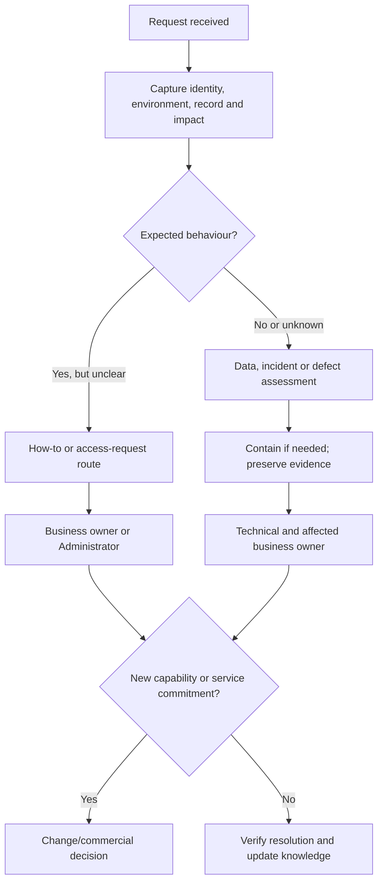

# Training, Adoption and Support Handover


## 1. What you will learn

A solution is not ready for ownership transfer merely because its configuration is documented. Users need to perform their work, administrators need to understand its operating boundaries, and support owners need to know how to recognise and route problems.

Training develops the ability to perform tasks. Adoption is the sustained use of the intended process. Support handover transfers the information, responsibilities and access needed to operate and support the agreed service.

By the end of this chapter, you should be able to:

- Prepare useful training materials for each business role.
- Explain the difference between attendance, demonstrated ability and adoption.
- Write an administrator guide with actionable verification steps.
- Document operational and exception procedures.
- Define business, technical and supplier support ownership.
- Triage incidents, data problems, access requests and enhancements.
- Set escalation and support boundaries without inventing service commitments.
- Produce a training and support handover pack.

Prerequisites and continuity

You need the access matrix, reference prototype, UAT pack and cutover runbook from Chapters 7–14.


| Carried-forward item | Current state |
| --- | --- |
| Planning scope | SB-02 v1.1 includes one weekly report |
| Original orientation allowance | One sixty-minute session, at most six client participants |
| Actual product release | No-go; no execution or release authority |
| Local/reference work | Available for practice, with evidence limits |
| Conditional cutover | Tabletop only; not a live deployment |
| Support ownership | Existing client arrangements remain |
| Supplier support service | No new service or response-time commitment established |
| Open matters | Native fit, product access, acceptance, recovery and several business exceptions remain unresolved |

EVG-SRC-138 authorises training documents, local role practice and a support-handover tabletop. It does not authorise tenant changes or operational takeover.

Your project contribution

You will produce:

1. Role-based quick guides and practice cards.
2. An administrator operating guide.
3. A triage and escalation procedure.
4. A support ownership and boundary matrix.
5. A handover inventory and readiness recommendation.

All Evergreen contacts, practice records, tickets, dates and estimates are synthetic. A planned session is not observed attendance. A completed document does not establish live-service ownership or acceptance.


## 2. Lessons


### 2.1 Train people for decisions and exceptions

Skill: prepare materials that support real work.

Role-based training starts from what the person must accomplish, not from a tour of every screen.

For Evergreen:

- Operations needs reliable intake and correction ownership.
- Dispatch needs current assignments, rescheduling history and acknowledgements.
- Technicians need assigned-work completion.
- Finance needs qualified handoffs and review authority.
- Administrators need environment, identity and evidence control.
- The Sponsor needs to interpret readiness and acceptance.

A useful quick guide contains:

1. Purpose.
2. Required access and information.
3. Steps.
4. Expected result.
5. Exception treatment.
6. Help owner.

Explain why important controls exist. A technician should understand that a required summary gives Finance usable information, not merely that the system refuses a blank field.

Use normal and exception examples. “What should I do when I cannot see a job?” is often more useful than another screenshot of a successful action.

Avoid writing a guide that teaches users to work around the access model. “Borrow a colleague’s account” is not a valid recovery procedure.

Lesson check LC1: Why should the Dispatch guide teach acknowledgement exceptions as well as ordinary scheduling?


### 2.2 Measure ability separately from adoption

Skill: interpret evidence without overstating readiness.

Attendance shows that someone was present. It does not prove that they can perform the task.

Useful training evidence includes:

- Task completed with the supplied inputs.
- Correct result.
- Exceptions identified.
- Required help or repeat attempt.
- Remaining access or knowledge gaps.

A repeat can demonstrate eventual ability without turning the first attempt into a first-pass success.

Adoption needs different evidence: people use the intended process during real work, maintain its data and follow its controls over time.

Do not infer adoption from a local practice exercise. Likewise, a high completed-attempt rate can hide an unfinished administrator task.

Define the measure before calculating it. State the denominator, unfinished records and exclusions.

Lesson check LC2: What can a successful repeat attempt demonstrate, and what can it not demonstrate?


### 2.3 Write an administrator guide for operation and diagnosis

Skill: give the technical owner a usable decision sequence.

An administrator guide should explain:

- Identified environment and build.
- Configuration and relationship inventory.
- User, role, profile and sharing design.
- Connection purpose, owner and permissions.
- Data and reconciliation controls.
- Known defects and limitations.
- Verification, correction and escalation.
- Recovery and support boundaries.

A collection of screenshots is insufficient. Screens can change; the business and technical decisions still need explanation.

Zoho CRM profiles determine user permissions. Detailed module permission data is returned when retrieving a specific profile, not merely the profile list.1 The guide should therefore identify the evidence needed to diagnose an access issue.

OAuth scopes limit delegated resources and operations.2 They do not replace the underlying identity or business authority.

Document connection ownership without storing tokens or client secrets in the handover pack. Also verify the organisation binding: Zoho authorisation is organisation-specific.3

The exact tenant UI navigation and configured field names remain unverified for Evergreen. The sample guide below uses business actions and documented read-only inspection routes.

Lesson check LC3: Why should a connection register include purpose and organisation as well as a technical owner?


### 2.4 Transfer ownership through evidence

Skill: distinguish nomination, receipt and operational acceptance.

Ownership transfer has several stages:


| Stage | Meaning |
| --- | --- |
| Owner nominated | A role/person is identified |
| Pack delivered | Materials are made available |
| Recipient review | Owner checks completeness and usability |
| Access and capability verified | Owner can perform the authorised responsibilities |
| Operational acceptance | Appropriate decision records the transferred boundary |

Do not collapse these stages into “handover complete.”

For example, a Sponsor can nominate a backup administrator. That does not grant the person product access or authorise them to use the previous administrator’s credentials.

A handover record should name:

- What is transferred.
- To whom.
- Which evidence has been reviewed.
- Which gaps remain.
- What support is included.
- Which decision is still required.

Evergreen can transfer document-review responsibility while actual operational handover remains blocked.

Lesson check LC4: Why is naming a support owner insufficient to establish support readiness?


### 2.5 Triage the request before choosing the route

Skill: identify the type of help needed.

Triage is the initial assessment that determines classification, impact, owner and next action.

Different requests need different routes:


| Type | Meaning | Evergreen route |
| --- | --- | --- |
| How-to question | Intended behaviour is unclear | Business process owner/quick guide |
| Data problem | Information is missing or wrong | Authorised data owner |
| Access request | New or changed authority is requested | Process owner and Administrator |
| Incident | Intended service is disrupted or unsafe | Existing technical/business support |
| Defect | Observed failure against the applicable requirement | Quality/technical owner |
| Enhancement | New capability or scope | Change mechanism and Sponsor |

Correct denial is not automatically an incident. A technician unable to open another technician’s job may be experiencing intended access.

A defect can contribute to an incident, but the records serve different purposes. A defect tracks nonconformance and correction; an incident tracks service impact and restoration.

Collect enough evidence to route the request:

- Environment/build.
- Actor and permitted role.
- Business reference.
- Action.
- Expected and observed result.
- Time.
- Scope of impact.
- Existing workaround.
- Relevant evidence.

Avoid copying private Finance reasons or credentials into a general ticket.

Lesson check LC5: Why should support classify “I cannot open this job” before changing permissions?


### 2.6 Define support boundaries and escalation

Skill: explain who acts and what has actually been committed.

A support boundary identifies the service, owner, authority and included work.

Do not invent:

- Twenty-four-hour coverage.
- Response or restoration targets.
- Unlimited changes.
- Supplier responsibility for every product issue.
- Production recovery guarantees.

An optimistic sales message is not enough to establish those commitments.

Escalation should state why and to whom:

- Business rule or data ownership → relevant process owner.
- Restricted information → Finance and technical owner.
- Environment/identity → Administrator.
- Reproducible configuration/code failure → technical owner and Quality Lead.
- Product service issue → Administrator through the client’s existing vendor-support arrangement.
- New scope → Sponsor and Implementation Lead.

Chapter 14’s recovery limits remain relevant. A support owner must not promise that configuration restore recalls a delivered email.

Lesson check LC6: Why should an after-hours support promise be recorded as an unresolved commercial matter when no service agreement is supplied?


## 3. Visual explanation: support routing




The flow starts with evidence. It avoids granting access or changing scope before the request is understood.

Containment and investigation can proceed through existing authority, while new service commitments require their own decision.


## 4. Worked case: assemble Evergreen’s training and handover pack


### 4.1 Supplied ownership and support rules


| Source ID | Synthetic input |
| --- | --- |
| EVG-SRC-139 | Sponsor nominates Operations as business-guide owner, Technician Lead as technician-guide owner, Finance as Finance-guide owner and Client Administrator as technical-guide recipient. No operational acceptance is supplied. |
| EVG-SRC-140 | Support classification below applies to the tabletop. Existing client support owns real operational incidents; no new supplier response-time service exists. |
| EVG-SRC-141 | Role-practice inputs and business rules below |
| EVG-SRC-144 | Inventory still lacks actual organisation IDs, effective permissions and live connection evidence. EVG-CONN-001 remains proposed metadata READ only. |

Tabletop priority definitions:


| Priority | Exercise meaning |
| --- | --- |
| P1 | Essential control failure requiring immediate containment decision |
| P2 | Essential work blocked; named owner and controlled continuation needed |
| P3 | Routine clarification, data or access request |
| P4 | Planned enhancement or service change |

These are routing categories, not response-time promises.


### 4.2 Completed Operations quick guide

Purpose: record a request without inventing identity or losing its history.

1. Confirm the business customer reference and received time.
2. Record a unique business job reference.
3. If customer identity is missing, keep the request on Intake hold.
4. Ask Operations’ authorised data owner for the correction.
5. Preserve the original value and correction source.
6. Release assignment readiness only when the required intake facts exist.

Expected result: one accountable request with known identity, or an explicit hold.

Worked input: EVG-JOB-2402 arrives at 08:10 UTC on 7 February with no customer reference. It remains on hold. At 08:20, Operations confirms EVG-CUST-0102. The same job is corrected; no replacement job is created.

Common mistake: creating a new customer because the caller’s name looks similar.

Help owner: Operations Manager, operations@evergreen.example.com.


### 4.3 Completed Dispatch quick guide

Purpose: coordinate the current appointment while retaining earlier arrangements.

1. Identify the job, current appointment and assigned technician.
2. For a pre-start reschedule, retain the job reference.
3. Obtain customer confirmation.
4. If the technician changes, record withdrawal acknowledgement from the old technician.
5. Create the replacement appointment and retain the old one as Superseded.
6. Keep the replacement pending until the new technician acknowledges.
7. Do not treat the scheduled time as evidence of actual start.

Worked input: EVG-JOB-2403 has EVG-APPT-9403 with T2 at 11:00–12:00. The replacement is EVG-APPT-9413 with T1 at 14:00–15:00. Customer confirmation is 09:00; T2 withdrawal is 09:05. Dispatch plans the replacement at 09:10. Until T1 acknowledges, it is Pending acknowledgement.

Expected result: one job, retained appointment history and clear current responsibility.

Help owner: Dispatcher/Operations. Finance questions follow the Finance contact, not unrestricted invoice access.


### 4.4 Completed technician quick guide

Purpose: supply usable completion facts for assigned work.

1. Confirm that the job is currently assigned to you.
2. Acknowledge the intended appointment.
3. Record actual start under the agreed process.
4. Supply completion date and a meaningful operational summary.
5. If required information is missing, correct it before handoff readiness.
6. Do not change customer identity, assignment or Finance outcome.
7. If access is denied, confirm assignment through Dispatch; do not use another account.

Worked input: T1 starts EVG-JOB-2401 at 09:00. A blank summary at 09:30 is rejected. At 10:00, T1 supplies date 7 February and summary “Replaced filter and checked operation.”

Expected result: Service completed and Ready for Finance, with no automatic invoice release.

Help owner: Technician Lead, technicians@evergreen.example.com.


### 4.5 Completed Finance quick guide

Purpose: review qualified information while preserving disclosure boundaries.

1. Confirm job/customer references, completion date and summary.
2. Record the review outcome under the Finance identity.
3. If returned, retain the reason in the permitted private evidence location.
4. Expose only nonfinancial status and Finance contact to Dispatch.
5. Preserve the return when corrected information arrives.
6. Record later review separately.
7. Keep invoice release under Finance authority and outside the local prototype.

Worked input: EVG-JOB-2401 is returned at 10:10 with private reason “Finance reference review required.” The technician supplies corrected operational detail at 10:15. Finance’s supplied practice decision at 10:20 is Review complete. That does not demonstrate a live invoice action.

Expected result: original return and correction history retained; public projection remains restricted.

Help owner: Finance Lead, finance@evergreen.example.com.


### 4.6 Completed Sponsor decision guide

Purpose: distinguish progress evidence from authority and acceptance.

Before deciding:

1. Identify scope and version.
2. Separate local evidence from actual product evidence.
3. Read open defects, issues and readiness gaps.
4. Compare forecast with the agreed constraint.
5. Identify the requested decision: planning, execution, exception or acceptance.
6. Record its boundaries and source.

Worked example: five local cases pass after a report correction, but actual product UAT has not started. The appropriate conclusion is that local evidence improved; product acceptance is still unsupported.

Expected result: an explicit decision without an invented launch or support commitment.


### 4.7 Completed administrator guide

Artifact: Evergreen Administrator Guide v0.1 — document/local boundary


| Procedure | Steps | Expected evidence |
| --- | --- | --- |
| Identify environment | Compare intended organisation, environment and region with authorised inventory | Actual organisation identity and intended target agree |
| Review profiles | Obtain profile list, then inspect each relevant specific profile | View/create/edit/delete permissions and intended tool access identified |
| Verify business access | Compare permissions, record scope and fields with Chapter 7 matrix | Intended roles can perform allowed tasks and are denied others |
| Review connections | Record purpose, owner, organisation, scopes and secret reference | Justified authority and environment binding |
| Check data | Compare business keys, parents, holds and delta ledger | Counts and relationships reconcile |
| Check operating state | Identify build, admission decision, outbound state and known defects | Applicable version and support route known |
| Investigate failure | Capture actor, reference, action, result and scope; classify before changing | Reproducible evidence with owner |
| Recover | Follow the approved runbook and preserve post-checkpoint work | Safe state plus accounted journal |

Documented inspection routes, subject to authority:

GET /crm/v8/org

GET /crm/v8/settings/profiles

GET /crm/v8/settings/profiles/{profile_ID}

These are route patterns. Use the verified regional API domain, actual product ID and appropriate permissions. Do not substitute EVG-ENV-S01 for an organisation ID.

A specific-profile review can use ZohoCRM.settings.profiles.READ.1 The proposed metadata connection has READ purposes; it is not a migration or correction writer.

Common mistake: receiving a profile list and declaring the access design verified.


### 4.8 Completed handover inventory

EVG-HO-001 — ready for document review, not live operational acceptance


| Pack item | Recipient/owner | Evidence/status |
| --- | --- | --- |
| Role quick guides | Operations, Dispatch, Technician Lead, Finance, Sponsor | Included in this chapter; practice required |
| Administrator guide | Client Administrator | Included; actual environment details pending |
| Access/identity pack | Administrator and process owners | Desired design, not configured proof |
| Requirements/scope | Sponsor/Implementation Lead | SB-02 v1.1 planning boundary |
| Migration workbook | Operations/Administrator | Paper reconciliation; exceptions retained |
| UAT/quality pack | Business owners/Quality Lead | Local results distinguished from product evidence |
| Cutover/recovery pack | Administrator/Operations | Tabletop only; actual No-go |
| Known-defect sheet | Administrator/Developer/Quality Lead | Local closure boundaries recorded |
| Connection register | Administrator | EVG-CONN-001 proposed; no secrets |
| Support route | Operations/Administrator | Existing client ownership; no new SLA |
| Recipient acknowledgement | Each recipient | Not supplied |
| Operational takeover | Sponsor and relevant owners | Not accepted; prerequisites unmet |

Record EVG-DEC-047: transfer documents and responsibilities through explicit evidence, without claiming live takeover.


## 5. Try it yourself — guided practice

Learning goal and complete inputs

Deliver the role materials as a local exercise, interpret practice evidence and triage requests.

For runtime practice, use Chapter 10’s complete Prototype class. Method:

```python
p.request(action, actor, timestamp, job_reference, **fields)
```

All practice times use 7 February 2027 UTC.

Complete setup for EVG-JOB-2401:

- Intake OPS 08:00, customer 0101.
- Plan DSP 08:20, appointment 9401, T1, 09:00–10:00, customer confirmed 08:10.
- Acknowledge T1 08:25; start T1 09:00.
- Complete attempts and Finance sequence follow the quick guides above.
- Correction summary at 10:15: “Replaced filter and confirmed service details.”

For job 2403, intake OPS 08:00, customer 0103; original planning DSP 08:20 with customer confirmed 08:10; T2 acknowledges at 08:25. Use the supplied replacement values, then T1 acknowledges at 09:20.

Practice evidence

EVG-SRC-142 supplies synthetic practice records. They are not observed client attendance or performance.

A first-pass success requires a completed, correct first attempt with no repeat. Incomplete attempts are excluded from that rate and disclosed separately.


```csv
participant,role,first_attempt_complete,first_attempt_correct,repeat_required,final_attempt_complete,final_attempt_correct
P01,Operations,yes,yes,no,yes,yes
P02,Dispatch,yes,no,yes,yes,yes
P03,Technician Lead,yes,no,yes,yes,yes
P04,Finance,yes,yes,no,yes,yes
P05,Sponsor,yes,yes,no,yes,yes
P06,Administrator,no,unknown,unknown,no,unknown
```

Support cases

EVG-SRC-143 supplies six tabletop requests.


| Ticket | Complete relevant facts |
| --- | --- |
| EVG-SUPPORT-001 | T1 cannot open EVG-JOB-2404. Assignment is T2. No access change approved. |
| EVG-SUPPORT-002 | Job 2405 has completion date 7 February but no summary. Handoff is held. Technician Lead owns the missing fact. |
| EVG-SUPPORT-003 | Local display V3 includes a private Finance reason in Dispatch output. Link EVG-DEFECT-004; no real tenant incident supplied. |
| EVG-SUPPORT-004 | Local event 008 exhausted three attempts before commit; receiver has zero receipts; sender Manual hold. Live integration is unapproved. |
| EVG-SUPPORT-005 | Sponsor asks again for the technician dashboard. Existing EVG-CHANGE-006 is pending and exceeds the ceiling. |
| EVG-SUPPORT-006 | Supplier asks to use EVG-CONN-001 metadata READ authority for writes. The connection is not created; current work is document-only. |

Guided steps and expected intermediate results

1. Use the role guides.  

Expected: hold, pending acknowledgement, completion and Finance boundaries can be explained with the supplied records.

2. Calculate practice measures.  

Expected: first-pass and eventual practice success use stated denominators; P06 remains visible.

3. Classify all six tickets.  

Expected: distinguish correct denial, missing data, local defect, delivery hold, enhancement and access-authority request.

4. Assign owners and next actions.  

Expected: no credential sharing, invented invoice action or automatic scope approval.

5. Complete the handover recommendation.  

EVG-SRC-145 states that recipient acknowledgements and actual product evidence are still absent.  

Expected: document review can proceed; live handover cannot be declared complete.

Blank role-material worksheet


| Role/task | Required inputs/access | Steps | Expected result | Exception |
| --- | --- | --- | --- | --- |
|  |  |  |  |  |
|  |  |  |  |  |

Blank triage worksheet


| Ticket | Type | Impact/priority | Evidence to retain | Owner/route | Permitted next action |
| --- | --- | --- | --- | --- | --- |
|  |  |  |  |  |  |
|  |  |  |  |  |  |

Final artifacts: role materials, practice interpretation, triage sheet and Handover Pack v0.2.

Cleanup: reset local fixtures and retain results. Keep restricted evidence separate from general tickets. Do not store credentials in the pack.


## 6. Independent challenge

Changed ownership and support inputs


| Source ID | Supplied input |
| --- | --- |
| EVG-SRC-146 | Current Administrator leaves the assignment on 14 February. They are available for document review on 11 February. |
| EVG-SRC-147 | Sponsor nominates Alex Rivera, backup.admin@evergreen.example.com, for technical-document review. Alex is available 12 February. No product access or connection authorisation is supplied. |
| EVG-SRC-148 | Sales Lead Casey Vale writes, “We can cover after-hours support.” No scope, coverage period, owner or service terms are approved. |
| EVG-SRC-149 | Operations requests one additional sixty-minute clinic for Operations, Dispatch, Technician Lead and Administrator. Supplier work is two hours preparation, one delivery, one follow-up/document update. |

Record the clinic as EVG-CHANGE-007, linked to candidate EVG-REQ-018.

Estimate rules:

- Current baseline base is 86 supplier hours.
- Reserve remains 15%.
- Ceiling remains 100 supplier hours.
- The clinic is additional to the original orientation.
- Client attendance adds four person-hours to the existing thirteen.
- Implementation Lead capacity is four hours per working day.
- Clinic preparation may start on relative day 1.
- Participants are available on day 3.
- Successor activities start the next working day.
- No clinic or after-hours service approval is supplied.

Deliverables

Produce:

1. Revised ownership and handover record.
2. A connection/identity transfer plan.
3. A response to the after-hours statement.
4. Clinic effort, reserve, ceiling and conditional schedule.
5. A revised support-readiness recommendation.

Success criteria

Do not copy the departing Administrator’s credentials or call nomination operational acceptance.

Keep after-hours coverage unresolved and the clinic outside the baseline until approved. Separate clinic effort from elapsed time and do not add its duration mechanically to the whole project schedule.


## 7. Common problems and recovery


| Symptom | Diagnosis | Correction |
| --- | --- | --- |
| Users attended but cannot perform the task | Attendance substituted for ability | Use representative task checks and repeats |
| Users bypass missing-data holds | Purpose not understood | Explain receiving-team need and correction owner |
| Support grants broad access for a how-to issue | Triage skipped | Compare assignment and matrix first |
| Administrator guide contains secrets | Ownership confused with credential distribution | Use controlled secret references |
| Recipient nominated but unavailable | Ownership readiness incomplete | Confirm review, capability and backup route |
| Local defect marked production-fixed | Evidence boundary lost | State component/version and remaining proof |
| Supplier becomes default support owner | Commercial boundary omitted | Name existing owners and approved supplier tasks |
| Additional training absorbed into reserve | New scope hidden | Estimate and record the change |
| Recovery promised to undo an email | External effects misunderstood | Use Chapter 14 limits |

Recovery should correct the guide, routing or ownership gap. It should not erase the original request or invent a support commitment.


## 8. Check your understanding

1. What should a role quick guide contain besides ordinary steps?
2. How do attendance, ability and adoption differ?
3. Why should repeat attempts remain distinguishable?
4. Which evidence makes an administrator guide actionable?
5. Why does correct access denial not necessarily indicate a defect?
6. What makes an escalation request useful?
7. Which ownership evidence is missing when a backup is merely nominated?
8. Why must additional training be assessed against the baseline?

## 9. Solutions and explanations


### 9.1 Lesson checks

LC1: Dispatch must understand pending, superseded and withdrawn assignments. Missing acknowledgement can leave people acting on different arrangements.

LC2: It can show eventual ability on the practice task. It does not change first-pass history or establish sustained adoption.

LC3: The owner needs to know what authority is appropriate and where it acts. A technical contact alone cannot establish the connection boundary.

LC4: The owner may lack access, information, capability or an accepted service boundary.

LC5: The denial may be intended, a data/assignment problem or an actual fault. Broadening access before classification can violate the design.

LC6: The statement lacks defined authority and service terms. Preserve it as an expectation requiring clarification.


### 9.2 Guided practice solution

Practice calculations

Five first attempts are complete. Three are correct without repeat.


> First-pass rate=(3) ÷ (5)×100=60%

Five of six supplied participants have a completed correct final practice attempt:


> (5) ÷ (6)×100≈83.33%

One administrator attempt remains unfinished. These are synthetic practice measures, not client adoption or course passing results.

Do not report “all six trained.”

Completed triage


| Ticket | Classification/priority | Owner and next action |
| --- | --- | --- |
| 001 | Expected denial/how-to, P3 | Dispatch/Technician Lead confirms assignment; no access grant |
| 002 | Data correction, P2 | Technician Lead supplies summary; Operations coordinates; retain hold |
| 003 | Local control defect, P1 | Developer/Quality Lead and Finance review restricted evidence; link defect 004 |
| 004 | Local delivery hold, P2 | Implementation Lead/Developer investigate; preserve event and attempts; no live endpoint retry |
| 005 | Enhancement, P4 | Link existing change 006; Sponsor decision required |
| 006 | Authority/access request, P3 | Administrator/Sponsor assess purpose; no write through metadata plan |

The general record for ticket 003 should say that restricted content is exposed and identify a controlled evidence reference. It should not reproduce the private reason for every reader.

Completed support boundary matrix


| Area | Primary owner | Supplier involvement |
| --- | --- | --- |
| Business how-to | Process owner | Clarification within authorised document/local work |
| Customer/intake data | Operations | Diagnose mapping/evidence questions |
| Completion facts | Technician Lead | Explain validation |
| Finance review/disclosure | Finance | Technical investigation support when authorised |
| Environment/access | Client Administrator | Approved design/local checks |
| Product service issue | Administrator via existing client arrangement | Supplied evidence if authorised |
| Enhancements | Sponsor/Implementation Lead | Impact analysis |
| Actual incident | Existing client support | Only expressly authorised assistance |

Record EVG-DEC-048: classify and route support through business, technical and scope authority.

Handover recommendation

The document pack and local practice materials are available for recipient review. Administrator practice, acknowledgements and actual product evidence remain incomplete. Do not declare operational handover or adoption established. Continue the documented owner-confirmation and readiness work.


### 9.3 Independent challenge solution

Ownership transfer


| Item | Revised treatment |
| --- | --- |
| Current Administrator | Review documents on 11 February; preserve outstanding inventory/access gaps |
| Alex Rivera | Nominated document recipient; review available 12 February |
| Technical ownership | Client Administrator role remains; effective replacement authority needs evidence |
| Connection | Purpose, organisation, scopes and authorising identity reviewed |
| Credentials | Not copied into the pack or shared from departing owner |
| Acceptance | Document receipt/capability and operational acceptance remain pending |

A suitable transfer plan is:

1. Review the inventory, known issues and dormant connections with the current owner.
2. Have Alex identify missing evidence and explain the operating/recovery boundaries.
3. Obtain appropriate identity/access authority through the client’s process.
4. Establish organisation-specific connection authorisation if later required.
5. Verify intended actions and record withdrawal of obsolete authority when authorised.
6. Record ownership acceptance at its actual boundary.

Do not claim any step has happened merely because it is planned.

Record EVG-DEC-049: transfer technical responsibility through review and verified authority, not copied credentials.

After-hours response

We have recorded the after-hours statement as an expectation requiring a commercial decision. Coverage, responsible owner, included work, escalation and service targets are not supplied. Existing client support remains the operational route; no new supplier coverage is established.

Clinic estimate

Additional supplier base:


> 2+1+1=4 person-hours

Revised base:


> 86+4=90

Reserve:


> 90×0.15=13.5

Upper bound:


> 90+13.5=103.5 hours

Ceiling excess:


> 103.5-100=3.5 hours

Client participation:


> 13+4=17 person-hours

Conditional clinic schedule:


| Relative day | Work |
| --- | --- |
| 1 | Two-hour preparation |
| 3 | One-hour clinic at participant availability |
| 4 | One-hour follow-up/document update |

Four supplier hours therefore span four working days under the supplied conditions. This does not automatically add four days to the complete pilot; its integrated dependency effect has not been supplied.

EVG-CHANGE-007 remains requested, not approved.

Options are to retain the existing orientation, request a revised ceiling or assess an explicit scope trade. Do not reduce reserve silently.

Record EVG-DEC-050: keep the extra clinic and proposed coverage outside the baseline until decided.

Revised readiness recommendation

Complete the scheduled document reviews and confirm replacement ownership before the current Administrator leaves. Actual access and operational acceptance remain pending. The extra clinic exceeds the ceiling with the supplied reserve and needs a scope decision. Live release and support takeover remain unsupported by the current evidence.


### 9.4 Understanding check answers

1. Purpose, inputs/access, expected result, exceptions, help owner and evidence boundary.
2. Attendance is presence; ability is demonstrated task performance; adoption is sustained intended use.
3. They show rework and eventual improvement without rewriting the original result.
4. Identified configuration, authority, verification steps, known limits, owners and evidence.
5. The actor may be outside the permitted record scope.
6. Clear impact, identity/environment, records, expected/observed result, attempted action and decision needed.
7. Receipt, review, access, capability and accepted responsibility.
8. It adds work and participation beyond the existing allowance.

## 10. Chapter recap and next step

Training and handover make delivery usable and accountable.

Your materials should help each role perform ordinary work, recognise exceptions and find the correct owner. Your handover should explain what is transferred, what remains pending and what support has actually been established.

Completion checklist

- I can create role-specific task and exception guides.
- I can distinguish practice ability from adoption.
- I can interpret incomplete and repeat attempts.
- I can write an actionable administrator guide.
- I can triage before changing access or scope.
- I can define escalation and support boundaries.
- I can transfer ownership without inventing authority.
- I can assess additional training as a change.

Your project pack now contains training materials and a support handover pack.

Chapter 16, Value Review, Closure and Client Presentation, uses the full pack to compare outcomes with baseline, explain evidence limits, prioritise improvements and present your individual contribution.


## 11. Glossary and further reading

Glossary


| Term | Meaning |
| --- | --- |
| Adoption | Sustained use of the intended process |
| Administrator guide | Operating, verification and diagnosis instructions for the technical owner |
| Escalation | Routing a matter to the owner with appropriate authority |
| How-to request | Question about intended use |
| Knowledge article | Reusable explanation of a task or resolved problem |
| Operational acceptance | Explicit acceptance of a defined operating responsibility |
| Quick guide | Concise task, result and exception instructions |
| Support boundary | Defined service, responsibility and authority limit |
| Triage | Initial classification and routing of a request |

Further reading

1. Zoho CRM API v8 — Get Profiles  
[Open official reference](https://www.zoho.com/crm/developer/docs/api/v8/get-profiles.html)

Profile inventory and specific-profile permission details.

2. Zoho CRM API v8 — Scopes  
[Open official reference](https://www.zoho.com/crm/developer/docs/api/v8/scopes.html)

Delegated resource and operation boundaries.

3. Zoho CRM API v8 — Authorization Request  
[Open official reference](https://www.zoho.com/crm/developer/docs/api/v8/auth-request.html)

Organisation-specific authorisation relevant to connection ownership.

Consult the official references above for current product details. Confirm the applicable edition, permissions and environment before using product-specific procedures. Evergreen’s actual UI, permissions, identities and support operation remain unverified. No client attendance, operational takeover or service-level approval is claimed.
