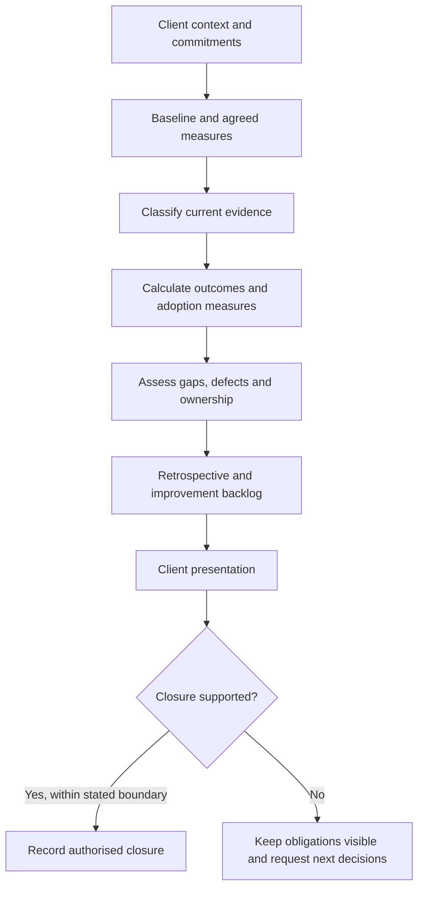

# Value Review, Closure and Client Presentation


## 1. What you will learn

The final client presentation should explain what the engagement has established, what evidence supports that conclusion and which decisions remain.

A value review is not a celebration of completed configuration. It compares intended outcomes with a baseline and current evidence. Closure checks commitments, responsibilities and unresolved work. Your presentation connects those findings to the client’s next decision.

By the end of this chapter, you should be able to:

- Compare outcome measures with their stated baseline.
- Distinguish synthetic rehearsal results from observed client outcomes.
- Assess adoption evidence without treating attendance as adoption.
- Reconcile commitments and identify closure gaps.
- Produce a useful retrospective and improvement backlog.
- Present the Evergreen project pack in client language.
- Explain your individual contribution with evidence.
- Respond to a client-style change, migration or incident scenario.

Prerequisites and continuity

You need the complete Evergreen pack developed through Chapters 1–15.


| Carried-forward item | Current state |
| --- | --- |
| Planning baseline | SB-02 v1.1 includes the core pilot and one weekly report |
| Supplier forecast | 86–98.9 person-hours; no actual effort supplied |
| Product implementation | Not executed or accepted |
| Release | No-go |
| Product UAT | Not started |
| Local/reference evidence | Available, with component-specific limits |
| Training | Materials and synthetic practice records; no actual attendance/adoption |
| Handover | Document review proposed; operational acceptance pending |
| Additional clinic | EVG-CHANGE-007 requested; full-reserve option 103.5 hours |
| Support coverage | No new after-hours service or service levels approved |

EVG-SRC-150 authorises the value review, retrospective and presentation pack. It does not authorise implementation closure, release or financial settlement.

Your contribution to the course project

You will present the client project pack and explain your own work. Your explanation should connect discovery, product fit, requirement-to-test links, delivery decisions, scope and client communication.

The pack demonstrates consulting judgement and reference behaviour. The actual fictional implementation remains incomplete and unreleased.

All new datasets, statements and decisions are synthetic. No client outcome, attendance, signature, commercial settlement or course passing result is invented.


## 2. Lessons


### 2.1 Review value through a defined comparison

Skill: explain what changed and what the evidence can support.

An outcome review compares intended business improvements with a defined starting point.

For Evergreen, the desired improvements include:

- Reliable service intake.
- Internal visibility of customers and open jobs.
- Coordinated dispatch and appointment changes.
- Complete, controlled Finance handoffs.
- Repeatable management reporting.

Configuration is a means to these outcomes. A working local completion rule does not show that Finance returns decreased in normal operations.

A useful comparison identifies:

1. Measure and business meaning.
2. Baseline dataset and period.
3. Current dataset and period.
4. Inclusion and exclusion rules.
5. Unfinished work.
6. Target status.
7. Evidence type.
8. Interpretation and limits.

Compare like measures. A completed-review first-pass rate is not the same as the proportion of all supplied handoffs that have already passed.

Also distinguish percentage points from relative percentage change. A rate rising from 60% to 80% rises by twenty percentage points. That does not mean it rose by 20% relative to its baseline.

Do not attribute improvement to the implementation when no implementation has occurred. A synthetic rehearsal can demonstrate a calculation or a plausible measurement method, not a realised client benefit.

Lesson check LC1: Why would “Evergreen’s first-pass performance improved to 80%” be unsupported by a synthetic rehearsal?


### 2.2 Evaluate adoption separately from capability

Skill: identify whether people are using the intended process.

Training evidence asks whether people can perform a task. Adoption evidence asks whether the intended process is being used during eligible business work.

Examples of adoption evidence include:

- Requests recorded with required identifiers.
- Appointment changes retaining history.
- Acknowledgements recorded before work starts.
- Qualified handoffs using the agreed route.
- Finance review remaining under Finance ownership.
- Users seeking help through the intended support route.

A successful outcome does not prove process adherence. Finance may receive complete information through an uncontrolled email. Conversely, a correctly routed handoff may still be awaiting review.

Keep those dimensions separate.

If evidence is missing, record Unknown. Do not convert Unknown to either success or failure merely to simplify the rate.

Chapter 15’s three first-pass successes among five completed practice attempts describe synthetic training performance. They do not demonstrate client adoption.

Lesson check LC2: Can a handoff pass Finance review while failing the process-adherence check? Explain.


### 2.3 Reconcile commitments before recommending closure

Skill: distinguish finished artifacts from fulfilled engagement obligations.

Closure checks whether the applicable responsibilities and commitments have been completed, accepted or explicitly transferred.

Consider:

- Agreed scope and deliverables.
- Acceptance evidence.
- Changes and exclusions.
- Data and migration exceptions.
- Training and support ownership.
- Known defects.
- Commercial records and applicable terms.
- Remaining obligations.

A document pack can be ready for presentation while the implemented service is not ready for closure.

Commercial closure requires the applicable agreement and financial records. Evergreen supplies no fees, invoices, payment evidence or settlement terms. You therefore cannot conclude that the commercial position is settled.

Do not invent a rule that every invoice depends on UAT. The applicable commercial terms would need to be inspected.

Similarly:

- Planning approval is not product acceptance.
- Forecast hours are not actual hours spent.
- A nominated backup is not verified operational ownership.
- A local defect correction is not a confirmed product fix.
- A preferred date is not a supported release commitment.

Lesson check LC3: What is wrong with “The engagement is closed because the project pack is complete”?


### 2.4 Turn the retrospective into actions

Skill: explain what caused difficulty and what should change.

A retrospective examines the work and decisions to identify useful improvements.

Avoid statements such as “communication could be better.” Explain the mechanism:

“The original sales wording combined a preferred date, historical migration and reduced re-entry without a supported implementation scope. Source classification exposed those expectations before they became delivery commitments.”

Then identify the reusable action:

“Future handoffs should link each material promise to its authority, assumptions and unresolved evidence.”

A useful retrospective includes:

- Event or evidence.
- Effect.
- Cause or contributing condition.
- What worked.
- Action and owner.
- Verification of the action.

Do not blame a person when the problem is an unclear process or missing evidence. Equally, do not hide a concrete decision behind generic lessons.

An improvement backlog should distinguish:

- Baseline completion.
- Business-data decisions.
- Operational exceptions.
- Reference-model investigation.
- New scope requests.

Unfinished baseline work should not be relabelled as an optional enhancement.

Lesson check LC4: How does a useful retrospective differ from a list of general advice?


### 2.5 Present the evidence and your contribution

Skill: make the client decision clear and defend your own work.

An executive presentation should explain:

1. The business problem.
2. The scope and authority.
3. What evidence exists.
4. What it demonstrates.
5. What remains unresolved.
6. The decision or next action required.

Lead with the main conclusion. For Evergreen:

“The planning and reference pack is available for review. Actual product acceptance, release and operational closure remain unsupported.”

Then explain why.

Use requirement-to-test links to defend decisions. For example:

“EVG-REQ-003 requires Finance review before invoice release. EVG-TEST-003 and EVG-UAT-003 check that boundary. Local evidence supports the model, while actual product evidence is still missing.”

Your contribution statement should distinguish:

- Work you authored.
- Work you reviewed.
- Exercises you executed.
- Calculations you performed.
- Supplied code or shared artifacts you used.
- Decisions you recommended.
- Decisions another role owned.

Do not claim authorship of supplied code simply because you ran it. Do not claim a client approval because your recommendation was reasonable.

Lesson check LC5: Why should your contribution statement identify supplied foundations as well as your own actions?


## 3. Visual explanation: evidence to closure decision




The diagram does not assume that the final presentation produces closure.

The decision depends on evidence and the applicable boundary. A completed learning artifact does not automatically close the client implementation.


## 4. Worked case: review Evergreen’s value and closure position


### 4.1 Baseline and rehearsal datasets

EVG-SRC-151 preserves Chapter 1’s original synthetic handoff sample.


```csv
job_ref,finance_review_state,returned_for_missing_info
EVG-JOB-1001,review_complete,no
EVG-JOB-1002,review_complete,yes
EVG-JOB-1003,review_complete,no
EVG-JOB-1004,review_complete,no
EVG-JOB-1005,review_complete,yes
EVG-JOB-1006,awaiting_review,
```

EVG-SRC-152 supplies a separate synthetic outcome-rehearsal cohort. It is not a production observation or a later state of the original six jobs.


```csv
job_ref,finance_review_state,returned_for_missing_info,process_followed,adherence_exception
EVG-JOB-2501,review_complete,no,yes,none
EVG-JOB-2502,review_complete,no,yes,none
EVG-JOB-2503,review_complete,no,no,bypassed_handoff_queue
EVG-JOB-2504,review_complete,no,yes,none
EVG-JOB-2505,review_complete,yes,no,missing_completion_summary
EVG-JOB-2506,awaiting_review,,yes,none
EVG-JOB-2507,awaiting_review,,no,bypassed_handoff_queue
EVG-JOB-2508,awaiting_review,,unknown,evidence_missing
```

Rules:

- First-pass success means a completed Finance review with no return for missing information.
- Awaiting reviews are excluded from that completed-review rate and disclosed separately.
- All eight rehearsal handoffs are eligible for process-adherence assessment.
- process_followed=yes means the required workflow steps applicable so far are evidenced.
- It does not require an unfinished Finance review to be complete.
- Unknown adherence remains an evidence gap.

### 4.2 Calculate the outcome comparison

Baseline:


> First-pass rate=(3) ÷ (5)×100=60%

One of six handoffs remains unreviewed.

Rehearsal:


> First-pass rate=(4) ÷ (5)×100=80%

Three of eight remain unreviewed.

Difference:


> 80%-60%=20 percentage points

Relative change:


> (80-60) ÷ (60)×100≈33.33%

These are two ways to describe the same mathematical comparison. Neither proves an actual client improvement.

The pending count rose from one in the baseline sample to three in the rehearsal cohort. The cohorts differ in size, so do not infer a business backlog trend without a defined period and selection method.


### 4.3 Explain the unfinished-record effect

If all three pending rehearsal reviews later return:


> (4) ÷ (8)×100=50%

If all three pass first time:


> (4+3) ÷ (8)×100=87.5%

These are conditional bounds, not predictions.

The current 80% describes five completed reviews only. It cannot be presented as the eventual result of all eight handoffs.

The original 80% target remains a discussion preference, not an approved contractual outcome threshold.


### 4.4 Calculate process adherence

Known adherence records:


> 4 yes+3 no=7

Known-record adherence:


> (4) ÷ (7)×100≈57.14%

Verified adherence coverage across all eligible records:


> (4) ÷ (8)×100=50%

One record is Unknown.

The first measure describes known records. The second describes the proportion of all eligible records with positive evidence. Unknown is not silently labelled noncompliant.

EVG-JOB-2503 passed Finance review but bypassed the handoff queue. Outcome and adoption therefore tell different stories.


### 4.5 Completed value-review brief

Evergreen Value Review v0.1 — synthetic/reference evidence


| Outcome area | Evidence available | Interpretation |
| --- | --- | --- |
| Intake reliability | Local unique-reference and hold cases | Business rule demonstrated locally; operating performance unobserved |
| Internal visibility | Defined requirement and local projections | Actual customer-search and role evidence incomplete |
| Dispatch coordination | Reference reschedule history and tabletop readiness | Native behaviour unverified; job 2105 acknowledgement issue remains |
| Finance handoff | Baseline 60%; separate rehearsal 80%; local review boundary | Measurement method demonstrated; no realised client improvement claim |
| Reporting | Local V1 defect corrected to V2 | Correct counting logic locally; actual report acceptance absent |
| Adoption | Rehearsal adherence 4/7 known, one Unknown | Synthetic process evidence; no client adoption observation |
| Support ownership | Guides, nominated owners and pending reviews | Operational takeover not accepted |

Technical inventory can support later verification. Official organisation metadata identifies environment details, while specific-profile metadata describes permissions.1 Those records would support evidence collection, not prove business outcomes by themselves.


### 4.6 Reconcile commitments

EVG-SRC-153 supplies the current commitment snapshot.


| Commitment or expectation | Applicable evidence | Closure position |
| --- | --- | --- |
| Core plus one weekly report | SB-02 v1.1 planning approval | Planning scope established; product delivery/acceptance incomplete |
| Supplier effort | 86–98.9 forecast | Actual effort not supplied |
| Preferred launch date | Earlier sales expectation corrected | No supported release commitment |
| All historical jobs | Earlier expectation corrected; production migration excluded | No complete-history delivery commitment established |
| Original orientation | One hour, at most six participants | Planned; actual attendance not observed |
| Extra clinic | EVG-CHANGE-007 | Requested, not approved |
| After-hours support | Sales statement without terms | Not established |
| Product UAT/release | Readiness unmet | Not completed |
| Commercial settlement | No applicable financial records supplied | Cannot assess |
| Operational handover | Recipient/access/acceptance gaps | Not complete |

Closure recommendation: do not close the implemented engagement or claim realised value. Present the pack and request the next evidence and scope decisions.

Record EVG-DEC-051: distinguish synthetic value analysis from actual client outcomes.

Record EVG-DEC-052: preserve unfulfilled or unverified commitments instead of declaring engagement closure.


### 4.7 Completed retrospective

EVG-SRC-155 identifies these case events.


| Event/evidence | Useful lesson | Action and owner |
| --- | --- | --- |
| Sales wording exceeded supported scope | Expectations need source and authority classification | Implementation Lead uses the engagement-brief classification at every handoff |
| J04 customer mismatch | Similar labels cannot determine ownership | Operations confirms relationships; original/correction retained |
| One receipt but two review items in receiver V1 | Count records and side effects | Developer/Quality Lead verify both in duplicate tests |
| Report V1 counted an older completion | Measure definitions belong in executable checks | Quality Lead retains date-boundary tests |
| Cutover forecast missed recovery deadline | Recovery time must shape the decision point | Administrator/Implementation Lead rehearse timing updates |
| Backup nominated without access proof | Nomination differs from accepted responsibility | Sponsor/Administrator confirm review and authority |

Each action has a mechanism and owner. “Communicate better” would not explain how these failures are prevented.


### 4.8 Completion and improvement backlog


| Backlog ID | Type | Item | Owner/decision |
| --- | --- | --- | --- |
| EVG-IMPROVE-001 | Baseline completion | Actual native fit, access, UAT and acceptance evidence | Implementation Lead/Administrator/business owners |
| EVG-IMPROVE-002 | Data decisions | Resolve C04 and the held cancellation group | Operations/Finance |
| EVG-IMPROVE-003 | Operational exception | Obtain job 2105’s required acknowledgement | Operations/Dispatch |
| EVG-IMPROVE-004 | Reference investigation | Reproduce sender-wrapper defect 002 and verify correction | Developer/Quality Lead |
| EVG-IMPROVE-005 | Ownership completion | Backup review, authority and handover acceptance | Sponsor/Administrator |
| EVG-IMPROVE-006 | Scope requests | Assess changes 003–007 through their existing records | Sponsor/Implementation Lead |

Portal/routing change 001 remains deferred. Reporting change 002 remains planning-approved only. Do not recast unresolved requests as included work.


## 5. Try it yourself — guided practice

Learning goal

Prepare the final project pack and a client-facing explanation that survives evidence questions.

Complete inputs

Use the worked datasets and commitment snapshot.

EVG-SRC-156 supplies these draft presentation claims:

1. “Evergreen’s first-pass performance improved to 80%.”
2. “The client accepted the weekly report.”
3. “Delivery consumed 98.9 hours.”
4. “Administrator handover is complete.”
5. “The reference pack is available for presentation review.”
6. “All integration defects are closed.”

No additional outcome, timesheet, acceptance or handover evidence is supplied.

Project-pack index

Check each chapter’s contribution.


| Chapter | Main artifact | Evidence/status to explain |
| --- | --- | --- |
| C05-CH01 | Engagement brief | Sources, expectations and authorised boundary |
| C05-CH02 | Discovery notes/charter | Business facts, owners and unresolved questions |
| C05-CH03 | Process models | Current evidence and proposed/confirmed rules |
| C05-CH04 | Requirements/traceability | Stable needs, criteria and planned checks |
| C05-CH05 | SOW/proposed scope | Boundaries and historical estimates |
| C05-CH06 | Architecture/fit-gap | Conditional product choice |
| C05-CH07 | Access/environment plan | Desired authority; actual proof missing |
| C05-CH08 | Migration workbook | Paper reconciliation and held changes |
| C05-CH09 | Delivery plan | Forecast, capacity and dependencies |
| C05-CH10 | Reference prototype | Local rules, not native fit |
| C05-CH11 | Interface/quality pack | Reference defect and retry evidence |
| C05-CH12 | Change/status pack | Explicit planning decisions |
| C05-CH13 | UAT pack | Local rehearsal versus unstarted product UAT |
| C05-CH14 | Cutover/recovery pack | Conditional simulation; actual No-go |
| C05-CH15 | Training/handover pack | Materials and proposed ownership |
| C05-CH16 | Value/closure/presentation | Evidence-based conclusions and next decisions |

Guided steps and expected intermediate results

1. Classify each claim.  

Expected: retain, qualify or remove it based on supplied evidence.

2. Calculate the measures.  

Expected: 60% baseline, 80% rehearsal, unfinished records and adherence gaps disclosed.

3. Prepare the presentation.  

Expected: state the main conclusion early and distinguish planning from delivery.

4. Write your contribution statement.  

EVG-SRC-154 supplies an illustrative learner role: Implementation Lead simulation. The supplied code is a foundation; the learner’s contribution is analysis, execution where performed, interpretation and decision documentation.  

Expected: claim only your own actions and identify the supporting artifacts.

5. Answer the client’s question.  

EVG-SRC-160 asks:

“Can we present 80% as achieved and close the implementation?”

Expected: explain the evidence boundary and closure gaps.

Blank value-review worksheet


| Outcome | Baseline/input | Current evidence | Formula/result | Unfinished/excluded records |
| --- | --- | --- | --- | --- |
|  |  |  |  |  |
|  |  |  |  |  |

Blank contribution worksheet


| Artifact/decision | Your action | Supplied/team foundation | Evidence | Business reason |
| --- | --- | --- | --- | --- |
|  |  |  |  |  |
|  |  |  |  |  |

Final artifacts: Value Review v0.2, closure assessment, improvement backlog, client presentation and individual contribution statement.

Cleanup: retain source data, corrected calculations and evidence versions. Do not replace historical forecasts or failed tests with the latest result.


## 6. Independent challenge

Choose one client-style scenario. All required inputs are supplied below.

Option A: scope change

EVG-SRC-157

The Sponsor asks for the extra role clinic while retaining the 100-hour supplier ceiling.

- Current base: 86 hours.
- Extra work: preparation 2, delivery 1, follow-up/document update 1.
- Reserve: 15% of revised base.
- Original client participation: 13 hours.
- Four clinic participants attend for one hour each.
- No clinic approval or reserve reduction is supplied.
- After-hours support remains an undefined request.

Deliver an impact calculation, options and a client response.

Option B: migration/recovery

EVG-SRC-158

Use a disposable simulation, not the actual project.

The checkpoint target has four customers, seven jobs and three appointments: fourteen entities.

Proposed replay rows:


| Row | Change |
| --- | --- |
| R1 | Create EVG-JOB-2301, customer 0104, received 6 February 08:58, Ready to assign |
| R2 | Create EVG-JOB-2302, customer 0101, received 10:08, Ready to assign |
| R3 | Create EVG-JOB-2303, customer 0102, received 10:10, Ready to assign |
| R4 | Update job 1803 summary from “Replaced sensor and checked operation.” to “Replaced sensor and checked operation. Verification recorded.” |
| R5 | Exact duplicate of R2 |

All parents exist. Simulator replay is approved; outbound actions must remain off. One notification concerning job 2302 was already delivered and cannot be recalled by this procedure.

C04 and the older cancellation conflict remain unresolved and are not part of this replay.

Deliver reconciliation, replay treatment, recovery limits and a client response.

Option C: incident/support

EVG-SRC-159

In the support tabletop:

- A local export marked Dispatch contains a private_reason field.
- Finance says that content must remain restricted.
- The reference record-page projection was corrected, but export-path proof is absent.
- No real tenant incident is supplied.
- Administrator is the technical owner; Finance owns restricted-information handling.
- Existing client support applies; no after-hours service is approved.
- Actual project release remains No-go.

Deliver triage, evidence preservation, escalation, correction/verification plan and a client response.

Success criteria

Your response must:

- Use the applicable requirement, change, defect or decision links.
- Separate calculations from approval.
- Preserve business identifiers and evidence.
- Name the responsible owner.
- Avoid unsupported outcome, recovery or service claims.
- Explain your own reasoning.

## 7. Common problems and recovery


| Symptom | Diagnosis | Correction |
| --- | --- | --- |
| Synthetic improvement presented as realised value | Evidence type omitted | State cohort, measure and simulation status |
| Unfinished cases disappear | Completed-case rate overextended | Disclose pending records and conditional limits |
| Forecast called actual cost | Estimate/expenditure confused | Keep forecast and actual records separate |
| Project declared closed after presentation | Artifacts confused with fulfilment | Review acceptance, obligations and ownership |
| Local fix called native product fix | Component evidence broadened | Name build/environment and remaining checks |
| Improvement backlog hides baseline gaps | Required work relabelled optional | Classify completion versus new scope |
| Learner claims supplied code authorship | Contribution attribution unclear | State source and personal analysis/execution |
| Recovery resets external-effect history | Restore confused with reversal | Preserve delivery/journal evidence |

Correct inaccurate claims before presentation. If already circulated, issue a clear correction identifying the affected statement and evidence.


## 8. Check your understanding

1. What makes an outcome comparison reproducible?
2. Why does 80% among completed reviews not describe all eight handoffs?
3. How does process adherence differ from first-pass success?
4. What is needed to assess commercial closure?
5. Why should a retrospective action have an owner and verification?
6. Which statements distinguish planning approval from acceptance?
7. How can you explain contribution without claiming team or supplied work?
8. What should the final client presentation request when closure is unsupported?

## 9. Solutions and explanations


### 9.1 Lesson checks

LC1: The dataset is synthetic and separate from production. It demonstrates a measurement, not a realised implementation outcome.

LC2: Yes. Job 2503 had complete information for Finance but bypassed the agreed handoff queue.

LC3: Artifact availability does not establish product delivery, acceptance, commercial settlement or operating ownership.

LC4: It connects a specific event and cause to an actionable change, owner and evidence of improvement.

LC5: Attribution makes the contribution credible and prevents running or reviewing supplied work from being mistaken for authorship.


### 9.2 Guided practice solution

Claim corrections


| Draft claim | Treatment | Supported wording |
| --- | --- | --- |
| First-pass improved to 80% | Qualify | Separate synthetic rehearsal: 4/5 completed reviews, 80%; three pending |
| Client accepted report | Correct | Reporting is in SB-02 v1.1 planning scope; actual report acceptance absent |
| 98.9 hours consumed | Correct | 98.9 is the full-reserve forecast; actual effort not supplied |
| Administrator handover complete | Correct | Document recipient nominated; authority/acknowledgement/acceptance pending |
| Reference pack available | Retain within boundary | Available for student/client-style presentation review |
| All integration defects closed | Remove | Defect 001 locally retested; sender defect 002 reproduction pending |

Completed client presentation

1. Main conclusion

The planning and reference pack is available for review. Actual implementation acceptance, release and operational closure are not supported by the current evidence.

2. Business context

Evergreen needs reliable intake, internal job visibility, dispatch coordination, controlled Finance handoffs and repeatable reporting. The pack preserves those needs and separates them from deferred portal, routing and other requests.

3. Evidence and value

The original synthetic handoff sample has a 60% completed-review first-pass rate. A separate rehearsal has 80%, with three reviews unfinished. These numbers demonstrate the measurement method, not realised benefit.

Local prototypes exercise key business controls. Actual native fit and product UAT remain unverified.

4. Scope and forecast

SB-02 v1.1 includes the core pilot and one weekly report for planning. Its supplier forecast is 86–98.9 hours, conditional on stated assumptions. The additional clinic is a separate request and would exceed the ceiling with the supplied reserve.

5. Open obligations

Product readiness, acceptance, migration exceptions, job-2105 acknowledgement, sender reproduction and ownership verification remain open. Support terms and commercial settlement are not established.

6. Requested decisions

Confirm the next authorised readiness work, retain explicit scope treatment for pending changes and identify owners for closure evidence. Do not present the rehearsal as achieved client value or approve release from the pack alone.

Example contribution statement

Use this as a model only where it matches your actual work:

My contribution was the evidence-based delivery review. I classified sales expectations, refined the requirements and scope comparisons, calculated effort and outcome measures, and documented decision boundaries. I used the supplied prototype code as a foundation and recorded the local cases I personally executed. I connected EVG-REQ-003 to EVG-TEST-003 and EVG-UAT-003 to explain the Finance boundary. I recommended preserving No-go because actual product and acceptance evidence was missing.

If you reasoned through cases without execution, replace the execution claim with “paper analysis.”

A suitable answer to the Sponsor is:

The 80% result belongs to a synthetic rehearsal and five completed reviews, with three pending. It cannot be presented as an achieved client outcome. The pack supports the next delivery decisions, but product acceptance, ownership and commercial evidence do not support implementation closure.


### 9.3 Independent challenge solutions

Option A: change


> Added base=2+1+1=4


> Revised base=86+4=90


> Reserve=90×0.15=13.5


> Upper bound=103.5


> Ceiling excess=103.5-100=3.5

Client participation becomes:


> 13+(4×1)=17 person-hours

Link EVG-CHANGE-007 and EVG-REQ-018. Options include retaining the original orientation, revising the ceiling or assessing an explicit scope trade. After-hours service still needs a separate definition and decision.

Option B: recovery

Five replay rows represent:


> 3 creates+1 update+1 duplicate skip=5

Closing target:


> 14+3=17


| Entity | Closing count |
| --- | --- |
| Customers | 4 |
| Jobs | 10 |
| Appointments | 3 |
| Total | 17 |

Update 1803 once. Skip the identical R5. Keep outbound actions off and retain the delivered-notification record.

Neither checkpoint restore nor replay recalls the message. C04 and the older conflict remain outside this approved simulation.

A suitable response is:

The simulator replay accounts for three new jobs, one summary update and one duplicate skip, returning seventeen entities. The delivered notification remains an external effect. This reconciles the permitted simulation rows; it does not resolve the excluded source exceptions or authorise actual migration.

Option C: incident/support

Treat the supplied local export disclosure as a control failure, linked to EVG-REQ-008, EVG-NFR-001 and the display/entry-path evidence.

- Pause use of the affected local export artifact.
- Preserve a restricted reproduction record.
- Route technical investigation to Administrator/Developer and handling to Finance.
- Keep the general ticket free of the private reason.
- Correct the output source, not merely the visible column.
- Verify the export, public projections and Finance’s permitted view.
- Record any actual product checks separately when authorised.

Do not promise an after-hours response or claim a real tenant exposure.

Record EVG-DEC-053: retain ownership, scope and evidence limits in final recommendations.


### 9.4 Understanding check answers

1. Defined dataset, period, inclusion rules, formula, unfinished records and evidence type.
2. Three have no review outcome; their later results could change the whole-cohort rate.
3. Adherence assesses intended process use; first-pass assesses the receiving team’s return outcome.
4. Applicable agreement, deliverable/change decisions and financial records.
5. Otherwise the lesson cannot be acted on or evaluated.
6. “Included in planning scope” differs from “implemented, tested and accepted.”
7. Identify your artifact/action, supplied foundation, evidence and decision ownership.
8. Specific next evidence, owners and decisions—not an unsupported success declaration.

## 10. Chapter recap and final project presentation

Value review is strongest when the limits of the evidence are clear.

You have developed a connected Evergreen pack covering discovery, scope, architecture, access, migration, prototypes, quality, changes, UAT, cutover, training and support. The final presentation should show how those artifacts support decisions and where delivery remains incomplete.

Completion checklist

- I can reproduce the outcome calculations.
- I can explain unfinished records and adoption gaps.
- I can reconcile commitments without inventing settlement.
- I can produce an actionable retrospective and backlog.
- I can present requirement-to-test links.
- I can explain my personal contribution accurately.
- I can respond to a change, migration or incident scenario.
- I can distinguish a completed learning pack from a closed implementation.

This is the final chapter of Course 5. Present the client project pack, defend your contribution and preserve the evidence boundaries in your recommendations.


## 11. Glossary and further reading

Glossary


| Term | Meaning |
| --- | --- |
| Commercial closure | Reconciliation of applicable commercial obligations and records |
| Contribution statement | Evidence-based explanation of personal work and decisions |
| Improvement backlog | Prioritised completion and improvement actions |
| Outcome review | Comparison of intended business improvements with available evidence |
| Percentage point | Absolute difference between percentage rates |
| Process adherence | Use of the intended workflow and controls |
| Realised value | Business benefit supported by actual operating evidence |
| Retrospective | Examination of events and causes to improve future work |
| Synthetic rehearsal | Constructed exercise used to test reasoning or behaviour |

Further reading

1. Zoho CRM API v8 — Get Organization Details  
[Open official reference](https://www.zoho.com/crm/developer/docs/api/v8/get-org-data.html)

Organisation/environment metadata useful when identifying actual technical evidence.

2. Zoho CRM API v8 — Get Profiles  
[Open official reference](https://www.zoho.com/crm/developer/docs/api/v8/get-profiles.html)

Specific-profile permission information relevant to unresolved access proof.

These official sources were accessed on 5 October 2026 during the course research. They support technical evidence collection, not business-value or acceptance claims. Research remains partially verified; Evergreen’s actual implementation and operating outcomes remain unobserved.
