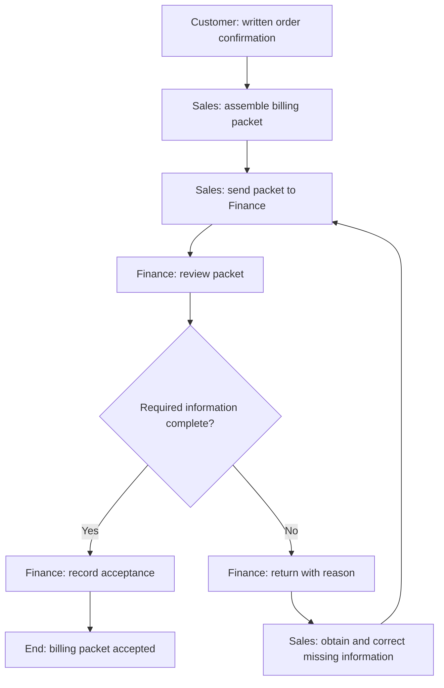

# Chapter 1 — Business Process Discovery

## 1. What you will learn

A process can appear successful to one team while creating problems for another. Sales may say, “We sent the order,” while finance says, “We cannot use it because the billing contact is missing.” Automating that handoff without understanding it would move incomplete information faster.
Business process discovery means finding out how work starts, who performs it, what decisions control it, where responsibility changes, and what happens when the normal route cannot continue.
By the end of this chapter, you should be able to:
- Define a process trigger, scope and observable end result.
- Identify participants, decision owners and handoff requirements.
- Map the current process, including exceptions and correction loops.
- Distinguish a bottleneck from rework and ordinary processing time.
- Propose changes connected to specific problems.
- Calculate starting measurements and define a measurable improvement goal.
- Write acceptance criteria that someone can check using evidence.
You need no coding or Zoho account. Paper, a drawing tool or a spreadsheet is sufficient. A spreadsheet row represents one record; a column represents one attribute, such as an order identifier or confirmation time.

### Your contribution to the course project

Meridian Supply is a fictional office-equipment business that receives enquiries, prepares quotes, confirms orders, hands billing information to finance, and handles installation and support.
The course project will eventually connect that work across applications. It includes application and data ownership, access controls, automation, finance and service handoffs, reporting, exception demonstrations, and user acceptance evidence. HR work remains a separate exercise.
In this chapter, you create the project’s current-state map, proposed future-state map, starting measurements and acceptance criteria. These explain the business need before you select applications or configure them.
The wider route is enquiry → qualification → quotation → written confirmation → finance handoff → invoicing/payment → installation/support. This overview provides context; the detailed map deliberately covers one subprocess.

The detailed case focuses on written order confirmation to finance acceptance of a billing packet. Enquiry handling and quoting are upstream; invoicing, payment, installation and support are downstream. Their detailed configuration belongs in later chapters.
All case records, permissions, timings and operating rules in this chapter are synthetic training assumptions.

## 2. Lessons


### How to investigate a process yourself

Do not start by asking which app the team wants. Start by following one real piece of work, then compare it with a case that was delayed or returned. Ask the person doing each step to describe what they received, what they did and what they sent next. Compare the explanation with available records. An interview describes a claim; a document or timestamp provides evidence for that claim.

Use these questions during discovery:

| Question | What you are trying to establish |
| --- | --- |
| Show me what starts your work. | The trigger and its evidence. |
| What information must be available before you can proceed? | Required inputs and completeness rules. |
| What decision do you make, and who may make it? | Decision rule and authority. |
| Who receives your output, and how do you know they accepted it? | Handoff and completion evidence. |
| Show me a recent returned or delayed case. | Actual exceptions and correction routes. |
| What happens if the usual person is unavailable? | Backup responsibility and unresolved ownership. |
| Which timestamps are recorded, and which are estimated? | What can be measured reliably. |

For example, Sales may say its job finishes when a packet is emailed, while Finance says it cannot begin billing until the packet is accepted. Record both statements. Inspect the email and review record. Then distinguish the sender's completed activity from the process endpoint instead of silently choosing one participant's account.

Keep a short evidence worksheet:

| Finding | Evidence or source | Status | Next action |
| --- | --- | --- | --- |
| MER-ORD-004 was returned for a missing billing email. | Supplied event trace, 15:15. | Observed within the fictional dataset. | Include the correction loop in the current map. |
| Every order waits three hours for Finance. | One order's trace only. | Not established. | Examine more review timestamps before generalising. |
| Finance should review every 30 minutes. | Proposed future rule F4. | Proposal. | Evaluate capacity and review the pilot results. |

In a real project, use permitted records and minimise copied personal information. If an observation is unavailable, label it unknown and identify who can resolve it. Do not invent a timestamp to complete a worksheet.

### Lesson 1 — Find the start, finish and boundary

A business process is a connected sequence of activities and decisions that produces a result for someone. A list of departmental duties is not yet a process: it does not show how one piece of work moves between those duties.
Begin with three questions:
1. What event starts one instance of the process?
2. What result proves that instance has finished?
3. What related work is outside this map?
The starting event is the trigger. It should be observable. “The customer is interested” is difficult to measure. “Sales receives the customer’s written order confirmation” provides evidence and a timestamp.
The finish should describe a result, rather than merely an action. “Sales emails finance” is an action. “Finance checks the billing packet and records acceptance” is a result.
This distinction matters because a sender can complete an action while the recipient still cannot proceed.

#### Worked example: setting Meridian’s boundary

Customer Taylor Ross sends an enquiry about two office printers with installation. Meridian assigns the business identifier MER-ENQ-001, associates the customer with MER-CUST-001, and prepares MER-QUOTE-001.
When written confirmation CONF-001 arrives, the detailed handoff process begins for MER-ORD-001.

| Boundary element | Meridian definition |
| --- | --- |
| Trigger | Sales receives written confirmation of an order |
| Unit being followed | One unique confirmed order |
| Start evidence | Confirmation reference and received timestamp |
| End result | Finance records that the billing packet is accepted |
| End evidence | Acceptance timestamp and finance participant |
| Outside the detailed scope | Enquiry qualification, quote preparation, invoicing, payment, installation and service resolution |

These identifiers are business identifiers created for the case. They are not Zoho-generated record IDs.
A wider map can show where this subprocess fits, but you should not measure its performance using an unrelated start or finish. Measuring from the initial enquiry would include customer decision time and quotation work, which this improvement does not address.
Mapping before implementation is consistent with Zoho’s published business process management lifecycle: identification is followed by improvement, implementation, monitoring and optimization.1
Check L1: If you want to measure Meridian’s order-to-finance handoff, should the clock start when the enquiry arrives or when written order confirmation arrives? Explain the boundary you would use.

### Lesson 2 — Identify participants, decisions and handoffs

A participant is a person, team or external party involved in the work. An activity owner is responsible for completing a particular step. A process owner is responsible for the overall process and its improvement.
These responsibilities differ. A process owner may investigate delays without being allowed to approve every record.
For this case:

| Participant | Responsibility | Boundary of authority |
| --- | --- | --- |
| Customer | Confirms the order and supplies missing customer information | Does not accept Meridian’s internal billing packet |
| Ava, Sales | Assembles, sends and corrects the packet | Cannot record finance acceptance |
| Leo, Finance | Reviews the packet; accepts it or returns it with a reason | Does not invent missing customer information |
| Noor, Operations | Owns the process definition and coordinates unresolved ownership or queue problems | Cannot substitute for finance acceptance |

An administrator later translates agreed rules into application settings. Administrator access does not, by itself, establish who should make a business decision.

### Decisions need questions and rules

A decision selects a route using information. “Review packet” is an activity. “Does the packet contain the required, confirmed information?” is a decision.
For Meridian, the packet needs:
- Order business ID.
- Customer business ID.
- Quote business ID.
- Written confirmation reference.
- Customer-confirmed billing contact email.
- Installation required: Yes or No.
A decision should identify both routes. If the packet is complete, finance can accept it. If it is incomplete, finance returns it to Sales with a reason.
A common mapping mistake is to draw a decision diamond with only a “Yes” arrow. The difficult work then disappears from the map.

### A handoff is more than sending information

A handoff transfers work and responsibility between participants. A usable handoff states what is transferred, who receives it and how the recipient responds.

| Handoff element | Completed Meridian example |
| --- | --- |
| Sender | Ava, Sales |
| Recipient | Leo, Finance |
| Information transferred | The six packet elements listed above |
| Recipient’s decision | Accept the complete packet or return it with a specific reason |
| Completion evidence | Finance acceptance record and timestamp |
| Recovery owner | Sales corrects a returned packet; finance reviews the corrected version |
| Unresolved delay | Sales asks Noor to coordinate with Finance |

Receipt and acceptance are different. A packet can be received but still await review. It can also be reviewed and rejected.
Check L2: Ava sends a packet containing all six elements. Leo has not reviewed it. What status is justified, and who can establish completion?

### Lesson 3 — Discover exceptions, rework and bottlenecks

The current state describes how work happens now. It should include inconvenient routes as well as the normal route.
For a real discovery exercise, compare three kinds of evidence:
- Participant explanations.
- Documents or records showing what happened.
- Timestamps or observations showing when it happened.
Ask participants to walk through a recent normal case and a recent difficult case. “What happened next?” usually reveals more than “What is your standard process?”
If accounts conflict, record the uncertainty and identify what evidence would resolve it. Do not silently turn a preferred procedure into the current-state map.

### Exceptions and recovery

An exception is a condition that prevents the normal route from continuing. Examples include missing information, a repeated confirmation, an unauthorized action or an unaccepted handoff.
Every exception needs an owner, a next action and a condition for returning to normal work.
For a missing billing email, safe recovery is to obtain the customer-confirmed value. Entering a convenient placeholder would make the packet appear complete without making it usable.

### Rework

Rework means repeating or correcting work because an earlier output was inadequate.
When finance returns a packet and Sales corrects and resends it, Sales repeats part of the handoff. Finance may also repeat its review.
Planned review is not automatically rework. The first completeness check is normal processing. Repeating that check because the original packet was defective is rework.

### Bottlenecks

A bottleneck is a stage that constrains overall flow, often causing work to accumulate before it.
A long case does not automatically prove a bottleneck. The delay might come from waiting for customer information, a queue, or several correction cycles.
Consider this supplied trace for MER-ORD-004:

| Event | Time on 14 September 2026, UTC |
| --- | --- |
| Order confirmed | 10:30 |
| First packet sent | 12:00 |
| First finance review begins | 15:00 |
| Finance returns packet: billing email missing | 15:15 |
| Sales resends corrected packet | 16:15 |
| Finance accepts packet | 16:30 |

The first finance queue wait is:
15:00 − 12:00 = 3 hours = 180 minutes
The two finance reviews take:
15 minutes + 15 minutes = 30 minutes
The full order-to-acceptance elapsed time is:
16:30 − 10:30 = 6 hours = 360 minutes
These are different measures. Finance did not spend six hours actively reviewing this packet.
The trace suggests a finance-review queue problem and a missing-information problem. It does not establish that every order experiences the same delay or that hiring another reviewer is necessary.
Check L3: Identify one waiting period and one rework loop in this trace. Why would “Finance takes six hours to review orders” be an inaccurate conclusion?

### Lesson 4 — Propose changes that address discovered causes

The future state describes how you propose work should happen. Keep it separate from the current state so that a proposal is not mistaken for an existing control.
Connect each change to a problem and explain its expected effect.

| Discovered problem | Proposed change | Expected effect |
| --- | --- | --- |
| Finance receives packets without confirmed billing emails | Sales checks completeness before sending | Fewer finance returns for missing information |
| Received packets wait without a clear review rhythm | Finance reviews new packets at least every 30 minutes during the training day | Shorter initial queue waits |
| Staff treat “sent” as “complete” | Use separate awaiting-review, returned and accepted states | Clearer ownership and more accurate reporting |
| A repeated confirmation could create another handoff | Compare the repeat with the existing order and confirmation | Preserve one order and one acceptance history |
| Sales attempts to accept its own packet | Reserve acceptance for Finance | Preserve the agreed decision authority |

These are proposals, not observed results.
Alternatives can address the same cause. A completeness checklist may be sufficient for an early pilot; a mandatory-information control may be suitable later. Both still depend on a useful rule. Requiring “some text” in a billing email field does not establish that the customer confirmed it.
Moving a correction upstream may improve finance’s first-pass rate without eliminating all corrective work. Therefore, record upstream holds and retain the original confirmation timestamp. Otherwise, the apparent improvement could simply hide work before submission.
For this case, a repeated customer confirmation is a duplicate only when it refers to the same order, customer, quote and confirmation reference, with no changed instruction. Another order from the same customer is not automatically a duplicate.
A corrected resubmission is also not a new order. It is a new version of the existing order’s packet.
Check L4: Would a Sales completeness check, on its own, remove the 12:00–15:00 queue wait in MER-ORD-004? What additional proposed change addresses that delay?

### Lesson 5 — Establish starting measurements and acceptance criteria

A baseline is the starting measurement used for comparison. Before calculating it, define the unit, start, finish, population and exclusions.
For Meridian:
- One case means one unique confirmed order.
- Elapsed time begins at written confirmation.
- Elapsed time ends at finance acceptance.
- A repeat transmission does not create another case.
- An unfinished order has no completed elapsed time yet.

### Worked measurement example

Suppose three completed orders have elapsed times of 60, 120 and 180 minutes. Their finance-return flags are No, Yes and No. A fourth order remains open at an age of 240 minutes.

### Mean completed elapsed time

Mean = sum of completed elapsed minutes ÷ number of completed orders
Mean = (60 + 120 + 180) minutes ÷ 3 = 120 minutes

### Completed-case first-pass rate

Here, first-pass means finance accepted the order’s packet without returning any submitted version for correction.
First-pass rate = completed orders with no finance return ÷ completed orders × 100%
First-pass rate = 2 ÷ 3 × 100% = 66.7%
The unfinished order is excluded from both completed-case calculations. However, it must still be reported as open, with an age of 240 minutes.
A mean of 120 minutes describes the three completed cases. It does not prove that all four orders are performing well. Slow unfinished work can make a completed-case average look misleadingly good.

### Improvement goals and acceptance criteria

An improvement goal states a measurable desired change. An acceptance criterion states the evidence needed to judge whether the proposed process is satisfactory.
“Make handoffs faster” is incomplete. A stronger statement specifies the population, target and deadline, while preventing unfinished cases from disappearing.
Acceptance should include both:
- Performance: elapsed time, first-pass rate and unresolved work.
- Behavior: missing data is held or returned, only the permitted participant accepts, and duplicates do not create extra cases.
A target is a desired result. An expected simulation outcome follows from supplied rules. An actual observation requires execution evidence. Do not label a planned target or paper answer as an observed improvement.
Check L5: In the four-order example, does the 120-minute mean prove that the whole process meets a 120-minute service target? What additional information should accompany it?

## 3. Visual explanation — The current handoff

### Drawing your own process map

Use a start/end shape for the boundary, a rectangle for an activity, a diamond for a decision and arrows for the order of work. Label decision arrows with their condition, such as Complete or Missing information. If drawing participant lanes, put each activity in the lane of the person responsible for it. These are simple drawing conventions for this exercise, not a full BPMN specification.

Write activities as a verb plus an object: “Review billing packet” is clearer than “Finance.” Write decisions as questions: “Is the billing email customer-confirmed?” is clearer than “Check.” Keep statuses separate from actions: “Awaiting review” describes a state; “Review packet” describes work.

To build your map, define the boundary, trace the normal route, add each decision's other route, assign owners and then replay one incomplete case. If that case reaches a dead end without an owner or a next action, the map needs repair. A spreadsheet step table is acceptable when it exposes the same logic.




The diagram begins at written order confirmation, rather than at the earlier enquiry. It ends at finance acceptance, rather than at invoicing.
The arrow from Sales to Finance is a handoff. The decision creates two routes. The return route loops back to Sales, showing rework rather than making it disappear.
If Sales cannot obtain the missing information, the order remains open with Sales as correction owner. It does not reach the accepted endpoint.
This current-state map intentionally has no pre-send completeness gate or formal repeated-confirmation check. Those are proposed changes.

## 4. Worked case — Meridian’s starting position


### Inputs and scenario rules

The sample contains six unique confirmed orders on 14 September 2026. All timestamps are UTC. The observation cutoff is 17:00 UTC.
For this sample, the training working day is 09:00–17:00. Calculations use elapsed clock minutes, not a business-hours formula.
The packet extract below preserves the original packet values. A blank billing email is intentionally missing data. Later correction evidence does not overwrite what the first version contained.

```csv
order_id,customer_id,quote_id,confirmation_ref,billing_contact_email,installation_required
MER-ORD-001,MER-CUST-001,MER-QUOTE-001,CONF-001,northbank.billing@example.com,Yes
MER-ORD-002,MER-CUST-002,MER-QUOTE-002,CONF-002,,No
MER-ORD-003,MER-CUST-003,MER-QUOTE-003,CONF-003,harbor.billing@example.com,Yes
MER-ORD-004,MER-CUST-004,MER-QUOTE-004,CONF-004,,No
MER-ORD-005,MER-CUST-005,MER-QUOTE-005,CONF-005,oak.billing@example.com,Yes
MER-ORD-006,MER-CUST-006,MER-QUOTE-006,CONF-006,elm.billing@example.com,No
```

Customer MER-CUST-001 is Northbank Studio. Its enquiry contact is taylor.ross@example.com; the billing contact is the different address shown in the packet.
The available, customer-confirmed corrections are:

| Order | Permitted correction | Supplied evidence reference |
| --- | --- | --- |
| MER-ORD-002 | Set billing email to redwood.billing@example.com | BILL-002 |
| MER-ORD-004 | Set billing email to cedar.billing@example.com | BILL-004 |

No other correction value is authorized by these inputs.
The event dataset records whether Finance returned any submitted packet version before acceptance. Unknown means the order was unfinished at the cutoff, so its final first-pass outcome was not yet known.

```csv
order_id,confirmation_at,first_sent_at,accepted_at,finance_returned,return_reason,status_at_cutoff
MER-ORD-001,2026-09-14T09:00:00Z,2026-09-14T09:30:00Z,2026-09-14T10:00:00Z,No,None,Accepted
MER-ORD-002,2026-09-14T09:15:00Z,2026-09-14T10:15:00Z,2026-09-14T14:15:00Z,Yes,Billing email missing,Accepted
MER-ORD-003,2026-09-14T10:00:00Z,2026-09-14T10:30:00Z,2026-09-14T11:00:00Z,No,None,Accepted
MER-ORD-004,2026-09-14T10:30:00Z,2026-09-14T12:00:00Z,2026-09-14T16:30:00Z,Yes,Billing email missing,Accepted
MER-ORD-005,2026-09-14T13:00:00Z,2026-09-14T14:00:00Z,,Unknown,Not yet determined,Awaiting finance review
MER-ORD-006,2026-09-14T14:00:00Z,,,Unknown,Not yet determined,Awaiting Sales send
```


### Step 1 — Follow the normal record

For MER-ORD-001, Sales receives confirmation at 09:00 and sends the complete packet at 09:30. Finance accepts at 10:00.
The intermediate state is awaiting finance review, not accepted. The final elapsed time is:
10:00 − 09:00 = 60 minutes
The packet was not returned, so this completed order passes first time.

### Step 2 — Follow a correction route

For MER-ORD-004, the first packet lacks the billing email. The trace in Lesson 3 shows that Finance returns it.
Sales uses the supplied correction cedar.billing@example.com, supported by BILL-004, and resends the existing order’s packet. Finance then accepts it at 16:30.
The final record remains MER-ORD-004. It is completed, but it is not first-pass.

### Step 3 — Produce the completed baseline


| Order | Accepted by cutoff? | Completed elapsed time | Completed first-pass outcome | Open age at 17:00 |
| --- | --- | --- | --- | --- |
| MER-ORD-001 | Yes | 60 minutes | Pass | Not applicable |
| MER-ORD-002 | Yes | 300 minutes | Fail | Not applicable |
| MER-ORD-003 | Yes | 60 minutes | Pass | Not applicable |
| MER-ORD-004 | Yes | 360 minutes | Fail | Not applicable |
| MER-ORD-005 | No | Not yet available | Not yet known | 240 minutes |
| MER-ORD-006 | No | Not yet available | Not yet known | 180 minutes |

The mean completed elapsed time is:
(60 + 300 + 60 + 360) minutes ÷ 4 = 780 ÷ 4 = 195 minutes
That is 3 hours 15 minutes.
The completed-case first-pass rate is:
2 ÷ 4 × 100% = 50%
The accepted proportion at the cutoff is:
4 ÷ 6 × 100% = 66.7%
The remaining two orders are open, not failed first-pass cases and not zero-minute completions.

### Step 4 — Write the proposed future state


| Step | Owner | Action or decision | Normal route | Exception or recovery |
| --- | --- | --- | --- | --- |
| F1 | Sales | Identify the confirmed order; check for an unchanged repeated confirmation | New unique order proceeds to F2 | Link an exact repeat to the existing order; create no extra handoff |
| F2 | Sales | Check the six required packet elements and their supplied evidence | Complete packet proceeds to F3 | Hold with Sales; obtain the permitted customer-confirmed correction |
| F3 | Sales | Submit the packet, preserving its order ID | Await Finance review | Corrected resubmission updates the existing packet history |
| F4 | Finance | Review new packets at least every 30 minutes during 09:00–17:00 | Complete packet proceeds to F5 | Return unexpected incomplete packets to Sales with a reason |
| F5 | Finance | Record acceptance | Accepted endpoint | Sales attempts to accept are denied; status remains awaiting Finance |
| F6 | Sales and Operations | Identify packets awaiting first review for more than 60 minutes | Noor coordinates with Finance | Keep the order open; do not manufacture acceptance |

F6 is a delay-management route, not a replacement for Finance’s decision. These review intervals are proposed Meridian training rules.

### Step 5 — Define the measurable improvement goal

For the next training pilot, use 10 consecutive unique confirmed orders received between 09:00 and 15:00 on one training day, with a cutoff at 17:00.
The proposed goal is:
Reduce mean confirmation-to-finance-acceptance elapsed time from 195 minutes to no more than 120 minutes, and increase completed-case first-pass acceptance from 50% to at least 90%. All 10 orders must be accepted by the cutoff for the pilot to pass.
This means at least 9 ÷ 10 × 100% = 90% must pass first time.
Also report upstream missing-data holds, finance returns and open ages. If an order remains open at 17:00, report the completed-case measures but mark the pilot outcome not accepted. Do not remove that order and declare success.

### Mistake and correction

Mistake: Mark MER-ORD-005 complete because Sales sent it at 14:00.
Correction: Preserve “awaiting finance review.” At 17:00, its open age is 17:00 − 13:00 = 240 minutes. Only a finance acceptance record can establish completion.
The correction protects both ownership and measurement accuracy.

## 5. Try it yourself — Guided practice


### Learning goal and materials

Map Meridian’s current and proposed processes, reproduce the baseline, and define a measurable improvement contract.
Use paper or a spreadsheet. You need no product permissions, live customer data or online application. This exercise demonstrates process reasoning; it does not demonstrate configured Zoho controls.

### Required project files

Create these four artifacts:
- C01_Meridian_Current_State.md
- C01_Meridian_Future_State.md
- C01_Meridian_Measurements.md
- C01_Meridian_Acceptance.md
Use the complete inputs in Section 4 and the replay cards below. Preserve the original dataset. Record corrections separately.

### Replay inputs

Each card is a paper simulation using a copy of the supplied packet, not a new baseline observation.

| Simulation | Supplied situation | Action to assess | Permitted recovery or comparison |
| --- | --- | --- | --- |
| SIM-01 | Original packet for MER-ORD-001; all six elements are supplied | Sales submits; Finance reviews and accepts | Use the supplied packet unchanged |
| SIM-02 | Original packet for MER-ORD-002; billing email is blank | Check the pre-send gate; also assess a variant where the incomplete packet was accidentally sent | Only redwood.billing@example.com, evidence BILL-002, is the permitted correction |
| SIM-03 | Original complete packet for MER-ORD-003; it awaits Finance | Ava in Sales attempts to record finance acceptance | Leo in Finance may subsequently review and accept |
| SIM-04 | SIM-01 is already accepted; an unchanged copy repeats MER-ORD-001, MER-CUST-001, MER-QUOTE-001 and CONF-001 | Decide whether to create another handoff | Compare with SIM-01; there is no changed customer instruction |


### Blank learner worksheets

Use one process row for each activity or decision. Name the participant, rather than writing only “the team.”

| Step | Participant or owner | Activity or decision question | Input or evidence | Next route | Exception and recovery |
| --- | --- | --- | --- | --- | --- |
|  |  |  |  |  |  |
|  |  |  |  |  |  |
|  |  |  |  |  |  |

For measurements, specify what is counted and what is excluded.

| Measure | Unit and population | Start and finish or flag | Formula | Baseline | Target and unfinished-case rule |
| --- | --- | --- | --- | --- | --- |
|  |  |  |  |  |  |
|  |  |  |  |  |  |

For acceptance, distinguish expected behavior from observed evidence.

| Simulation | Decision and reason | Responsible participant | Expected state or output | Recovery | Evidence status |
| --- | --- | --- | --- | --- | --- |
| SIM-01 |  |  |  |  |  |
| SIM-02 |  |  |  |  |  |
| SIM-03 |  |  |  |  |  |
| SIM-04 |  |  |  |  |  |


### Guided steps and expected intermediate results

1. Define scope and draw the current map.  
Expected result: one written-confirmation trigger, one finance-accepted endpoint, named participants and a visible return-and-resend loop.
2. Draw or tabulate the future map.  
Expected result: a repeated-confirmation decision, a completeness gate, Finance-only acceptance and reachable recovery routes.
3. Recalculate the baseline.  
Expected result: four completed orders and two open orders, with completed calculations and separately reported open ages.
4. Apply the future rules to all four replay cards.  
Expected result: each card has a justified route, owner, resulting state and permitted recovery. Record the accidental-send variant of SIM-02 separately.
5. Write the improvement contract.  
Expected result: a defined pilot population, numeric targets, a cutoff, an unfinished-case rule and behavioral acceptance criteria.
Your final artifacts should allow another student to trace a normal order, a correction, a denied action and a repeat without guessing what happens next.
No application cleanup is required. Retain the synthetic inputs and clearly label replay outcomes as expected paper results.

## 6. Independent challenge — A separate HR process

Apply the same discovery method to leave requests. Keep HR records separate from the customer-order project.

### Supplied current process

An employee submits a leave request. HR coordinator Omar logs it and forwards it without a completeness check. Manager Ren reviews it.
If information is missing, Ren returns it to Omar. Omar asks the employee for a correction and resubmits it. Ren makes the approve-or-decline decision. Omar records that decision and notifies the employee.
The endpoint is employee notification of the decision, whether approved or declined.

### Synthetic rules and access constraints

- A request needs an employee ID, start date and end date.
- The end date cannot precede the start date.
- Requests longer than two working days also need a cover-plan reference.
- The supplied working-day counts are authoritative for this exercise.
- Ren alone makes the leave decision. Omar cannot approve.
- Only the employee for their own request, Omar and Ren may read its details. Sales has no access.
- All elapsed durations below are clock minutes.
- First-pass means a completed request reached notification without being returned for missing information by any participant.
These are exercise rules, not legal or employee-policy advice.

### Complete input dataset


| Request | Employee | Start date | End date | Working days | Initial cover plan | Baseline status | Elapsed or open age | Returned for missing information? |
| --- | --- | --- | --- | --- | --- | --- | --- | --- |
| MER-HR-001 | MER-EMP-001 | 2026-09-21 | 2026-09-21 | 1 | Not required | Notified: approved | 120 minutes elapsed | No |
| MER-HR-002 | MER-EMP-002 | 2026-09-21 | 2026-09-23 | 3 | Missing | Notified: approved after correction | 360 minutes elapsed | Yes |
| MER-HR-003 | MER-EMP-003 | 2026-09-22 | 2026-09-23 | 2 | Not required | Notified: declined | 180 minutes elapsed | No |
| MER-HR-004 | MER-EMP-004 | 2026-09-24 | Missing | Unknown until corrected | Undetermined | Awaiting manager review | 300 minutes open age | Not yet known |

Available replay corrections and decisions are:

| Request | Permitted correction | Supplied manager decision after completeness |
| --- | --- | --- |
| MER-HR-001 | None needed | Approve |
| MER-HR-002 | Employee supplies COVER-002 | Approve |
| MER-HR-003 | None needed | Decline: insufficient team coverage |
| MER-HR-004 | Employee confirms end date 2026-09-25; corrected working days = 2; no cover plan required | Approve |


### Deliverables and success criteria

Create C01_HR_Discovery_Challenge.md containing:
1. Current and proposed future maps.
2. The completed-case mean elapsed time and first-pass rate, plus the open request’s age.
3. A measurable goal for the next four consecutive requests. Choose a mean-time target between 150 and 180 minutes, a 100% first-pass target, and require all four requests to reach notification within eight elapsed hours of submission.
4. Expected routes for the missing cover plan, missing end date and a Sales request to read HR details.
5. An explanation of why a declined request can still be successfully completed.
Success means that the maps preserve Ren’s decision authority, expose correction routes, prevent unauthorized disclosure and use reproducible denominators. Future performance is a target, not something this dataset proves.

## 7. Common problems and recovery


| Symptom | Likely diagnosis | Correction | Verification |
| --- | --- | --- | --- |
| The map stops at “send email” | Sender activity was mistaken for the business outcome | Add recipient review and an accepted or returned result | Trace a received-but-unreviewed packet |
| Every decision has only one route | Exceptions were omitted | Add the negative route, owner and return condition | Trace MER-ORD-004 through correction |
| A placeholder makes a packet look complete | Presence was mistaken for confirmed information | Hold or return it; use only the supplied permitted correction | Check the value against BILL-002 or BILL-004 |
| A correction becomes another order | Record identity was confused with packet version | Preserve the order ID and retain version history | Count one case before and after resend |
| Two transmissions become two cases | Attempts were counted instead of unique orders | Link the exact repeat to the existing order | Replay SIM-04 and reconcile the unique-order count |
| Sales records finance acceptance | Business authority was not respected | Deny the action; leave the state awaiting Finance | Confirm that only Finance can reach acceptance |
| The mean looks good while work remains open | Completed-case reporting hides unfinished work | Report open count and ages; apply the cutoff rule | Reconcile all six baseline orders |
| All long elapsed time is called processing time | Waiting and active work were mixed | Use event timestamps to separate known intervals | Explain the 180-minute initial queue wait in MER-ORD-004 |
| HR details appear in a sales worksheet | Separate access boundaries were lost | Remove the details from the sales artifact; keep them in the restricted HR exercise | Check intended readers against the supplied HR access rule |

Recovery should preserve evidence. Keep the original missing value, return reason and confirmation time. A correction changes the usable packet; it should not erase the history of how the problem occurred.

## 8. Check your understanding

Answer before reading the solutions.
1. Why is “finance accepts the packet” a stronger endpoint than “Sales sends the packet”?
2. Using MER-ORD-002, calculate confirmation-to-acceptance elapsed time. Does its accepted status make it a first-pass case?
3. At 17:00, what can you calculate for MER-ORD-006, and what completed measure is unavailable?
4. A student removes MER-ORD-005 and MER-ORD-006 from every report because they are unfinished. What interpretation problem does this create?
5. Why should an unchanged repeated confirmation and a corrected resubmission follow different routes?
6. Which evidence would help you investigate whether Finance is consistently a bottleneck beyond this small sample?
7. Suppose the proposed pilot accepts all 10 orders by the 17:00 cutoff, with total elapsed time of 1,100 minutes and eight first-pass acceptances. Does it meet the performance criteria?
8. Omar records Ren’s decline decision and notifies the employee. Has the HR process reached its endpoint? Explain.

## 9. Solutions and explanations


### Lesson checks


| Check | Explained answer |
| --- | --- |
| L1 | Start at written order confirmation. The selected process measures confirmed-order handoff, so earlier enquiry and quotation time are outside its boundary. Starting at enquiry would answer a different question. |
| L2 | “Awaiting finance review” is justified. Supplying the required elements permits review but does not prove it occurred. Finance establishes completion by recording acceptance. |
| L3 | The 12:00–15:00 interval is a 180-minute queue wait. The return, correction and resend form a rework loop. The six-hour elapsed time includes Sales work, waiting and correction, so it is not six hours of finance review. |
| L4 | No. A completeness check addresses missing information. The proposed 30-minute finance review rhythm and overdue-review route address initial queue delay. |
| L5 | No. The mean describes three completed cases, while a fourth is open at 240 minutes. Report the three-of-four completion position, open age, measurement cutoff and the rule for judging unfinished work. |


### Guided practice: completed project artifacts


### Current-state artifact

C01_Meridian_Current_State.md should contain the scope table from Lesson 1, the participant responsibilities from Lesson 2 and the current-state diagram in Section 3.
A text or spreadsheet map is equally valid if it preserves this route:
Written confirmation → Sales assembles packet → Sales sends → Finance reviews → complete?
- Yes: Finance accepts; process ends.
- No: Finance returns with reason; Sales obtains the permitted correction and resends the existing order’s packet.
- Unresolved missing information: remain open with Sales.
Do not add the proposed pre-send gate to the current-state artifact.

### Future-state artifact

C01_Meridian_Future_State.md should preserve F1–F6 from the worked case. It must include both an upstream hold and a downstream return route.
An acceptable alternative layout uses participant lanes rather than a step table. The logic must remain the same: Sales controls preparation and correction, Finance controls acceptance, and Noor coordinates overdue work.

### Measurement artifact

The completed core of C01_Meridian_Measurements.md is:

| Measure | Calculation | Baseline interpretation |
| --- | --- | --- |
| Mean completed elapsed time | 780 minutes ÷ 4 = 195 minutes | Applies to four accepted orders |
| Completed-case first-pass rate | 2 ÷ 4 × 100% = 50% | Two accepted orders had no Finance return |
| Accepted proportion at cutoff | 4 ÷ 6 × 100% = 66.7% | Two unique confirmed orders remain open |
| MER-ORD-005 open age | 17:00 − 13:00 = 240 minutes | Awaiting Finance review |
| MER-ORD-006 open age | 17:00 − 14:00 = 180 minutes | Awaiting Sales send |

Open orders are excluded from completed-case elapsed time and first-pass calculations, but remain in the overall case count.

### Acceptance artifact

The completed replay section of C01_Meridian_Acceptance.md is:

| Simulation | Expected decision and reason | Responsible participant | Expected output and recovery | Evidence status |
| --- | --- | --- | --- | --- |
| SIM-01 | Complete packet may proceed; Finance accepts after review | Sales submits; Finance accepts | Accepted under MER-ORD-001 | Expected paper result |
| SIM-02, pre-send | Missing confirmed billing email prevents submission | Sales | Hold; enter redwood.billing@example.com using BILL-002; submit corrected packet for Finance review | Expected paper result |
| SIM-02, accidental-send variant | Finance cannot accept the incomplete packet | Finance returns; Sales corrects | Returned with reason; correction uses BILL-002; resend under MER-ORD-002; Finance may then accept | Expected paper result |
| SIM-03 | Sales is not permitted to establish finance acceptance | Sales action denied; Finance owns review | Remain awaiting Finance after denial; Leo may review and accept afterward | Expected paper result |
| SIM-04 | Exact unchanged repeat matches already accepted SIM-01 | Sales identifies and links repeat | No second order or new handoff; original acceptance is preserved | Expected paper result |

The complete pilot acceptance contract is:

| Criterion | Required evidence |
| --- | --- |
| Defined sample | Ten consecutive unique confirmed orders received 09:00–15:00 on one training day |
| Timeliness | Total completed elapsed minutes ÷ 10 ≤ 120 minutes |
| First-pass acceptance | At least 9 of 10 accepted without a Finance return |
| Completion guardrail | All 10 accepted by 17:00; otherwise pilot not accepted |
| Missing-data behavior | Hold before sending, or return if unexpectedly received incomplete; preserve correction evidence |
| Decision authority | Sales acceptance attempt is denied without changing the acceptance state |
| Duplicate behavior | Exact repeated confirmation links to the existing order without creating another case |
| Visibility of displaced work | Report upstream holds, Finance returns and any unfinished ages |

The four paper replays demonstrate expected routing. They do not establish the pilot’s elapsed-time or first-pass results.

### Independent challenge: completed HR artifact

A valid C01_HR_Discovery_Challenge.md uses these maps:

| Stage | Current state | Proposed future state |
| --- | --- | --- |
| Intake | Employee submits; Omar logs and forwards unchecked | Employee submits; Omar logs and checks completeness |
| Missing information | Ren returns to Omar; Omar obtains correction and resubmits | Omar holds before manager review and obtains the permitted correction |
| Decision | Ren approves or declines after completeness | Ren approves or declines after completeness |
| Completion | Omar records decision and notifies employee | Omar records decision and notifies employee |
| Unexpected incomplete handoff | Ren returns with a reason | Retain the same return-and-correction safety route |
| Access exception | Apply the supplied restricted-reader rule | Deny Sales access; do not disclose request details |

The baseline mean is:
(120 + 360 + 180) minutes ÷ 3 = 660 ÷ 3 = 220 minutes
The completed-case first-pass rate is:
2 ÷ 3 × 100% = 66.7%
MER-HR-004 is excluded from those completed-case calculations and reported separately as open at 300 minutes.
One valid goal is:
For the next four consecutive requests, reduce mean submission-to-notification elapsed time from 220 minutes to no more than 180 minutes, achieve 100% first-pass completion, and notify all four employees within eight elapsed hours of their respective submissions.
Eight hours equals 8 × 60 = 480 minutes. If any request misses its notification deadline or remains unfinished, the goal is not achieved. Targets of 150–179 minutes are also acceptable within the task’s range, provided they are clearly labeled targets rather than predicted results.
Expected replay routes are:

| Condition | Correct route |
| --- | --- |
| MER-HR-002 missing cover plan | Omar holds and obtains COVER-002; Ren then approves; Omar notifies |
| MER-HR-004 missing end date | Omar obtains 2026-09-25; the supplied corrected count is two working days, so no cover plan is needed; Ren approves; Omar notifies |
| Sales requests HR details | Deny access and disclose no request details |
| MER-HR-003 declined | Record Ren’s supplied coverage reason and notify the employee; the process is completed |

A decline is a valid decision outcome. It is not a process failure merely because the employee did not receive the desired answer.

### Answers to the understanding questions

1. Acceptance establishes recipient usability and ownership. Sending proves only that the sender performed a transmission action.
2. Elapsed time is 300 minutes.  
14:15 − 09:15 = 5 hours = 300 minutes.  
It is not first-pass because Finance returned a submitted version for missing billing information.
3. Its open age is 180 minutes.  
17:00 − 14:00 = 3 hours = 180 minutes.  
Its completed confirmation-to-acceptance duration is unavailable because no acceptance timestamp exists.
4. The report would hide unfinished work. Completed-case calculations may legitimately exclude open records, but an overall process report must retain their count, ages and owners.
5. A duplicate repeats an unchanged business event; a correction repairs an existing packet. Link the duplicate without new work. Allow the correction to update the existing packet and proceed to another review.
6. Collect queue and processing evidence across more cases. Useful evidence includes arrival times, first-review times, review durations, queue sizes, reviewer availability, return reasons and customer-correction delays. This separates recurring queue constraints from isolated exceptions.
7. The pilot does not meet all performance criteria.  
Mean: 1,100 minutes ÷ 10 = 110 minutes, which meets the 120-minute target.  
First-pass: 8 ÷ 10 × 100% = 80%, which misses the 90% target. Completing all 10 satisfies the completion condition, but the first-pass failure prevents overall acceptance.
8. Yes. The endpoint is notification of the manager’s decision. Omar communicates and records Ren’s decision without taking over Ren’s authority.

## 10. Chapter recap and next step

Discovery turns a vague complaint into a defined process, an evidence-based starting position and a testable proposal.
For Meridian, the important findings are that “sent” differs from “accepted,” missing billing information causes rework, and queue waiting contributes to elapsed time. The proposed process therefore combines preparation controls, clear review ownership and exception recovery.
Use this completion checklist:
- I can identify an observable trigger and endpoint.
- I can name activity owners and decision authorities.
- I can trace both normal and exception routes.
- I can distinguish a repeat, a correction and a new case.
- I can reproduce the baseline and report unfinished work.
- I can define measurable goals and behavioral acceptance criteria.
- I can distinguish expected paper results from actual execution evidence.
Your project evidence is the four Meridian artifacts. The separate HR artifact shows that the same discovery skills apply under different access and decision constraints.
The next chapter, Zoho Ecosystem and Solution Selection, uses these process requirements to select applications and identify which system should own each record. Later chapters implement and test the proposed controls.

## 11. Glossary and further reading


### Glossary


| Term | Meaning |
| --- | --- |
| Acceptance criterion | An evidence-based condition used to judge whether a process or change is satisfactory |
| Baseline | A starting measurement used for comparison |
| Bottleneck | A stage that constrains overall flow and may cause work to accumulate |
| Current state | How work happens now, including actual exceptions |
| Decision | A question and rule that select the next route |
| Elapsed time | Clock time between defined start and finish events |
| Exception | A condition that prevents the normal route from continuing |
| First-pass rate | The proportion of the defined completed population that finishes without the specified correction return |
| Future state | The proposed way work should happen |
| Handoff | Transfer of work, information and responsibility between participants |
| Open age | Time from the defined start to the observation cutoff for unfinished work |
| Process owner | The participant accountable for the overall process and its improvement |
| Rework | Repeated or corrective work caused by an inadequate earlier output |
| Trigger | The observable event that starts a process instance |


### Further reading

1 Zoho, Business Process Management (https://www.zoho.com/creator/business-process-management-software/), especially Business process management lifecycle. The accessed official overview explains identification, improvement, implementation, monitoring and optimization. Read these sections alongside your maps; they provide conceptual context rather than a configuration procedure.
This chapter’s research coverage is limited to that conceptual lifecycle. No current Zoho interface procedure or product execution is established here.
