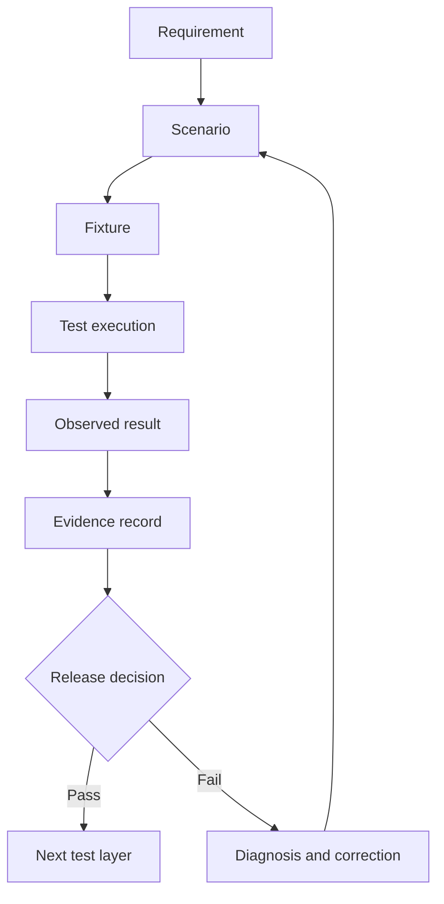

# Testing and Performance

## What you will learn

A solution is not complete when its normal path works once.
A professional implementation must also show what happens when:
- Required data is missing.
- A user lacks permission.
- A credential expires.
- A request is repeated.
- A downstream service times out.
- A batch contains partial failures.
- API credits are consumed faster than expected.
- Concurrent requests exceed a limit.
- A Function exceeds its execution time.
- A schema changes.
- A release is tested in one environment but deployed in another.

In this chapter, you will learn to:
- Build a test suite linked to requirements.
- Separate local, contract, sandbox, tenant, and production evidence.
- Test functional, access, integration, regression, volume, and failure scenarios.
- Use synthetic dependencies to test errors without live API requests.
- Design duplicate, retry, timeout, conflict, and reconciliation tests.
- Estimate CRM API credits for common operations.
- Understand API concurrency and sub-concurrency.
- Compare Get Records, Search, COQL, Composite, Bulk Read, and Bulk Write test strategies.
- Define performance budgets separately from platform limits.
- Use logs, revisions, failures, analytics, and credit usage as diagnostic evidence.
- Produce a completed test suite and performance findings for Nova Field Service.

## Prerequisites

You should understand:
- The Nova data ownership rules from Chapter 1.
- The extension and reusable-component boundary from Chapter 20.
- The difference between Creator operational state and CRM reference data.
- Stable business identifiers such as `NOV-REQ-001`.
- The completion event key: `NOV-REQ-001:completed:v1`.

No live Zoho tenant or credentials are required for the guided practice.

## Chapter overview

```text
Requirement
    |
    v
Test scenario
    |
    v
Expected result
    |
    v
Synthetic or tenant test
    |
    v
Observed evidence
    |
    v
Performance and release decision
```

The goal is to produce evidence that answers: *Does this implementation behave correctly, safely, and within its intended operating budget?*

---

## Lessons

### Lesson 1 — A test is an evidence record

A useful test contains more than an assertion.
Record:
- Scenario ID.
- Requirement ID.
- Input fixture.
- Preconditions.
- Action.
- Expected result.
- Observed result.
- Environment.
- Version under test.
- Evidence location.
- Follow-up action.

A weak test note says:
> Integration tested successfully.

A stronger test record says:
```yaml
scenario_id: "INT-006"
requirement_id: "NFR-003"
description: "Replay the same completion event after delivery"
input:
  request_key: "NOV-REQ-001"
  event_key: "NOV-REQ-001:completed:v1"
expected:
  state: "Delivered"
  code: "DUPLICATE_SUPPRESSED"
  second_destination_write: false
observed:
  state: "Delivered"
  code: "DUPLICATE_SUPPRESSED"
  second_destination_write: false
environment: "local synthetic"
version: "C02-CH21 reference harness"
live_tenant_used: false
```

This record distinguishes what was expected from what was observed.

#### Evidence classes

| Evidence class | Example | What it proves |
| :--- | :--- | :--- |
| Pure logic | Event-key validation | Local algorithm behavior |
| Component test | Fake CRM client | Error mapping and projection |
| Contract test | Synthetic CRM response | Parser and response-shape behavior |
| Sandbox test | Extension sandbox | Controlled Zoho behavior |
| Tenant test | Configured organization | Current tenant behavior |
| Production observation | Deployed logs | Live release behavior |

Never report a pure local test as a live CRM result.

---

### Lesson 2 — Build a test pyramid

Test inexpensive and deterministic behavior first.

```text
                 Production observation
                         |
                    Tenant tests
                         |
                    Sandbox tests
                         |
                  Contract tests
                         |
                 Component tests
                         |
                  Pure logic tests
```

#### Pure logic tests
Test code that does not need an API:
- Validate required fields.
- Preserve identifiers as strings.
- Construct event keys.
- Choose allowed fields.
- Classify errors.
- Estimate API costs.
- Check performance budgets.
- Select retry or reconciliation behavior.

#### Component tests
Inject fake dependencies:
- Fake CRM client.
- Fake Connector.
- Fake clock.
- Fake destination.
- Fake quota response.
- Fake timeout.
- Fake malformed response.

#### Contract tests
Verify the shape of an exchanged request or response:
- CRM record response.
- COQL response.
- Composite response.
- Bulk job response.
- Connector response.
- Function REST response.

#### Sandbox tests
Use a safe product environment to test:
- Extension installation.
- Fields and modules.
- Function association.
- Connections.
- Workflows.
- Widgets.
- Upgrade behavior.
- Access decisions.

#### Controlled tenant or production tests
Use only when the release process permits them.
They should have:
- Approved synthetic or limited data.
- A defined rollback or disablement path.
- Monitoring.
- A named owner.
- A defined stop condition.

---

### Lesson 3 — Link tests to requirements

A requirement without a testable condition is incomplete.
Nova’s Chapter 1 requirements include:
- **FR-001**: A Dispatcher can create a valid service request.
- **FR-004**: A Technician can record an inspection.
- **FR-006**: Completion is blocked without required inspection information.
- **NFR-002**: Credentials do not appear in source or logs.
- **NFR-003**: Replayed completion does not create a duplicate business action.
- **NFR-004**: Integration failures have a classified recovery state.

Link them to scenarios:

| Requirement | Scenario | Expected result |
| :--- | :--- | :--- |
| FR-001 | Valid request submission | Request is accepted |
| FR-001 | Missing customer | Request is rejected |
| FR-004 | Assigned Technician records inspection | Inspection is associated with visit |
| FR-006 | Completion without inspection | Completion is blocked |
| NFR-002 | Scan source and logs | No credential marker appears |
| NFR-003 | Replay completion event | Second business action is suppressed |
| NFR-004 | CRM timeout | Failure is classified and recovery path is recorded |

A test suite should reveal missing requirements. If an important behavior has no scenario, it may not have a complete requirement.

---

### Lesson 4 — Test normal, invalid, permission, duplicate, and recovery paths

Nova’s minimum scenario categories are:

#### Normal
- Valid request is accepted.
- Assignment is recorded.
- Inspection is recorded.
- Completion is accepted.
- CRM reference data is returned.

#### Invalid or missing data
- Customer is absent.
- Request key is blank.
- CRM identifier is numeric rather than a string.
- Inspection result is missing.
- Event version is unsupported.
- Field mapping is unavailable.

#### Permission and access
- Technician attempts to modify CRM-owned customer data.
- Customer requests another customer’s record.
- A Connection lacks the required scope.
- A user cannot access the assigned module.

#### Duplicate and replay
- Same event key is received twice.
- Same request is submitted twice.
- A retry follows an ambiguous timeout.
- A Function failure is manually rerun.

#### Recovery
- CRM is temporarily unavailable.
- An external service returns a rate-limit response.
- A timeout happens before a destination commits.
- A timeout happens after a destination may have committed.
- A batch returns both successes and failures.

Each scenario needs an expected classification.

---

### Lesson 5 — Classify failures before choosing a retry

Do not retry every failure.

| Result | Classification | Typical next action |
| :--- | :--- | :--- |
| Missing required input | Blocked | Correct input |
| Invalid field mapping | Blocked | Correct configuration |
| Insufficient permission | Blocked | Review access |
| Expired Connection | Blocked until reauthorized | Reauthorize |
| Temporary quota response | Retryable | Bounded delay |
| Network error before request sent | Retryable | Retry within policy |
| Timeout before known commit | Retryable | Retry within policy |
| Timeout after possible commit | Uncertain | Reconcile first |
| Duplicate event already delivered | Suppressed | Do not write again |
| Business conflict | Blocked or reconciliation-required | Review source of truth |
| Malformed response | Blocked | Fix contract or parser |

The most important distinction is between **Retryable** and **Uncertain**.

- **Retryable**: You have reasonable evidence that the destination did not commit the business action.
- **Uncertain**: The destination may have committed the business action, but the caller cannot prove the result.

A timeout is not automatically retryable.

---

### Lesson 6 — Use deterministic event identity

Nova’s completion identity is:
```text
Event_Key = Request_Key + ":completed:v1"
```
For `Request_Key = NOV-REQ-001`, the event key is `NOV-REQ-001:completed:v1`.

The event key should be:
- Deterministic.
- Stable across retries.
- Preserved as a string.
- Stored with the delivery attempt.
- Used to identify a duplicate.
- Separate from a product-generated CRM ID.

A test for event identity should include:

| Input | Expected |
| :--- | :--- |
| `NOV-REQ-001` | `NOV-REQ-001:completed:v1` |
| `NOV-REQ-002` | `NOV-REQ-002:completed:v1` |
| Blank request key | Rejected |
| Numeric request key | Rejected or normalized only by an explicit contract |
| Mismatched supplied event key | Rejected |

A production delivery ledger is still outside the current Nova implementation. The local harness in this chapter models the intended behavior using in-memory state.

---

### Lesson 7 — Understand API credits

The current CRM API limits documentation describes a rolling 24-hour credit model. The number of credits consumed depends on the operation.
Examples documented for CRM v8 include:

| Operation | Documented credit behavior |
| :--- | :--- |
| Most standard APIs | 1 credit |
| Composite request | 1 credit |
| COQL limit 1–200 | 1 credit |
| COQL limit 201–1000 | 2 credits |
| COQL limit 1001–2000 | 3 credits |
| Insert, update, or upsert | 1 credit per 10 records |
| Send Mail | 20 credits |
| Bulk Read initialization | 50 credits |
| Bulk Write initialization | 500 credits |

These values must be checked against the current official documentation and target edition.

#### Example calculation
Suppose an implementation performs:
```text
100 individual update calls
100 calls × 1 credit per call = 100 credits
```
If the same operation can safely use ten update calls containing ten records each:
```text
10 calls × 1 credit per call = 10 credits
```
The second design may be cheaper, but it requires additional tests:
- Partial failure in a batch.
- Record-level error results.
- Replay behavior.
- Record ordering.
- Payload size.
- Upsert or external-key behavior.

Do not optimize for credit count alone. A design can consume fewer credits and still be unsafe.

---

### Lesson 8 — Understand API concurrency

API credits and concurrency are separate.
Concurrency describes how many calls are active at the same time.
The current CRM API limits documentation lists example organization/application concurrency values:

| Edition | Example concurrency limit |
| :--- | :--- |
| Free | 5 |
| Standard/Starter | 10 |
| Professional | 15 |
| Enterprise/Zoho One | 20 |
| Ultimate/CRM Plus | 25 |

The same documentation describes a sub-concurrency limit of 10 for selected resource-intensive operations, including:
- Query API.
- Composite API.
- Search Records from a Function.
- Convert Lead.
- Larger insert, update, or upsert calls.
- Send Mail.

Do not launch a large batch with unrestricted parallelism:
```text
Available concurrency: 20
Worker launches: 100 simultaneous calls
Likely result: throttling, failures, retries, and more load
```

Use bounded concurrency:
```javascript
async function mapWithLimit(items, limit, worker) {
  var nextIndex = 0;
  var results = new Array(items.length);

  async function runWorker() {
    while (true) {
      var index = nextIndex;
      nextIndex += 1;

      if (index >= items.length) {
        return;
      }

      results[index] = await worker(items[index], index);
    }
  }

  var workers = [];
  var workerCount = Math.min(limit, items.length);

  for (var i = 0; i < workerCount; i += 1) {
    workers.push(runWorker());
  }

  await Promise.all(workers);
  return results;
}
```
The value of `limit` must come from the actual API plan and organization limits. The code sample demonstrates bounded concurrency; it does not prescribe a universal number.

---

### Lesson 9 — Select the correct API for the workload

#### Get Records
Use Get Records when:
- You need records from one module.
- You know the fields required.
- The result is bounded or paginated.
- You need direct record retrieval.

The current documentation describes:
- Up to 50 field API names in the `fields` parameter.
- Up to 200 records per request.
- Page-based retrieval for an initial range.
- Page tokens for larger retrievals.
- User-specific and expiring page tokens.

Test:
- The selected field list.
- Empty result.
- Page boundary.
- Expired token.
- Token from another user.
- More-records indicator.

#### Search Records
Use Search Records when:
- You need module-specific search.
- The criteria are controlled.
- You can handle special-character encoding.
- The result is bounded.

The current documentation describes:
- Up to 10 criteria.
- Up to 200 records in one call.
- A maximum search result of 2,000 records.
- Special behavior for some equals searches.
- Possible indexing delay immediately after a create or edit.

Test:
- Special characters.
- Empty search values.
- Criteria encoding.
- No-match result.
- More than 2,000 matching records.
- Search immediately after a write.

#### COQL
Use COQL when:
- You need linked-module joins.
- You need aggregates.
- You need a structured query.
- You need controlled field selection.

Test:
- API field names.
- Criteria grouping.
- Sorting.
- Limit and offset.
- Null values.
- Joined records.
- Aggregate output.
- Credit estimate.

#### Composite
Use Composite when:
- You have up to five sub-requests.
- You want to reduce round trips.
- You need controlled sequencing.
- You may need rollback behavior.

Test:
- Independent sub-requests in parallel.
- Dependent sub-requests sequentially.
- One sub-request failing.
- Rollback enabled.
- Rollback disabled.
- Referencing an earlier sub-request result.

#### Bulk Read and Bulk Write
Use Bulk Read for asynchronous exports and Bulk Write for large asynchronous insert, update, or upsert operations.

Test:
- Job creation.
- Job ID storage.
- Polling or callback.
- Completion status.
- Download result.
- Per-record success and error rows.
- Retry of only failed records.

A bulk API is not an appropriate replacement for a synchronous user action without a user-facing job state.

---

### Lesson 10 — Define performance budgets

A platform limit is not the same as a performance target.

- **Platform constraint**: A documented Function REST API category timeout may be 10 seconds.
- **Engineering target**: Nova may choose an internal target: `rest_function_target_seconds: 8`.

The target leaves room for network variation and operational overhead.
A useful budget includes:

| Budget | Example target | Measurement |
| :--- | :--- | :--- |
| Function time | Under 8 seconds | Function execution timing |
| Response size | Under 1 MB | Serialized response bytes |
| CRM calls per request | No more than 2 | Request trace |
| Peak concurrency | Below configured limit | Load test |
| Automatic retries | No more than 3 | Delivery state history |
| Log volume | One safe result entry per operation | Log inspection |
| Query result | Bounded by required data | Response count |

The values above are teaching targets, not universal Zoho limits.

#### Measure stages
```text
Total request time
= input parsing
+ configuration lookup
+ metadata lookup
+ CRM request
+ response validation
+ projection
+ serialization
+ network response
```
If a request is slow, determine which stage is responsible before changing the architecture.

---

### Lesson 11 — Test Functions using operational evidence

Current CRM Function management documentation describes:
- Function revisions.
- Logs.
- Failures.
- Analytics.
- Credits.

Use each view for a different question.

#### Revisions
Use revisions to identify:
- Which version was deployed.
- Who changed it.
- What changed.
- Which version should be compared with a failure.

#### Logs
Use logs for:
- Safe request keys.
- Result categories.
- Duration categories.
- External operation names.
- Retry state.

Do not log:
- Access tokens.
- Refresh tokens.
- Authorization headers.
- Full request bodies.
- Full CRM records.
- Raw exception details containing confidential data.

#### Failures
A failure view may provide a rerun action.
Before rerunning a failed Function:
1. Determine whether it performs writes.
2. Identify its business key.
3. Check whether a downstream commit may have occurred.
4. Verify idempotency.
5. Check the current Connection.
6. Record the operator decision.

A rerun button is not a substitute for duplicate protection.

#### Analytics
Use analytics to identify:
- Frequently executed Functions.
- High-credit Functions.
- Execution sources.
- Modules generating the most activity.
- Language or category patterns.

Analytics show trends. They do not replace scenario-level evidence.

#### Credits
Use credit information to compare:
- Expected API usage vs observed API usage.
- Expected Function usage vs observed Function usage.

A large difference is an investigation signal.

---

## Visual explanation

### Test and evidence flow



#### Text explanation
- A requirement becomes one or more scenarios.
- Each scenario receives complete input data.
- The test runs in a defined environment.
- The observed result is compared with the expected result.
- Evidence is recorded with the version and environment.
- A failed result goes back through diagnosis and correction.
- A passed local test does not automatically pass a Sandbox or production test.

### Nova failure state model

```text
Pending
  |
  v
InFlight
  |
  +--> Delivered
  |
  +--> Retryable
  |       |
  |       +--> bounded retry
  |
  +--> Blocked
  |
  +--> Uncertain
          |
          +--> reconcile
                    |
                    +--> Delivered
                    +--> Retryable
                    +--> Blocked
```

### Requirement-to-test trace

| Requirement | Local test | Sandbox test | Evidence |
| :--- | :--- | :--- | :--- |
| Valid request is accepted | Fixture validation | Creator request test | Request result |
| Completion needs inspection | State transition test | Workflow test | Rejected completion |
| CRM owns customer data | Mapping test | Access test | Permission evidence |
| Duplicate completion is suppressed | Event-key replay test | Integration test | One business action |
| CRM failure is recoverable | Timeout fixture | Connection failure test | Failure state |
| Credentials are protected | Source/log scan | Tenant log review | Redacted evidence |

---

## Worked case

### Scenario input
Nova has accepted completion for:
```yaml
customer_key: "NOV-CUST-001"
request_key: "NOV-REQ-001"
visit_key: "NOV-VISIT-001"
event_key: "NOV-REQ-001:completed:v1"
crm_account_id: "000900000000002901"
event_type: "completion"
payload_version: "1"
```
The current chapter lab marker is `NOVCH21LAB901A`.

The following scenarios are required:

| Scenario ID | Situation | Expected state |
| :--- | :--- | :--- |
| T01 | Valid event | Delivered |
| T02 | Missing event key | Blocked |
| T03 | Numeric CRM ID | Blocked |
| T04 | Wrong event-key format | Blocked |
| T05 | Duplicate after delivery | Suppressed |
| T06 | Timeout before destination commit | Retryable |
| T07 | Timeout after possible destination commit | Uncertain |
| T08 | Destination quota response | Retryable |
| T09 | Destination authorization failure | Blocked |
| T10 | Destination conflict | Blocked |
| T11 | Malformed response | Blocked |
| T12 | REST Function within target | Pass |
| T13 | REST Function exceeds timeout | Fail |
| T14 | Response exceeds size limit | Fail |
| T15 | Organization concurrency exceeds limit | Fail |
| T16 | Heavy API sub-concurrency exceeds limit | Fail |

### Event validator

```javascript
"use strict";

function isObject(value) {
  return value !== null &&
    typeof value === "object" &&
    !Array.isArray(value);
}

function isText(value, maxLength) {
  return typeof value === "string" &&
    value.length > 0 &&
    value.length <= maxLength &&
    value.trim() === value &&
    !(/[\u0000-\u001f\u007f]/).test(value);
}

function validateEnvelope(input) {
  var expectedKeys = [
    "event_key",
    "request_key",
    "event_type",
    "crm_account_id",
    "payload_version"
  ];

  if (!isObject(input)) {
    return {
      ok: false,
      state: "Blocked",
      code: "MALFORMED_PAYLOAD"
    };
  }

  var actualKeys = Object.keys(input).sort();
  var sortedExpectedKeys = expectedKeys.slice().sort();

  if (actualKeys.length !== sortedExpectedKeys.length ||
      !actualKeys.every(function(key, index) {
        return key === sortedExpectedKeys[index];
      })) {
    return {
      ok: false,
      state: "Blocked",
      code: "MALFORMED_PAYLOAD"
    };
  }

  if (!isText(input.event_key, 256) ||
      !isText(input.request_key, 128) ||
      !isText(input.event_type, 128) ||
      !isText(input.crm_account_id, 256) ||
      input.payload_version !== "1") {
    return {
      ok: false,
      state: "Blocked",
      code: "INVALID_ENVELOPE"
    };
  }

  if (input.event_type !== "completion") {
    return {
      ok: false,
      state: "Blocked",
      code: "UNSUPPORTED_EVENT"
    };
  }

  if (input.event_key !== input.request_key + ":completed:v1") {
    return {
      ok: false,
      state: "Blocked",
      code: "EVENT_KEY_MISMATCH"
    };
  }

  return {
    ok: true,
    value: input
  };
}
```

This validator:
- Requires the complete envelope.
- Rejects unexpected keys.
- Preserves identifiers as strings.
- Enforces the event-key relationship.
- Rejects unsupported event versions.
- Does not call CRM.
- Does not claim delivery success.

### Delivery simulator

```javascript
function createLedger() {
  var state = Object.create(null);

  return {
    get: function(eventKey) {
      return state[eventKey] || null;
    },

    put: function(eventKey, value) {
      state[eventKey] = value;
    }
  };
}

async function deliver(input, dependencies) {
  var parsed = validateEnvelope(input);

  if (!parsed.ok) {
    return parsed;
  }

  var event = parsed.value;
  var previous = dependencies.ledger.get(event.event_key);

  if (previous && previous.state === "Delivered") {
    return {
      ok: true,
      state: "Delivered",
      code: "DUPLICATE_SUPPRESSED",
      destination_id: previous.destination_id,
      api_calls: 0
    };
  }

  var response;

  try {
    response = await dependencies.destination.upsert({
      event_key: event.event_key,
      request_key: event.request_key,
      crm_account_id: event.crm_account_id
    });
  } catch (error) {
    return {
      ok: false,
      state: "Retryable",
      code: "DESTINATION_CLIENT_ERROR",
      retryable: true
    };
  }

  if (!response || typeof response.kind !== "string") {
    return {
      ok: false,
      state: "Blocked",
      code: "INVALID_DESTINATION_RESPONSE",
      retryable: false
    };
  }

  if (response.kind === "success") {
    dependencies.ledger.put(event.event_key, {
      state: "Delivered",
      destination_id: response.destination_id
    });

    return {
      ok: true,
      state: "Delivered",
      code: "DELIVERED",
      destination_id: response.destination_id,
      api_calls: 1
    };
  }

  if (response.kind === "timeout_before_commit") {
    dependencies.ledger.put(event.event_key, {
      state: "Retryable"
    });

    return {
      ok: false,
      state: "Retryable",
      code: "TIMEOUT_BEFORE_COMMIT",
      retryable: true
    };
  }

  if (response.kind === "timeout_after_commit") {
    dependencies.ledger.put(event.event_key, {
      state: "Uncertain"
    });

    return {
      ok: false,
      state: "Uncertain",
      code: "TIMEOUT_AFTER_COMMIT",
      retryable: false
    };
  }

  if (response.kind === "quota") {
    dependencies.ledger.put(event.event_key, {
      state: "Retryable"
    });

    return {
      ok: false,
      state: "Retryable",
      code: "DESTINATION_QUOTA",
      retryable: true
    };
  }

  if (response.kind === "auth") {
    dependencies.ledger.put(event.event_key, {
      state: "Blocked"
    });

    return {
      ok: false,
      state: "Blocked",
      code: "DESTINATION_AUTH",
      retryable: false
    };
  }

  dependencies.ledger.put(event.event_key, {
    state: "Blocked"
  });

  return {
    ok: false,
    state: "Blocked",
    code: "DESTINATION_UNEXPECTED",
    retryable: false
  };
}
```

The in-memory ledger models the required behavior. Nova does not yet have a production delivery ledger.

### Performance budget
Use this instructional budget:
```yaml
component: "nova_context_read"
category: "rest_api"
target_execution_seconds: 8
documented_category_timeout_seconds: 10
target_response_bytes: 1048576
organization_concurrency_target: 15
organization_concurrency_fixture_limit: 20
sub_concurrency_target: 8
sub_concurrency_fixture_limit: 10
automatic_retry_attempts: 3
```
The target values are engineering choices for the exercise. They are not universal platform guarantees.

### Completed test findings

| Finding | Result | Interpretation |
| :--- | :--- | :--- |
| Valid event accepted | Pass | Envelope supports the normal case |
| Duplicate delivered event | Pass | Second write is suppressed |
| Timeout before commit | Pass | Retryable |
| Timeout after possible commit | Pass | Uncertain; reconcile first |
| Destination authorization failure | Pass | Blocked |
| Invalid event key | Pass | Blocked |
| Numeric CRM ID | Pass | Blocked |
| REST execution at 9 seconds | Pass against 10s fixture | Within documented category timeout |
| REST execution at 11 seconds | Fail | Timeout breach |
| Response over 10 MB | Fail | Response-size breach |
| Organization concurrency at 21 against 20 | Fail | Concurrency breach |
| Sub-concurrency at 11 against 10 | Fail | Sub-concurrency breach |

---

## Try it yourself — guided practice

### Learning goal
Produce a test suite linked to Nova requirements and performance findings.

### Requirements and access
You need:
- A Markdown editor.
- Node.js or another runtime capable of running the provided JavaScript logic.
- No Zoho credentials.
- No live API request.
- The synthetic fixtures in this section.

### Complete test fixture
```json
{
  "event_key": "NOV-REQ-001:completed:v1",
  "request_key": "NOV-REQ-001",
  "event_type": "completion",
  "crm_account_id": "000900000000002901",
  "payload_version": "1"
}
```

### Part 1 — Create the scenario table
Complete this table:

| Scenario ID | Requirement ID | Input variation | Expected state | Expected code | Retryable |
| :--- | :--- | :--- | :--- | :--- | :--- |
| T01 | | valid fixture | | | |
| T02 | | remove event key | | | |
| T03 | | numeric CRM ID | | | |
| T04 | | wrong event key | | | |
| T05 | | repeat after success | | | |
| T06 | | timeout before commit | | | |
| T07 | | timeout after commit | | | |
| T08 | | quota response | | | |
| T09 | | authorization response | | | |

*Expected intermediate result:*
The table should classify:
- T02, T03, T04 as Blocked
- T05 as Delivered with duplicate suppression
- T06 as Retryable
- T07 as Uncertain
- T08 as Retryable
- T09 as Blocked

### Part 2 — Add requirement links
Use:
```yaml
requirements:
  FR-001: "Valid request or completion can be accepted"
  FR-006: "Completion requires required inspection information"
  NFR-002: "Credentials do not appear in source or logs"
  NFR-003: "Replay does not create duplicate business action"
  NFR-004: "Integration failures have recovery states"
```
Link each test to one requirement.

*Expected intermediate result:*
At least one test must cover each of:
- Functional success.
- Invalid input.
- Credential or permission behavior.
- Duplicate protection.
- Recovery.

### Part 3 — Add performance findings
Complete:

| Measurement | Target | Fixture result | Pass/fail |
| :--- | :--- | :--- | :--- |
| REST Function execution | 8 seconds target | 9 seconds | |
| REST Function hard category limit | 10 seconds | 11 seconds | |
| Response size | 1 MB target | 900 KB | |
| Response size hard limit | 10 MB | 10 MB + 1 byte | |
| Organization concurrency | 15 target | 14 | |
| Organization concurrency fixture limit | 20 | 21 | |
| Sub-concurrency target | 8 | 8 | |
| Sub-concurrency fixture limit | 10 | 11 | |

*Expected intermediate result:*
- The 9-second execution should pass the hard 10-second limit but breach the 8-second engineering target.
- The 11-second execution should fail.
- The 900 KB response should pass the 1 MB target.
- The response larger than 10 MB should fail.

### Part 4 — Write the failure decision
For each result, select: `Correct input`, `Retry`, `Reauthorize`, `Reconcile`, `Reduce load`, or `Block release`.

*Expected intermediate result:*
- `missing_input`: "Correct input"
- `quota`: "Retry"
- `authorization_failure`: "Reauthorize"
- `timeout_after_possible_commit`: "Reconcile"
- `concurrency_breach`: "Reduce load"
- `hard_timeout_breach`: "Block release"

### Part 5 — Produce the final test artifact
Create: `C02_CH21_Nova_Test_Suite_and_Performance_Findings.md`.
The artifact must contain:
1. Requirement traceability.
2. Scenario fixtures.
3. Expected results.
4. Observed results.
5. Environment.
6. Version.
7. Failure classifications.
8. Performance targets.
9. API-credit estimates.
10. Open findings.
11. Release recommendation.

### Safe cleanup
No tenant records or live API requests are used. Remove only local test files if no longer needed.

---

## Independent challenge

### Changed scenario
Nova must reconcile:
- 100 customer references
- 100 service requests
- 100 CRM summary updates

Constraints:
- CRM remains the reference-data authority.
- Creator remains the workflow authority.
- The process may run asynchronously.
- A partial batch result is possible.
- The same request may appear in two input pages.
- The CRM API may return a temporary quota response.
- A product-generated ID may differ between Sandbox and production.
- The production delivery ledger is not yet available.

### Required deliverables
Produce:
1. A workload strategy comparing:
   - Individual requests.
   - Batched updates.
   - COQL.
   - Composite.
   - Bulk Read.
   - Bulk Write.
2. A credit estimate for each strategy.
3. A bounded-concurrency plan.
4. A duplicate-detection rule.
5. A partial-result recovery rule.
6. A timeout-before-commit rule.
7. A timeout-after-commit rule.
8. A test matrix with at least 12 scenarios.
9. A performance budget.
10. A release recommendation.

### Success criteria
Your solution succeeds when:
- It does not assume that fewer API calls automatically means a safer design.
- It distinguishes synchronous from asynchronous APIs.
- It preserves business keys.
- It identifies partial failure handling.
- It avoids unbounded parallelism.
- It does not blindly retry uncertain writes.
- It identifies which limits are documented platform constraints and which are engineering targets.
- It records what cannot be proven without a live tenant.

---

## Common problems and recovery

### Problem 1 — A local test is reported as a live result
- **Symptom**: "The CRM integration passed."
- **Diagnosis**: The test used a fake client or fixture but did not identify the environment.
- **Correction**: Write: "The local response projection test passed using a synthetic CRM response. No Zoho request was made."
- **Verification**: The evidence record contains `environment` and `live_tenant_used: false`.

### Problem 2 — Every failure is retried
- **Symptom**: A Function retries on missing fields, authorization failures, and duplicate events.
- **Diagnosis**: Failure classification is missing.
- **Correction**: Classify first: Missing field -> Blocked; Authorization failure -> Blocked until reauthorized; Duplicate delivered event -> Suppressed; Temporary quota -> Retryable; Possible prior commit -> Uncertain.
- **Verification**: The test matrix includes expected state and retryability.

### Problem 3 — A timeout creates a duplicate
- **Symptom**: A destination may have committed, but the caller retries immediately.
- **Diagnosis**: The implementation treats timeout as proof of no side effect.
- **Correction**: Set Uncertain, then reconcile using the stable business key.
- **Verification**: The timeout-after-commit test produces no blind second write.

### Problem 4 — A test cannot be reproduced
- **Symptom**: The test result says “failed under load” without input or environment.
- **Diagnosis**: The test record is incomplete.
- **Correction**: Record dataset size, input fixture, concurrency, API operation, version, environment, expected result, observed result, and time window.
- **Verification**: Another engineer can repeat the scenario.

### Problem 5 — Parallel requests exceed concurrency
- **Symptom**: A batch works with ten records but fails with one hundred.
- **Diagnosis**: The implementation launched all calls concurrently.
- **Correction**: Use bounded concurrency, batching, Composite, or an asynchronous bulk API where appropriate.
- **Verification**: The load test records peak concurrency and compares it with the configured limit.

### Problem 6 — Search returns no record immediately after a write
- **Symptom**: The test creates or updates a record and then immediately searches for it, receiving no result.
- **Diagnosis**: Search indexing may not be immediate.
- **Correction**: Use the write response where possible, use the appropriate query path, or add bounded reconciliation.
- **Verification**: The test distinguishes “not found yet” from “write failed.”

### Problem 7 — A batch failure causes the whole batch to be retried
- **Symptom**: Successful records are sent again after only a few records failed.
- **Diagnosis**: Per-record results were not retained.
- **Correction**: Store record-level outcomes and retry only failed records when the API contract permits it.
- **Verification**: The partial-result test shows one retry for each failed business key and no duplicate successful action.

### Problem 8 — The performance target is confused with the platform limit
- **Symptom**: A request taking nine seconds is called a platform failure because the team target was eight seconds.
- **Diagnosis**: Engineering target and hard platform constraint are mixed.
- **Correction**: Record both: Engineering target (8s), Documented hard limit (10s), Observed (9s). Decision: target breached; hard limit not breached.
- **Verification**: The release decision explains the difference.

### Problem 9 — A Function failure is rerun without checking side effects
- **Symptom**: The Function Failure view is used to rerun a write operation immediately.
- **Diagnosis**: The original execution may have committed before failing.
- **Correction**: Check the business key and destination state first. Reconcile before rerunning.
- **Verification**: The rerun procedure has an operator decision and idempotency check.

### Problem 10 — API credits are higher than expected
- **Symptom**: The API Dashboard or Function Credits view shows unexpectedly high consumption.
- **Diagnosis**: Possible causes include one request per record, repeated metadata calls, hidden integration tasks, duplicate workflow triggers, or repeated retries.
- **Correction**: Compare estimated calls with observed calls and trace the source.
- **Verification**: The test suite includes a credit estimate and an observed-usage review.

---

## Check your understanding

1. What information should a reproducible test record contain?
2. What does a local fake-client test prove?
3. What is the difference between Retryable, Blocked, Suppressed, and Uncertain?
4. Why is a timeout after possible commit treated differently from a timeout before commit?
5. What is the difference between API credits and concurrency?
6. When is Search Records unsuitable for a large data export?
7. When is Bulk Read more appropriate than Get Records?
8. Why should dependent Composite sub-requests not run in parallel?
9. What is a performance budget?
10. Why should a nine-second request be described carefully when the engineering target is eight seconds and the platform limit is ten seconds?
11. What should an operator check before rerunning a failed Function?
12. Why should a partial batch result not be retried as one undifferentiated batch?
13. What does the current CRM API documentation say about Search Records result size?
14. What is the purpose of Function revisions and logs?
15. What does the Chapter 21 exercise claim about live Zoho requests?

---

## Solutions and explanations

### Guided practice solution

#### Scenario table

| Scenario ID | Requirement ID | Input variation | Expected state | Expected code | Retryable |
| :--- | :--- | :--- | :--- | :--- | :--- |
| T01 | FR-001 | Valid fixture | Delivered | DELIVERED | No |
| T02 | FR-001 | Remove event key | Blocked | MALFORMED_PAYLOAD | No |
| T03 | NFR-003 | Numeric CRM ID | Blocked | INVALID_ENVELOPE | No |
| T04 | NFR-003 | Wrong event key | Blocked | EVENT_KEY_MISMATCH | No |
| T05 | NFR-003 | Repeat after success | Delivered | DUPLICATE_SUPPRESSED | No |
| T06 | NFR-004 | Timeout before commit | Retryable | TIMEOUT_BEFORE_COMMIT | Yes |
| T07 | NFR-004 | Timeout after commit | Uncertain | TIMEOUT_AFTER_COMMIT | No |
| T08 | NFR-004 | Quota response | Retryable | DESTINATION_QUOTA | Yes |
| T09 | NFR-004 | Authorization response | Blocked | DESTINATION_AUTH | No |

#### Performance findings

| Measurement | Target | Fixture result | Pass/fail |
| :--- | :--- | :--- | :--- |
| REST Function execution | 8 seconds target | 9 seconds | Target breach |
| REST Function hard category limit | 10 seconds | 11 seconds | Fail |
| Response size | 1 MB target | 900 KB | Pass |
| Response size hard limit | 10 MB | 10 MB + 1 byte | Fail |
| Organization concurrency | 15 target | 14 | Pass |
| Organization concurrency fixture limit | 20 | 21 | Fail |
| Sub-concurrency target | 8 | 8 | Pass |
| Sub-concurrency fixture limit | 10 | 11 | Fail |

The nine-second result is not a hard platform timeout failure in the fixture. It breaches the team’s eight-second target and should trigger investigation before release.

#### Failure decisions

| Failure | Decision | Reason |
| :--- | :--- | :--- |
| Missing input | Correct input | Retrying unchanged data will not help |
| Quota | Retry | Temporary capacity issue may clear |
| Authorization failure | Reauthorize | Credentials or scope must be corrected |
| Timeout after possible commit | Reconcile | A duplicate write is unsafe |
| Concurrency breach | Reduce load | Bound parallel work |
| Hard timeout | Block release | The Function may be terminated |

---

### Independent challenge solution

#### Strategy comparison

| Strategy | Suitable use | Main test concern |
| :--- | :--- | :--- |
| Individual requests | Small, interactive work | High call count and credit use |
| Batched updates | Known-size synchronous batches | Partial results and record-level errors |
| COQL | Joined reads and aggregates | Query syntax, limits, and credit cost |
| Composite | Up to five related sub-requests | Ordering and rollback behavior |
| Bulk Read | Large asynchronous export | Job polling and result download |
| Bulk Write | Large asynchronous writes | CSV mapping and per-record result handling |

#### Approximate credit reasoning
- For 100 individual reads: `100 reads × 1 credit = 100 credits`.
- For ten update calls containing ten records each: `10 update calls × 1 credit = 10 credits`.
- For one Bulk Write initialization: `1 initialization × documented 500 credits = 500 credits`.

Bulk Write may still be appropriate for a large asynchronous workload because credit cost is only one part of the architecture. The job’s throughput, result handling, and operational behavior must also be evaluated.

#### Bounded concurrency
```yaml
worker_limit: 5
reason: "Conservative starting point for controlled testing"
change_requires:
  - "Observed concurrency"
  - "API response behavior"
  - "Organization edition"
  - "Sub-concurrency category"
  - "Failure rate"
```

#### Partial results
If a batch returns 3 successes and 1 failed with `TEMPORARY_QUOTA`:
- Record successful items as delivered.
- Record failed item as retryable.
- Retry only the failed item.
- Preserve its event key.
- Avoid replaying successful business actions.

#### Timeout decisions
```yaml
timeout_before_commit:
  state: "Retryable"
  action: "Retry within bounded policy"

timeout_after_possible_commit:
  state: "Uncertain"
  action: "Reconcile using business key before retry"

timeout_with_no_destination_identity:
  state: "Uncertain"
  action: "Query destination or operator review"
```

#### Release recommendation
The reconciliation design can proceed to controlled testing when:
- Functional scenarios pass.
- Duplicate scenarios pass.
- Failure states are observable.
- No secrets appear in source or logs.
- API call and credit estimates are documented.
- Concurrency is bounded.
- Partial results are handled.
- Hard timeout breaches are resolved.
- Tenant-specific assumptions are recorded.

---

### Check-your-understanding answers

1. Scenario ID, requirement ID, inputs, preconditions, action, expected result, observed result, environment, version, evidence location, and follow-up.
2. It proves local behavior against supplied synthetic dependencies. It does not prove live Zoho behavior.
3. Retryable may be attempted again; Blocked needs correction or operator action; Suppressed is a duplicate that should not create another action; Uncertain requires reconciliation before another write.
4. The destination may have committed, so an immediate retry could create a duplicate.
5. Credits measure consumption over the documented credit model; concurrency measures simultaneous active calls.
6. Search is bounded and module-specific; it is not the right choice for a large asynchronous export.
7. Bulk Read is more appropriate when the dataset is large and asynchronous CSV or ICS output is acceptable.
8. The later request may require data produced by the earlier request.
9. A measurable engineering target for time, size, concurrency, retries, or another resource.
10. It breaches the engineering target but remains below the documented hard timeout. The release decision must state both facts.
11. Side effects, business key, possible destination commit, idempotency, current Connection, and operator decision.
12. Successful records may already have committed. Retrying the whole batch can duplicate them.
13. The current documentation describes a maximum of 2,000 Search Records results and up to 200 records per call.
14. Revisions identify deployed versions and changes; logs provide execution evidence and safe diagnostics.
15. It uses synthetic fixtures and makes no live Zoho requests.

---

## Chapter recap and next step

Testing connects requirements to evidence.
You should now be able to:
- Write reproducible test records.
- Link scenarios to functional and non-functional requirements.
- Test normal, invalid, permission, duplicate, and recovery paths.
- Preserve stable event identity.
- Distinguish retryable and uncertain outcomes.
- Estimate API credits.
- Bound concurrent requests.
- Choose an appropriate CRM API for the workload.
- Define engineering performance budgets.
- Inspect Function revisions, logs, failures, analytics, and credits.
- Produce a test suite with expected and observed results.
- Make a release recommendation from evidence.

### Project artifact
The Chapter 21 artifact is `C02_CH21_Nova_Test_Suite_and_Performance_Findings.md`. It contains:
- Requirement traceability.
- Complete scenario fixtures.
- Expected and observed outcomes.
- Failure classification.
- API budget estimates.
- Performance findings.
- Open assumptions.
- Release recommendation.

### Next step
Chapter 22 covers environments, release, and operations. It will use this chapter’s test evidence to plan:
- Development and Sandbox progression.
- Release promotion.
- Versioned artifacts.
- Recovery and rollback.
- Technical handover.
- Support runbooks.

---

## Glossary and further reading

### Glossary
- **API credit**: A unit consumed by an API operation under the platform’s documented credit model.
- **API concurrency**: The number of API calls active at the same time.
- **Contract test**: A test that verifies the expected structure and meaning of exchanged data.
- **Failure injection**: A deliberate simulated failure used to test recovery behavior.
- **Performance budget**: An engineering target for time, size, concurrency, credits, retries, or another resource.
- **Retryable**: A result that may be attempted again under a bounded policy.
- **Sub-concurrency**: A narrower concurrency limit applied to selected resource-intensive operations.
- **Test fixture**: A complete input or fake dependency used to produce a repeatable test.
- **Uncertain**: A state where the remote side effect may have occurred but the result is not known.
- **Volume test**: A test using a larger number of records, requests, or events to expose capacity and performance problems.

### Further reading
- Zoho CRM API v8 (https://www.zoho.com/crm/developer/docs/api/v8/)
- CRM API Limits (https://www.zoho.com/crm/developer/docs/api/v8/api-limits.html)
- Get Records API (https://www.zoho.com/crm/developer/docs/api/v8/get-records.html)
- Search Records API (https://www.zoho.com/crm/developer/docs/api/v8/search-records.html)
- COQL Query API (https://www.zoho.com/crm/developer/docs/api/v8/COQL-Overview.html)
- Composite API (https://www.zoho.com/crm/developer/docs/api/v8/composite-overview.html)
- Bulk Read API (https://www.zoho.com/crm/developer/docs/api/v8/bulk-read/overview.html)
- Bulk Write API (https://www.zoho.com/crm/developer/docs/api/v8/bulk-write/overview.html)
- CRM Functions Limits and Quotas (https://www.zoho.com/crm/developer/docs/functions/limits-quotas.html)
- Managing CRM Functions (https://www.zoho.com/crm/developer/docs/functions/management.html)
- CRM Function Security (https://www.zoho.com/crm/developer/docs/functions/security.html)
- Testing a Zoho CRM Extension (https://www.zoho.com/developer/help/extensions/test-extension.html)

```yaml continuity
course_id: "C02"
current_chapter: "C02-CH21"
previous_chapter: "C02-CH20"
next_chapter: "C02-CH22"
title: "Testing and Performance"
nova:
  system_name: "Nova Field Service"
  ownership:
    crm: "Customer and service reference facts"
    creator: "Intake, assignment, inspections, completion"
    future_integration_boundary: "Delivery identity, retries, reconciliation and durable state when implemented"
  stable_ids:
    customer_key: "NOV-CUST-001"
    request_key: "NOV-REQ-001"
    visit_key: "NOV-VISIT-001"
    event_key: "NOV-REQ-001:completed:v1"
    synthetic_crm_account_id: "000900000000002901"
  lab:
    marker: "NOVCH21LAB901A"
    fixture_event_type: "completion"
    fixture_payload_version: "1"
    live_zoho_requests: false
    production_ledger_exists: false
    production_queue_exists: false
    production_reconciliation_module_exists: false
  test_states:
    - "Delivered"
    - "Retryable"
    - "Blocked"
    - "Suppressed"
    - "Uncertain"
  performance:
    instructional_rest_target_seconds: 8
    documented_rest_function_timeout_seconds: 10
    instructional_response_target_bytes: 1048576
    documented_function_response_limit_bytes: 10485760
    instructional_org_concurrency_target: 15
    instructional_sub_concurrency_target: 8
    actual_tenant_limits_verified: false
  artifacts:
    - "C02_CH21_Nova_Test_Suite_and_Performance_Findings.md"
  open_assumptions:
    - "Final tenant API credits and concurrency depend on edition, organization and workload."
    - "Actual API latency must be measured in the target environment."
    - "Sandbox data may differ from current production data."
    - "The durable delivery ledger remains unimplemented."
    - "A timeout after possible destination commit requires reconciliation before retry."
research:
  status: "partially_verified"
  official_sources_accessed:
    - "https://www.zoho.com/crm/developer/docs/api/v8/api-limits.html"
    - "https://www.zoho.com/crm/developer/docs/api/v8/get-records.html"
    - "https://www.zoho.com/crm/developer/docs/api/v8/search-records.html"
    - "https://www.zoho.com/crm/developer/docs/api/v8/COQL-Overview.html"
    - "https://www.zoho.com/crm/developer/docs/api/v8/composite-overview.html"
    - "https://www.zoho.com/crm/developer/docs/api/v8/bulk-read/overview.html"
    - "https://www.zoho.com/crm/developer/docs/api/v8/bulk-write/overview.html"
    - "https://www.zoho.com/crm/developer/docs/functions/limits-quotas.html"
    - "https://www.zoho.com/crm/developer/docs/functions/management.html"
    - "https://www.zoho.com/crm/developer/docs/functions/security.html"
    - "https://www.zoho.com/developer/help/extensions/test-extension.html"
  tenant_dependent_claims:
    - "Edition-specific API credit allowance"
    - "Organization concurrency"
    - "Sub-concurrency behavior"
    - "Actual Function runtime and latency"
    - "Connection and permission behavior"
    - "Sandbox data freshness"
```

END OF C02-CH21
