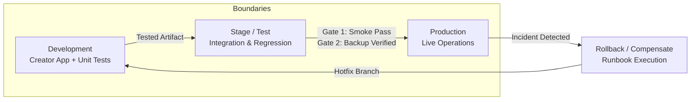
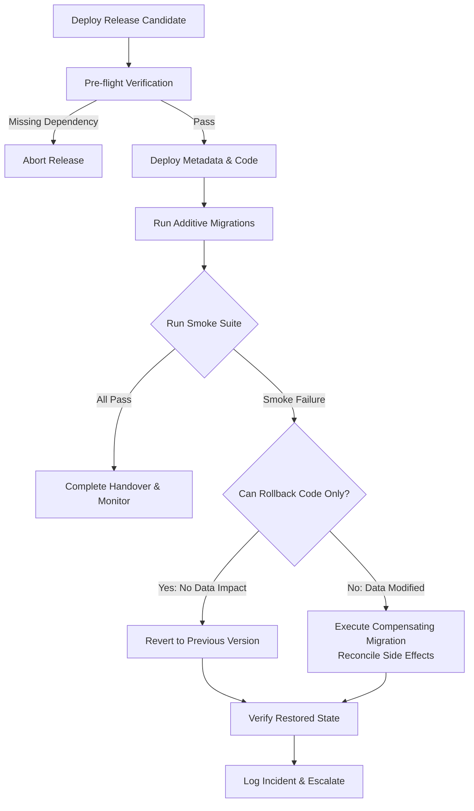

# Environments, Release and Operations

## What you will learn

A working solution can still fail during release.
Common release failures include:
- Deploying code without its configuration.
- Moving a form without its workflow dependency.
- Using a production Connection in a test environment.
- Assuming product-generated IDs are the same in every environment.
- Updating a field type that existing data depends on.
- Enabling a new workflow before its required fields exist.
- Rolling back code while leaving changed data behind.
- Restoring a database without restoring its integration mapping.
- Publishing an extension without documenting installation behavior.
- Declaring success without a support runbook.

In this chapter, you will learn to:
- Distinguish development environments, sandboxes, staging environments, and production.
- Plan a Creator development-to-stage-to-production flow.
- Understand the difference between a developer or authoring environment and a sandbox.
- Identify dependencies before promotion.
- Design versioned release artifacts.
- Plan metadata migrations and data migrations separately.
- Design backups and recovery evidence.
- Rehearse a release with synthetic Nova artifacts.
- Define smoke tests, rollback decisions, and operational handover.
- Produce a release plan and support runbook for the Nova Field Service project.

## Prerequisites

You should understand:
- The Nova requirements and ownership rules from Chapter 1.
- The extension boundary from Chapter 20.
- The testing and performance findings from Chapter 21.
- Stable business keys such as `NOV-REQ-001`.
- The difference between Creator operational state and CRM reference data.
- The distinction between code, configuration, credentials, metadata, and data.

No production tenant or live credentials are required for the guided practice.

## Chapter overview

```text
Design
  |
  v
Develop
  |
  v
Test in isolation
  |
  v
Stage and verify
  |
  v
Promote
  |
  v
Smoke test
  |
  v
Monitor
  |
  +--> Recover or roll forward if required
```

A release is a controlled change to a working system. It is not merely a file upload.

---

## Lessons

### Lesson 1 — Separate environments by purpose

An environment is a place where a version of the solution runs with a particular configuration and data boundary.
A useful environment model is:

| Environment | Main purpose | Data | Credentials | Release authority |
| :--- | :--- | :--- | :--- | :--- |
| Local development | Build and unit-test code | Synthetic fixtures | Fake or local-safe values | Developer |
| Creator development | Configure and build the application | Development data | Development Connections | Developer |
| Stage or test | Rehearse integration and release | Controlled test data | Test Connections | Developer and reviewer |
| CRM extension sandbox | Test extension installation and behavior | Isolated simulation | Sandbox authorization | Developer |
| Production | Serve real business operations | Production data | Production Connections | Approved release owner |

The exact names and availability of environments depend on the product, edition, organization, and account structure.

Zoho’s current Creator resource center provides documentation areas for Environments and development lifecycle management. The exact UI, eligibility, and promotion behavior must be verified for the target Creator account.
For CRM extensions, the current Developer Console documentation describes a sandbox testing flow in which the extension can be tested in an isolated end-user-like environment. Actions performed during that test are intended to remain in the simulated environment.

Do not assume that two environments have identical:
- Record IDs.
- Field API names.
- Connection names.
- OAuth clients.
- User identities.
- Feature availability.
- Region or data center.
- External endpoint URLs.
- Sample data.

---

### Lesson 2 — Distinguish development, sandbox, staging, and production

These words are often used interchangeably, but they serve different purposes.

#### Development environment
A developer changes the solution here:
- Build forms and reports.
- Write Deluge or JavaScript.
- Create local fixtures.
- Configure test-only values.
- Make incomplete changes.
- Run unit tests.

Development should be safe to change frequently.

#### Sandbox
A sandbox is an isolated environment used to test behavior without changing production data:
- Install or test an extension.
- Trigger workflows.
- Test custom Functions.
- Verify access boundaries.
- Test Connector behavior.
- Try an upgrade.
- Test failure scenarios.

A sandbox may be a snapshot or simulated environment. It may not contain current production data.

#### Stage or test environment
A stage environment is a release rehearsal environment:
- Deploy a release candidate.
- Use production-like configuration with test credentials.
- Run regression tests.
- Test migrations.
- Test smoke procedures.
- Verify monitoring and support steps.

A stage environment should be more controlled than development.

#### Production
Production contains real business data and real operational consequences. Only changes that have:
- A version.
- A release owner.
- A tested artifact.
- A dependency manifest.
- A rollback or recovery plan.
- Evidence of approval.

should be promoted to production.

---

### Lesson 3 — Separate artifacts from environment configuration

The same application version may run in multiple environments with different configuration.

For Nova:
```text
Same artifact:
  nova-context-0.1.0

Development configuration:
  environment = development
  CRM connection = nova_crm_dev
  external endpoint = synthetic

Stage configuration:
  environment = stage
  CRM connection = nova_crm_stage
  external endpoint = stage service

Production configuration:
  environment = production
  CRM connection = nova_crm_prod
  external endpoint = production service
```

Do not copy production credentials into development.
Do not hardcode an environment-specific URL inside reusable code.

Keep these concerns separate:

| Concern | Usually versioned with artifact | Usually supplied per environment |
| :--- | :--- | :--- |
| Deluge or JavaScript code | Yes | No |
| Field mapping rules | Sometimes | Often |
| CRM module API names | Documented | Verified per tenant |
| Connection link name | No | Yes |
| OAuth client | No | Yes |
| Secret | No | Yes, through secure storage |
| Feature flag | No | Yes |
| Retry policy | Sometimes | Often |
| Test fixtures | Yes | No |
| Production customer data | No | No |

An environment configuration file may be versioned as a template, but secret values must not be committed.

---

### Lesson 4 — Build a dependency inventory

A release is incomplete if dependencies are missing.
The Nova dependency inventory includes:

#### Creator application
- Forms
- Reports
- Pages
- Workflows
- Functions
- Schedules
- Users and access
- Environment configuration

#### CRM
- Module API names
- Field API names
- Lookup relationships
- Custom views
- Custom Functions
- Connections
- OAuth scopes
- Custom variables
- Extension namespace

#### Integration
- Event key format
- Request and response schemas
- Retry policy
- Reconciliation procedure
- External endpoint
- Callback or polling configuration

#### Operations
- Logs
- Failure view
- Alert ownership
- Runbook
- Backup evidence
- Rollback procedure

#### Dependency categories

| Category | Example | Verification |
| :--- | :--- | :--- |
| Code | `nova_context_read` | Version and source review |
| Metadata | `Account_Name` API field | Metadata inspection |
| Configuration | `Enable_Context_Read` | Environment checklist |
| Credential | `nova_crm_stage` Connection | Authorized test |
| Data | Existing request records | Migration count |
| Permission | Technician access | Access test |
| External service | Dispatch endpoint | Contract and smoke test |
| Scheduler | Reconciliation schedule | Schedule inspection |
| Documentation | Support runbook | Handover review |

A release should stop if a required dependency is missing.

---

### Lesson 5 — Use versioned artifacts

Every release candidate should have a unique version.
A useful version record contains:
```yaml
release:
  product: "Nova Field Service"
  version: "0.1.0"
  release_candidate: "rc1"
  source_revision: "synthetic-source-revision-001"
  schema_version: "1"
  api_version:
    crm: "v8"
    creator: "v2.1"
  created_at: "2026-10-06"
  owner: "Nova implementation team"
```

Version separately where necessary:
- Application version.
- Database or schema version.
- Integration contract version.
- Event payload version.
- Extension version.
- API version.
- Configuration version.

For Nova:
- Application version: `0.1.0`
- Event payload version: `1`
- Event identity: `NOV-REQ-001:completed:v1`
- CRM API version: `v8`
- Creator API version: `v2.1`

A code version change does not necessarily mean a payload contract change. Record both.

---

### Lesson 6 — Plan promotion as a controlled sequence

A promotion plan identifies what moves and in which order.

A generic Creator sequence is:
```text
Development
    |
    v
Stage or test environment
    |
    v
Production
```
The exact supported promotion mechanism must be verified in the target Creator environment. Do not assume that every component can be promoted automatically.

A generic CRM extension sequence is:
```text
Developer Console
    |
    v
Extension sandbox test
    |
    v
Private publication or Marketplace submission
    |
    v
Installation or upgrade in target organization
```

#### Promotion order
A safe release follows this order:
1. Confirm the release artifact.
2. Confirm target environment.
3. Verify prerequisites.
4. Apply additive metadata changes.
5. Apply configuration.
6. Deploy code.
7. Configure or authorize Connections.
8. Run migration scripts if required.
9. Enable workflows or schedules.
10. Run smoke tests.
11. Monitor.
12. Record the release result.

Do not enable a workflow before its required fields and Functions exist.
Do not migrate data before the target schema is available.
Do not enable external callbacks before the receiver has been tested.

---

### Lesson 7 — Treat migrations as separate work

A migration changes existing data or configuration. A deployment changes code or metadata. They are related but not identical.

#### Metadata migration
- Add a custom field.
- Add a new status value.
- Add a related list.
- Add a new report.
- Add a Function.
- Add a Connector.
- Add a page.

#### Data migration
- Populate a new field for existing requests.
- Convert old status values.
- Create mapping rows.
- Add missing business keys.
- Link historical records.
- Mark existing records as migrated.

A data migration must define:
- Input selection.
- Transformation.
- Output.
- Count before.
- Count after.
- Error handling.
- Restart behavior.
- Duplicate handling.
- Verification.
- Recovery.

#### Additive migration example
```text
Old:
  Request_Status = "Done"

New:
  Request_Status = "Completed"
  Completion_Source = "legacy-migration"
```
Do not overwrite values without recording the mapping.

#### Idempotent migration
A migration is idempotent when running it again does not create a second business result:
```text
If Completion_Source is already "legacy-migration",
do not update the record again.
```
This is especially important when a migration is interrupted and restarted.

---

### Lesson 8 — Design backups and recovery evidence

A backup plan should identify:
- What is backed up.
- How often.
- Where it is stored.
- How access is controlled.
- How restore is tested.
- What the backup does not include.
- Who owns recovery.

#### Backup categories

| Category | Example |
| :--- | :--- |
| Source | Deluge, JavaScript, configuration templates |
| Metadata | Forms, fields, workflows, Functions, pages |
| Configuration | Connection names, feature flags, mappings |
| Data | Creator records, CRM records, migration exports |
| Evidence | Test results, release manifests, logs |
| Credentials | Secure platform configuration, not source files |

A source backup does not automatically restore OAuth authorization or user access.
A data export does not automatically restore code or workflow order. Recovery must be tested as a complete process.

#### Recovery objectives
- **Recovery Point Objective (RPO)**: How much data loss is acceptable.
- **Recovery Time Objective (RTO)**: How quickly the service should be restored.

Do not invent Nova’s RPO or RTO. Record them as decisions requiring approval:
```yaml
recovery:
  rpo: "To be approved"
  rto: "To be approved"
  accepted_creator_completion_on_crm_failure: true
  external_side_effect_rollback: "reconcile or compensate"
```

---

### Lesson 9 — Roll back code, data, and side effects differently

Rollback is not one universal action.

#### Code rollback
Restore a previous version of code or configuration:
`Release 0.1.0 -> Release 0.0.9`

#### Metadata rollback
Remove or reverse a newly added field, workflow, or configuration where the product supports it. If existing records depend on a new field, deleting the field can delete live data.

#### Data rollback and compensation
You cannot cleanly "undo" a database state after new transactions have arrived. Instead, use:
- Compensating updates.
- Explicit status changes.
- Rollback flags.
- Re-running an inverse migration script.

#### External side-effect rollback
If a downstream CRM record or third-party dispatch was already committed before an issue occurred, you cannot roll back the network call. You must:
- Issue a compensating cancellation or void request.
- Mark the delivery state as `Uncertain` and reconcile.
- Notify an operator via the support runbook.

Never assume that rolling back a Creator script rolls back an external CRM update.

---

### Lesson 10 — Design smoke tests and release gates

A smoke test is a fast, non-exhaustive verification executed immediately after deployment to confirm that critical paths function.

#### Nova smoke suite
1. **Health Check**: Open the Creator application and verify core views load.
2. **Context Read**: Perform a single customer reference lookup for `NOV-CUST-001`.
3. **Intake Flow**: Submit a synthetic request and verify `NOV-REQ-001` is accepted.
4. **Access Check**: Confirm a user with the Technician role cannot edit CRM customer master records.
5. **Connection Check**: Test that the configured CRM Connection authorization is active.

#### Release gates
- **Gate 1 (Pre-flight)**: All unit and contract tests passed in CI/local harness. No uncommitted changes.
- **Gate 2 (Stage verification)**: Regression and performance budgets verified in Stage. Backup verified.
- **Gate 3 (Production authorization)**: Named release owner approval. Maintenance window active.
- **Gate 4 (Post-deployment smoke)**: Smoke suite passes 100%. If any smoke check fails, trigger immediate rollback.

---

### Lesson 11 — Prepare the operational handover and support runbook

A developer cannot remain the sole operator of a live integration.
An operational handover transfers knowledge to the support team and administrators.

A support runbook contains:
- **System overview**: Architecture boundaries, owners, and environments.
- **Routine operations**: How to inspect queues, check execution logs, and monitor credit consumption.
- **Incident triage procedures**: Step-by-step instructions for common alerts.
- **Escalation matrix**: Contact roles, response SLAs, and emergency stop procedures.
- **Audit and compliance**: Where logs are archived and retention policies.

---

## Visual explanation

### Environment progression and promotion pipeline



### Release and rollback decision flow



#### Text explanation
- The solution progresses from isolated Development to Stage for integration rehearsal, then to Production.
- Pre-flight checks verify that dependencies and credentials exist before any changes are applied.
- Additive migrations run before services are opened to users.
- If smoke tests fail, the decision path branches: clean code revert if no data changed, or compensating actions if data migrations have executed.
- Every release concludes with operational monitoring and runbook handover.

---

## Worked case

### Scenario input
Nova Field Service is preparing Release `0.1.0-rc1` for production deployment.
```yaml
release_marker: "NOVCH22LAB901A"
target_environment: "Production"
application_version: "0.1.0"
schema_version: "1"
payload_version: "1"
customer_key: "NOV-CUST-001"
request_key: "NOV-REQ-001"
visit_key: "NOV-VISIT-001"
completion_event_key: "NOV-REQ-001:completed:v1"
```

### Release checklist execution

#### 1. Pre-flight verification
- Source control commit: `git rev-parse HEAD` recorded.
- Automated tests: 26 synthetic scenarios from Chapter 21 verified.
- Backup: Creator application export and data snapshot taken.
- Connection: `nova_crm_prod` verified with scopes `ZohoCRM.modules.READ,ZohoCRM.modules.UPDATE`.

#### 2. Deployment execution
- Deploy Creator application components (Forms, Reports, Workflows).
- Configure CRM custom variables (`nova_env = "production"`, `nova_retry_limit = 3`).
- Run additive data migration: add `Legacy_Ref_ID` column without altering existing keys.

#### 3. Smoke verification test
```javascript
async function runSmokeTests(client) {
  var checks = [];

  // 1. Health check
  var health = await client.checkAppHealth();
  checks.push({ test: "App Health", passed: health.status === "ACTIVE" });

  // 2. Reference lookup
  var cust = await client.getCustomer("NOV-CUST-001");
  checks.push({ test: "CRM Lookup", passed: cust && cust.customer_key === "NOV-CUST-001" });

  // 3. Request creation
  var req = await client.createRequest({
    customer_key: "NOV-CUST-001",
    issue_summary: "Smoke test issue",
    service_location: "18 Example Lane"
  });
  checks.push({ test: "Create Request", passed: req.ok && req.status === "Accepted" });

  return checks;
}
```

#### 4. Simulated release defect and correction

**Defect:**
During deployment to Stage, a workflow triggered an immediate update to CRM before the `nova_crm_stage` Connection was authorized. The operation failed with `CONNECTION_NOT_FOUND`, leaving 5 requests in an orphaned state.

**Why it occurred:**
The deployment script enabled workflows *before* the environment connection credentials were saved.

**Correction applied:**
Enforce strict sequencing:
1. Deploy schema.
2. Save and authorize environment Connections.
3. Verify connection with a read-only smoke probe.
4. Enable automated workflows and schedules.
5. Re-run reconciliation on the 5 orphaned records.

---

## Try it yourself — guided practice

### Learning goal
Produce a complete release plan, rehearsal log, and operational support runbook for Nova Field Service Release `0.1.0`.

### Requirements and access
You need:
- A Markdown editor.
- The synthetic Nova case data from Chapters 1, 20, and 21.
- No live Zoho account or API credentials.

### Step 1 — Build the dependency manifest
Using the template below, inventory all dependencies:

```markdown
### Component Manifest
| Component Name | Type | Target System | Pre-deployment Action |
| :--- | :--- | :--- | :--- |
| Service_Requests | Form | Creator | Verify unique request_key rule |
| Dispatch_Portal | Page | Creator | Configure role visibility |
| nova_context_read | Function | CRM | Verify v8 endpoint and parameters |
| nova_crm_connection | Connection | Platform | Authorize OAuth tokens |
```

### Step 2 — Define the promotion and rollback sequence
Write step-by-step instructions for:
- Pre-release backup.
- Metadata and code deployment.
- Environment configuration injection.
- Smoke verification checks.
- Abort and rollback triggers.

### Step 3 — Draft the support runbook
Detail the response to three common operational alerts:
1. `CRM_CONNECTION_EXPIRED`
2. `DELIVERY_UNCERTAIN_TIMEOUT`
3. `CONCURRENCY_BUDGET_BREACH`

*Expected intermediate result:*
Each runbook entry must specify:
- Alert trigger.
- Severity.
- Immediate containment.
- Root cause diagnosis.
- Recovery action.
- Escalation path.

### Step 4 — Assemble the final artifact
Save the document as `C02_CH22_Nova_Release_Plan_and_Handover.md`.

---

## Independent challenge

### Changed scenario
A critical production issue requires an emergency hotfix:
- The external CRM updated a field label, causing the context lookup function to fail on unmapped properties.
- 45 field service requests completed in Creator are queued with status `CRM_DELIVERY_PENDING`.
- Management demands an immediate fix within 30 minutes without losing in-flight completions.

### Required deliverables
Produce:
1. An **Emergency Change Record (ECR)** specifying the hotfix scope and risk analysis.
2. A **Safe Promotion Plan** detailing how to test in Sandbox before pushing to Production.
3. A **Reconciliation Script Design** to process the 45 pending completions without creating duplicate external calls.
4. An **Incident Post-Mortem Template** with root cause, timeline, and preventive actions.

### Success criteria
- The plan must preserve Creator completion validity even if the CRM patch is delayed.
- The hotfix must be tested in a sandbox or staging environment before touching production.
- The 45 queued requests must be reconciled idempotently using `NOV-REQ-xxx:completed:v1`.
- No credentials or live tokens are exposed in the change records.

---

## Common problems and recovery

### Problem 1 — Hardcoded URLs break across environments
- **Symptom**: Code in Stage sends API requests to the Development mock server.
- **Diagnosis**: URLs or Connection names were hardcoded into the Deluge or JavaScript source.
- **Correction**: Move URLs and connection names to environment variables or custom configuration settings.
- **Verification**: Inspect source code with a regex scan for literal endpoint URLs.

### Problem 2 — Missing field breaks promoted workflow
- **Symptom**: Deployment fails with "Field `Inspection_Summary` does not exist."
- **Diagnosis**: The workflow was deployed before the form schema update was applied.
- **Correction**: Split metadata deployments: apply schema updates first, then deploy workflow logic.
- **Verification**: Run a pre-flight schema check before activating workflows.

### Problem 3 — Rolling back code corrupts migrated data
- **Symptom**: Code is reverted to version `0.0.9`, but database contains new version `0.1.0` status values that `0.0.9` cannot parse.
- **Diagnosis**: Code was rolled back without considering the data migration state.
- **Correction**: Revert data records using an inverse migration script before rolling back code, or make code changes backward-compatible.
- **Verification**: Test backward compatibility of code against old and new schema variants.

### Problem 4 — Sandbox test passes, production fails on permissions
- **Symptom**: The integration works for the testing developer but fails for live Dispatchers.
- **Diagnosis**: The test was run under an administrator profile, while production users have restricted roles.
- **Correction**: Test all features in the Sandbox under exact end-user roles before authorizing release.
- **Verification**: Add role-based access checks to the formal smoke test suite.

### Problem 5 — Additive schema change causes performance regression
- **Symptom**: Loading reports becomes slow after adding lookup fields.
- **Diagnosis**: Adding unindexed relationships to large tables increased query overhead.
- **Correction**: Optimize queries, limit fetched fields, or add indexed filters.
- **Verification**: Measure report rendering times against performance budgets before promoting.

### Problem 6 — Uncontrolled concurrent deployments cause race conditions
- **Symptom**: Two developers deploy different components simultaneously, overwriting each other's changes.
- **Diagnosis**: No deployment lock or release coordinator was designated.
- **Correction**: Establish a single release owner and a locked deployment window.
- **Verification**: Check version tags in the release audit log.

### Problem 7 — Backup cannot be restored
- **Symptom**: A failed release requires a restore, but the backup file is corrupted or incomplete.
- **Diagnosis**: Backups were scheduled but never tested for restoration.
- **Correction**: Schedule periodic restore drills in a designated staging environment.
- **Verification**: Require a documented restore test before major release windows.

### Problem 8 — Support team has no access to diagnostic logs
- **Symptom**: Production incidents go unresolved because only developers have access to error consoles.
- **Diagnosis**: Operational handover was skipped.
- **Correction**: Expose redacted audit logs and provide support staff with runbook training.
- **Verification**: Include support sign-off as a mandatory release gate.

### Problem 9 — Downstream API deprecation breaks live integration
- **Symptom**: CRM integration halts with HTTP 410 Gone.
- **Diagnosis**: The release used a deprecated API version without monitoring platform roadmaps.
- **Correction**: Upgrade to the current supported API version (e.g., CRM v8) and update contracts.
- **Verification**: Verify API versions in the component manifest against vendor deprecation schedules.

### Problem 10 — Release candidate has no version tag
- **Symptom**: Nobody knows which commit is currently running in Production.
- **Diagnosis**: Deployment was performed directly from an ad-hoc branch without version tagging.
- **Correction**: Enforce release tagging (e.g., `v0.1.0-rc1`) and build artifact hashes.
- **Verification**: Display application build version in the footer or system info panel.

---

## Check your understanding

1. What is the fundamental difference between a development environment and a sandbox?
2. Why must application artifacts be strictly separated from environment configuration?
3. In what sequence should schema, connections, and workflows be deployed?
4. What is the difference between a metadata migration and a data migration?
5. Why is an additive schema migration safer than modifying existing fields in place?
6. What is the difference between RPO and RTO?
7. Why can you not simply "undo" an external API call during a rollback?
8. What is the purpose of a post-deployment smoke test?
9. When should a release gate immediately abort a deployment?
10. What key information must be included in a support runbook for an integration alert?
11. Why should smoke tests be run under specific end-user roles rather than an admin account?
12. What risk is introduced by deleting a deprecated field immediately upon deploying a new version?
13. How does idempotent data migration protect a system during an interrupted release?
14. What evidence proves that a release rehearsal was successful?
15. Who owns the final decision to promote a release candidate to Production?

---

## Solutions and explanations

### Guided practice solution

#### Component manifest
```yaml
manifest:
  application: "Nova Field Service"
  version: "0.1.0"
  components:
    - name: "Service_Requests"
      type: "Creator Form"
      dependencies: ["Customers_Lookup"]
    - name: "Technician_Visits"
      type: "Creator Form"
      dependencies: ["Service_Requests"]
    - name: "nova_context_read"
      type: "CRM Custom Function"
      runtime: "Node.js 18 / REST"
      dependencies: ["nova_crm_connection"]
```

#### Promotion sequence
1. Verify pre-flight test results (26 passed).
2. Take full backup snapshot of Creator application and CRM metadata.
3. Deploy Creator schema changes (additive).
4. Configure environment Connections (`nova_crm_prod`).
5. Deploy custom Functions and client scripts.
6. Run data migration script with count reconciliation.
7. Activate automated workflows and schedules.
8. Execute smoke test suite.
9. If smoke tests pass 100%, hand over to operations. If any fail, trigger rollback.

#### Runbook sample entry: `DELIVERY_UNCERTAIN_TIMEOUT`
- **Trigger**: Delivery boundary records state `Uncertain` following HTTP 504.
- **Severity**: P2 (Operational degradation).
- **Immediate action**: Do NOT re-trigger the completion action manually.
- **Diagnosis**: Query the destination CRM using `request_key = NOV-REQ-xxx` to verify if the upsert committed.
- **Resolution**: If record exists, update local ledger state to `Delivered`. If absent, trigger one bounded retry.
- **Escalation**: Escalate to Integration Lead if > 10 records remain in `Uncertain` state for > 15 minutes.

---

### Independent challenge solution

#### Emergency Change Record (ECR-042)
- **Title**: Hotfix for CRM context property mapping failure.
- **Risk**: High (blocks request intake dispatch).
- **Scope**: Update `nova_context_read` parsing logic to support both legacy and updated CRM field API names.
- **Rehearsal**: Deploy to CRM Sandbox; execute 3 test lookups.
- **Promotion**: Update production function revision; verify live lookup.

#### Reconciliation design
```javascript
async function reconcileQueuedCompletions(queue, client) {
  var results = { processed: 0, skipped: 0, failed: 0 };

  for (var item of queue) {
    // 1. Verify if already committed
    var existing = await client.findExternalRecord(item.event_key);
    if (existing) {
      item.state = "Delivered";
      results.skipped += 1;
      continue;
    }

    // 2. Perform safe write
    var res = await client.upsertCompletion(item);
    if (res.ok) {
      item.state = "Delivered";
      results.processed += 1;
    } else {
      item.state = "Retryable";
      results.failed += 1;
    }
  }

  return results;
}
```

---

### Check-your-understanding answers

1. A development environment is an authoring space where code is actively changed; a sandbox is an isolated testing replica where changes are verified safely against representative configurations.
2. Artifacts contain logic that should not vary between environments; configuration contains environment-specific URLs, connection names, and credentials.
3. Apply schema updates first, configure/authorize connections second, and activate workflows last.
4. Metadata migration changes structural definitions (fields, forms); data migration transforms and moves actual stored records.
5. Additive migrations add new fields without deleting or altering old fields, allowing old code and new code to run side-by-side during deployment.
6. RPO is maximum acceptable data loss measured in time; RTO is maximum acceptable downtime to restore operations.
7. External systems commit side effects immediately; you must issue an explicit compensating action or reconcile rather than expecting a network call to "undo."
8. To verify that critical business paths operate in the live environment immediately following a change.
9. When a critical dependency is missing, a prerequisite check fails, or a post-deployment smoke check fails.
10. Trigger condition, severity level, immediate containment, step-by-step diagnostic procedure, recovery actions, and escalation contacts.
11. Admin accounts bypass security, role, and profile restrictions that can cause hidden failures for everyday business users.
12. If a rollback is needed or if legacy records still reference the field, deleting it causes immediate, irreversible data loss.
13. It allows the migration to be rerun safely after an interruption without creating duplicate records or corrupted values.
14. Documented test results, migration count reconciliation matching 100%, and an error-free smoke run in the target environment.
15. The designated release owner or technical lead, following formal review of gate evidence.

---

## Chapter recap and next step

Release management and operational hygiene transform isolated technical code into durable business software.
You should now be able to:
- Structure multi-tier environment architectures (Dev, Stage, Sandbox, Prod).
- Separate application release artifacts from environment configuration.
- Plan and execute dependency-ordered deployment sequences.
- Manage additive metadata and idempotent data migrations.
- Define RPO and RTO recovery expectations.
- Execute smoke tests and enforce release gates.
- Handle code, metadata, and external side-effect rollbacks safely.
- Write actionable operational runbooks for support teams.

### Project artifact
The Chapter 22 artifact is `C02_CH22_Nova_Release_Plan_and_Handover.md`. It contains:
- Complete component and dependency manifest.
- Promotion sequence and deployment checklist.
- Pre-flight and post-deployment smoke test suite.
- Rollback and data compensation plan.
- Operational runbook for production support.

### Course completion
This chapter completes the technical curriculum for **Course 2: Zoho Developer & Implementation Engineer**. You have journeyed from requirements and data modeling through Deluge, CRM APIs, Widgets, Extensions, Testing, and Release Operations. You are now prepared to build, integrate, test, and maintain enterprise solutions across the Zoho platform.

---

## Glossary and further reading

### Glossary
- **Additive migration**: A schema change pattern that adds new fields without altering or deleting existing fields, ensuring backward compatibility.
- **Compensating transaction**: An explicit business action executed to counter the effect of an earlier committed action that cannot be rolled back.
- **Deployment gate**: A mandatory verification checkpoint that must pass before a release can proceed to the next stage.
- **Idempotency**: The property of an operation whereby running it multiple times produces the exact same outcome as running it once.
- **Operational handover**: The formal transfer of system documentation, runbooks, and support responsibilities from developers to operational staff.
- **Recovery Point Objective (RPO)**: The maximum acceptable age of files or records that must be recovered from backup storage for normal operations to resume.
- **Recovery Time Objective (RTO)**: The maximum acceptable duration of time within which a business process must be restored after a service interruption.
- **Release candidate (RC)**: A build version that has passed preliminary testing and is considered ready for final staging and production deployment.
- **Smoke test**: A preliminary suite of basic functional tests executed immediately after deployment to confirm core operational readiness.
- **Support runbook**: A practical compilation of routine procedures and step-by-step instructions for troubleshooting and resolving operational incidents.

### Further reading
- Zoho Creator Environments (https://help.zoho.com/portal/en/kb/creator/developer-guide/environments)
- Understand Environments in Zoho Creator (https://help.zoho.com/portal/en/kb/creator/developer-guide/environments/articles/understand-environments)
- Deploy Applications across Environments (https://help.zoho.com/portal/en/kb/creator/developer-guide/environments/articles/deploy-applications)
- Zoho Creator Backup and Restore (https://help.zoho.com/portal/en/kb/creator/developer-guide/backup-and-restore)
- Zoho Creator Governance (https://help.zoho.com/portal/en/kb/creator/developer-guide/governance/articles/understand-governance)
- Publishing Zoho CRM Extensions (https://www.zoho.com/developer/help/extensions/publish-extension.html)
- Upgrading Extensions (https://www.zoho.com/developer/help/extensions/upgrade-index.html)
- Zoho Developer Console Help (https://www.zoho.com/developer/help/)

```yaml continuity
course_id: "C02"
current_chapter: "C02-CH22"
previous_chapter: "C02-CH21"
next_chapter: null
title: "Environments, Release and Operations"
nova:
  system_name: "Nova Field Service"
  ownership:
    crm: "Customer and service reference facts"
    creator: "Intake, assignment, inspections, completion"
    future_integration_boundary: "Delivery identity, retries, reconciliation and durable state when implemented"
  stable_ids:
    customer_key: "NOV-CUST-001"
    request_key: "NOV-REQ-001"
    visit_key: "NOV-VISIT-001"
    completion_event_key: "NOV-REQ-001:completed:v1"
    synthetic_crm_account_id: "000900000000002901"
  release_model:
    version: "0.1.0"
    schema_version: "1"
    payload_version: "1"
    environments:
      development: "Creator Development / Local Synthetic"
      staging: "Creator Stage / CRM Extension Sandbox"
      production: "Live Creator Organization / Live CRM Organization"
    promotion_order:
      - "Verify pre-flight gate"
      - "Execute backup"
      - "Deploy additive schema"
      - "Configure environment connections"
      - "Deploy functions and logic"
      - "Run data migration"
      - "Enable workflows"
      - "Execute smoke suite"
      - "Operational handover"
    rollback_policy:
      code: "Revert version tag"
      data: "Execute compensating migration"
      external_side_effects: "Reconcile using stable business keys"
  artifacts:
    - "C02_CH22_Nova_Release_Plan_and_Handover.md"
  open_assumptions:
    - "Production environment promotion features depend on the target Creator account edition."
    - "Formal RPO and RTO policies require owner confirmation."
    - "Connection authorization requires human admin consent in production."
    - "Production delivery ledger and queue implementation remain future milestones."
research:
  status: "partially_verified"
  official_sources_accessed:
    - "https://help.zoho.com/portal/en/kb/creator/developer-guide/environments"
    - "https://help.zoho.com/portal/en/kb/creator/developer-guide/environments/articles/understand-environments"
    - "https://help.zoho.com/portal/en/kb/creator/developer-guide/environments/articles/deploy-applications"
    - "https://help.zoho.com/portal/en/kb/creator/developer-guide/backup-and-restore"
    - "https://help.zoho.com/portal/en/kb/creator/developer-guide/governance/articles/understand-governance"
    - "https://www.zoho.com/developer/help/extensions/publish-extension.html"
    - "https://www.zoho.com/developer/help/extensions/upgrade-index.html"
  tenant_dependent_claims:
    - "Exact environment lifecycle availability across Creator plan tiers"
    - "Marketplace private publication vs direct installation approval flows"
    - "Tenant backup retention and restore limits"
```

END OF C02-CH22
