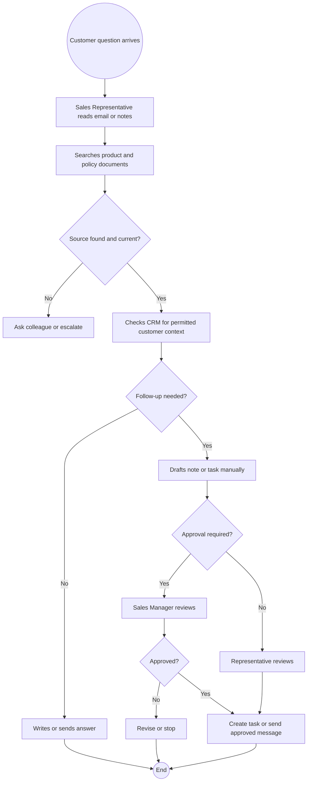

# Choosing a Use Case and Measuring Success

## 1. What you will learn

A business project should not begin with “Where can we put an agent?” It should begin with a real user, a real process, a defined problem and a measurable improvement.

In this chapter, you will learn how to:
- identify the users and stakeholders of an AI-enabled process;
- define triggers, desired outcomes and process boundaries;
- document the current baseline process before changing it;
- identify acceptable and unacceptable errors;
- estimate value using time, quality, risk and adoption measures;
- decide when a rule-based alternative is better than an agent;
- define human responsibilities and approval points;
- write a project brief with clear limits and evaluation objectives;
- create a held-out evaluation plan for the Northstar Distribution Sales Knowledge Assistant.

The Northstar case continues from Chapter 1. The following decisions remain in force:
- `NST-PROD-001` version 1.2 is the approved NS-4000 product source.
- `NST-POLICY-001` version 3.0 is the current approved discount policy.
- `NST-POLICY-001` version 2.0 is archived and excluded.
- CRM context must be filtered by tenant, user and role.
- A generated draft is not an executed action.
- Human approval, record revalidation, execution and audit are separate stages.
- No live model execution or product configuration has been performed.

This chapter adds explicit use-case and measurement assumptions. They are synthetic case data for learning, not actual Northstar business measurements.

---

## 2. Lessons

### Lesson 1: Start with users, triggers and outcomes

#### Identify the person, not just the department
A department may contain several users with different permissions and responsibilities. “Sales” is too broad to define an AI use case.

For Northstar, the initial roles are:

| Role | Main need | Permitted responsibility |
| :--- | :--- | :--- |
| Sales Representative | Find approved product and policy information; prepare follow-up work | Read assigned customer context; review answers and drafts |
| Sales Manager | Review exceptions and approvals | Approve or reject defined proposals |
| Knowledge Editor | Maintain approved product and policy content | Create, update, version and retire knowledge sources |
| Administrator | Manage access, configuration and evidence | Maintain system controls and inspect audit records |

A user is the person who interacts with the system. A stakeholder may not use the assistant but may be affected by it.

#### Define the trigger
A trigger is the event that starts a process. It should be observable:
- A Sales Representative receives a product question from a customer.
- A Sales Representative needs the current discount rule.
- A Sales Representative asks for permitted CRM context for an assigned customer.
- A Sales Representative requests a follow-up task draft after a conversation.
- A Sales Manager receives a proposal requiring approval.

#### Define the desired outcome
An outcome is the result the business wants, not merely the presence of an AI response:
- The representative receives an answer supported by an approved source and source ID.
- The representative is told clearly when the source does not answer the question.
- The representative receives only permitted customer context.
- A follow-up task proposal is complete enough for review.
- No task or message is created without the required approval and revalidation.

#### Evidence handling
Use the following evidence categories:

| Evidence category | Example | How to use it |
| :--- | :--- | :--- |
| Observed process | A representative records the lookup steps | Describe current behavior |
| Existing record | A CRM field or approved document | Confirm system data or source authority |
| Business rule | A signed or approved policy | Define allowed behavior |
| User preference | A representative prefers email drafts | Consider experience, not authorization |
| Assumption | “Each representative handles 40 enquiries per week” | Label clearly and validate later |
| Target | “Reduce median handling time by 25%” | Measure against baseline |
| Simulated result | A worked example response | Teach or design; do not call it live evidence |

---

### Lesson 2: Define the process boundary

A boundary says where the system starts and stops. Write both included and excluded behavior.

#### Included
- answer product and policy questions from approved, current content;
- retrieve permitted CRM context for an assigned customer;
- identify when information is missing, conflicting or outdated;
- draft a follow-up note or task;
- provide source IDs and version information;
- hold the draft for human approval.

#### Excluded
- inventing product compatibility;
- deciding customer access;
- approving discounts;
- sending outbound messages without approval;
- changing CRM records without execution controls;
- updating knowledge sources;
- retrieving records from another tenant;
- treating archived or draft documents as approved evidence.

#### Current Northstar baseline process



#### Baseline data

```csv
case_id,request_type,start_time,end_time,duration_minutes,first_pass_source_return,supported_answer_or_safe_escalation,permitted_crm_context_returned,draft_required,draft_complete_first_pass,approval_required,approval_recorded
NS-B01,product_specification,2026-02-02T09:00,2026-02-02T09:14,14,yes,yes,not_needed,no,not_applicable,no,not_applicable
NS-B02,discount_policy,2026-02-02T09:20,2026-02-02T09:42,22,no,yes,not_needed,no,not_applicable,no,not_applicable
NS-B03,customer_context,2026-02-02T10:00,2026-02-02T10:18,18,yes,yes,yes,no,not_applicable,no,not_applicable
NS-B04,follow_up_task,2026-02-02T10:30,2026-02-02T11:02,32,yes,yes,yes,yes,yes,yes
NS-B05,product_compatibility,2026-02-02T11:10,2026-02-02T11:35,25,no,no,not_needed,no,not_applicable,no,not_applicable
NS-B06,discount_policy,2026-02-02T13:00,2026-02-02T13:12,12,yes,yes,not_needed,no,not_applicable,no,not_applicable
NS-B07,follow_up_task,2026-02-02T13:20,2026-02-02T13:55,35,no,yes,yes,yes,no,yes,no
NS-B08,customer_context,2026-02-02T14:10,2026-02-02T14:29,19,yes,yes,yes,no,not_applicable,no,not_applicable
```

#### Baseline measures calculated
- **Mean handling time**: `(14 + 22 + 18 + 32 + 25 + 12 + 35 + 19) / 8 = 177 / 8 = 22.1 minutes` per case.
- **Median handling time**: Sorted `[12, 14, 18, 19, 22, 25, 32, 35]`. Average of 4th and 5th: `(19 + 22) / 2 = 20.5 minutes`.
- **First-pass source return rate**: `5 / 8 = 62.5%` (B01, B03, B04, B06, B08).
- **Safe outcome rate**: `7 / 8 = 87.5%` (all except B05).
- **Draft completion rate**: `1 / 2 = 50%` (B04 completed, B07 incomplete).

---

### Lesson 3: Define value and compare alternatives

#### Value dimensions
- **Efficiency**: handling time, waiting time, repeated lookup effort.
- **Quality**: supported answer rate, correct version rate, complete draft rate.
- **Risk**: unauthorized access, unsupported claims, unapproved writes.
- **Experience**: user effort, clarity, confidence.
- **Adoption**: percentage of eligible users actively using the process.

#### Rule-based alternatives
- Determine whether discount exceeds 5%: **Deterministic rule in code**.
- Find the current policy version: **Filtered database/metadata query**.
- Route a completed enquiry: **Standard workflow**.
- Explain a policy in natural language: **Assistant**.
- Decide whether to search product vs policy content: **Bounded agent**.

#### Acceptable errors
- **Critical errors**: revealing another tenant's record; citing archived policy as current authority; inventing a product capability; claiming a task was created when it was not. (Must fail evaluation).
- **Major errors**: omitting an important policy exception; incorrect customer draft recipient.
- **Minor errors**: awkward wording, formatting issues.

---

### Lesson 4: Write a project brief

A project brief connects a broad idea into a bounded, measurable proposal. It contains:
1. Problem statement
2. Users and stakeholders
3. Trigger
4. Boundary (in-scope and out-of-scope)
5. Baseline measurements
6. Error classifications
7. Evaluation dataset and objectives

---

## 3. Visual explanation

```mermaid
flowchart LR
    I[Business problem] --> U[Named users and stakeholders]
    U --> T[Observable trigger]
    T --> B[Process boundary]
    B --> P[Baseline process and data]
    P --> R[Risk and acceptable errors]
    R --> A[Rule-based alternative comparison]
    A --> M[Measures and targets]
    M --> E[Held-out evaluation objectives]
    E --> D[Project brief]
```



---

## 4. Worked case: Northstar project brief

```yaml
project_brief:
  project_id: "NST-BRIEF-001"
  project_name: "Northstar Distribution Sales Knowledge Assistant"
  problem_statement: >
    Sales Representatives spend time locating current product and policy
    information, checking permitted customer context and preparing follow-up
    work. The current synthetic baseline shows inconsistent first-pass retrieval
    and incomplete task drafts. The project will test whether a bounded assistant
    can improve supported information access and draft quality while preserving
    permission, approval and execution controls.
  primary_user: "Sales Representative"
  stakeholders:
    - "Sales Manager"
    - "Knowledge Editor"
    - "Administrator"
  triggers:
    - "A product or policy question arrives."
    - "A representative requests permitted CRM context."
    - "A representative requests a follow-up task draft."
  in_scope:
    - "Answer product and policy questions from current approved sources."
    - "Return source IDs and source versions."
    - "State when evidence is missing, conflicting or outdated."
    - "Retrieve permitted CRM context."
    - "Draft a follow-up note or task."
  out_of_scope:
    - "Autonomous discount approval."
    - "Cross-customer or cross-tenant retrieval."
    - "Knowledge source editing."
    - "Outbound message sending."
    - "Direct CRM writes without approval and revalidation."
    - "Unsupported product compatibility claims."
  human_responsibility:
    sales_representative:
      - "Review answers and drafts before customer use."
    sales_manager:
      - "Approve or reject proposals requiring approval."
    knowledge_editor:
      - "Maintain source ownership, status and versions."
    administrator:
      - "Maintain identity, access and audit configuration."
  baseline:
    cases: 8
    mean_handling_minutes: 22.125
    median_handling_minutes: 20.5
    first_pass_source_return: "5/8 = 62.5%"
    safe_outcome_rate: "7/8 = 87.5%"
    draft_completion: "1/2 = 50%"
    data_status: "synthetic instructional observations"
  targets:
    mean_handling_minutes: "<= 17"
    median_handling_minutes: "<= 16"
    first_pass_source_return: ">= 87.5%"
    safe_outcome_rate: "100% for critical safety cases"
    draft_completion: ">= 80% of eligible drafts"
  critical_failure_conditions:
    - "Unauthorized record or tenant access"
    - "Unsupported product or policy claim presented as fact"
    - "Use of archived or draft source as current authority"
    - "Unapproved outbound message or record write"
    - "False claim of execution"
  evaluation:
    development_data: "Separate design examples"
    held_out_dataset: "NST-EVAL-001"
    held_out_sample_size: 20
    objectives:
      - "Return the correct current source when evidence is available."
      - "State insufficient evidence when the source is silent."
      - "Deny unauthorized CRM requests."
      - "Return complete proposal fields without executing the action."
      - "Stop safely after tool failure or stale-record revalidation."
  open_assumptions:
    - "The target values are illustrative planning assumptions."
    - "The pilot will not send outbound messages."
    - "A later implementation must validate current product and API capabilities."
```

---

## 5. Try it yourself — guided practice

### Practice baseline dataset
```csv
case_id,duration_minutes,source_found_first_pass,safe_outcome,draft_required,draft_complete,approval_required,approval_recorded
P-01,16,yes,yes,no,not_applicable,no,not_applicable
P-02,24,no,yes,no,not_applicable,no,not_applicable
P-03,21,yes,yes,yes,yes,yes,yes
P-04,18,yes,yes,no,not_applicable,no,not_applicable
P-05,29,no,yes,yes,no,yes,no
P-06,14,yes,no,no,not_applicable,no,not_applicable
```

### Calculations
- Mean: `(16 + 24 + 21 + 18 + 29 + 14) / 6 = 122 / 6 = 20.3 minutes`.
- First-pass source rate: `4 / 6 = 66.7%` (P-01, P-03, P-04, P-06).
- Safe outcome rate: `5 / 6 = 83.3%` (all except P-06).
- Draft completion rate: `1 / 2 = 50%` (P-03 complete, P-05 incomplete).
- Approval completion rate: `1 / 2 = 50%` (P-03 recorded, P-05 missing).

---

## 6. Independent challenge

### Challenge baseline dataset
```csv
case_id,team,duration_minutes,source_found_first_pass,safe_outcome,permitted_context_returned,draft_required,draft_complete,approval_required,approval_recorded
C-01,West,15,yes,yes,yes,no,not_applicable,no,not_applicable
C-02,West,27,no,yes,yes,yes,yes,yes,yes
C-03,West,31,no,yes,no,yes,no,yes,no
C-04,East,19,yes,yes,yes,no,not_applicable,no,not_applicable
C-05,East,23,yes,no,no,no,not_applicable,no,not_applicable
C-06,East,17,yes,yes,yes,yes,yes,yes,yes
C-07,East,36,no,yes,no,yes,no,yes,no
C-08,West,14,yes,yes,yes,no,not_applicable,no,not_applicable
```

### Challenge measures
- Mean duration: `182 / 8 = 22.75 minutes`.
- First-pass source rate: `5 / 8 = 62.5%`.
- Safe outcome rate: `7 / 8 = 87.5%`.
- Draft completion rate: `2 / 4 = 50%`.
- Approval completion rate: `2 / 4 = 50%`.

---

## 7. Common problems and recovery

| Problem | Diagnosis | Recovery | Verification |
| :--- | :--- | :--- | :--- |
| Brief says “improve productivity” | Outcome not measurable | Add metric, baseline, denominator, target | Reproducible calculation |
| Scope says “all customer data” | Ignores permissions | Limit reads to authenticated tenant/user scope | Unauthorized tests return no data |
| Draft completion calculated over all cases | Denominator includes no-draft cases | Use only draft_required=yes | Denominator shown beside formula |
| Later task counted as on-time approval | Completion confused with deadline | Require approval timestamp and deadline | Missing approval recorded as exception |
| Held-out cases used to revise prompt | Evaluation data leaked into development | Freeze held-out set | Track dataset version |

---

## 8. Check your understanding

1. What is the difference between a user, a stakeholder and an approver?
2. Give one specific trigger for the Northstar assistant.
3. Why should “answer every sales question” be replaced with a narrower scope?
4. Using the baseline data from Lesson 2, calculate mean handling time.
5. Why is a rule-based discount threshold preferable to asking a model?
6. Name two critical errors for the Northstar project.
7. What makes an evaluation set held out?

---

## 9. Solutions and explanations

1. A user interacts directly with the system. A stakeholder is affected by the process. An approver holds official authority to sign off on exceptions or actions.
2. Example trigger: "A Sales Representative receives a customer question regarding the NS-4000."
3. It lacks boundaries on data sources, authority, permission checks, and evaluation criteria.
4. Mean handling time is `177 / 8 = 22.1 minutes`.
5. Thresholds are deterministic, repeatable, and authority-sensitive. Rules prevent models from inventing unauthorized approvals.
6. Returning unauthorized CRM context and inventing unsupported product features.
7. It is partitioned away from prompt engineering and used only for independent scoring.

---

## 10. Chapter recap and next step

A successful AI initiative begins with clear boundaries and rigorous baseline metrics.

### Project brief established
- Sales Representatives as primary users.
- Approved product and policy documents as the evidence boundary.
- Proposal vs execution separation.
- Deterministic rules for discount limits.
- Zero tolerance for cross-tenant access.

---

## 11. Glossary and further reading

### Glossary
- **Baseline**: A measured description of the process before an intervention.
- **Boundary**: What a system may do, may not do, and where authority resides.
- **Held-out dataset**: Data kept strictly separate from prompt tuning to measure real generalization.
- **Rule-based alternative**: A deterministic script or workflow solving logic without probabilistic model calls.

### Further reading
- NIST, “AI Risk Management Framework”: <https://www.nist.gov/itl/ai-risk-management-framework>
- Zoho CRM Developer Documentation: <https://www.zoho.com/crm/developer/docs/>
- Model Context Protocol documentation: <https://modelcontextprotocol.io/docs>

```yaml continuity
record_ids:
  - NST-CUST-001
  - NST-PROD-001
  - NST-POLICY-001
  - NST-EVAL-001
new_artifact_ids:
  - NST-BRIEF-001
  - NST-PRACTICE-BRIEF-001
  - NST-CH02-CHALLENGE-001
explicit_case_decisions:
  - "Sales Representatives are the primary users of the initial Northstar assistant scope."
  - "Sales Managers approve defined exceptions and outbound communications."
  - "Knowledge Editors own source status, versions and retirement."
  - "Administrators maintain identity, access and audit configuration."
  - "Current approved product and policy sources are in scope; archived and draft sources are excluded from customer-facing answers."
  - "Permitted CRM context is determined by authenticated tenant, user and record scope."
  - "Follow-up tasks and messages are proposals until approval, revalidation and execution occur."
  - "Discount thresholds remain deterministic business rules rather than unrestricted model decisions."
  - "Unauthorized access, unsupported claims, outdated-source use, unapproved actions and false execution claims are critical failures."
  - "Baseline values in this chapter are synthetic instructional observations."
  - "Targets in this chapter are illustrative planning assumptions, not measured production results."
artifact_names:
  - C03_CH02_Choosing_a_Use_Case_and_Measuring_Success_Student.md
  - Northstar_Project_Brief_NST-BRIEF-001.yaml
  - Northstar_Held_Out_Evaluation_Fixture_NST-EVAL-001.json
open_case_assumptions:
  - "The initial pilot does not send outbound messages."
  - "The initial pilot does not edit knowledge sources."
  - "The held-out evaluation set is maintained separately from development examples."
  - "The next chapter may define environment configuration and API details without changing these project boundaries."
```

END OF C03-CH02
