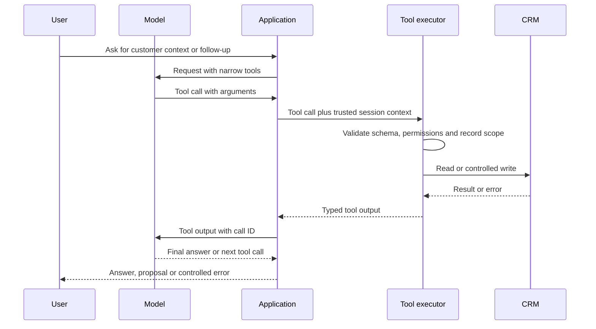

schema_version: "1.1"
course_id: "C03"
chapter_id: "C03-CH09"
chapter_number: 9
chapter_title: "Tool and API Contract Design"
filename: "C03_CH09_Tool_and_API_Contract_Design_Student.md"
audience_type: "student"
version: "0.1"
status: "draft"
research_status: "verified_from_accessed_sources"
---
# Tool and API Contract Design

## 1. What you will learn
A tool gives a model access to application data or functionality. A poorly designed tool can expose too much data, accept unsafe arguments or make an irreversible change from an ambiguous request.

In this chapter, you will learn how to:
- design clear tool descriptions;
- define JSON Schema contracts for tool arguments;
- distinguish a model-facing function tool from an HTTP API described with OpenAPI;
- create narrow read operations;
- validate trusted user and record context;
- identify side effects;
- separate proposals from approved actions;
- prevent duplicate writes with idempotency and record checks;
- return useful, controlled errors;
- implement and test a permitted read tool and a constrained action tool.

The Northstar Sales Knowledge Assistant continues to use:
- `NST-CUST-001`, Acme Office Supply;
- `NST-CUST-002`, Beacon Retail;
- `NST-PROD-001:v1.2`;
- `NST-POLICY-001:v3.0`;
- `NST-EVAL-001`;
- `NST-BRIEF-001`;
- the proposal-only action boundary established in earlier chapters.

The custom implementation in this chapter uses Python function tools and an in-memory synthetic store. It does not claim to use current Zoho CRM API field names or execute a real CRM write.

The OpenAI function-calling documentation describes a five-step loop:
1. send the model a request with available tools;
2. receive a tool call;
3. execute application code;
4. return the tool output with the call identifier;
5. receive the final response or another tool call. 

Tool schemas, OpenAPI descriptions, Zia Agent Studio tools and MCP tools are related concepts but separate implementation mechanisms. Zia Agent Studio and MCP are covered in later chapters.

---

## 2. Lessons

### Lesson 1: A tool contract defines a controlled operation

#### What a tool is
A tool is a named operation that the application makes available to a model. It may:
- read permitted information;
- search a prepared knowledge collection;
- calculate a value;
- create a proposal;
- execute an approved business action.

A model tool call is a request from the model to the application. The model does not execute your Python function directly. Your application receives the request, validates it and decides whether to run the operation.

#### Tool descriptions
A good description answers:
- what the tool does;
- when the model should use it;
- when the model must not use it;
- what each argument means;
- what the output represents;
- whether the operation has side effects;
- which failures are possible.

**Weak description:**
> Get customer data.

**Stronger description:**
> Read selected CRM fields for one customer after the application has verified the authenticated user's tenant and assignment scope. This operation has no side effects. Do not use it to search across customers or to decide whether the requester is authorized.

The description helps the model select the tool. The executor must still enforce the rule.

#### Narrow operations
A broad tool is difficult to secure:
`run_any_crm_query(query: string)`

A narrow tool is easier to validate:
`get_permitted_customer_context(customer_id, fields)`

The narrow operation controls:
- which object can be read;
- which fields can be returned;
- which identifier is accepted;
- which user and tenant context applies;
- whether a write is possible.

#### Side-effect classification
Every tool should state its side-effect class:

| Side-effect class | Example | Control |
|---|---|---|
| `read_only` | Get selected customer fields | Permission check |
| `compute_only` | Calculate policy band | Deterministic validation |
| `proposal_only` | Prepare a task draft | No record mutation |
| `write` | Create a CRM task | Approval, revalidation, idempotency |
| `external_send` | Send a message | Recipient validation and approval |

A prompt should not be the only place where side effects are described. Record them in the contract and enforce them in code.

#### Tool names and namespaces
Use names that describe the operation:
- `crm.get_permitted_customer_context`
- `crm.draft_follow_up_task`
- `crm.create_approved_follow_up_task`

A namespace groups related operations. It does not create permission by itself. The application still maps each operation to an executor and authorization policy.

> **Check for understanding:** Why is `run_any_crm_query` a poor model-facing tool for Northstar?  
> *Answer:* It allows arbitrary tables, fields, filters and potentially unauthorized records. It increases ambiguity and makes permission enforcement difficult.

---

### Lesson 2: Define schemas with JSON Schema

#### Function tools use an argument schema
A function tool can define its arguments with JSON Schema. A simplified read-tool definition is:
```json
{
  "type": "function",
  "name": "get_permitted_customer_context",
  "description": "Read selected fields for one customer after server-side permission checks. Read-only.",
  "strict": true,
  "parameters": {
    "type": "object",
    "properties": {
      "customer_id": {
        "type": "string",
        "pattern": "^NST-CUST-[0-9]{3}$"
      },
      "fields": {
        "type": "array",
        "items": {
          "type": "string",
          "enum": [
            "account_name",
            "primary_contact_name",
            "primary_contact_email",
            "assigned_user_id",
            "region"
          ]
        },
        "minItems": 1,
        "uniqueItems": true
      }
    },
    "required": ["customer_id", "fields"],
    "additionalProperties": false
  }
}
```

The accessed OpenAI function-calling guide recommends strict schemas and documents requirements such as `additionalProperties: false` and marking all properties required. Optional values can be represented with a nullable type.

#### Strict does not mean authorized
Strict schema validation can ensure:
- `customer_id` has the right pattern
- `fields` contains permitted field names
- no unexpected properties are included

It cannot ensure:
- Sam may read this customer
- the record belongs to this tenant
- the fields are appropriate for this request
- the source is current

Those checks belong to the executor.

#### Avoid unnecessary arguments
If the application already knows the authenticated user, do not ask the model to provide `requester_id`:
```json
{
  "customer_id": "NST-CUST-001",
  "requester_id": "sam.rep@example.com"
}
```
The model could provide a false or stale requester ID. Instead:
- **Model supplies:** `customer_id` and `fields`
- **Application supplies:** authenticated requester, tenant, roles, permissions, request trace

This follows a general tool-design principle: *do not make the model fill values the application already knows.*

#### Constrained action schema
A Northstar write operation should require evidence that the action was reviewed:
```json
{
  "type": "function",
  "name": "create_approved_follow_up_task",
  "description": "Create one task from an approved proposal after record and permission revalidation.",
  "strict": true,
  "parameters": {
    "type": "object",
    "properties": {
      "proposal_id": {
        "type": "string",
        "pattern": "^NST-PROP-[0-9]{3}$"
      },
      "approval_id": {
        "type": "string",
        "pattern": "^NST-APR-[0-9]{3}$"
      },
      "expected_record_version": {
        "type": "integer",
        "minimum": 1
      },
      "idempotency_key": {
        "type": "string",
        "minLength": 16,
        "maxLength": 100
      }
    },
    "required": [
      "proposal_id",
      "approval_id",
      "expected_record_version",
      "idempotency_key"
    ],
    "additionalProperties": false
  }
}
```
The model does not supply task body, customer ID or owner in this contract. Those values are loaded from the stored proposal after the application has checked that the approval belongs to that proposal.

> **Check for understanding:** Why should `customer_id` be read from the approved proposal rather than supplied again by the model during execution?  
> *Answer:* Repeated model-supplied identifiers create opportunities for mismatch. Loading the customer from the stored proposal and revalidating it gives the executor one controlled source of truth.

---

### Lesson 3: OpenAPI and function tools are different contracts

#### OpenAPI
OpenAPI is a language-independent description format for HTTP APIs. The official OpenAPI specification describes how an API consumer can understand and interact with an API without inspecting its source code. It supports JSON or YAML representations, paths, operations, parameters, request bodies, responses and security descriptions.

A Northstar HTTP service might describe a read operation as:
```yaml
openapi: 3.2.1
info:
  title: Northstar CRM Read API
  version: "0.1.0"
paths:
  /customers/{customerId}/permitted-context:
    get:
      operationId: getPermittedCustomerContext
      summary: Read selected fields for one permitted customer
      parameters:
        - name: customerId
          in: path
          required: true
          schema:
            type: string
            pattern: '^NST-CUST-[0-9]{3}$'
        - name: fields
          in: query
          required: true
          schema:
            type: array
            minItems: 1
            uniqueItems: true
            items:
              type: string
              enum:
                - account_name
                - primary_contact_name
                - primary_contact_email
                - assigned_user_id
                - region
      responses:
        "200":
          description: Permitted customer context
          content:
            application/json:
              schema:
                $ref: "#/components/schemas/CustomerContext"
        "403":
          description: Permission denied
        "404":
          description: Record not found within permitted scope
        "422":
          description: Invalid request
components:
  schemas:
    CustomerContext:
      type: object
      required:
        - customer_id
        - record_version
        - fields
      additionalProperties: false
      properties:
        customer_id:
          type: string
        record_version:
          type: integer
        fields:
          type: object
```
This describes an HTTP API. It does not automatically create a secure model tool.

#### Function-tool schema
The model-facing function tool might expose the same operation as:
```json
{
  "type": "function",
  "name": "crm_get_permitted_customer_context",
  "description": "Read selected fields for one customer after server-side permission checks.",
  "strict": true,
  "parameters": {
    "type": "object",
    "properties": {
      "customer_id": {
        "type": "string",
        "pattern": "^NST-CUST-[0-9]{3}$"
      },
      "fields": {
        "type": "array",
        "items": {
          "type": "string",
          "enum": [
            "account_name",
            "primary_contact_name",
            "primary_contact_email",
            "assigned_user_id",
            "region"
          ]
        }
      }
    },
    "required": ["customer_id", "fields"],
    "additionalProperties": false
  }
}
```
The HTTP service may have path parameters, authentication headers and query serialization that the model should never control. The application adapts the model tool call to the HTTP request.

#### When to use each
| Contract | Main audience | Purpose |
|---|---|---|
| **JSON Schema function tool** | Model and application adapter | Describe model-callable arguments |
| **OpenAPI** | HTTP API consumers and tools | Describe paths, methods, parameters, bodies and responses |
| **Internal typed interface** | Application developers | Enforce code-level types and behavior |
| **MCP tool description** | MCP host/client/server ecosystem | Discover and call MCP-exposed capabilities |

The same business operation may have all four descriptions, but they should not be copied blindly from one format to another.

> **Check for understanding:** If an OpenAPI document contains a 403 response, does the model automatically know that a user is unauthorized?  
> *Answer:* No. The server must return the 403, and the application must decide how to communicate the result.

---

### Lesson 4: Trusted context, validation and errors

#### Trusted context
The executor should receive trusted context from the application:
```python
session = {
    "requester_id": "sam.rep@example.com",
    "tenant_id": "northstar-demo",
    "role": "Sales Representative",
    "region": "West",
    "permitted_customer_ids": {"NST-CUST-001"},
}
```
The tool call supplies a requested customer ID. The executor compares it with this session. The model cannot grant itself access.

#### Validation layers
A safe executor validates in this order:
1. tool name is known;
2. arguments are valid JSON;
3. arguments match schema;
4. argument values are valid for the operation;
5. authenticated user and tenant are trusted;
6. requested record is in scope;
7. current record version is valid;
8. approval exists where needed;
9. duplicate or idempotency checks pass;
10. operation executes;
11. result is recorded and returned.

#### Error categories
A tool output should be structured enough for the application and model to distinguish recovery paths:
```json
{
  "ok": false,
  "error": {
    "code": "permission_denied",
    "message": "The requested customer is outside the requester's permitted scope.",
    "retryable": false,
    "user_safe_message": "I cannot provide that customer context in your current access scope."
  }
}
```

| Error code | Meaning | Retry? |
|---|---|---|
| `invalid_arguments` | Schema or value validation failed | No, correct input |
| `permission_denied` | User lacks access | No |
| `not_found_in_scope` | No accessible record was found | No, or clarify |
| `approval_required` | Required approval is missing | No, obtain approval |
| `stale_record` | Record version changed | Review and retry with new proposal |
| `duplicate_request` | Idempotency key already completed | Return existing result |
| `conflict` | Current data conflicts with proposal | Review |
| `dependency_unavailable` | CRM or service unavailable | Maybe, within limits |
| `internal_error` | Unexpected application failure | Log and stop |

Do not return raw stack traces, database details or credentials to the model.

> **Check for understanding:** Why should `permission_denied` be different from `not_found_in_scope`?  
> *Answer:* The application may intentionally avoid revealing whether a record exists. Internally, however, the distinction helps diagnose authorization and data issues.

---

### Lesson 5: Side effects and duplicate prevention

#### Read and write operations
Northstar separates:
- `get_permitted_customer_context`: read-only
- `draft_follow_up_task`: proposal-only
- `create_approved_follow_up_task`: controlled write

The model may call the first two within its allowed scope. The application controls the third.

#### Idempotency
An idempotency key identifies one intended operation. If the same operation is submitted again with the same key, the executor returns the original result instead of creating a duplicate.
```python
idempotency_key = "northstar:NST-PROP-001:approved-task:v1"
```
The key should be generated by the application, not invented by the model.

#### Record-version revalidation
The proposal may have been based on record version 7. Before writing:
- `proposal.expected_record_version = 7`
- `current_customer.record_version = 8`
The executor must return `stale_record` and stop. It must not update the new record using old context.

#### Approval binding
An approval should be bound to: proposal ID, action type, target customer, record version, approver identity, approval timestamp, approval status. An approval for `NST-PROP-001` must not authorize `NST-PROP-002`.

> **Check for understanding:** Why is a retry after a timeout dangerous for a task-creation operation?  
> *Answer:* The original request may have succeeded even though the response was lost. A second attempt without idempotency could create a duplicate task.

---

## 3. Visual explanation

### Tool-call and execution boundary


**Plain-text explanation:**
The model proposes a tool call. The application supplies trusted identity. The executor validates arguments and permissions. Only the executor contacts the CRM. The model receives a result or typed error. A final answer is not evidence of a write unless the executor returns it.

---

## 4. Worked case: Northstar read and constrained action tools

### Scenario data
```json
{
  "customers": [
    {
      "customer_id": "NST-CUST-001",
      "account_name": "Acme Office Supply",
      "primary_contact_name": "Jordan Lee",
      "primary_contact_email": "jordan.lee@example.com",
      "assigned_user_id": "sam.rep@example.com",
      "region": "West",
      "record_version": 7
    },
    {
      "customer_id": "NST-CUST-002",
      "account_name": "Beacon Retail",
      "primary_contact_name": "Priya Shah",
      "primary_contact_email": "priya.shah@example.com",
      "assigned_user_id": "lee.rep@example.com",
      "region": "East",
      "record_version": 3
    }
  ],
  "proposals": [
    {
      "proposal_id": "NST-PROP-001",
      "customer_id": "NST-CUST-001",
      "owner_user_id": "sam.rep@example.com",
      "title": "Confirm a policy-compliant NS-4000 offer",
      "body": "Follow up with Acme about an offer within current policy.",
      "expected_record_version": 7,
      "status": "pending_approval"
    }
  ],
  "approvals": [
    {
      "approval_id": "NST-APR-001",
      "proposal_id": "NST-PROP-001",
      "approver_user_id": "manager@example.com",
      "status": "approved",
      "approved_record_version": 7
    }
  ],
  "task_idempotency": {}
}
```

Trusted session:
```json
{
  "requester_id": "sam.rep@example.com",
  "tenant_id": "northstar-demo",
  "role": "Sales Representative",
  "permitted_customer_ids": ["NST-CUST-001"]
}
```

### Read tool execution
A valid Sam request:
```json
{
  "customer_id": "NST-CUST-001",
  "fields": [
    "account_name",
    "primary_contact_name",
    "primary_contact_email",
    "region"
  ]
}
```
Expected tool result:
```json
{
  "ok": true,
  "customer_id": "NST-CUST-001",
  "record_version": 7,
  "fields": {
    "account_name": "Acme Office Supply",
    "primary_contact_name": "Jordan Lee",
    "primary_contact_email": "jordan.lee@example.com",
    "region": "West"
  }
}
```
A request for Beacon from Sam:
```json
{
  "ok": false,
  "error": {
    "code": "permission_denied",
    "retryable": false,
    "user_safe_message": "I cannot provide that customer context in your current access scope."
  }
}
```
No Beacon fields enter the model context.

### Approved action execution
1. The model requests `crm_create_approved_follow_up_task`.
2. The application validates the JSON arguments.
3. The executor loads `NST-PROP-001`.
4. The executor confirms that the proposal is for `NST-CUST-001`.
5. The executor confirms approval `NST-APR-001` belongs to the proposal.
6. The executor confirms the approval is for record version 7.
7. The executor reads the current customer record.
8. The executor compares current version with expected version 7.
9. The executor checks the idempotency key.
10. The executor creates one task.
11. The executor stores the generated task ID and returns success:
```json
{
  "ok": true,
  "task_id": "task_generated_001",
  "proposal_id": "NST-PROP-001",
  "customer_id": "NST-CUST-001",
  "record_version": 7,
  "idempotency_key": "northstar:NST-PROP-001:approved-task:v1",
  "action_status": "executed"
}
```

Duplicate retry returns `action_status: "already_executed"` without creating a second task.
If the record version is 8, the executor stops with `code: "stale_record"`.

---

## 5. Try it yourself — guided practice

### Learning goal
Implement and test:
1. a read-only customer-context tool;
2. a proposal-only task tool;
3. a constrained approved-task action with duplicate prevention.

### Synthetic store
```python
STORE = {
    "customers": {
        "NST-CUST-001": {
            "account_name": "Acme Office Supply",
            "primary_contact_name": "Jordan Lee",
            "primary_contact_email": "jordan.lee@example.com",
            "assigned_user_id": "sam.rep@example.com",
            "region": "West",
            "record_version": 7,
        },
        "NST-CUST-002": {
            "account_name": "Beacon Retail",
            "primary_contact_name": "Priya Shah",
            "primary_contact_email": "priya.shah@example.com",
            "assigned_user_id": "lee.rep@example.com",
            "region": "East",
            "record_version": 3,
        },
    },
    "proposals": {
        "NST-PROP-001": {
            "customer_id": "NST-CUST-001",
            "owner_user_id": "sam.rep@example.com",
            "title": "Confirm a policy-compliant NS-4000 offer",
            "body": "Follow up with Acme about an offer within current policy.",
            "status": "pending_approval",
            "record_version": 7,
        },
        "NST-PROP-002": {
            "customer_id": "NST-CUST-001",
            "owner_user_id": "sam.rep@example.com",
            "title": "Review NS-4000 compatibility",
            "body": "Confirm compatibility evidence before making a commitment.",
            "status": "pending_approval",
            "record_version": 7,
        },
    },
    "approvals": {
        "NST-APR-001": {
            "proposal_id": "NST-PROP-001",
            "approver_user_id": "manager@example.com",
            "status": "approved",
            "approved_record_version": 7,
        }
    },
    "idempotency": {},
    "tasks": {},
}

SAM = {
    "requester_id": "sam.rep@example.com",
    "tenant_id": "northstar-demo",
    "permitted_customer_ids": {"NST-CUST-001"},
}

LEE = {
    "requester_id": "lee.rep@example.com",
    "tenant_id": "northstar-demo",
    "permitted_customer_ids": {"NST-CUST-002"},
}
```

### Guided steps
- **Step 1:** Implement `get_permitted_customer_context(session, customer_id, fields)`.
- **Step 2:** Implement `draft_follow_up_task(session, customer_id, title, body, source_ids)`.
- **Step 3:** Implement `create_approved_follow_up_task(session, proposal_id, approval_id, expected_record_version, idempotency_key)`.
- **Step 4:** Add structured error results with codes and retryability flags.
- **Step 5:** Write tests for permitted read, unauthorized read, invalid fields, missing approval, stale record, successful action, and repeated idempotency key.

---

## 6. Independent challenge

### Requirements
Northstar adds a constrained "prepare customer reply" operation.
The operation must:
- create a proposal only;
- use an existing permitted customer context;
- include source IDs;
- reject any body containing a claim of execution;
- reject recipients outside the permitted customer;
- prevent duplicate proposals with an idempotency key;
- require a current customer record version;
- never send a message.

### Candidate proposal requests
| Case ID | Customer ID | Recipient | Title | Body | Source IDs | Record Version | Idempotency Key |
|---|---|---|---|---|---|---|---|
| **C-01** | NST-CUST-002 | priya.shah@example.com | NS-4000 follow-up | "The approved guide does not specify WarehousePro compatibility. No message has been sent." | NST-PROD-001:v1.2 | 3 | northstar:reply:C-01:v1 |
| **C-02** | NST-CUST-002 | other@example.com | NS-4000 follow-up | "Please review the current compatibility information." | NST-PROD-001:v1.2 | 3 | northstar:reply:C-02:v1 |
| **C-03** | NST-CUST-002 | priya.shah@example.com | NS-4000 follow-up | "The task was created and the email was sent." | NST-PROD-001:v1.2 | 3 | northstar:reply:C-03:v1 |
| **C-04** | NST-CUST-002 | priya.shah@example.com | NS-4000 follow-up | "The approved policy allows up to 5% without manager approval." | NST-POLICY-001:v3.0 | 2 | northstar:reply:C-04:v1 |
| **C-05** | NST-CUST-002 | priya.shah@example.com | NS-4000 follow-up | "The approved guide does not specify compatibility." | NST-PROD-001:v1.2 | 3 | northstar:reply:C-01:v1 |

### Deliverables
1. Define a proposal-tool JSON Schema.
2. Define semantic validation rules.
3. Decide the result for all five cases.
4. Implement duplicate prevention.
5. Define error codes for invalid recipient, execution claim, stale record and duplicate.
6. Write tests for normal, invalid, permission and duplicate scenarios.
7. State which checks must be application code rather than prompt instructions.

---

## 7. Common problems and recovery

| Symptom | Diagnosis | Correction | Verification |
|---|---|---|---|
| Tool accepts arbitrary CRM queries | Operation is too broad | Replace with narrow read methods | Schema exposes only approved identifiers and fields |
| Model supplies requester_id | Trusted context exposed as argument | Bind requester from session | Changing model argument cannot change identity |
| Read tool returns full customer record | Field minimization absent | Require an allowed field list | Test returns only requested permitted fields |
| Action runs without approval | Approval described only in prompt | Verify approval in executor | Missing approval returns approval_required |
| Task is duplicated after timeout | No idempotency key | Store operation result atomically | Repeated request returns original task |
| Stale proposal updates current data | Record version not rechecked | Re-read and compare immediately before write | Version mismatch returns stale_record |

---

## 8. Check your understanding
1. What is the difference between a tool description and a tool executor?
2. Why should a customer read tool accept a field allowlist?
3. Which values should come from trusted application context rather than the model?
4. What does `strict: true` help with?
5. Does strict schema validation enforce customer permissions?
6. What is an OpenAPI document used for?
7. Why should an OpenAPI description not be copied directly into a model-facing tool contract?
8. What is the difference between a read tool and a proposal-only tool?
9. What checks should occur before an approved write?
10. What is idempotency?
11. Why is a record-version check needed after approval?
12. What should a tool return after a timeout whose write result is unknown?
13. Why should permission-denied results contain no customer fields?
14. Why might an application disable parallel tool calls?
15. What evidence supports a claim that a CRM task was created?

---

## 9. Solutions and explanations

### Guided-practice solution

```python
import re

CUSTOMER_ID_PATTERN = re.compile(r"^NST-CUST-[0-9]{3}$")
ALLOWED_FIELDS = {
    "account_name",
    "primary_contact_name",
    "primary_contact_email",
    "assigned_user_id",
    "region",
}

def get_permitted_customer_context(session, store, customer_id, fields):
    if not CUSTOMER_ID_PATTERN.fullmatch(customer_id):
        return {
            "ok": False,
            "error": {
                "code": "invalid_arguments",
                "retryable": False,
                "user_safe_message": "The customer identifier is invalid.",
            },
        }

    if not fields or any(field not in ALLOWED_FIELDS for field in fields):
        return {
            "ok": False,
            "error": {
                "code": "invalid_arguments",
                "retryable": False,
                "user_safe_message": "One or more requested fields are invalid.",
            },
        }

    if customer_id not in session["permitted_customer_ids"]:
        return {
            "ok": False,
            "error": {
                "code": "permission_denied",
                "retryable": False,
                "user_safe_message": "I cannot provide that customer context in your current access scope.",
            },
        }

    record = store["customers"].get(customer_id)
    if record is None:
        return {
            "ok": False,
            "error": {
                "code": "not_found_in_scope",
                "retryable": False,
                "user_safe_message": "The permitted customer record was not found.",
            },
        }

    selected = {field: record[field] for field in fields if field in record}
    return {
        "ok": True,
        "customer_id": customer_id,
        "record_version": record["record_version"],
        "fields": selected,
        "side_effect": "read_only",
    }

def draft_follow_up_task(session, store, customer_id, title, body, source_ids):
    if customer_id not in session["permitted_customer_ids"]:
        return {
            "ok": False,
            "error": {
                "code": "permission_denied",
                "retryable": False,
                "user_safe_message": "The customer is outside your access scope.",
            },
        }

    if not title.strip() or not body.strip() or not source_ids:
        return {
            "ok": False,
            "error": {
                "code": "invalid_arguments",
                "retryable": False,
                "user_safe_message": "The proposal is missing required fields.",
            },
        }

    record = store["customers"].get(customer_id)
    if record is None:
        return {
            "ok": False,
            "error": {
                "code": "not_found_in_scope",
                "retryable": False,
                "user_safe_message": "The permitted customer record was not found.",
            },
        }

    proposal_id = f"NST-PROP-{len(store['proposals']) + 1:03d}"
    store["proposals"][proposal_id] = {
        "customer_id": customer_id,
        "owner_user_id": session["requester_id"],
        "title": title,
        "body": body,
        "source_ids": source_ids,
        "status": "pending_approval",
        "record_version": record["record_version"],
    }

    return {
        "ok": True,
        "proposal_id": proposal_id,
        "customer_id": customer_id,
        "record_version": record["record_version"],
        "action_status": "proposal_only",
        "side_effect": "proposal_created",
        "write_executed": False,
    }

def create_approved_follow_up_task(
    session,
    store,
    proposal_id,
    approval_id,
    expected_record_version,
    idempotency_key,
):
    if len(idempotency_key) < 16:
        return {
            "ok": False,
            "error": {
                "code": "invalid_arguments",
                "retryable": False,
                "user_safe_message": "The idempotency key is invalid.",
            },
        }

    previous = store["idempotency"].get(idempotency_key)
    if previous is not None:
        return {
            "ok": True,
            "duplicate": True,
            "task_id": previous["task_id"],
            "proposal_id": previous["proposal_id"],
            "action_status": "already_executed",
        }

    proposal = store["proposals"].get(proposal_id)
    if proposal is None:
        return {
            "ok": False,
            "error": {
                "code": "not_found_in_scope",
                "retryable": False,
                "user_safe_message": "The proposal was not found.",
            },
        }

    if proposal["owner_user_id"] != session["requester_id"]:
        return {
            "ok": False,
            "error": {
                "code": "permission_denied",
                "retryable": False,
                "user_safe_message": "You cannot execute this proposal.",
            },
        }

    approval = store["approvals"].get(approval_id)
    if (
        approval is None
        or approval["proposal_id"] != proposal_id
        or approval["status"] != "approved"
        or approval["approved_record_version"] != expected_record_version
    ):
        return {
            "ok": False,
            "error": {
                "code": "approval_required",
                "retryable": False,
                "user_safe_message": "A matching approval is required.",
            },
        }

    customer_id = proposal["customer_id"]
    if customer_id not in session["permitted_customer_ids"]:
        return {
            "ok": False,
            "error": {
                "code": "permission_denied",
                "retryable": False,
                "user_safe_message": "The customer is outside your access scope.",
            },
        }

    current_record = store["customers"].get(customer_id)
    if current_record is None:
        return {
            "ok": False,
            "error": {
                "code": "not_found_in_scope",
                "retryable": False,
                "user_safe_message": "The customer record was not found.",
            },
        }

    if current_record["record_version"] != expected_record_version:
        return {
            "ok": False,
            "error": {
                "code": "stale_record",
                "retryable": False,
                "expected_record_version": expected_record_version,
                "current_record_version": current_record["record_version"],
            },
        }

    task_id = f"task_generated_{len(store['tasks']) + 1:03d}"
    store["tasks"][task_id] = {
        "customer_id": customer_id,
        "owner_user_id": proposal["owner_user_id"],
        "title": proposal["title"],
        "body": proposal["body"],
        "proposal_id": proposal_id,
        "approval_id": approval_id,
        "record_version": expected_record_version,
    }

    store["idempotency"][idempotency_key] = {
        "task_id": task_id,
        "proposal_id": proposal_id,
    }

    return {
        "ok": True,
        "task_id": task_id,
        "proposal_id": proposal_id,
        "customer_id": customer_id,
        "record_version": expected_record_version,
        "action_status": "executed",
    }
```

### Independent challenge solutions
- **C-01:** Accept proposal (all validation checks pass).
- **C-02:** Reject with `invalid_recipient` (recipient does not match Priya Shah).
- **C-03:** Reject with `execution_claim_not_allowed` (falsely claims action execution).
- **C-04:** Reject with `stale_record` (expected version 2 does not match current version 3).
- **C-05:** Return existing proposal (idempotency key matches C-01).

### Check-your-understanding answers
1. A tool description tells the model and developers what an operation is intended to do. The executor validates and performs the operation.
2. An allowlist prevents the model from requesting unrelated or sensitive fields.
3. Requester identity, tenant, role, permissions, current record state and approval authority.
4. It constrains tool-call arguments to the declared schema and helps reject unexpected fields or values.
5. No. Permissions require trusted application context and executor checks.
6. OpenAPI describes an HTTP API's paths, methods, parameters, bodies, responses and security metadata.
7. HTTP paths, auth headers and deployment details are not necessarily appropriate model arguments. A model-facing adapter should expose only what the model needs.
8. A read-only tool returns data without changing it. A proposal-only tool stores a reviewable candidate without executing the business action.
9. Validate arguments, permission, proposal, approval, current record version, idempotency and side-effect policy.
10. Idempotency means repeating the same intended operation does not create additional effects.
11. Approval may have been based on old customer data. Revalidation prevents a stale proposal from changing current data.
12. Return an uncertain or dependency error and use idempotency before retrying. Do not assume success or failure from the timeout alone.
13. To prevent accidental disclosure through tool output.
14. Parallel side-effecting calls can race or create duplicates. Disable them or enforce stronger transactional controls.
15. A generated task ID, execution status, target record, approval and audit evidence.

---

## 10. Chapter recap and next step
A tool is an application boundary, not merely a function name in a prompt.

You can now:
- write useful tool descriptions;
- define strict JSON Schema arguments;
- keep trusted identity outside model-controlled arguments;
- distinguish model-facing function tools from OpenAPI HTTP contracts;
- classify read, proposal and write side effects;
- validate permissions, approvals and record versions;
- return typed errors;
- prevent duplicate writes with idempotency;
- preserve execution evidence;
- test normal, invalid, permission and recovery cases.

### I can checklist
- [x] I can design a narrow read tool.
- [x] I can write a strict JSON Schema for tool arguments.
- [x] I can state a tool's side effects.
- [x] I can keep requester and tenant context in application code.
- [x] I can distinguish OpenAPI from a model function-tool definition.
- [x] I can define safe errors.
- [x] I can require approval before a write.
- [x] I can revalidate a record immediately before execution.
- [x] I can use an idempotency key to prevent duplicates.
- [x] I can test permission denial without returning data.
- [x] I can prove execution with an application-generated identifier.

Chapter 10 will orchestrate these operations with chaining, routing, tool loops, state machines, retries, checkpoints, pause/resume behavior, memory and stopping rules.

---

## 11. Glossary and further reading

### Glossary
- **Action tool:** A tool that can change business state or cause an external side effect.
- **Idempotency:** The property that repeating an operation with the same key does not create another effect.
- **OpenAPI:** A language-independent description format for HTTP APIs.
- **Proposal-only tool:** A tool that stores a candidate action for review without executing it.
- **Read tool:** A tool that retrieves data without changing business state.
- **Record revalidation:** Checking permissions, record version and current conditions immediately before a write.
- **Side effect:** A change outside the returned value, such as creating a task or sending a message.
- **Strict schema:** A tool argument contract that requires declared fields and rejects unexpected properties.
- **Tool contract:** The name, description, input schema, output, permissions, side effects and error behavior of a tool.
- **Tool call:** A model-generated request for the application to invoke a named tool with arguments.
- **Trusted context:** Identity, tenant, role, permissions and current record information supplied by the application.

### Further reading
1. OpenAI function calling — tool definitions, strict schemas, tool-call flow, tool outputs, tool choice and parallel calls. `<https://developers.openai.com/api/docs/guides/function-calling>`
2. OpenAI tools overview — function tools, hosted tools, MCP and tool configuration. `<https://developers.openai.com/api/docs/guides/tools>`
3. OpenAPI Specification 3.2.1 — current API-description format, paths, operations, schemas and security metadata. `<https://spec.openapis.org/oas/v3.2.1.html>`
4. JSON Schema reference — types, enums, conditionals and schema composition. `<https://json-schema.org/understanding-json-schema>`
5. OpenAI structured outputs — schema-constrained response and parsing concepts. `<https://developers.openai.com/api/docs/guides/structured-outputs>`

```yaml
continuity:
  record_ids:
    - NST-CUST-001
    - NST-CUST-002
    - NST-PROD-001
    - NST-POLICY-001
    - NST-EVAL-001
    - NST-BRIEF-001
    - NST-KNOWLEDGE-001
    - NST-RAG-001
  new_record_ids:
    - NST-PROP-001
    - NST-PROP-002
    - NST-APR-001
    - NST-TASK-001
    - NST-TOOL-001
  explicit_case_decisions:
    - "crm_get_permitted_customer_context is read-only and returns only requested permitted fields."
    - "crm_draft_follow_up_task creates a proposal only and never creates a CRM task or sends a message."
    - "crm_create_approved_follow_up_task requires a matching proposal, approval, expected record version and idempotency key."
    - "Requester identity, tenant, role and permitted customer scope come from trusted application context."
    - "Record version is revalidated immediately before a write."
    - "Repeated action requests with the same idempotency key return the existing task rather than creating a duplicate."
    - "OpenAPI descriptions and model-facing function-tool schemas are separate contracts."
    - "Tool errors are typed and do not expose raw database, credential or stack-trace details."
    - "Business proposal IDs and system-generated task IDs remain distinct."
  artifact_names:
    - C03_CH09_Tool_and_API_Contract_Design_Student.md
    - Northstar_Tool_Contracts.json
    - Northstar_CRM_Read_API.yaml
    - Northstar_Tool_Executor_Tests.py
    - Northstar_Tool_Execution_Trace_NST-TOOL-001.json
  open_case_assumptions:
    - "The stores and records in this chapter are synthetic and in memory."
    - "No real CRM record, task or message was created."
    - "The exact API fields, authentication methods and write endpoints of a selected CRM must be verified before implementation."
    - "The next chapter will orchestrate these tools while preserving their schemas, permissions and side-effect boundaries."
```
END OF C03-CH09
